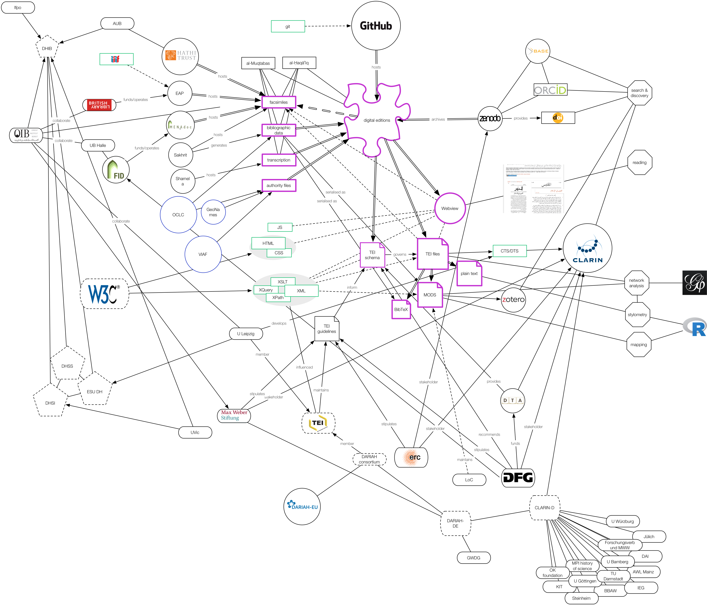
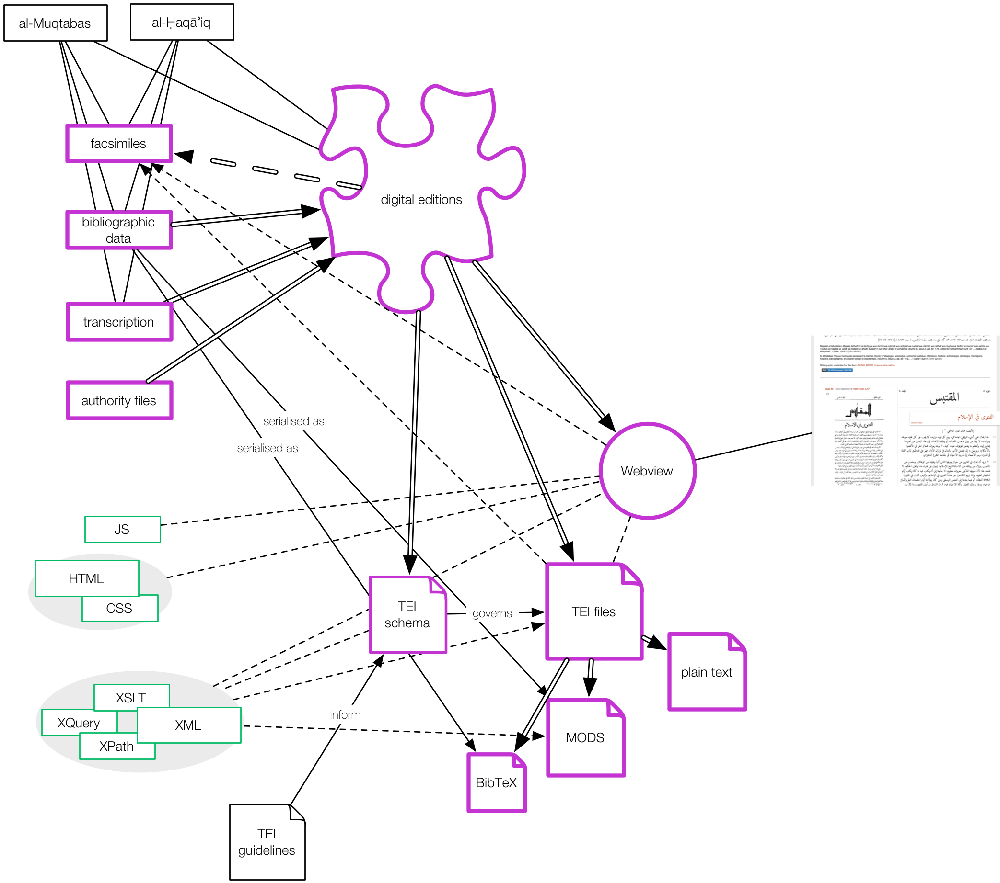
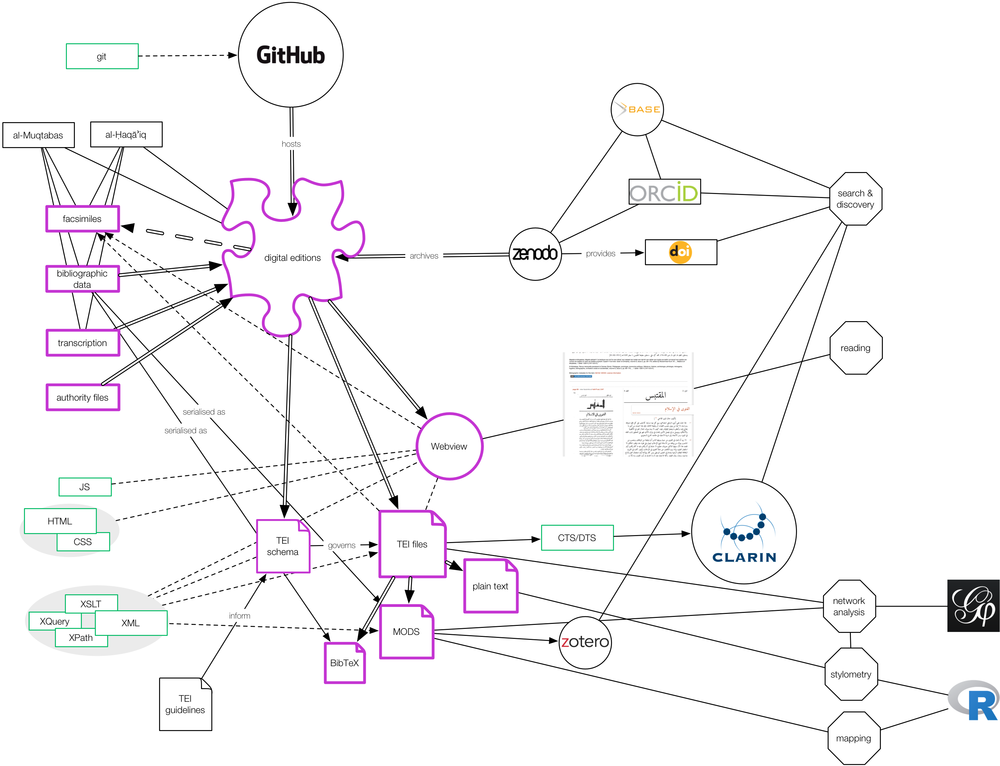
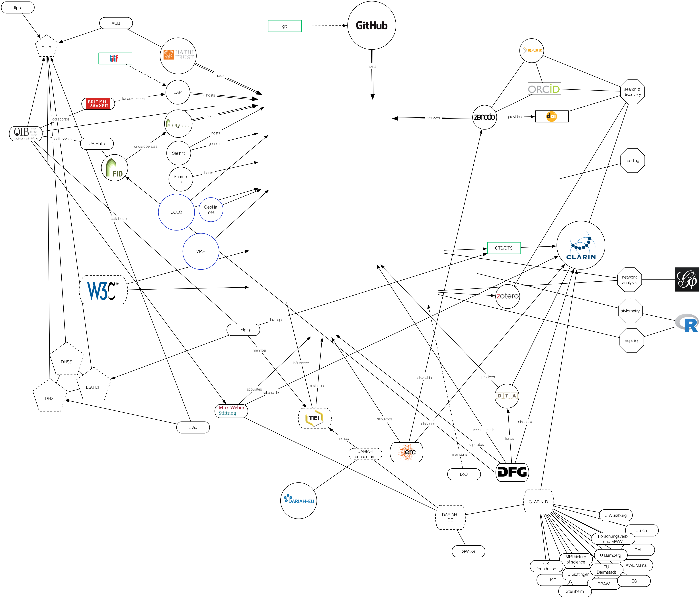

## Overview

1. Why digital humanities?
2. What are digital humanities?
    - communities of practice
    - institutionalised discipline
3. Islamicate DH / DH in the MENA region
4. DH at the OIB
5. Challenges to Islamicate DH

# Why digital humanities?
## technologies are here to stay

>Because digital technologies are increasingly central to the way we do our work as humanists, we all have a responsibility to keep pace with the information technologies that are changing the landscapes of higher education.

<cite>Battershill and Ross, *Using Digital Humanities in the Classroom*, 2017[^3]</cite>

[^3]: Battershill, Claire and Shawna Ross. *Using Digital Humanities in the Classroom : A Practical Introduction for Teachers, Lecturers and Students.* London: Bloomsbury, 2017, p.1.

## technologies are here to stay

>The question of whether something is or is not 'digital' will be increasingly secondary as many forms of culture become mediated, produced, accessed, distributed or consumed through digital devices and technologies. Thus, [...] the digital humanities must be able to offer theoretical interventions and digital methods for a historical moment when the computational has become both hegemonic and post-screenic. [...] We think of the 'digital' as a previous historic movement when computation as digitality was understood in opposition to the analogue, rather than complementary, as we argue in this book.

<cite>Berry and  Fagerjord, *Digital Humanities: Knowledge and Critique in a Digital Age*, 2017[^5]</cite>

[^5]: Berry, David M and Anders Fagerjord. *Digital Humanities: Knowledge and Critique in a Digital Age.* Cambridge; Malden: Polity, 2017, p.2.

# What are digital humanities?
## dh are many things to many people

[What is Digital Humanities?](https://whatisdigitalhumanities.com/) 

- presents a random selection from 791 definitions from the "Day of DH" between 2009--14

## dh are many things to many people

- a misnomer: who speaks of "digital physics"?
- a label: symbolic capital
- methodological approaches: result in community/ies of practice
- a discipline: with its own history and institutional structures

## dh as label

>it is largely due  to the apparently instrumental or utilitarian value of the digital humanities (their ability to provide liberal arts majors with digital skills that can  be turned into productive jobs) that university administrators, foundation  officers, and government agencies have been so eager to fund DH projects,  create DH undergraduate and graduate programs, and hire DH faculty.

<cite>Grusin, *The Dark Side of Digital Humanities*, 2014[^2]</cite>

[^2]: Grusin, Richard. "The Dark Side of Digital Humanities: Dispatches From Two Recent MLA Conventions." *Differences: A Journal of Feminist Cultural Studies* 25, no. 1 (2014), p.83.

## dh as methodological approaches

## dh as methodological approaches

>DH is the application of computational tools to research questions rooted in the humanities and the scrutiny of computational tools and digital media with methodologies rooted in the humanities.

<cite>My own working definition</cite>

>What is important today is not that we are doing work with computers, but rather that we are doing the work of the humanities, in digital form. The field is now much broader than it once was, and includes not only the computational modeling and analysis of humanities information, but also the cultural study of digital technologies, their creative possibilities, and their social impact.

<cite>Schreibmann, Siemens, and Unsworth, *A New Companion to Digital Humanities*, 2016[^1]</cite>

[^1]: Schreibmann, Susan, Ray Siemens, and John Unsworth (eds.). *A New Companion to Digital Humanities.* Chichester: Wiley-Blackwell, 2016, p.xvii.

## dh as methodological approaches

>[...] there are central concerns among digital humanists which cross disciplinary boundaries. This is nowhere more evident than in the representation of knowledge-bearing artifacts. The process of such representation – especially so when done with the attention to detail and the consistency demanded by the computing environment – requires humanists to make explicit what they know about their material and to understand the ways in which that material exceeds or escapes representation. [...]

>The process that one goes through in order to develop, apply, and compute these knowledge representations is unlike anything that humanities scholars, outside of philosophy, have ever been required to do. This method, or perhaps we should call it a heuristic, discovers a new horizon for humanities scholarship, a paradigm as powerful as any that has arisen in any humanities discipline in the past – and, indeed, maybe more powerful, because the rigor it requires will bring to our attention undocumented features of our own ideation. Coupled with enormous storage capacity and computational power, this heuristic presents us with patterns and connections in the human record that we would never otherwise have found or examined.

<cite>Schreibmann, Siemens, and Unsworth, *A Companion to Digital Humanities*, 2004[^6]</cite>

[^6]: Schreibmann, Susan, Ray Siemens, and John Unsworth (eds.). *A Companion to Digital Humanities.* Oxford: Blackwell, 2004.

## dh as methodological approaches

- digitisation of cultural artifacts
    + scanning: 3D, radar, LIDAR, multispectral imaging
    + modelling
    + metadata
- distant reading
    + stylometry
    + authorship attribution
    + text re-use
    + topic modelling
- computational linguistics
    + NLP
- network analysis
- visualisation
- mapping: GIS
- study of digital media
- creation of digital artifacts: e-lit
- study of algorithms and affordances

## DH as a community

## DH as a community

>For us, digital humanities simply represents a community of scholars and teachers interested in using or studying technology. We use humanities techniques to study digital cultures, tools, and concepts, and we also use computational methods to explore the traditional objects of humanistic inquiry.

<cite>Battershill and Ross, *Using Digital Humanities in the Classroom*, 2017[^4]</cite>

[^4]: Battershill, Claire and Shawna Ross. *Using Digital Humanities in the Classroom : A Practical Introduction for Teachers, Lecturers and Students.* London: Bloomsbury, 2017, pp.3--4.

## DH as a community

## DH as a community

](../assets/dh/map_dhcenters.png)

## DH as a community

, 2014](../assets/dh/map_arounddh.png)

# DH as a discipline
## DH as a discipline

## DH as a discipline

- history
- chairs, centres, programmes
- professional associations
- conferences
- journals
- consortia

## DH as a discipline: history

Computing in the humanities / DH is **old**!

- 1940s: the founding myth / distant reading
    + IBM card indexes
- 1960s: conferences and journals as nucleus for a field
    + availability of software packages: SPSS (1968), TU-STEP
- 1970s: scholarly associations
    + formation of first independent discipline: comp.ling.
- 1980s onwards: digital editing, corpus building 
    + databases, personal computers, word processors
    + TEI (1987)
- 1990s: www, internet
- 2000s onwards: digital humanities as term and discipline
    + adoption of methods as standards by funding bodies
- 2010s: expanding from textual media

## DH as a discipline: chairs, centres, programmes

](../assets/dh/map_dhcenters.png)

## DH as a discipline: professional associations

[Alliance of Digital Humanities Organisations (ADHO)](http://adho.org/), **2004** by ALLC/ACH

* [Australasian Association for Digital Humanities (aaDH)](http://aa-dh.org/)
+ [Association for Computers and the Humanities (ACH)](http://ach.org/): **1978**
+ [Canadian Society for Digital Humanities / Société canadienne des humanités numériques (CSDH/SCHN)](http://csdh-schn.org/)
+ [centerNet](http://digitalhumanities.org/centernet/)
* [Digital Humanities Association of Southern Africa (DHASA)](http://digitalhumanities.org.za/)
+ [European Association for Digital Humanities (eadh)](http://eadh.org/): **1973** as Association for Literary and Linguistic Computing (ALLC)
+ [Humanistica, L'association francophone des humanités numériques/digitales (Humanistica)](http://www.humanisti.ca/)
+ [Japanese Association for Digital Humanites (JADH)](http://www.jadh.org/)
+ [Taiwanese Association for Digital Humanities (TADH)](http://tadh.org.tw/en/)

## DH as a discipline: professional associations

[European Association for Digital Humanities (eadh)](http://eadh.org/): **1973** as Association for Literary and Linguistic Computing (ALLC)

* Italian organization: [AIUCD](http://www.aiucd.it/) - Associazione Informatica Umanistica e Cultura Digitale,
* Czech organization: [CZDHI](http://czdhi.ff.cuni.cz/en/about/) - Czech Digital Humanities Initiative,
* German language based: [DHd](http://www.dig-hum.de/) - Digital Humanities im deutschsprachigen Raum, **2013**
* Nordic organization: [DHN](http://dig-hum-nord.eu/?page_id=34&lang=sv) - Digital humaniora i Norden,
* Russian organization: [DH Russia](http://dhrussia.ru/en) - Russian Association for Digital Humanities.

## DH as a discipline: journals

+ ["Digital Scholarship in the Humanities" (DSH)](https://academic.oup.com/dsh), **1973**, formerly "Literary and Linguistic Computing"
+ ["Digital Humanities Quarterly" (DHQ)](http://digitalhumanities.org/dhq/), 2007
+ [Journal of the TEI](https://journals.openedition.org/jtei/)

## DH as a discipline: consortia

+ TEI: [Text Encoding Initiative](http://www.tei-c.org/)
+ IIIF
+ [CLARIN: European Research Infrastructure for Language Resources and Technology
](https://www.clarin.eu/)
    - CLARIN-D
+ [DARIAH: Digital Research Infrastructure for the Arts and Humanities](https://www.dariah.eu/)
    + DARIAH-DE
    + TextGrid
- [Council on Library and Information Resources (CLIR)](http://www.clir.org/), 1997
    + [Digital Library Federation](http://www.diglib.org/), 1993

# Islamicate DH / DH in the MENA region
## DH in Lebanon

- AUB: English department, library
    + David Wrisley, Najla Jarkass et al.
    + undergrad courses, events, training, translation
- Balamand: **2013** [DH Centre at Balamand](http://uob-dh.org), Elie Dannaoui
- LU: **2015** *al-insāniyyāt al-raqmiyya* by Ghassan Murad
- Ifpo: Jean-Christophe Peyssard, 2016
- OIB: Till Grallert, 2014
- DH Institute Beirut, bi-annual, since **2015**
    + 2015: first THATCamp in the ME

## DH in the region

- [AMICAL](https://www.amicalnet.org/) events
- DH Abu Dhabi
- NL Qatar
- Oman Muscat Mushaf
- [Middle East Digital Humanities Digest](https://aucmedhd.blogspot.com/)
- plans for a scholarly association

## DH with a focus on Islamicate societies

- (predominantly) American funding / institutions
    + Digital Library of the Middle East
    + Islamic Law
    + Workshops: Digital Ottoman (Princeton)
    + Workshops: DH and Islamic and Middle East Studies (Brown)

## DH with a focus on Islamicate societies

- European funding / institutions: 
    + corpus building at the basis
        + London: KITAB / ITI project
        + Berlin: Kalīla wa Dimna
        + Berlin: Corpus Coranicum
        + Leipzig: Arabic mss
        + Utrecht: bridging the gap
        * Fihris
        * Thurayya (gazetteer)
    + tool building
        * OCR
        * lemmatizer
        * stemmer

## DH with a focus on Islamicate societies

- MENA funding / institutions
    + corpus building:
        * Berber traditions
        * Arabic as foreign language
        * Quran
    + computer linguistics

# DH at the OIB
## DH at OIB

- focus
    + textual material
    + Islamicate societies
- framework / affordances
    + Lebanese infrastructure
    - part of the MWS
    - part of regional and international efforts

## DH at OIB: building of digital corpora

+ databases: 
    - SCRIPT
+ editions / corpus building:
    * BI and BTS
    - OpenArabicPE

## DH at OIB: methodological approaches

+ digital editing/ publishing
    * XML workflows, TEI editions
    * plain text pipelines
+ network analysis: Wollina, Grallert
+ (historical) GIS: Wollina, Grallert
+ stylometry: Grallert
+ NER: Grallert

## DH at OIB: events and collaborations

+ UB Halle: MENAdoc and MENAlib 
+ Workshop on digital scholarly editing (2015)
+ DHIB 2015, 2017, 2019: AUB, AMICAL, UVic, Ifpo
    * DiXiT applications for ERC funding
+ Uni Leipzig, 2017: CTS pilot for Arabic editions, integration into CLARIN and the VLO
+ DH internship, since 2017: MWS, Mainzed
+ BL, 2018?: host facsimiles

## DH at OIB: within the MWS

- 2016, Working Group DH
- 2017, DH strategy
    1. support and institutionalisation of DH
    2. development of scholarly software
    3. integration of DH into research projects
    4. digital research infrastructure
    5. research data management
    6. knowledge transfer
    7. digital publications
    8. Open Access and OpenScience

# Challenges
## dh requires massive efforts

Digital material and tools are fragile and subject to constant access to massive, expensive resources, many, if not all, of which are controlled by actors outside academe / scholarly communities.

## Affordances of DH in the MENA region

- Access to technical infrastructure is precarious.
- Cultural artefacts are in danger of destruction
- Civil liberties are far from granted

## Challenges to Islamicate DH: corpus building

1. selection: what is included and why?
2. the text layer: transcription, unicode
3. modelling structural, semantic and linguistic layers: western episteme for standards, formats, tools
4. enriching the data with external sources: western episteme, lack of data

## Challenges to Islamicate DH: analysis

+ conceptual: based in the Western episteme
+ technological: lack of modells, algorithms, computing languages
+ technical: limited of support for Arabic script

## Challenges to Islamicate DH: presentation

+ technological: lack of support for Arabic script
+ technical: rendering

# Open end
## Thank you!

- Links:
    + Project URLs: [https://www.github.com/tillgrallert/digital-muqtabas](https://www.github.com/tillgrallert/digital-muqtabas), [https://www.github.com/OpenArabicPE](https://www.github.com/OpenArabicPE)
    + Project blog: [https://tillgrallert.github.io/digital-muqtabas](https://tillgrallert.github.io/digital-muqtabas)
    + Slides: [https://tillgrallert.github.io/slides/2018-oib/](https://tillgrallert.github.io/slides/2018-oib/index.html)
    + Twitter: @[tillgrallert](https://twitter.com/tillgrallert)
    + Email: <grallert@orient-institut.org>

- Licence: The slides are licenced as [CC BY-SA 4.0](http://creativecommons.org/licenses/by-sa/4.0/)

## Supplementary bibliography

- brief introductions to DH
    + Kirschenbaum, Matthew. "What Is Digital Humanities and What’s It Doing in English Departments?" In *Debates in the Digital Humanities.* Open Access Edition ed. Edited by Matthew K. Gold. Minneapolis: University of Minnesota Press, 2012. [online](http://dhdebates.gc.cuny.edu/debates/text/38)
    + Fitzpatrick, Kathleen. "The Humanities, Done Digitally." In *Debates in the Digital Humanities.* Open Access Edition ed. Edited by Matthew K. Gold. Minneapolis: University of Minnesota Press, 2012. [online](http://dhdebates.gc.cuny.edu/debates/text/30)
    + Burdick, Anne, Johanna Drucker, et al. "Humanities to Digital Humanities." In *Digital_Humanities.* Cambridge, London: The MIT Press, 2012, pp.1--26. [online](http://mitpress.mit.edu/books/digitalhumanities)
    + Klein, Lauren F. and Matthew K. Gold. "Digital Humanities: The Expanded Field." In *Debates in the Digital Humanities 2016.* Edited by Matthew K. Gold and Lauren F. Klein. Minneapolis, London: University of Minnesota Press, 2016. [online](http://dhdebates.gc.cuny.edu/debates/text/51)
- recommended reading:
    + introductions
        * Jannidis, Fotis, Hubertus Kohle, and Malte Rehbein. *Digital Humanities: Eine Einführung.* Heidelberg: J.B. Metzler, 2017.
        * Murād, Ghassān. *Al-insāniyyāt Al-raqmiyya.* Bayrūt, 2015.
        * "Part I: Defining the Digital Humanities." In *Debates in the Digital Humanities.* Edited by Matthew K. Gold. Minneapolis, London: University of Minnesota Press, 2012. [online](http://dhdebates.gc.cuny.edu/debates/part/2)
        * Battershill, Claire and Shawna Ross. *Using Digital Humanities in the Classroom: A Practical Introduction for Teachers, Lecturers and Students.* London: Bloomsbury, 2017. [Web companion](http://www.teachdh.com)
        * Berry, David M and Anders Fagerjord. *Digital Humanities: Knowledge and Critique in a Digital Age.* Cambridge; Malden: Polity, 2017.
    + state of the field: check contributors and chapter titles
        + Gold, Matthew K. and Lauren F. Klein (eds.). *Debates in the Digital Humanities 2016.* Minneapolis, London: University of Minnesota Press, 2016. [online](http://dhdebates.gc.cuny.edu/debates/text/51)
        + Gold, Matthew K (ed.). *Debates in the Digital Humanities.* Minneapolis, London: University of Minnesota Press, 2012. [online](http://dhdebates.gc.cuny.edu/debates/text/2)
        + Schreibmann, Susan, Ray Siemens, and John Unsworth (eds.). *A New Companion to Digital Humanities.* Chichester: Wiley-Blackwell, 2016.
        + Crompton, Constance, Richard J Lane, and Ray Siemens (eds.). *Doing Digital Humanities: Practice, Training, Research.* Abingdon: Routledge, 2016. [first proofs](http://www.dhsi.org/content/2016Content%20(Archive%20Backup)/DoingDHProofs/2.%20DOING%20DIGITAL%20FIRST%20PROOFS%20(4%20MAY).pdf)
        + Busse, Laura, Wilfried Enderle, et al (eds.). *Clio-Guide ein Handbuch zu Digitalen Ressourcen Für die Geschichtswissenschaften.* Historisches Forum 19. Berlin: Clio-online und Humboldt-Universität zu Berlin, 2016. [online](http://guides.clio-online.de/guides)
        + Schreibmann, Susan, Ray Siemens, and John Unsworth (eds.). *A Companion to Digital Humanities.* Oxford: Blackwell, 2004. [online](http://www.digitalhumanities.org/companion)
    + DH ME:
        * Muhanna, Elias (ed.). *Digital Humanities and Islamic & Middle East Studies.* Boston, Berlin: De Gruyter, 2016.
    + Digital editing:
        * Driscoll, Matthew James and Elena Pierazzo (eds.). *Digital Scholarly Editing: Theories and Practices.* Cambridge: Open Book Publishers, 2016. [online](https://www.openbookpublishers.com/product/483/digital-scholarly-editing--theories-and-practices)
        * Pierazzo, Elena. *Digital Scholarly Editing: Theories, Models and Methods.* London: Routledge, 2015. [draft](http://hal.univ-grenoble-alpes.fr/hal-01182162)
    + Inspiring reads
        * Kirschenbaum, Matthew G. *Track Changes: A Literary History of Word Processing.* Cambridge: Harvard University Press, 2016.
        * Tenen, Dennis. *Plain Text: The Poetics of Computation.* Stanford: Stanford University Press, 2017.
