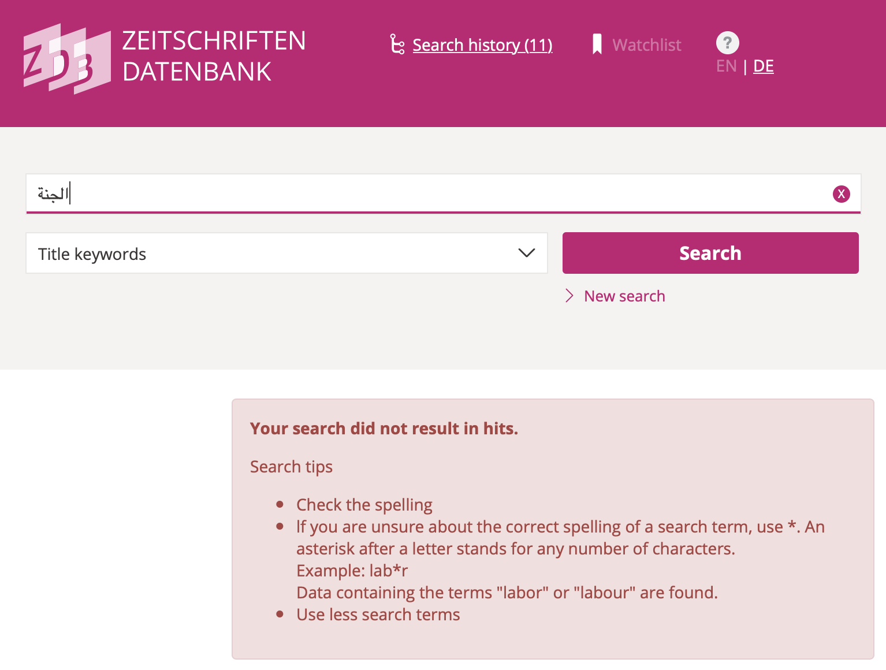

## Zur Erschließung arabischer Periodika aus spätosmanischer Zeit (c.1800--c.1920) <br/>Herausforderungen einer multilingualen und multiskriptoralen Digital History

Till Grallert, @[tillgrallert](https://twitter.com/tillgrallert)

*Digital History* – Offenes Forschungskolloquium  

26 Januar 2022

Folien: [https://tillgrallert.github.io/slides/dh/2022-digital-history-colloquium](https://tillgrallert.github.io/slides/dh/2022-digital-history-colloquium/index.html)

## Übersicht des Vortrages

1. Einführung: Arabische Periodika
2. Mind the `<gap/>`!
3. Closing the `<gap/>` one step at the time

# Einführung
## Spätosmanischer östlicher Mittelmeerraum

:::{.c_width-60}

![Das Osmanische Reich, 1893. [@map_ottoman-empire-1893]](../../assets/maps/map_Ottoman-Empire-1893_annotated.jpg){#fig:map-oem}

:::
:::{.c_width-30}

- Norden: Rumelien und Anatolien
    + ab 14. Jhd. osmanisch
- Süden: *Mashriq* und Ägypten
    + ab 16. Jhd. osmanisch
- Modernisierendes Reich
    + *Tanzimat*: 1838--76
    + 1. Konstitutionelle Monarchie: 1876--78
    + Jungtürkische Revolution: 24. Juli 1908
    + 2. Konstitutionelle Monarchie: 1908--18 
- Sezessionen, Einfluss europ. Kolonialmächte
    + Muslimisierung
    + Arabisierung

:::

## Spätosmanischer östlicher Mittelmeerraum

:::{.c_width-30}

### Multilingual

+ Verwaltungssprachen: Osmanisch, Arabisch, Persisch
+ Alltagssprachen: Turksprachen, Arabisch, Griechisch, slawische Sprachen ...
+ Liturgische Sprachen: Arabisch, Griechisch, Armenisch, Koptisch, Russisch
+ Bildungssprachen: Osmanisch, Arabisch, Französisch, Englisch, Russisch ...

:::
:::{.c_width-30}

### Multiskriptoral

+ Arabisch: Osmanisch, Arabisch, Hebräisch
+ Griechisch
+ Armenisch
+ Lateinisch: Französisch, Englisch ...
+ Kyrillisch
+ Hebräisch: Hebräisch, Arabisch, Jiddisch
+ Assyrisch
+ Koptisch

:::
:::{.c_width-30}

### Multireligiös

+ muslimisch: sunnitisch, schiitisch
+ christlich: div. orthodox, katholisch, assyrisch, uniert, protestantisch
+ jüdisch: sephardisch, ashkenasisch
+ zoroastrisch

:::

## Arabische Zeitungen und Zeitschriften

{#fig:map-jaraid}


## Arabische Zeitungen und Zeitschriften

:::{.c_width-50}

- Presse als zentraler Agent des Wandels in der Moderne
    + erstes Massenmedium
    + zentrales Medium der literarischen und kulturellen arabischen Renaissance (*nahḍa*)
    + Medium des Sprachwandels
    + zentrale Foren für Verhandlung von Moderne, Nationalismen, Islamismus etc.

:::
:::{.c_width-50}

- Presse bisher vor allem als Quelle genutzt und kaum als Gegenstand untersucht
- Forschung wird dominiert von
    + national(istisch)en Narrativen
    + Verengung auf zwei Orte und wenige <!-- allgemein zugängliche --> Titel
    + impliziten Hypothesen

:::

{#fig:front-pages}

## Computationelle Periodikastudien

:::{.c_width-50}

{#fig:network-authors}

:::
:::{.c_width-50}

<!-- {#fig:authors-haqaiq .c_height-50}

{#fig:referenced-periodicals-muqtabas .c_height-50} -->

{#fig:map-bylines}

:::

## Computationelle Periodikastudien

:::{.c_width-50}

{#fig:network-periodicals}

:::
:::{.c_width-50}

{#fig:map-referenced}

:::

## Notwendige Datenbasis

:::{.c_width-30}

### Modellierten Volltext mit Auszeichnung von *Named Entities*

+ z.B. "In ihrer letzten Ausgabe berichtete die Zeitung *al-ʿAṣr al-Jadīd* aus Damaskus, dass ..."
+ (halb)automatische Extraktion basiert auf
    * named entity recognition (NER)
+ Probleme
    * Zustand von OCR und Layout-Erkennung
    * Zustand von NER

:::
:::{.c_width-30}

### Strukturierte bibliographische (Meta)daten auf der Artikelebene

+ z.B. "*Sātisnā* schickte uns diesen Artikel aus *al-Shahbāʾ*"
+ (halb)automatische Extraktion basiert auf
    * Anwesenheit der Information im materiellen Artefakt
    * einem modellierten digitalen Surrogat
+ Probleme
    * Vielfalt von Namensformen

:::
:::{.c_width-30}

### Normdatensätze <!-- zur Disambiguierung und Anreicherung der Daten -->

- *Sātisnā*
    + Pseudonym und Anagram für *Anastās al-Karmilī*, den Herausgeber von *Lughat al-ʿArab* in Bagdad
- *al-Shahbāʾ*, "die Graue"
    + ein Beiname von Aleppo
    + Geokoordinaten: `36.20124, 37.16117`
- Probleme
    + enormes Bias auf den Globalen Norden

:::


# 1. Mind the `<gap/>`! <br/>Digitalität zwischen Heilsversprechen und Realität
## Digitalität zwischen Heilsversprechen und Realität

::: {.c_width-50}

### egalitäres Heilsversprechen

- jede kann ohne Unterschied teilhaben
- uneingescheränkter Zugang zum Wissen der Welt

### Normative Grundlagen

- Wissen = Daten = Verständnis
- mehr Wissen = besseres Verständnis
- Solutionism/Technokratie

:::
::: {.c_width-50}

{#fig:memex}

:::

## Digitalität zwischen Heilsversprechen und Realität

::: {.c_width-50}

{#fig:vaccination}

:::
::: {.c_width-50}

### ernüchternde Realtität

- universale, wenn auch unterschiedliche Ausschlußerfahrungen

### Elefant in the room

- Digitalität wird als **voraussetzungslos** verstanden

:::

## Digitalität als vorausetzungslos?
### Metaphermaschinen

::: {.c_width-50 .c_right}

- Digitalität **simuliert** Stasis und Vertrautheit
    + Metaphern
    + semantische Modelle
- Digitalität ist hochgradig ephemer und wird kontinuierlich remediiert

:::
::: {.c_width-50 .c_left}

{#fig:google-docs}

:::

## Mind the `<gap/>`! <br/>Zugangsvorraussetzungen

...  müssen explizit gemacht werden!

::: {.c_width-50}


### technisch

+ Hardware: aktuell
+ Strom: kontinuierlich
+ Internet: schnell und stabil
+ Software

:::
::: {.c_width-50}

### kulturell

+ Sprach- und Schriftkenntnisse
+ Vertrautheit mit den Metaphern
+ Vertrautheit mit semantischen Modellen

:::


## Mind the `<gap/>`! <br/>Zugangsvorraussetzungen

### Du bist so schön, wie eine zusätzliche Stunde Strom

](../../assets/dh/Evc9uxzXEAE8GFw.jpg)


## Mind the `<gap/>`! <br/>Zwischen Globalem Norden und Globalem Süden

::: {.c_width-50}

### Globaler Norden

- Hegemon
- Autor der technischen und kulturellen Standards der Digitalität

:::
::: {.c_width-50}

### Globaler Süden

- nicht homogen, kein universeller "Anderer"
- Vielzahl heterogener Regionalitäten
- gemeinsame Erfahrung der konstanten Auseinandersetzung mit dem Hegemon

:::


## Mind the `<gap/>`! <br/>Digital Humanities als Teil des Globalen Nordens

](../../assets/dh/map_dhcenters.png)


# 1.1 Mind the `<gap/>`! <br/>*Linguistic imperialism*
## Linguistic imperialism

>'Linguistic imperialism' is shorthand for a multitude of activities, ideologies, and structural relationships. Linguistic imperialism takes place within an overarching structure of asymmetrical North/ South relations, where language interlocks with other dimensions, cultural (particularly in education, science, and the media), economic and political

<cite>[@Phillipson1997RealitiesAndMyths, 239]</cite>

>The basis for the codes, languages, methodologies, and technical instruments of the digital humanities is English; the written and spoken language of all the main conferences, the most prestigious journals, the institutions that control the discipline, the organizations and international consortia, and the central authorities of knowledge is, with few exceptions, some dialect of British or American English.

<cite>[@Fiormonte+2021+TaxationagainstOverrepresentation, 334-335]</cite>


## Englischkenntnisse sind <!-- für die Teilhabe --> unabdingbar

:::{.c_width-50}

Englisch ist die Lingua Franca und Basis der technischen Infrastruktur

- Beispiel: CSS

```css
body {
    background: white;
    color: black;
}
```

- Beispiel: R

```R
library(tidyverse)
setwd("/path/to/folder/")
load("oape_stats.rda")
المجلات <- c("4770057679", "644997575", "472450345", "792756327")
المشار.اليها <- المشار.اليها %>%
    filter(source.id.oclc %in% المجلات)
write.table(المشار.اليها, file = "csv/oape_stats.csv", row.names = FALSE, quote = TRUE, sep = ",")
```

:::
:::{.c_width-50}

Schriften und Sprachen des Globalen Nordens sind der Hegemon der Interfaces

: Englisches Interface (gelb), Arabisch in deutscher Umschrift (lila), Deutsch (grün).](../../assets/OpenArabicPE/translatio_interface-languages_annotated.png){#fig:translatio-interface}

:::

## Arabisch

:::{.c_width-50}

### Schrift

- zweithäufigste Schrift <!-- nach lateinischer Schrift -->
    + aktuell für 14 Sprachen verwendet, u.a. Arabisch, Persisch, Urdu, Pashtu.

:::
:::{.c_width-50}

### Sprache

+ fünfthäufigste Sprache
    * eine von sechs Amtssprachen der UN
    + <!-- offizielle --> Amtssprache in 26 Ländern
    * \>420 Mio. Sprechende
+ liturgische Sprache des Islams mit 1,6 Mrd. Gläubigen

:::

](../../assets/dh/arabic-script_sample-annotated.png){#fig:arabic-sample-1}

## Arabisch

### Schrift

+ Schriftrichtung von rechts nach links
+ Buchstaben (Grapheme) werden mehrheitlich in Schreibrichtung verbunden und ändern dabei ihre Form (Allographen):  [ج جـ ـجـ ـج]{.c_rtl lang="ar"}
+ Grapheme bestehen aus Basisformen (Archigraphem, *rasm*) und diakritischen Zeichen (*iʿjām*)
    * Gebrauch unterliegt historischem Wandel und regionalen Präferenzen
* Vokalisierung (*tashkīl*) **kann** hinzugefügt werden und hat Einfluss auf Bedeutung
<!-- + Präferenz für Ligaturen -->

<!-- ](../../assets/dh/arabic-script_sample-annotated.png){#fig:arabic-sample-2} -->

:::{.c_width-50 .c_rtl}

### أميركا وعلماء العرب

[كانت أميركا مجهولة عند ابنآء القرن الخامس عشر بدليل ان المؤرخين في ذلك العهد لم يذكروا عنها سوى اخبار اكتشافها في أواخر ذلك القرن]{.c_rtl lang="ar"}

<cite>[@oclc_4770057679-i_13-div_8.d1e1249]</cite>

:::
:::{.c_width-50 .c_rtl}

### امىرکا وعلماء العرٮ

[کاںٮ امىرکا محهوله عںد اٮںا الٯرں الحامس عسر ٮدلىل اں المورحىں ڡى دلک العهد لم ىدکروا عںها سوى احٮار اکٮساڡها ڡى اواحر دلک الٯرں]{.c_rtl lang="ar"}

:::

## Arabisch in der Digitalität
### Zum großen Teil <!-- von der digitalen Infrastruktur --> nicht unterstützt


+ Zeichenkodierung lange Zeit nicht unterstützt
    * <!-- Konsequenz aus dem Buchdruck, Schreibmaschinen etc.:  -->Latinisierte Umschriften
        - Arabisch: [تصوير الافكار]{.c_rtl} -> *taṣwīr al-afkār* (IJMES)
        - Osmanisch: [تصوير افكار]{.c_rtl} -> *teṣvīr-i efkār* (IJMES)
    * "gelehrte" Umschrift vs Praxis des Arabisi
+ <!-- Notwendige --> Allographen (Verbindungsformen) werden der Rendering Engine überlassen
    * Microsoft Office for Mac: 2015
    * ggplot(Plots in R): 2021
    * Gephi: 2020
+ OCR ist nicht funktional*

<!-- + Abstraktion in Buchstaben ist zumindest umstritten
    + Zeichkodierung kann die kulturelle Praxis der Schreibenden nicht abbilden -->


:::{.c_width-50 .c_rtl}

### أميركا وعلماء العرب

[كانت أميركا مجهولة عند ابنآء القرن الخامس عشر بدليل ان المؤرخين في ذلك العهد لم يذكروا عنها سوى اخبار اكتشافها في أواخر ذلك القرن]{.c_rtl lang="ar"}

<cite>[@oclc_4770057679-i_13-div_8.d1e1249]</cite>

:::
:::{.c_width-50 .c_ltr}

### Amīrkā wa ʿulamāʾ al-ʿarab

*Kānat Amīrkā majhūla ʿinda abnāʾ al-qarn al-khāmis ʿashr bi-dalīl anna al-muʾarikhīn fī dhalika al-ʿahd lam yadhkarū ʿanhā siwā akhbār iktishāfihā fī awākhir dhalika al-qarn*

:::

<!-- hello Java, I am looking at you! -->
<!-- add screenshot of tweet writing Arabic in Latin -->

## Erfassung: Buchstaben, Grapheme, Zeichenkodierung
### Unicode ist nicht die Lösung aller Probleme

:::{.c_width-50}

<!-- - Vor Unicode lange Zeit gar nicht unterstützt -->
- Unicode: <!-- in Mountain View ansässiges --> Industriekonsortium und ein Standard <!-- mit US-Dominanz -->
    <!-- + Full members: Adobe, Apple, Facebook, Google, IBM, Microsoft, Netflix, SAP, Salesforce, **Sultanat von Oman** -->
- Idee: Trennung von Bedeutung und Form
- Probleme:
    - Kodierungen <!-- sind politische Entscheidungen und --> folgen Sprachen, nicht Schriften
    - inkonsistent
- OS, Browser etc. normalisieren die Varianz nicht.
<!-- - Notwendige Verbindungsformen der Buchstaben werden der Rendering Engine überlassen -->
- Folge: Volltextsuchen sind nicht aussagekräftig
    + 32 Arten "mekkanisch" (مكية) zu schreiben

:::
:::{.c_width-50}

<!-- {#fig:arabic-mecca-1} -->

)](../../assets/dh/arabic-script_unicode-example-wikidata_narrow.png){#fig:arabic-mecca-2 height="300px"}

:::

## Darstellung <br/>basale Standards werden nicht unterstützt
### Beispiel 1: Werbung (Grafik- und Layout Programme)

:::{.c_width-50}

<!-- Nicht verbunden und von rechts nach links -->

](../../assets/dh/ErLBbWwVgAErjHy.jpg){#fig:arabic-fail-covid}

:::
:::{.c_width-50}

<!-- Korrektur -->

](../../assets/dh/ErO3qtUVkAEUAQ_.jpg){#fig:arabic-fail-covid-corrected}

:::

## Darstellung <br/>basale Standards werden nicht unterstützt
### Beispiel 2: Webbrowser und HTML 5

Browser ignorieren das HTML5 Attribut `@lang` und stellen Arabisch linksbündig dar


:::{.c_width-50}
{#fig:arabic-fail-chrome}
:::

:::{.c_width-50}
{#fig:arabic-fail-firefox}
:::

## Darstellung <br/>Arabische Inhalte in LTR-Standards

![Bidirektionales XML vom Anfang von [@oclc_1034545644-i_15-div_1.d2e634]. Die farbigen Pfeile zeigen die Leserichtung an. Die Zahlen unter den Pfeilen zeigen die Lesesequenz an.](../../assets/OpenArabicPE/xml_zuhur-v_2-i_4_annotated.png){#fig:bidi-xml}

# 1.2 Mind the `<gap/>`! <br/>Digitalisierung des Kulturerbes
## Digitalisierung des Kulturerbes <br/>neo-koloniale Unsichtbarkeit des Globalen Südens

:::{.c_width-50}

### Erfassung

Digitalisierung ist **teuer**: public-private partnerships, private vendors

+ Findet primär im Globalen Norden statt
+ Kuratorische Entscheidungen
    + Sammlung
    + Katalogisierung
    + Digitalisierung
+ Technische Entscheidungen
    * Workflows, Modelle, Ontologien des Nordens
+ Wirtschaftliche Entscheidungen
    * Outsourcing

:::
:::{.c_width-50}

### Bereitsstellung

Platformen zur Maximierung des Gewinns

+ Proprietäre Interfaces
+ Datensilos ohne APIs
+ Bezahlschranken
+ geo-fencing

:::

## Digitalisierung des Kulturerbes <br/>Katalogisierung

- Digitale Kataloge sind **digitalisierte** Kataloge
- Katalogisierungsregeln sind historisch kontingent
    + nutzen lateinische Umschriften (plural!!)
    + unterscheiden nicht konsequent zwischen Schrift und Sprache
    + Kalender sind häufig falsch
- Kataloge sind lokal, Aggregierung zumeist auf nationaler Basis
- Nutzung zumeist über Webinterfaces
    + Worldcat und Arabic Union Catalogue (ArUC) haben keine kostenlose API

## Digitalisierung des Kulturerbes <br/>Katalogisierung

### Suche in der ansonsten großartigen [ZDB](https://zdb-katalog.de)

<!-- - nur in Umschrift 
- Umschrift wird in unbekanntem Umfang "normalisiert"
- aber der bestimmte Artikel "al-" muss manuell entfernt werden -->

:::{.c_width-30}

- kein Arabisch



:::
:::{.c_width-30}

- keine volle Umschrift (*dmg* al-Ǧanna, *ijmes* al-Janna)


:::
:::{.c_width-30}

- defektive Umschrift ohne "al-"
- Umfang der Normalisierung unklar (`ʿ` wird komplet herausgefiltert, `'` und `ʾ` nicht)


:::


## Digitalisierung des Kulturerbes <br/>Was können wir überhaupt sehen?

Welche Verzerrungen bildet die Karte ab: Sammlung, Katalogiesierung, Digitalisierung der Wissensinfrastruktur?

{#fig:map-global-holdings}

## Closing the knowledge `<gap/>` <br/>[Project Jarāʾid](https://projectjaraid.github.io/) (2012--)

:::{.c_width-50}

- Bibliographische Erfassung sämtlicher arabisch-sprachiger Periodika weltweit seit ihrer Entstehung um 1800 bis 1929.
    + Webseite und offene Datensätze ([TEI XML](https://tei-c.org/)) für mehr als 3700 Periodika
    + Normdatensätze für c.2700 Personen, 220 Orte, 180 Bibliotheken u.ä.
- Kollaboration mit Adam Mestyan (Duke), "Crowd"-Sourcing
- Seit 2021/22: Integration von Bibliothekskatalogen, ZDB, HathiTrust

:::
:::{.c_width-50}

{#fig:holding-stats}

:::

## [Project Jarāʾid](https://projectjaraid.github.io/) <br/>Mind the `<gap/>`!
### Wissenslücke -> Digitalisierungslücke

:::{.c_width-50}

Arabische Periodika bis 1929 weltweit

- Arabisch: 420 Mio Sprechende
- 3269 Zeitungen und Zeitschriften
- davon knapp 1/4 (747) in Sammlungen lokalisiert
- davon wiederum knapp 1/5 (145) digitalisiert
- Bezahlschranken, geo-fencing


:::
:::{.c_width-50}

Zum Vergleich: "[Der Erste Weltkrieg im Spiegel hessischer Regionalzeitungen](https://hwk1.hebis.de)"

- Hessen: 6,2 Mio. Einwohner_innen
- 125 Zeitungen mit mehr als ½ Mio. Seiten
- Digitalisat: Faksimile und Volltext
- Offen zugänglich

:::

## Digitalisierung des Kulturerbes <br/>Copyrightregime, Bezahlschranken und Geo-fencing

Katalogisierungsregeln und algorithmische Copyrightbestimmung verstärken Unzugänglichkeiten

<!-- Beispiel: unklares Enddatum eines Erscheinungsverlaufs im 20. Jahrhundert wird korrekt als 19uu katalogisiert und dann Copyrightstatus sicherheitshalber als 1999 angenommen. -->

:::{.c_width-50}

 außerhalb der USA](../../assets/OpenArabicPE/hathi_muqtabas-1.png){#fig:hathi-muqtabas-global}

:::
:::{.c_width-50}

 mit US IP](../../assets/OpenArabicPE/hathi_muqtabas-2.png){#fig:hathi-muqtabas-us}

:::

<!-- hier muss noch was zu den verschiedenen Gaps hin -->

<!-- OCR layer -->
<!-- Level 4: der Artefakt selbst -->

## Digitalisierung des Kulturerbes <br/>Klassisches / kommerzielles OCR

- basiert auf Segmentierung in Buchstaben

![Evaluierung von OCR Software für Arabisch, [@Alghamdi.Teahan+2017+ExperimentalEvaluationArabic, table IV]](../../assets/dh/arabic-ocr_alghamdi-2017-table-iv_annotated.png){#fig:alghamdi-2018-table-4}

## Digitalisierung des Kulturerbes <br/>Die resultierenden Textschichten

- Anbieter halten Algorithmen und Evaluierung unter Verschluss: unbekannte Anzahl von *false negatives*
- Keine Strukturierung, keine APIs, proprietäre Interfaces

:::{.c_width-50 .c_left}

, Qualität der OCR-Schicht (nur mit US IP zugänglich)](../../assets/OpenArabicPE/hathi_muqtabas-ocr-3.png)

:::
:::{.c_width-50 .c_right}

, Qualität der OCR-Schicht](../../assets/OpenArabicPE/gpa_bashir-i_487-p_1_ocr.png)

:::

## Closing the tool `<gap/>` <br/>OCR/HTR für arabische Periodika (2019--)

:::{.c_width-50}

### State of the art

- Maschinelles Lernen ohne Segmentierung in Buchstaben
- Es gibt gut finanzierte Projekte zu arabischen Schriften
    + OpenITI (Mellon, ECR, Harvard)
- Probleme
    + Projekte halten ihre Modelle und Infrastrukturen mehrheitlich unter Verschluss
    + keine GUI
    + GUI sind nicht auf Arabisch ausgelegt
    + teuer: Rechenzeit, Upload von 100.000den Bildern

:::
:::{.c_width-50}

- Kollaboration mit Sinai Rusinek (Haifa)
- Ansatz:
    + Maschinelles Lernen ohne Segmentierung in Buchstaben
- Software: Transkribus, Tesseract 4
- Probleme:
    + Benötigt vielfältige *Ground Truth*
    + Komplexes Layout von Periodikaseiten
    + Software nimmt Links-nach-rechts als Leserichtung an

:::

## OCR/HTR für arabische Periodika
### Ergebnisse mit Transkribus

| ID      | based on   | ground truth    | words   | lines  | epochs  | CER train  | CER validation        |
| ------- | ---------- | --------------- | ------: | -----: | ------: | ---------: | --------------:       |
| 15946   |            | *al-Ustādh*     | 192829  | 18732  | 200     | 2.01       | [**2.09**]{style="color:green;"} |
| 13864   |            | *al-Muqtabas*   | 11116   | 1013   | 200     | 0.07       | [**8.40**]{style="color:red;"}                  |


## Closing the infrastructural `<gap/>` <br/>Open Arabic Periodical Editions ([OpenArabicPE](https://openarabicpe.github.io), 2015--)

::: {.c_width-30}

### Ansatz

- Verbindung **vorhandener** Faksimiles und Transkriptionen in einem standardkonformen, offenen Format
- Scraping, Erzeugung, Validierung und Teilen von offenen bibliographischen Metadaten

:::
::: {.c_width-30}

### Ziele

- Validierung und Nutzbarmachung vorhandener Transkriptionen
- Aufbau einer offenen Infrastruktur von Modellen, Workflows, Normdatensätzen
- Unter den Bedingungen des Globalen Südens

:::
::: {.c_width-30}

### Prinzipien

- **Etablierte** Werkzeuge und Technologien
- **wenige**, **offene** und **einfache** Formate und Werkzeuge
- **kostenfreie** Platformen ohne lock-in

:::

## [OpenArabicPE](https://openarabicpe.github.io)
### Infrastruktur

:::{.c_width-50}

1. Digitale Editionen, Normdatensätze: [TEI XML](https://tei-c.org/).
1. Offene Lizenzen: [CC BY-SA 4.0](http://creativecommons.org/licenses/by-sa/4.0/) (TEI, MODS, BibTeX), MIT license (XSLT, XQuery)
2. Soziale digitale Editionen, die auf [GitHub](https://github.com/openarabicpe) gehostet sind: <!-- gradually improve transcription and mark-up -->
2. Archivierung auf [Zenodo](https://zenodo.org): DOI für dauerhafte Referenzierbarkeit
3. [Statische Webansichten](https://github.com/openarabicpe/tei-boilerplate-arabic-editions)<!--  (doesn't require a permanent internet connection) -->: Parallele Darstellung von Text und Faksimile.
4. Bibliographische Metadaten sind als öffentliche [Zotero-Gruppe](https://www.zotero.org/groups/openarabicpe) gehostet

:::
:::{.c_width-50}

](../../assets/OpenArabicPE/boilerplate_muqtabas.png){#fig:webview-muqtabas}

:::

## OpenArabicPE
### Korpus

| Periodikum                                                                    | DOI                                                              | Bände | Ausgaben | Artikel | Wörter  |
| :--------                                                                     | :--                                                              | ----: | ----:    | ----:   | ----:   |
| [al-Ḥaqāʾiq](https://www.github.com/openarabicpe/digital-haqaiq)              | [10.5281/zenodo.1232016](https://doi.org/10.5281/zenodo.1232016) | 3     | 35       | 389     | 298090  |
| [al-Ḥasnāʾ](https://www.github.com/openarabicpe/journal_al-hasna)             | [10.5281/zenodo.3556246](https://doi.org/10.5281/zenodo.3556246) | 1     | 12       | 201     | NA      |
| [al-Manār](https://www.github.com/openarabicpe/journal_al-manar)              |                                                                  | 35    | 537      | 4300    | 6144593 |
| [al-Muqtabas](https://www.github.com/tillgrallert/digital-muqtabas)           | [10.5281/zenodo.597319](https://doi.org/10.5281/zenodo.597319)   | 9     | 96       | 2964    | 1981081 |
| [al-Ustādh](https://www.github.com/openarabicpe/journal_al-ustadh)            | [10.5281/zenodo.3581028](https://doi.org/10.5281/zenodo.3581028) | 1     | 42       | 435     | 221447  |
| [al-Zuhūr](https://www.github.com/openarabicpe/journal_al-zuhur)              | [10.5281/zenodo.3580606](https://doi.org/10.5281/zenodo.3580606) | 4     | 39       | 436     | 292333  |
| [Lughat al-ʿArab](https://www.github.com/openarabicpe/journal_lughat-al-arab) | [10.5281/zenodo.3514384](https://doi.org/10.5281/zenodo.3514384) | 3     | 34       | 939     | 373832  |
| **total**                                                                     |                                                                  | 56    | 795      | 9664    | 9311376 |

<!-- Table: Übersicht über das Periodikakorpus {#tbl:openarabicpe-corpus} -->


# SIHAFA: Mapping the late Ottoman Ideosphere of the Eastern Mediterranean through Computational Approaches to its Periodical Press (2021?--)

## SIHAFA

:::{.c_width-30}

### Ziele:

+ systematische Erforschung der spätosmanischen arabischen Presse *at scale*
+ Entwicklung/Evaluation von digitalen Methoden
+ Hinterfragung etablierter Forschungsnarrative
+ Etablierung von "Arab Periodical Studies"

:::
:::{.c_width-30}

### Fragen

+ Wer sind die zentralen Akteure (Personen, Periodika) in diesem diskursiven Feld?
+ Wie sind Periodika produziert worden? Wie ist Autorenschaft zu denken?
+ Welche Rolle spielt *text reuse*? Wie reisten Texte, Themen, Genres?
+ Wie hat sich die Sprache der Moderne im multilingualen, imperialen Raum etabliert?

:::
:::{.c_width-30}

### Methoden

+ Netzwerkanalyse
+ stilometrische Autorenschaftbestimmung
+ historische GIS
+ Layoutanalyse
+ Topic modelling
+ Word embeddings

:::

## 1. Historisches GIS: Typologie der Periodika <!-- CUT -->

Hypothese: geographische Herkunft von Artikeln in einem Periodikum erlaubt Rückschlüsse über seine Bedeutung

:::{.c_width-30}

### trans-regional

{#fig:authors-muqtabas-2}

:::

:::{.c_width-30}

### regional

{#fig:authors-hasna}

:::
:::{.c_width-30}

### lokal

{#fig:authors-haqaiq-2}

:::


## Historisches GIS
### Voraussetzungen: Daten

:::{.c_width-50}

- Erste Quellen: OpenArabicPE
- Auszeichnung von Orten im modellierten Volltext
    + Autor_innenzeilen
    + Rezensionen
    + Probleme: kein funktionales arabisches NER
- Normdatensätze für die Disambiguierung und Anreicherung von Daten
    + Georeferenzierte Orte
    + Probleme: Mangel an historischen Ortsverzeichnissen (gazetteer)

:::
:::{.c_width-50}

- Autor_innenzeile: Maryam Zakā aus Saida

```xml
 <byline>
    <placeName ref="oape:place:9 geon:268064">صيدا</placeName>
    <persName ref="oape:pers:2845">مريم زكا</persName>
</byline>
```

- Gazetteer-Eintrag für Saida

```xml
<place type="town" xml:id="place_9">
    <placeName type="simple">Saida</placeName>
    <placeName xml:lang="ar-Latn-x-ijmes">Ṣaydā</placeName>
    <placeName xml:lang="en">Sidon</placeName>
    <placeName xml:lang="ar">صيدا</placeName>
    <location>
        <geo>33.55751, 35.37148</geo>
    </location>
    <idno type="url">http://en.wikipedia.org/wiki/Sidon</idno>
    <idno type="geon">268064</idno>
    <idno type="oape">9</idno>
</place>
```

:::

## 2. Netzwerkanalyse: erwähnte Periodika

:::{.c_width-60 .c_left}

{#fig:network-periodicalsß2}

:::
:::{.c_width-30}

### Ziel

- empirische Überprüfung von Hypothesen
- Entscheidungshilfe für Digitalisierung

### Erste Ergebnisse

* hauptsächlich selbstreferentiell
* Typologie: Grad der Weltzugewandtheit
* Kernnetzwerk:
    * Überraschende Mitglieder
    - Hochgradig geographisch konzentriert <!-- (10 Orte) -->
<!--     - Bestätigt den Forschungsschwerpunkt auf Kairo und Beirut -->

:::


## Netzwerkanalyse: erwähnte Periodika
### Voraussetzungen: Daten

:::{.c_width-50}

- Erste Quellen: OpenArabicPE, Project Jarāʾid, OCR
- Auszeichnung aller Erwähnungen von Periodika im modellierten Volltext
    + semi-automatisch (regex): folgt dem Muster "Zeitung ABC", "Zeitschrift DEF"
    + Probleme: kein funktionales arabisches NER
- Normdatensätze für die Disambiguierung und Anreicherung von Daten
    + Bibliographie
    + Probleme: geringe Quote in vorhandenen Normdatensätzen

:::
:::{.c_width-50}
<!-- Zwei Ausschnitte, die verschiedene Periodika mit dem gleichen Titel (*al-Zuhūr*) erwähnen. -->


+ Das Magazin *al-Zuhūr* aus Kairo 

<!-- ägyptische Zeitschrift -->
```xml
والأصح الدرعية بلام التعريف (راجع <bibl subtype="journal" type="periodical">مجلة <title level="j" ref="oape:bibl:3 oclc:1034545644">الزهور</title> المصرية  <biblScope unit="volume" from="2" to="2">٢</biblScope> :  <biblScope unit="page" from="292">٢٩٢</biblScope></bibl>)
```

+ Die Zeitung *al-Zuhūr* aus Baghdad

<!-- irakische Zeitung -->
```xml
وانتخب <persName>فؤاد أفندي الدفتري البغدادي</persName> و<bibl><editor><persName>نوري أفندي</persName></editor> راس كتاب <textLang otherLangs="ota">القسم التركي</textLang> في <bibl type="periodical" subtype="newspaper">جريدة <title ref="oape:bibl:532">الزهور</title></bibl> البغدادية</bibl> نائبين عن <placeName ref="oape:place:372 geon:94824">كربلاء</placeName>.
```

:::

## 2. Netzwerkanalyse: Autor_innen

:::{.c_width-50}

{#fig:network-authors-2}

:::
:::{.c_width-50}

### Ziel

- empirische überprüfung von Hypothesen
- Forschungsleitend für *close reading*

### Erste Ergebnisse

<!-- * Nur wenige Knoten sind von relativer Bedeutung (14 von 319) -->
* Sehr begrenzte Überschneidung zwischen Periodika aus der gleichen Stadt
* Kernnetzwerk:
    - praktisch nicht in der Forschung abgebildet
    - Überraschende Zusammensetzung: viele Iraker (6), wenige Syrer (2), wenige Christen (2)

:::

## Netzwerkanalyse: Autor_innen
### Voraussetzungen: Daten

:::{.c_width-50}

- Erste Quellen: OpenArabicPE, Project Jarāʾid
- Strukturierte bibliographische Daten
    + semi-automatisch auf Basis der Editionen
    + manuelle Erfassung
    + Probleme: viele Abkürzungen, vielfältige Namensformen
- Normdatensätze für die Disambiguierung und Anreicherung von Daten
    + Lebensdaten
    + Werke in Bibliothekskatalogen
    + Probleme: geringe Quote in vorhandenen Normdatensätzen

:::
:::{.c_width-50}

- Personographie-Eintrag für Père Anastase-Marie de Saint-Elie (Normdatensatz), der sich in den Quellen vornehmlich als *Sātisnā* findet.

```xml
<person>
    <persName><roleName type="pseudonym">ساتسنا</roleName></persName>
    <persName><roleName type="pseudonym">أمكح</roleName></persName>
    <persName><roleName type="pseudonym">فهر الجابري</roleName></persName>
    <persName><roleName type="rank">الأب</roleName> <forename>أنستاس</forename> <forename>ماري</forename> <surname><addName type="nisbah">الكرملي</addName></surname></persName>
    <persName><forename>أنستاس</forename> <forename>ماري</forename> <addName type="nisbah">الألياوي</addName> <surname><addName type="nisbah">الكرملي</addName></surname></persName>
    <persName><forename>بطرس</forename> <addName type="nasab">بن <forename>جبرائيل</forename></addName> <forename>يوسف</forename> <surname>عواد</surname></persName>
    <idno type="VIAF">39370998</idno>
    <idno type="oape">227</idno>
    <idno type="wiki">Q4751824</idno>
    <birth><date source="viaf" when="1866-08-05">1866-08-05</date> in <placeName ref="oape:place:216 geon:98182">Baghdad</placeName></birth>
    <death><date source="viaf" when="1947-01-07">1947-01-07</date> in <placeName ref="oape:place:216 geon:98182">Baghdad</placeName></death>
</person>
```

:::

## Problem: Das Netzwerk der Autor_innen umfasst nur 17% aller Artikel

:::{.c_width-30}

### Forschungsstand

- Die Frage der Autorenschaftsbestimmung ist weitgehend ignoriert worden  <!-- standard accounts don't even mention the issue -->
- Implizite und häufig angenommene Hypothese: die Herausgeber_innen haben alle anonymen Artikel selbst geschrieben

:::
:::{.c_width-30}

{width="100%" height="100%"}

:::
:::{.c_width-30}

### Probleme

- Hypothese ist nicht überprüft
- Wir kennen gar nicht die Namen aller potentiellen Kandidat_innen <!-- (siehe Project Jarāʾid) -->
- Es ist sehr unwahrscheinlich, dass alles von einer Person verfasst wurde <!-- Autor als Funktion, nicht als Person zu denken -->

:::

## 3. Stilometrie zur Autorenschaftsbestimmung

- **komparative** Methode:
    + Vergleich **stylistischer Merkmale** (*most frequent words* MFWs) liefert ein nummerisches Abstandsmaß (Verschiedenheit)
    + Selbstvalidierung: Abstimmung der Ergebnisse mehrerer Iterationen mit verschiedenen Anzahlen von MFWs
- Ist bis jetzt nicht auf arabische Texte angewendet worden
- Herausvorderungen:
    + abhängig von der Zusammensetzung des Korpus
    + Texte müssen eine Mindestlänge haben

## Stilometrie: erste Experimente
### Falsifizierung der Hypothese

:::{.c_width-60 .c_left}

{#fig:stylometry-muqtabas-w5000}

<!-- modularity group: members of the group have more connections among themselves than with other (groups of) nodes -->

:::
:::{.c_width-30}

- Stilometrie funktioniert für arabische Periodika
- <!-- Erfolgreich identifizierte  -->Signale für
    + Autorenschaft
    + Herausgeberschaft
    + Übersetzung
- Zusätzliches (Sub)-signal
    + Genre
<!-- - Falsifizierung der Hypothese: es gibt einen anonymen Autor, der nicht der Herausgeber ist -->

:::

<!-- - chunking/sampling beeinflusst die Ergebnisse
    + Anzahl der stylistische Merkmale: mehrere Iterationen stimmen ab
    + Textlänge: Minimum von 4000-5000 Wörtern für signifikante Ergebnisse -->


# Schlußbemerkungen <br/>Mind the `<gap/>`!
## Mind the `<gap/>`!

:::{.c_width-50}

- bei Forschung/Lehre zu Digitalität
- bei digitaler Forschung/Lehre
- beim Aufbau von Infrastrukturen
- beim Forschungsdatenmanagement
- ...

:::
:::{.c_width-50}

](../../assets/dh/Evc9uxzXEAE8GFw.jpg)
:::

## Danke!

- Beiträger_innen zu Project Jarāʾid: Hala Auji, Philippe Chevrant, Marina Demetriadou, Lamia Eid, Stacy Fahrenthold, Ulrike Freitag, <!-- Till Grallert,  -->Rana Issa, Nicole Khayat, Peter Magierski, Leyla von Mende, Adam Mestyan, Christian Meier, Daniel Newman, Geoffrey Roper, Sinai Rusinek, Philip Sadgrove, Ola Seif, and Rogier Visser
- Beiträger_innen zu OpenArabicPE: Jasper Bernhofer, Dimitar Dragnev, Patrick Funk, Talha Güzel, Hans Magne Jaatun, Xaver Kretzschmar, Daniel Lloyd, Klara Mayer, Tobias Sick, Manzi Tanna-Händel, and Layla Youssef
- Beiträger_innen zu OCR: Adam Mestyan, Sinai Rusinek

- Links:
    + Slides: [https://tillgrallert.github.io/slides/dh/2022-digital-history-colloquium](https://tillgrallert.github.io/slides/dh/2022-digital-history-colloquium/index.html)
    + Publikationen: 
        * [@Grallert+2020]
        * [@Grallert2022DHQ]
    + Project URLs: [https://www.github.com/OpenArabicPE](https://www.github.com/OpenArabicPE), [https://openarabicpe.github.io](https://openarabicpe.github.io), 
    + Twitter: @[tillgrallert](https://twitter.com/tillgrallert)
    + Email: <till.grallert@fu-berlin.de>
- Licence: slides and plots are licenced as [CC BY-SA 4.0](http://creativecommons.org/licenses/by-sa/4.0/)