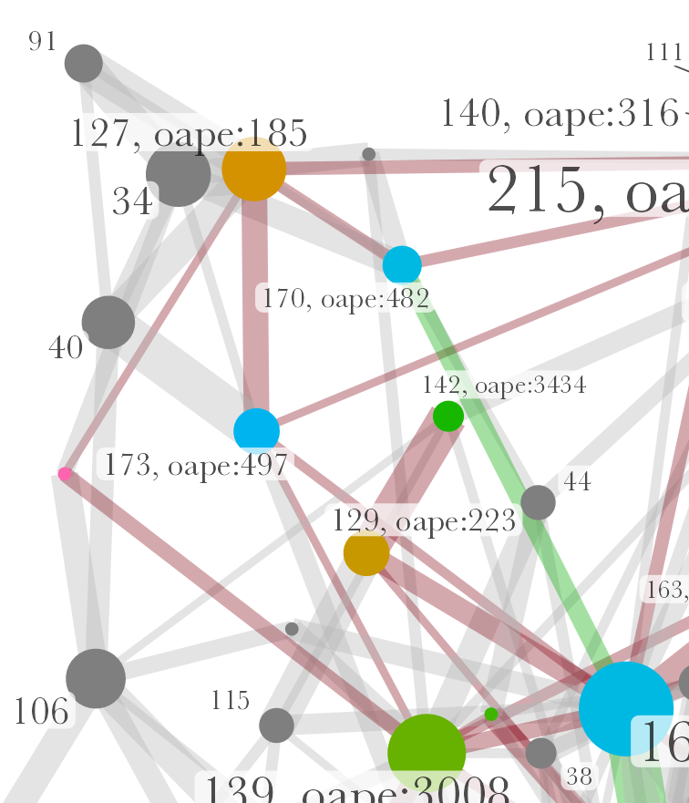
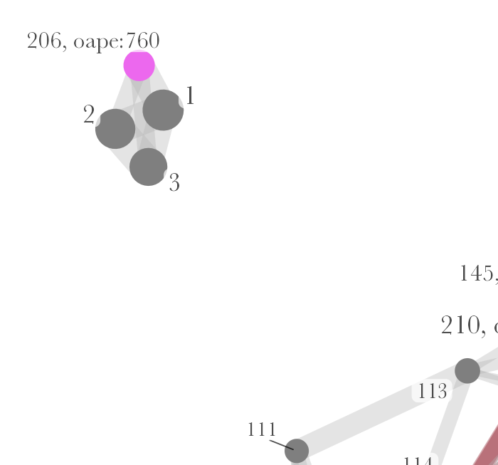
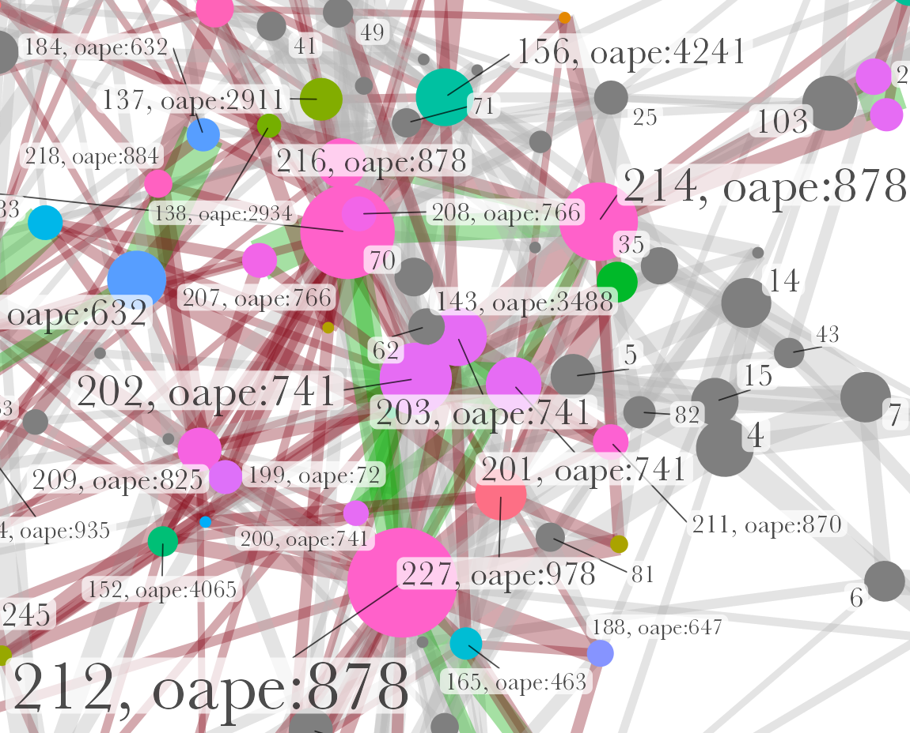
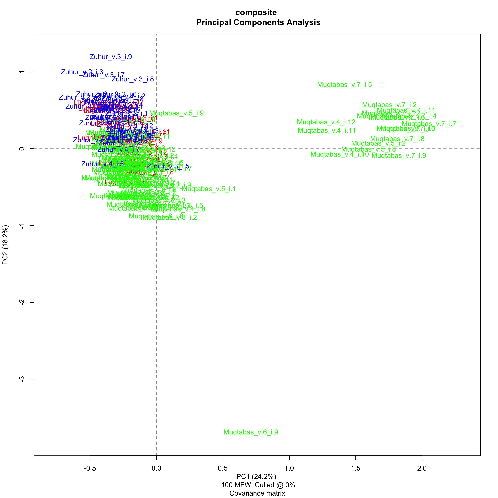
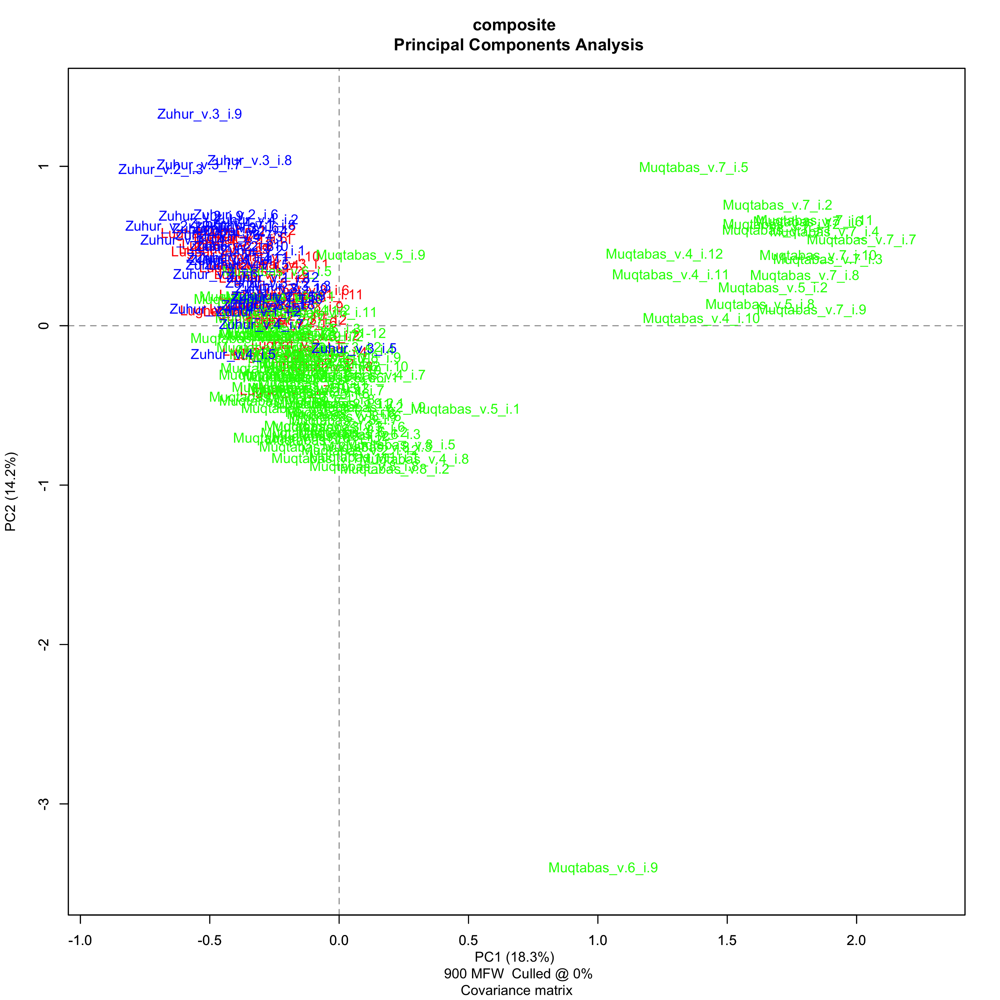

## outline

1. Background
2. Method and corpus
3. Results

# Background {data-background-image="../../assets/OpenArabicPE/front-pages_strip.png" data-background-size="90%"}
## Arabic periodicals

::: columns
:::: column

- Periodical press as agent of change
    + first mass medium
    + central medium of the literary and cultural Arabic renaissance (*nahḍa*)
    + medium of linguistic change
    + central forum for negotiations over modernity, nationalism, Islamism etc.

::::
:::: column

- Periodicals as *source* but not a *subject*
- Research is dominated by
	+ national(ist) narratives
	+ bias on two places and small no. of titles
	+ implicit hypotheses

::::
:::

{#fig:map-jaraid}

## Arabic periodicals

::: columns
:::: column

{#fig:al-quds}

::::
:::: column

- Green: Ottoman crescent with 3 stars and slogan of the Young Turk Revolution of 1908: "Liberty, Equality, Fraternity"
- Blue: French title
- Red: Date line according to 3 calendars
    + reformed Julian: 28 Dec. 1912
    + Gregorian: 10 Jan. 1913
    + Islamic: 2 Ṣafar 1331

::::
:::

## Research interest: intellectual networks

There will be a [paper](https://tillgrallert.github.io/slides/dh/2022-dot-periodicals/index.html) on Wednesday

::: columns
:::: column

{#fig:network-authors-2}

::::
:::: column

### Aims

- empirical testing of hypotheses
- evaluate existing literature

### Observations

<!-- * Nur wenige Knoten sind von relativer Bedeutung (14 von 319) -->
- very limited overlap between periodicals from the same place
- core network (14 of 319 nodes):
    - absent from the literature
    - suprising set up: many Iraqis (6), few Syrians (2), few Christians (2)

::::
:::

::: notes
- of the 14, Ayalon mentions only ʿIsā Iskandar al-Maʿlūf 
:::

## Problem: missing bylines

::: columns
:::: column

::::
:::: column

- About 4/5 of all articles or 2/3 of all words carry no byline
* Commonly ignored in scholarship 
* Implicit hypothesis is implausible and untested
* Stylometric authorship attribution is untested for this material

::::
:::

# Method
## Stylometric authorship attribution

Authorship signal is prevalent in most frequent words, i.e. function words

::: columns
:::: column

### comparative method

- steps:
	1. compute frequencies for every text
	2. compare every text with every text
	3. validate through voting (*consensus*) of multiple iterations

::::
:::: column

### challenges

- novel application to Arabic and this genre
- comparison depends on input
- reliability depends on a minimal length of texts

::::
:::

::: notes

- stylometry is old, compution has supercharged it
- Computational Stylometry Group
	+ Maciej Eder
	+ Mike Kestemont
	+ Jan Rybicki

:::

## Stylometry

- In R with the `stylo()` package [@Eder+2016b]
- Based on parameter settings established in our tests [@RomanovGrallert2022Stylometry]

::: columns
:::: column

### `stylo()` settings

- Tokens: words
- Sampling: 2500 tokens
- Most Frequent Features: 200--500 tokens, incremented by 100
- Culling: 0
- distance measure: Eder's simple delta

::::
:::: column

### Analysis

- edges (and nodes) tables from `stylo()`
- computing network measures with `tidygraph()` and `igraph()`
    + centrality
    + community detection
- plotting results with `ggpragh()` and `ggplot2()`

::::
:::

::: notes

- Maxim designed and ran parameter test on a corpus of 300 nineteenth-century books
- I confirmed the viability of these settings in my work on periodicals

:::

## Corpus

| Periodical                      | Place             | Dates[^tb1]   | Vol.s   | No.s    | Words       | Articles | with author | 2500+ words | words/articles | Authors | DOI                                                              |
| ------------------------------- | ----------------- | ------------- | ------: | ------: | ------:     | ------:  | ------:     | -----:      | ------:        | ------: | ------------------------                                         |
| [al-Ḥaqāʾiq][haqaiq_git]        | Damascus          | 1910--13      | 3       | 35      | 298090      | 389      | **41.90**   | 22          | 832.66         | 104     | [10.5281/zenodo.1232016](https://doi.org/10.5281/zenodo.1232016) |
| [al-Muqtabas][muqtabas_git]     | Cairo, Damascus   | 1906--18      | **9**   | **96**  | **1981081** | **2964** | 12.72       | **241**     | 873.34         | 140     | [10.5281/zenodo.597319](https://doi.org/10.5281/zenodo.597319)   |
| [al-Ustādh][ustadh_git]         | Cairo             | 1892--93      | 1       | 42      | 221447      | 435      | 5.52        | 13          | 582.21         | 8       | [10.5281/zenodo.3581028](https://doi.org/10.5281/zenodo.3581028) |
| [al-Zuhūr][zuhur_git]           | Cairo             | 1910--13      | 4       | 39      | 292333      | 436      | **41.51**   | 6           | 695.09         | 112     | [10.5281/zenodo.3580606](https://doi.org/10.5281/zenodo.3580606) |
| [Lughat al-ʿArab][lughat_git]   | Baghdad           | 1911--14      | 3       | 34      | 373832      | 939      | 16.19       | 21          | 485.21         | 53      | [10.5281/zenodo.3514384](https://doi.org/10.5281/zenodo.3514384) |
| **total**                       |                   |               | 20      | 246     | 3166783     | 5163     |             | 303         | 613.36         |         |                                                                  |

Table: Our corpus from "[Open Arabic Periodical Editions](https://openarabicpe.github.io/)" {#tbl:openarabicpe-corpus}

[^tb1]: The current cut-off date is 1918.

[muqtabas_git]: https://github.com/OpenArabicPE/journal_al-muqtabas
[haqaiq_git]: https://github.com/OpenArabicPE/journal_al-haqaiq
[lughat_git]: https://github.com/OpenArabicPE/journal_lughat-al-arab
[ustadh_git]: https://github.com/OpenArabicPE/journal_al-ustadh
[zuhur_git]: https://www.github.com/openarabicpe/journal_al-zuhur

## Corpus

Plain text files of >2500 words

::: columns
:::: column

- corpus 1: 303 individual articles
    + 76 unique authors
    + 190 anonymous articles

-> **very different from Maxim Romanov's test corpus**

::::
:::: column

- corpus 2: 88 sections of anonymous articles from 2 journals
- corpus 3: 246 full issues from 5 journals
- corpus 4: 6 books by Muḥammad Kurd ʿAlī

::::
:::

# Results
## articles

We found the spaghetti monster!

{#fig:network-author}

::: notes

- centrality measure
	+ degree: 
		* number of connections
		* local measure
- authorship
	+ 116 attributed texts
	+ 112 unattributed
	+ 75 authors
:::

## Zooming in: Kāẓim al-Dujaylī

Anonymous travellogue in *Lughat al-ʿArab* most likely written by the magazine's editor Kāẓim al-Dujaylī

::: columns
:::: column

{#fig:network-detail-dujayli}

::::
:::: column

](../../assets/OpenArabicPE/stylometry/stylo_NN_oclc.472450345_v.3_i.1_div_7.d2e1438_lollipop.png){#fig:radar-dujayli}

::::
:::

## Zooming in: Ibn al-Muqaffaʿ?

A cluster of texts potentially written by Ibn al-Muqaffaʿ (d. 759) and edited by Ṭāhir al-Jazāʾirī

::: columns
:::: column

{#fig:network-detail-muqaffa}

::::
:::: column

](../../assets/OpenArabicPE/stylometry/stylo_NN_oclc.4770057679_v.3_i.1_div_3.d1e733_lollipop.png){#fig:radar-muqaffa}

::::
:::

::: notes

- this is a case where the algorithm for extracting bibliographic information did not work as expected
	+ the title clearly mentions Ibn al-Muqaffaʿ as the author

:::

## Zooming in: William Shakespeare

Unmarked translations of Shakespeare's "Julius Caesar" in *al-Zuhūr*

::: columns
:::: column

{#fig:network-detail-shakespeare}

::::
:::: column

](../../assets/OpenArabicPE/stylometry/stylo_oape.760_oclc.1034545644_v.3_i.6_div_1.d2e1819_lollipop.png){#fig:radar-shakespeare}

::::
:::

::: notes

- one case of faulty transcription by al-Maktaba al-Shamela: *būlūs qayṣar*
- the fourth installment of the play was too short to make it into the corpus
- #3 is also a play featuring Antonius, Casius, Brutus -> https://openarabicpe.github.io/journal_al-zuhur/tei/oclc_1034545644-i_30.TEIP5.xml#div_1.d2e2328
	+ but kept under the title of "Fukaha ilá madāris al-banāt" and a brief introductory scene

:::

## Zooming in: Charles Seignobos

Historical texts by Charles Seignobos translated by Muḥammad Kurd ʿAlī. 

When does the distance measure become unrealiable?

::: columns
:::: column 

{#fig:network-detail-seignobos}

::::
:::: column

](../../assets/OpenArabicPE/stylometry/stylo_oape.741_oclc.4770057679_v.2_i.5_div_9.d1e1431_lollipop.png){#fig:radar-seignobos}

::::
:::

::: notes

- Which values of the distance measure are close enough to be considered?
- The text of Jibrāʾīl Madīnā is closer than other texts by Seignobos

:::

## owners-cum-editors as authors?
### *al-Muqtabas*

:::{.c_width-30 .c_right}

Muḥammad Kurd ʿAlī most likely not the author

:::
:::{.c_width-60 .c_left}

:::

## owners-cum-editors as authors?
### *al-Muqtabas*

:::{.c_width-30 .c_right}

Multiple anonymous candidates?

:::
:::{.c_width-60 .c_left}

:::

## owners-cum-editors as authors?
### *Lughat al-ʿArab*

:::{.c_width-30 .c_right}

Authorship of Anastās Mārī al-Karmalī and Kāẓim al-Duyalī more likely

:::
:::{.c_width-60 .c_left}

:::

## owners-cum-editors as authors?
### *Lughat al-ʿArab*

:::{.c_width-30 .c_right}

Authorship of Anastās Mārī al-Karmalī and Kāẓim al-Duyalī more likely

:::
:::{.c_width-60 .c_left}

:::

## stylistic differences between journals
### Auctorial voices?

:::{.c_width-60 .c_left}

:::
:::{.c_width-30 .c_right}

- periodicals show distinct stylistic features
- some similarity between *al-Muqtabas* and *al-Zuhūr*

:::

## stylistic differences between journals
### *al-Ḥaqāʾiq*, *Lughat al-ʿArab*, and *al-Muqtabas*

:::{.c_width-30}

{#fig:pca-halumu-100}

:::
:::{.c_width-30}

- *Lughat al-ʿArab* and *al-Muqtabas* are indistinguishable
- *al-Ḥaqāʾiq* is different
- some issues of *al-Muqtabas* are very different

:::
:::{.c_width-30}

{#fig:pca-halumu-900}

:::

## stylistic differences between journals
### *Lughat al-ʿArab*, *al-Muqtabas*, and *al-Zuhūr*

:::{.c_width-30}

{#fig:pca-lumuzu-100}

:::
:::{.c_width-30}

- Strong stylistic similarities between all three periodicals
- some issues of *al-Muqtabas* are very different

:::
:::{.c_width-30}

{#fig:pca-lumuzu-900}

:::

## stylistic differences between journals
### Importance of genre

:::{.c_width-60 .c_left}

:::
:::{.c_width-30 .c_right}

- very limited similarity between *al-Muqtabas* and its editor Muḥammad Kurd ʿAlī

:::

# Thank you!
## Thank you!

- Maxim Romanov for his work on parameter testing
- Contributors to OpenArabicPE: Jasper Bernhofer, Dimitar Dragnev, Patrick Funk, Talha Güzel, Hans Magne Jaatun, Jakob Koppermann, Xaver Kretzschmar, Daniel Lloyd, Klara Mayer, Tobias Sick, Manzi Tanna-Händel, and Layla Youssef
- Links:
    + Slides: [https://tinyurl.com/dot2022-grallert-dh](https://tillgrallert.github.io/slides/dh/2022-dot-dh/index.html)
    + Project blog: [https://openarabicpe.github.io](https://openarabicpe.github.io)
    + Papers: <http://digitalhumanities.org/dhq/vol/16/2/000593/000593.html>, <https://doi.org/10/gkhrjr>
    + Twitter: \@[tillgrallert](https://twitter.com/tillgrallert)
    + Email: <till.grallert@fu-berlin.de>, <till.grallert@hu-berlin.de>
- Licence: slides and images are licenced as [CC BY-SA 4.0](http://creativecommons.org/licenses/by-sa/4.0/)

## References {#refs}