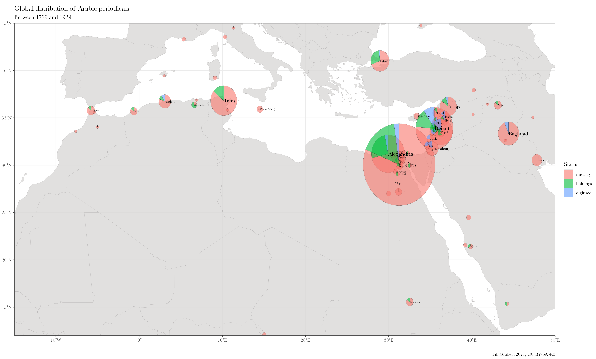
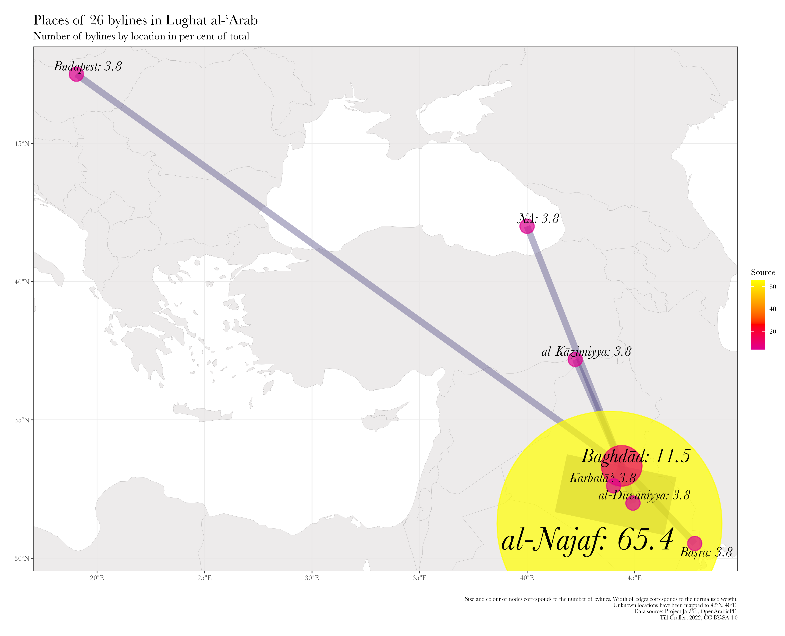
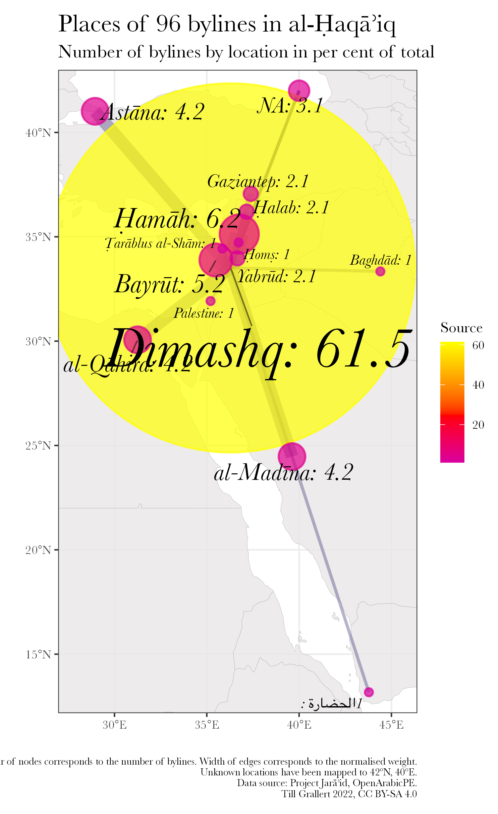
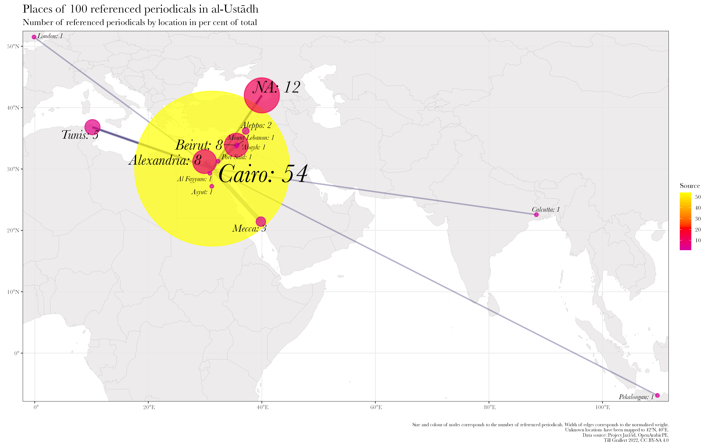

## outline

## Netzwerkanalyse

::: notes

- Knoten und Kanten
- Unimodal: 
    + nur eine Art von Knoten
    + verschiedenste Arten von Kanten
- statistische Aussagen über Dichte, Clustering, Wichtigkeit von Knoten

:::

## Wichtigkeit von Orten jenseits von Kairo und Beirut

::: columns
:::: c_width-30

| rank |    location   | titles |
|------|---------------|--------|
|    1 | Cairo         |    734 |
|    2 | Beirut        |    199 |
|    3 | Alexandria    |    155 |
|    4 | Tunis         |     99 |
|    5 | Baghdad       |     62 |
|    6 | Damascus      |     55 |
|    7 | Istanbul      |     51 |
|    8 | New York City |     48 |
|    9 | Paris         |     48 |
|   10 | Sao Paolo     |     34 |

Table: Publikationsorte arabischer Periodika bis 1918, nach Häufigkeit {#tbl:locations}

::::
:::: c_width-60

::::
:::

## Problem 
### Unzugänglichkeit

::: columns
:::: c_width-60

{#fig:map-holdings-summary}

::::
:::: c_width-30

{#fig:map-holdings-catalogues}

::::
:::

## Corpus

| Periodical                                                        | Place           | Dates[^tb1] | Vol.s   | No.s   | Words       | Articles | with author | Authors | DOI                                                              |
| -------------------------------                                   | ---------       | --------    | ------: | ----:  | ----:       | ------:  | ------:     | ------: | --------------                                                   |
| [al-Ḥaqāʾiq][haqaiq_git]                                          | Damascus        | 1910--13    | 3       | 35     | 298090      | 389      | **41.90**   | 104     | [10.5281/zenodo.1232016](https://doi.org/10.5281/zenodo.1232016) |
| [al-Ḥasnāʾ][hasna_git] | Beirut          | 1909--11    | 1       | 12     |             | 201      |             |         |                                                                  |
| [al-Muqtabas][muqtabas_git]                                       | Cairo, Damascus | 1906--18    | **9**   | **96** | **1981081** | **2964** | 12.72       | 140     | [10.5281/zenodo.597319](https://doi.org/10.5281/zenodo.597319)   |
| [al-Ustādh][ustadh_git]                                           | Cairo           | 1892--93    | 1       | 42     | 221447      | 435      | 5.52        | 8       | [10.5281/zenodo.3581028](https://doi.org/10.5281/zenodo.3581028) |
| [al-Zuhūr][zuhur_git]                                             | Cairo           | 1910--13    | 4       | 39     | 292333      | 436      | **41.51**   | 112     | [10.5281/zenodo.3580606](https://doi.org/10.5281/zenodo.3580606) |
| [Lughat al-ʿArab][lughat_git]                                     | Baghdad         | 1911--14    | 3       | 34     | 373832      | 939      | 16.19       | 53      | [10.5281/zenodo.3514384](https://doi.org/10.5281/zenodo.3514384) |
| **total**                                                         |                 |             | 21      | 258    | 3166783     | 5163     |             |         |                                                                  |

Table: Our corpus from "[Open Arabic Periodical Editions](https://openarabicpe.github.io/)" {#tbl:openarabicpe-corpus}

[^tb1]: The current cut-off date is 1918.

[muqtabas_git]: https://github.com/OpenArabicPE/journal_al-muqtabas
[haqaiq_git]: https://github.com/OpenArabicPE/journal_al-haqaiq
[lughat_git]: https://github.com/OpenArabicPE/journal_lughat-al-arab
[ustadh_git]: https://github.com/OpenArabicPE/journal_al-ustadh
[zuhur_git]: https://www.github.com/openarabicpe/journal_al-zuhur
[hasna_git]: https://www.github.com/openarabicpe/journal_al-hasna

# Geographische Netzwerke
## Autor_innenzeilen
### Lokale und regionale Zeitschriften

::: columns
:::: column

<!-- {#fig:map-bylines-lughat} -->
{#fig:map-bylines-haqaiq}

::::
:::: column

{#fig:map-bylines-hasna}

::::
:::

## Erwähnte Periodka
### Internationale Zeitschriften

{#fig:map-periodicals-muqtabas}

## Erwähnte Periodka
### Lokale und regionale Zeitschriften

::: columns
:::: column

{#fig:map-periodicals-ustadh}

{#fig:map-bylines-lughat}

::::
:::: column

{#fig:map-periodicals-haqaiq}

::::
:::

## Autor_innenzeilen
### Internationale Zeitschriften

{#fig:map-bylines-muqtabas}

# Danke!
## Danke!

- Links:
    + Folien: [https://tinyurl.com/dot2022-grallert-periodicals](https://tillgrallert.github.io/slides/dh/2022-dot-periodicals/index.html)
    + Projektblog: [https://openarabicpe.github.io](https://openarabicpe.github.io)
    + Papers: <http://digitalhumanities.org/dhq/vol/16/2/000593/000593.html>, <https://doi.org/10/gkhrjr>
    + Twitter: \@[tillgrallert](https://twitter.com/tillgrallert)
    + Email: <till.grallert@fu-berlin.de>, <till.grallert@hu-berlin.de>
- Licence: slides and images are licenced as [CC BY-SA 4.0](http://creativecommons.org/licenses/by-sa/4.0/)

## Ideen

- Zeigen, dass Periodika nur als Netzwerk zu denken und verstehen sind
- Zeige die Wichtigkeit von anderen Orten als Beirut und Kairo
    + Tabellen aus meinem Tutorial zum Mapping