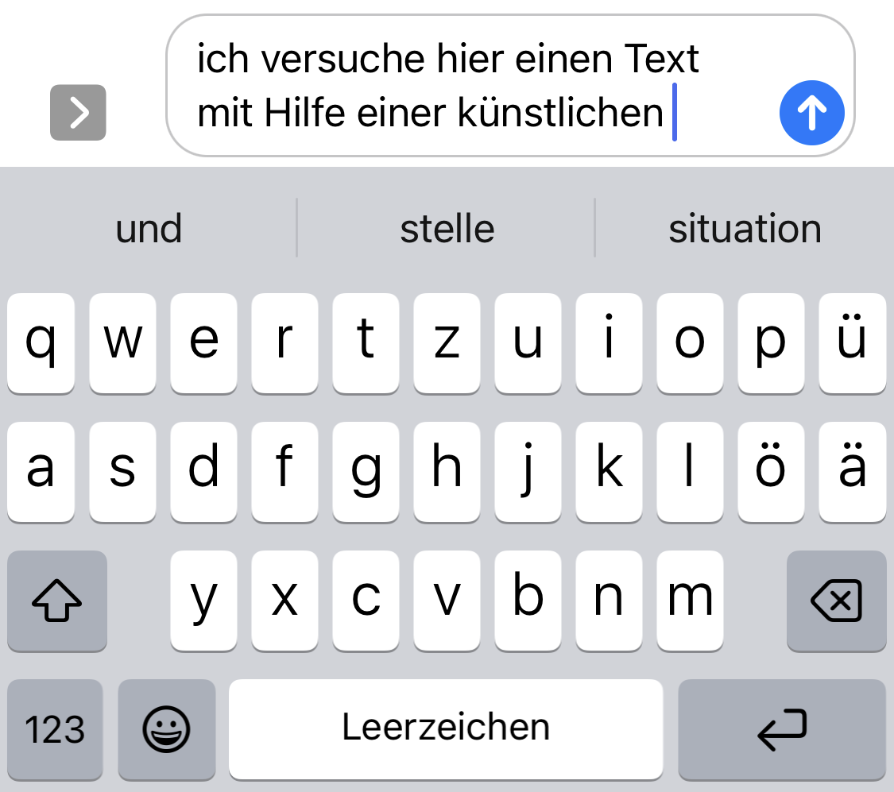
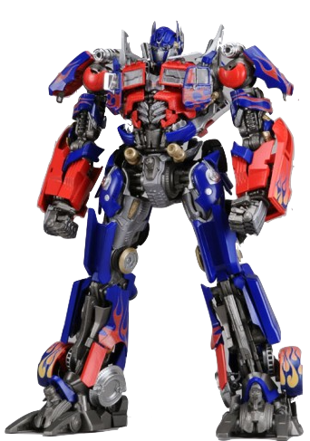
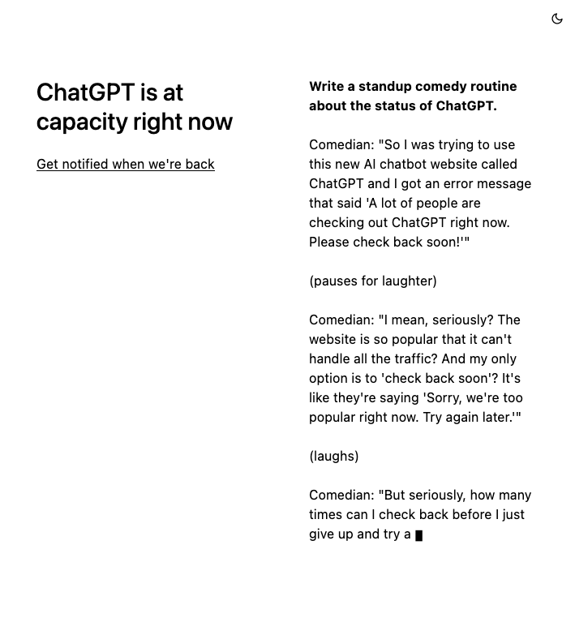
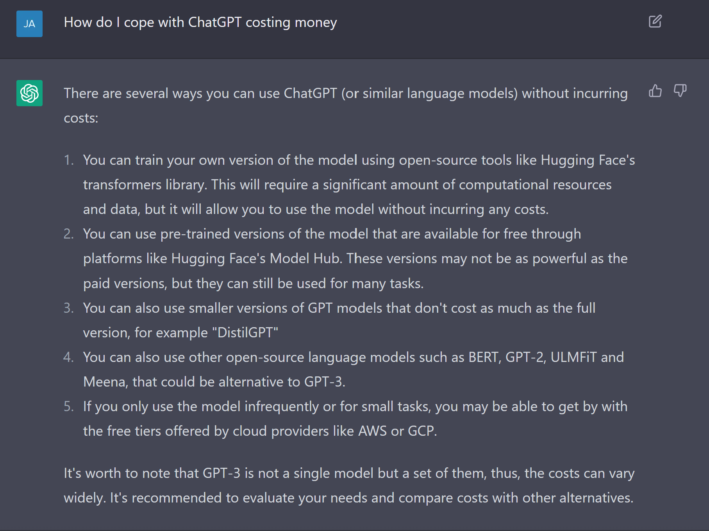
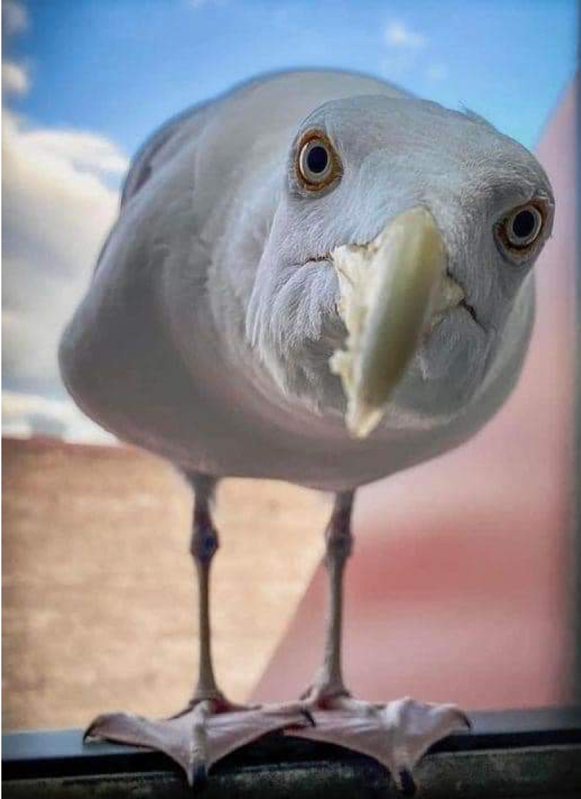
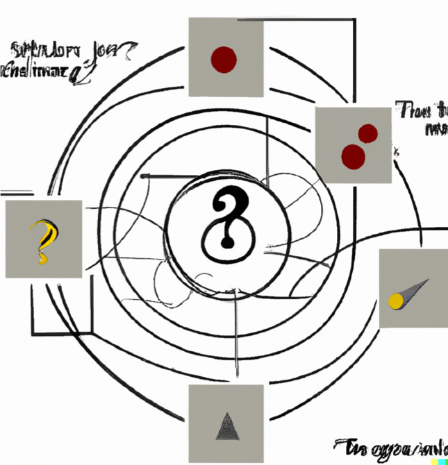

# Generative KI?  Was soll das sein?!
## Künstliche Intelligenz (KI / AI)

::: columns
:::: column

![Enthüllung einer Gedenktafel im Darthmouth College, Quelle: [@Belser2006AIConferenceReturns]](../../assets/ai/ai-plaque-darthmouth-reveal.jpg){#fig:plaque}

::::
:::: column

- "Künstliche Intelligenz" ist ein **altes** Buzzword, das sich findige Wissenschaftler 1956 für einen Förderantrag ausgedacht haben.
- Es ist besser von **maschinellem Lernen** (ML) zu sprechen, das z.T. auf **künstlichen neuronalen Netzen** beruht.

::::
:::

::: notes

- Dartmouth Conference im Sommer 1956 
- sechswöchiger Workshop mit dem Titel Dartmouth Summer Research Project on Artificial Intelligence
- von der Rockefeller Foundation gefördert
- "In 1955, John McCarthy, then a young Assistant Professor of Mathematics at Dartmouth College, decided to organize a group to clarify and develop ideas about thinking machines." <https://en.wikipedia.org/wiki/Dartmouth_workshop>

:::

## Maschinelles Lernen (ML)

::: columns
:::: column

### Was?

- Algorithmen, die auf der Basis sehr großer Datensätze statistische Modelle anlegen (trainieren)
- Es gibt verschiedenste Arten des ML
    - Supervised
    - unsupervised
    - transfer learning
    - deep learning
    - reinforcement learning

::::
:::: column

### Wie?

::::
:::

::: notes

- ist nicht neu

:::

## Large Language Models (LLMs)

::: columns
:::: wide

### Was?

- **Modelle** [@Stachowiak1973AllgemeineModelltheorie]: 
    + Abbildung
    + Verkürzung/Reduktion
    + Zweckbindung 
- **Sprach**Modelle (LM):
    + statistische Wahrscheinlichkeitsverteilung von Tokens (Buchstaben, Wörter, Strings) in einer Textsequenz innerhalb eines Korpus
    + werden *trainiert*
    + dienen der Stringvorhersage
    + Idee ist alt [@ShannonWeaver1949MathematicalTheoryCommunication]
- **Große** Sprachmodelle (LLM): 
    + Hunderte Milliarden von Parametern
    + Benötigen hunderte GB Speicherplatz

::::
:::: narrow

### Beispiel

{#fig:ios-keyboard}

::::
:::

::: notes

- Modelle haben drei grundlegende Eigenschaften [@JannidisFlanders2019GentleIntroduction, 28; @Stachowiak1973AllgemeineModelltheorie]
    1. **Mapping**: Ein Model ist ein Model von etwas
    2. **Reduction**: Ein Model ist nicht das Original sondern bildet für die Untersuchenden wichtige Aspekte ab
    3. **Purpose**: Ein Model hat einen Zweck: es soll von jemanden für etwas benutzt werden
- LM:
    + >we understand the term language model (LM) to refer to systems which are trained on string prediction tasks: that is, predicting the likelihood of a token (character, word or string) given either its preceding context or (in bidirectional and masked LMs) its surrounding context. Such systems are unsupervised and when deployed, take a text as input, commonly outputting scores or string predictions.
+ "stochastic parrots" [@BenderEtal2021StochasticParrots, 617]
    * >an LM is a system for haphazardly stitching together sequences of linguistic forms it has observed in its vast training data, according to probabilistic information about how they combine, but without any reference to meaning: a stochastic parrot. [BenderEtal2021StochasticParrots, 617]
    * Wer trifft die Auswahl?  
    * Welche sozio-kulturellen Biases perpetuieren sich hier?
- Beispiel GPT-3 (Generative Pre-trained Transformer)
    + 2048-token-long context and 175 billion parameters (requiring 800 GB of storage).
:::

## Transformer Modelle {#transformer-2}

::: columns
:::: column

{#fig:transformer-model}

::::
:::: column

- Sind Anwendungen von deep learning, die vor allem für Natural Language Processing (NLP) entwickelt wurden
- Prinzip:
    + Die Inputsequenz wird in Tokens (Wörter, Sätze etc.) zerschnitten
    + Tokens werden in Vektoren *übersetzt* (Word embedding), bei dem Informationen über die Position des Tokens in der Inputsequenz erfasst wird. 
- Beispiele: 
    - `Königin - weiblich = König`
    - `Arzt + weiblich = Krankenschwester`

::::
:::

::: columns-3
:::: column

- [ChatGPT](https://chat.openai.com/)
- [Rytr](https://rytr.me/)
- [You](https://you.com/search?q=how+to+write+well)

::::
:::: column

- [Moonbeam](https://www.gomoonbeam.com/ )
- [Elicit](https://elicit.org/)
- [Lex](https://lex.page/)

::::
:::: column

- [R Tutor](http://rtutor.ai) <!-- : Zum Erlernen von R-->
- [GitHub CoPilot]()
- [OpenAI detector](https://huggingface.co/openai-detector)

::::
:::

::: notes

>Ein Transformer besteht im Wesentlichen aus in Serie geschalteten Kodierern (Encoder) und in Serie geschalteten Dekodierern (Decoder).[2][3][4] Die Eingabesequenz wird durch eine sogenannte Embedding-Schicht in eine Vektorrepräsentation überführt. Die Gewichte der Embedding-Schicht werden während des Trainings angepasst. Im Falle des Transformers kommt zusätzlich eine Positionskodierung zum Einsatz, wodurch die sequentielle Abfolge der Wörter berücksichtigt werden kann. Ein Wort erhält somit zu Beginn eines Satzes eine andere Repräsentation als am Ende.[3]

>Die Eingabesequenz wird in der Vektorrepräsentation einer Serie von Kodierern übergeben und in eine interne Repräsentation überführt. Diese interne Repräsentation bildet die Bedeutung der Eingabesequenz abstrakt ab[4] und wird durch die Dekodierer in eine Ausgabesequenz übersetzt.[4] Die Eingabesequenz wird hierbei in Batches verarbeitet, wobei die Länge der Kodierer-Dekodierer-Pipeline die maximale Länge der Eingabesequenz beschränkt.[3] Je nach Größe des Netzwerks können beispielsweise einzelne Sätze oder auch ganze Absätze verarbeitet werden. Bei Eingabesequenzen, welche kürzer sind als die Länge der Kodierer-Dekodierer-Pipeline, wird Padding genutzt, um die Eingabesequenz aufzufüllen.[3]

:::

# Abgeleitete Anwendungen
## ChatGPT

::: columns
:::: column

- Ein "Chatbot" auf der Basis von GPT-3 ... GPT-3.5 ... GPT-4
+ Entwickelt von OpenAI
+ unterstützt alle im Internet dominant vertretenen Sprachen

::::
:::: column

+ Veröffentlicht am 30 November 2022
- 1 Mio Nutzer_innen in 5 Tagen

::::
:::

<pre class="mermaid">
---
title: Die etwas interessantere Antwort
---
%%{ init: { 'flowchart': { 'curve': 'bumpX' } } }%%
flowchart LR
    %% nodes
    gpt[(GPT: Generative\nPre-trained\nTransformer\n2018)]
    gpt3[(GPT-3,\n-3.5, -4\n2020)]
    chatgpt{ChatGPT\n2022}
    dalle{DALL-E\n2021}
    copil{GitHub\nCoPilot\n2021}
    data1[("Common Crawl\ndata set\n2011-")]

    pers1[Elon Musk]
    pers2[Peter Thiel]
    comp2((OpenAI\n2015\nnonprofit))
    comp3((Microsoft))
    comp4(("Amazon Web\nServices (AWS)"))
    comp5((OpenAI\n2019\nfor profit))
    comp6((Common Crawl\nnonprofit))
    comp7((GitHub))

    %% vertices
    comp2 ==> gpt
    pers1 -.->|co-funded| comp2
    pers2 -.->|co-funded| comp2
    comp4 -.->|co-funded| comp2
    comp4 --> |hosts| data1
    comp6 --> |provides| data1
    data1 --> |training\nset for| gpt
    gpt ==> comp5
    comp5 ==> gpt3
    comp3 -.->|invested| comp5
    gpt3 -.->|exclusive use| comp3
    gpt3 -.-> comp3
    comp3 -.->|bought\n2018| comp7
    gpt3 -->|powers| dalle & copil
    gpt3 ====>|powers| chatgpt
    comp7 -.- copil

    %% hyperlinks
    click chatgpt "https://chat.openai.com/" _blank
    click dalle "https://openai.com/blog/dall-e/" _blank
    click comp6 "http://commoncrawl.org/" _blank

    %% looks: note that classes can be defined in the main CSS
    classDef focus stroke:blue,stroke-width:4px,font-size:1em
    class comp2,comp5,gpt3,gpt,chatgpt focus
</pre>

## Wer kann das benutzen?

- Die Nutzung ist **zunächst** kostenfrei nach Anmeldung und in der Kapazität begrenzt
- Dient der Verbesserung der Modelle und Produktentwicklung

::: columns
:::: column

{#fig:chatgpt-max}

::::
:::: column

<!-- {#fig:chatgpt-cost} -->
<video width="500" height="400" controls>
    <source src="../assets/video/example_ChatGPT-math.mp4" type="video/mp4"></source>
    
Your browser does not support the video tag. 

</video>

::::
:::

# Anmerkungen vom Grantler 
## LLMs sind Bullshit-Artists

::: columns
:::: column

- Konzepte wie "Wahrheit" oder "Korrektheit" sind nur nebensächlicher Beifang
- Optimiert werden "Menschenähnlichkeit" und "Menschengefälligkeit" 

::::
:::: column

![[@Frankfurt2005Bullshit]](../../assets/ai/on-bullshit.jpg)

::::
:::

## Wer ist der Urheber?  Wer ist zuständig?

::: columns
:::: column

- Wo ist die Grenze zwischen Schöpfung und Remix der Ursprungsdaten?
- "Zufallsausgaben" mit schutzwürdigen und privaten Informationen
- Wie Training auf eigenen Schöpfungen kontrollieren?

::::
:::: column

::::
:::

## It is a riddle...

>It is a riddle... wrapped in a mystery...inside an enigma

<cite>Winston Churchill</cite>

::: columns
:::: column

LLMs sind Blackboxes...

- ...gefüttert mit unbekannten Daten...
- ... mit automatisierten (vor) Filtern....
- ...potentiellen manuellen Antwortmustern...

::::
:::: column

::::
:::

# Schluß / Danke!

## Literatur {#refs}
