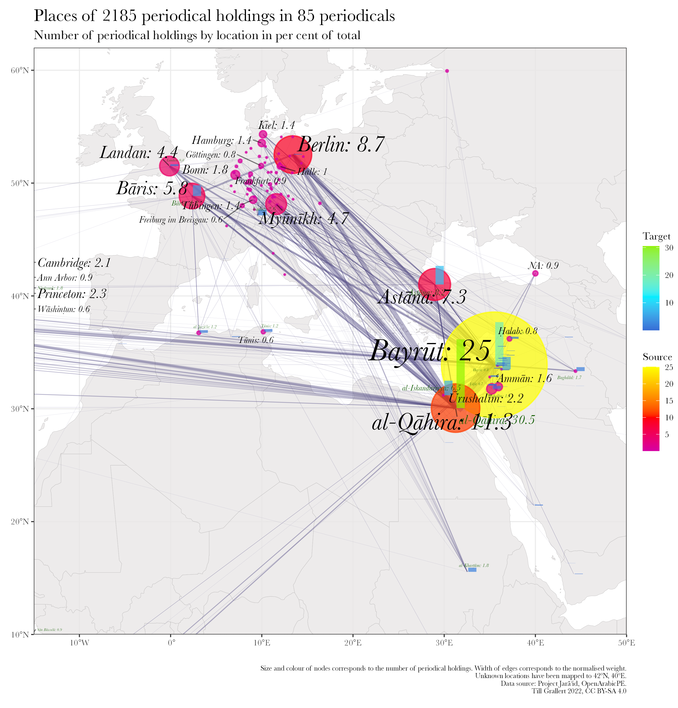
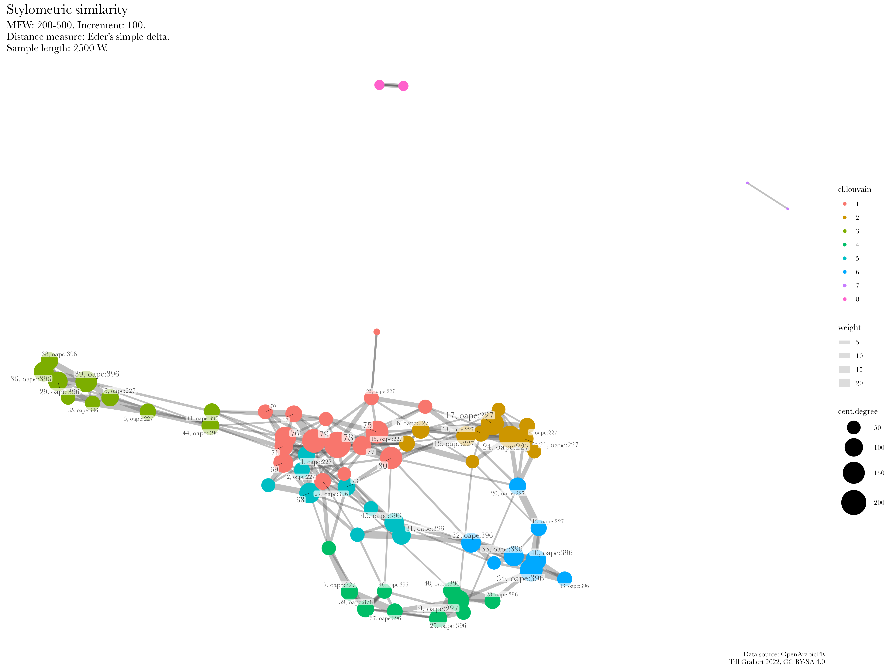

# Background {data-background-image="../../assets/OpenArabicPE/front-pages_strip.png" data-background-size="90%"}
## Arabic periodicals

::: columns
:::: column

- Periodical press as agent of change
    + first mass medium
    + central medium of the literary and cultural Arabic renaissance (*nahḍa*)
    + medium of linguistic change
    + central forum for negotiations over modernity, nationalism, Islamism etc.

::::
:::: column

- Periodicals as *source* but not a *subject*
- Research is dominated by
    + national(ist) narratives
    + bias on two places and small no. of titles
    + implicit hypotheses

::::
:::

{#fig:map-jaraid}

## Research interest: intellectual networks

::: columns
:::: column

{#fig:network-authors}

::::
:::: column

### Aims

- empirical testing of hypotheses
- evaluate existing literature

### Observations

<!-- * Nur wenige Knoten sind von relativer Bedeutung (14 von 319) -->
- very limited overlap between periodicals from the same place
- core network (14 of 319 nodes):
    - absent from the literature
    - suprising set up: many Iraqis (6), few Syrians (2), few Christians (2)

::::
:::

::: notes
- of the 14, Ayalon mentions only ʿIsā Iskandar al-Maʿlūf 
:::

## Research interest: intellectual networks

::: columns
:::: column

{#fig:network-periodicals}

::::
:::: column

{#fig:map-referenced}

::::
:::

## Data requirements


::: columns-3
:::: column

### modelled text

+ e.g. "The newspaper *al-ʿAṣr al-Jadīd* from Damascus reported in its last issue that ..."
+ (semi)automated extraction based on
    * named entity recognition (NER)
+ problems
    * state of OCR/HTR
    * state of Layout recognition
    * state of NER

::::
:::: column

### structured bibliographic metadata

+ e.g. "*Sātisnā* dispatched this report from *al-Shahbāʾ*"
+ (semi)automated extraction based on
    * presence of information in the material artefact
    * a modelled digital surrogate
+ problems
    * absence of explicit information

::::
:::: column

### authority files / norm data

- *Sātisnā*
    + Pseudonym and anagramme of *Anastās al-Karmilī*, editor of *Lughat al-ʿArab* in Baghdad
- *al-Shahbāʾ*, "the grey"
    + one of the epithets of Aleppo
    + geo coordinates: `36.20124, 37.16117`
- problems
    + bias on Global North in form and content

::::
:::

# Closing some `<gap/>`(s)
## [Project Jarāʾid](https://projectjaraid.github.io/) (2012--) <br/>Closing the knowledge `<gap/>`

::: columns
:::: column

- Bibliographic record of **all** Arabic periodical titles published between 1798 and 1929
    - websits and open datasets ([TEI XML](https://tei-c.org/)) for more than 3500 periodicals
    - additional authority files for c.2700 persons, 220 places, 180 libraries
- Unfunded collaboration with Adam Mestyan (Duke), "crowd"-sourcing
- Ongoing since 2021/22: Integration of holding information from library catalogues such as ZDB, AUB, BnF, HathiTrust

::::
:::: column

{#fig:holding-stats}

::::
:::

## Collection and digitisation biases

::: columns
:::: column

{#fig:holding-map}

::::
:::: column

|      periodicals       | --1918 | --1929 |
|------------------------|--------|--------|
| published              |   2054 |   3550 |
| known holdings         |    540 |    775 |
| % of total             |  26.29 |  21.83 |
|------------------------|--------|--------|
| digitized              |    156 |    233 |
| % of total             |   7.59 |   6.56 |
|------------------------|--------|--------|
| multiple digitizations |     51 |     66 |
| % of total             |   2.48 |   1.86 |
| % of digitized         |  32.69 |  28.33 |

Table: Periodical holdings and digitization {#tbl:jaraid-holdings}

::::
:::

::: notes

- collection bias is more of a knowledge bias
- While the digitization quote of roughly 50% of titles in collections is surprisingly high, it must be kept in mind that we cannot resolve information on the extent of digitization. Even if only a single issue of hundreds published was digitized, the periodical title will be included in this count.
- 66 periodicals or 28,33% have been digitized by multiple institutions and 21 of this subset by three and more.

:::

## The digitisation bias compared

|             | Arabic periodicals (1798--1918) | [WWI as mirrored by Hessian regional papers](https://hwk1.hebis.de) |
|-------------|---------------------------------|---------------------------------------------------------------------|
| community   | c. 420 million Arabic speakers  | c. 6.2 million inhabitants                                          |
| periodicals | 2054 newspapers and journals    | 125 newspapers                                                      |
| digitized   | 156 periodicals                 | 125 newspapers with more than 1.5 million pages                     |
| type        | mostly facsimiles               | facsimiles and full text                                            |
| access      | paywalls, geo-fencing           | open access                                                         |
| interface   | mostly foreign languages only   | local and foreign languages                                         |

Table: Comparison of digitized periodicals between the Global South and the Global North {#tbl:digitisation}

## Accessibility
### Catalogue searches

::: columns-3
:::: column

No Arabic script

{#fig:zdb-ar}

::::
:::: column

Which Latinized transcription was used?

{#fig:zdb-dmg}

::::
:::: column

What are the normalization rules for the search algorithm?

{#fig:zdb-functional}

::::
:::

::: notes

- catalogue could be searched in Arabic but the data is missing
- Latin input is mostly reduced to ASCII
    + Hamza and ʿAyn escape this algorithm on ZDB
- determined article is not automatically removed

:::

## Accessibility
### Interfaces

 project (Bonn). Facsimile of Arabic original on the left. Yellow = English UI; purple = Arabic metadata in DMG transcription;  green = German metadata](../../assets/OpenArabicPE/translatio_interface-languages_annotated.png){#fig:translatio-interface}

## Accessibility
### copyright regimes, paywalls, and geo fencing

cataloging rules and algorithmic copyright detection cause further inaccessibilities

::: columns
:::: column

 (Original in Princeton) outside the USA](../../assets/OpenArabicPE/hathi_muqtabas-1.png){#fig:hathi-muqtabas-global}

::::
:::: column

![The page from [@fig:hathi-muqtabas-global] with a US-IP](../../assets/OpenArabicPE/hathi_muqtabas-2.png){#fig:hathi-muqtabas-us}

::::
:::


::: notes

Beispiel: unklares Enddatum eines Erscheinungsverlaufs im 20. Jahrhundert wird korrekt als 19uu katalogisiert und dann Copyrightstatus sicherheitshalber als 1999 angenommen.

:::

## Accessibility
### Text layers

>For old prints, there's [...] kraken/calamari for coders, Transkribus if you've got money and just want to have the results[,] and OCR-D if you've got an IT department.

<cite>[@Winkler20230307OCR]</cite>

- Unstructured text, no APIs, propriertary interfaces
- Algorithms and evaluation are kept secret
    +  unknown numbers of *false positives* and *false negatives*

::: columns
:::: column

, quality of the OCR layer (requires US IP)](../../assets/OpenArabicPE/hathi_muqtabas-ocr-3.png)

::::
:::: column

, quality of the OCR layer](../../assets/OpenArabicPE/gpa_bashir-i_487-p_1_ocr.png)

::::
:::


## Closing the infrastructural `<gap/>` <br/>Open Arabic Periodical Editions ([OpenArabicPE](https://openarabicpe.github.io), 2015--)

::: columns-3
:::: column

### approach

- combine available facsimiles and transcriptions into an open standard format
- scrape, generate, and share open bibliographic metadata
- with the affordances of the Global South

::::
:::: column

### aims

- validate available transcriptions for scholarly (re)use
- develop an open infrastructure of models, workflows, authority files

::::
:::: column

### principles

- **established** tools and technologies
- as **few** as possible, **open**, and **simple** tools and formats
- **free-to-use** platforms without lock-in

::::
:::

::: notes

- minimal computing
- meaningful connection

:::

## [OpenArabicPE](https://openarabicpe.github.io)
### Infrastructure

::: columns
:::: column

1. Digital scholarly editions, authority files: [TEI/XML](https://tei-c.org/).
1. Open licenses: [CC BY-SA 4.0](http://creativecommons.org/licenses/by-sa/4.0/) (TEI, MODS, BibTeX), MIT license (XSLT, XQuery)
2. Social digital editions, hosted on [GitHub](https://github.com/openarabicpe): <!-- gradually improve transcription and mark-up -->
2. Archived on [Zenodo](https://zenodo.org): DOI for stable citability
3. [Static webviews](https://github.com/openarabicpe/tei-boilerplate-arabic-editions)<!--  (doesn't require a permanent internet connection) -->: parallel display of text and facsimile
4. Bibliographic metadata, hosted through a [Zotero group](https://www.zotero.org/groups/openarabicpe).

::::
:::: column

](../../assets/OpenArabicPE/boilerplate_muqtabas.png){#fig:webview-muqtabas}

::::
:::

## OpenArabicPE
### Corpus

| Title                                                                           | Place             | Proprietor                    | DOI                                                                | Volumes  | Issues  | Articles | Words   |
| ------------------------------------------------------------------------------- | ----------------- | ----------------------------- | ------------------------------------------------------------------ | -------: | ------: | -------: | ------: |
| [al-Ḥaqāʾiq](https://www.github.com/openarabicpe/digital-haqaiq)                | Damascus          | Abd al-Qādir al-Iskandarānī   | [10.5281/zenodo.1232016](https://doi.org/10.5281/zenodo.1232016)   | 3        | 35      | 389      | 298090  |
| [al-Ḥasnāʾ](https://www.github.com/openarabicpe/journal_al-hasna)               | Beirut            | Niqūlā Bāz                    | [10.5281/zenodo.3556246](https://doi.org/10.5281/zenodo.3556246)   | 1        | 12      | 201      | NA      |
| [al-Manār](https://www.github.com/openarabicpe/journal_al-manar)                | Cairo             | Muḥammad Rashīd Riḍā          |                                                                    | 35       | 537     | 4300     | 6144593 |
| [al-Muqtabas](https://www.github.com/tillgrallert/digital-muqtabas)             | Cairo, Damascus   | Muḥammad Kurd ʿAlī            | [10.5281/zenodo.597319](https://doi.org/10.5281/zenodo.597319)     | 9        | 96      | 2964     | 1981081 |
| [al-Ustādh](https://www.github.com/openarabicpe/journal_al-ustadh)              | Cairo             | Abdallāh Nadīm al-Idrīsī      | [10.5281/zenodo.3581028](https://doi.org/10.5281/zenodo.3581028)   | 1        | 42      | 435      | 221447  |
| [al-Zuhūr](https://www.github.com/openarabicpe/journal_al-zuhur)                | Cairo             | Anṭūn al-Jumayyil             | [10.5281/zenodo.3580606](https://doi.org/10.5281/zenodo.3580606)   | 4        | 39      | 436      | 292333  |
| [Lughat al-ʿArab](https://www.github.com/openarabicpe/journal_lughat-al-arab)   | Baghdad           | Anastās Mārī al-Karmalī       | [10.5281/zenodo.3514384](https://doi.org/10.5281/zenodo.3514384)   | 3        | 34      | 939      | 373832  |
| **total**                                                                       |                   |                               |                                                                    | 56       | 795     | 9664     | 9311376 |


# Attempts at a digital/computational history
## SIHAFA

::: columns-3
:::: column

### aims

+ systematic analysis of the late Ottoman Arabic press at scale
+ development and evaluation of computational methods
+ challenging established narratives
+ establishing "Arab Periodical Studies"

::::
:::: column

### questions

+ who are the central actors (people, periodicals) in this discursive field?
+ how were periodicals produced and how to conceptualise "authorship"?
+ what is the role of *text reuse* and how did texts, topics, and genres travel?
+ how did the language of modernity develop in this multilingual, imperial space?

::::
:::: column

### methods

+ social network analysis (SNA)
+ stilometric authorship attribution
+ historical GIS
+ layout analysis
+ topic modelling
+ ...

::::
:::


# 1. Historical GIS
## 1. Historical GIS: typology of periodicals <!-- CUT -->

Hypothesis: distribution of geographic origin of contributions to a periodical is an indicator for its importance

::: columns-3
:::: column

### trans-regional

{#fig:authors-muqtabas-2}

::::
:::: column

### regional

{#fig:authors-hasna}

::::
:::: column

### local

{#fig:authors-haqaiq-2}

::::
:::

::: notes

- *al-Muqtabas* turns the saying “Cairo writes, Beirut publishes and Baghdad reads” upside down with Baghdad well ahead of even Damascus.

:::


## Historical GIS
### Required data

::: columns
:::: column

- Initial sources: OpenArabicPE
- Marked-up place names in the modelled text
    + bylines
    + reviews
    + problems: no functional NER for late Ottoman Arabic 
- authority files for disambiguation and enriching data
    + geo-referenced places
    + problems: lack of historical gazetteers

::::
:::: column

- Byline: Maryam Zakā from Sayda

```xml
 <byline>
    <placeName ref="oape:place:9 geon:268064">صيدا</placeName>
    <persName ref="oape:pers:2845">مريم زكا</persName>
</byline>
```

- Gazetteer entry for Sayda

```xml
<place type="town" xml:id="place_9">
    <placeName type="simple">Saida</placeName>
    <placeName xml:lang="ar-Latn-x-ijmes">Ṣaydā</placeName>
    <placeName xml:lang="en">Sidon</placeName>
    <placeName xml:lang="ar">صيدا</placeName>
    <location>
        <geo>33.55751, 35.37148</geo>
    </location>
    <idno type="url">http://en.wikipedia.org/wiki/Sidon</idno>
    <idno type="geon">268064</idno>
    <idno type="oape">9</idno>
</place>
```

::::
:::


::: notes

- mention the "Historical Middle East Data Alliance" on Github

:::

# 2. Social network analysis
## 2. Social network analysis: referenced periodicals

<!-- use Arabic labels -->

::: columns
:::: wide

](../../assets/OpenArabicPE/networks/network_oape-p3a6afa20_referenced-periodicals-per-issue_circular-n-size_in-degree_ar.png){#fig:network-periodicals-2}

::::
:::: narrow

### aim

- empirical testing of hypotheses
- guidance for future digitisation efforts

### results

- mainly self-referential
- typology: extent of outward looking
- core network (44 of 465)
    + surprising members
    + highly concentrated on a few locations

::::
:::

::: notes

- geographic distribution: 10 locations only
    + The thirty core nodes with identified publication places were published in only a handful of locations: Beirut (9), Cairo (7), Baghdad, Damascus, Paris (3), Alexandria, London, Mount Lebanon, Saida and Zahle (1).
- confirms the research bias on Cairo
- Only nine of those (or 2.13 % of all periodicals) were referenced by three journals in our corpus. They are: al-Manār, al-Muqtaṭaf, al-Hilāl and al-Ḍiyāʾ from Cairo, al-Muqtabas itself, alMufīd, al-Waṭan and al-Ḥaqīqa from Beirut and al-Ḥuqūq from Mount Lebanon.

:::


## Social network analysis: referenced periodicals
### Required data

::: columns
:::: column

- Initial sources: OpenArabicPE, Project Jarāʾid, OCR\
- Mark-up of all references to periodicals in the modelled text:
    + semi-automatic (regex): tracks pattern of "[مجلة ...]{lang="ar"}", "[جريدة ...]{lang="ar"}"
    + problems: lack of functional NER for Arabic
- authority files for disambiguation and enriching data
    + bibliography
    + problems: absence from existing authority files

::::
:::: column
<!-- Zwei Ausschnitte, die verschiedene Periodika mit dem gleichen Titel (*al-Zuhūr*) erwähnen. -->


+ the journal *al-Zuhūr* from Cairo 

<!-- ägyptische Zeitschrift -->
```xml
والأصح الدرعية بلام التعريف (راجع <bibl subtype="journal" type="periodical">مجلة <title level="j" ref="oape:bibl:3 oclc:1034545644">الزهور</title> المصرية  <biblScope unit="volume" from="2" to="2">٢</biblScope> :  <biblScope unit="page" from="292">٢٩٢</biblScope></bibl>)
```

+ the newspaper *al-Zuhūr* from Baghdad

<!-- irakische Zeitung -->
```xml
وانتخب <persName>فؤاد أفندي الدفتري البغدادي</persName> و<bibl><editor><persName>نوري أفندي</persName></editor> راس كتاب <textLang otherLangs="ota">القسم التركي</textLang> في <bibl type="periodical" subtype="newspaper">جريدة <title ref="oape:bibl:532">الزهور</title></bibl> البغدادية</bibl> نائبين عن <placeName ref="oape:place:372 geon:94824">كربلاء</placeName>.
```

::::
:::

## 2. Social network analysis: authors

::: columns
:::: column

{#fig:network-authors-2}

::::
:::: column

### aim

- empirical testing of hypotheses
- guidance for *close reading*

### results

- very limited overlap between periodicals from the same place
- core network (14 of 319 nodes):
    + absent from the literature
    + suprising set up: many Iraqis (6), few Syrians (2), few Christians (2)

::::
:::

## Netzwerkanalyse: Autor_innen
### Required data

::: columns
:::: column

- Initial data: OpenArabicPE, Project Jarāʾid
- structured bibliographic data
    + semi-automatic on the basis of the editions
    + manual recording
    + problems: many accronyms, multiple name forms
- authority files for disambiguation and enriching data
    + life dates
    + works in library catalogues 
    * problems: absence from existing authority files

::::
:::: column

- personography entry for Père Anastase-Marie de Saint-Elie, who was mostly referenced as *Sātisnā* in out sources

```xml
<person>
    <persName><roleName type="pseudonym">ساتسنا</roleName></persName>
    <persName><roleName type="pseudonym">أمكح</roleName></persName>
    <persName><roleName type="pseudonym">فهر الجابري</roleName></persName>
    <persName><roleName type="rank">الأب</roleName> <forename>أنستاس</forename> <forename>ماري</forename> <surname><addName type="nisbah">الكرملي</addName></surname></persName>
    <persName><forename>أنستاس</forename> <forename>ماري</forename> <addName type="nisbah">الألياوي</addName> <surname><addName type="nisbah">الكرملي</addName></surname></persName>
    <persName><forename>بطرس</forename> <addName type="nasab">بن <forename>جبرائيل</forename></addName> <forename>يوسف</forename> <surname>عواد</surname></persName>
    <idno type="VIAF">39370998</idno>
    <idno type="oape">227</idno>
    <idno type="wiki">Q4751824</idno>
    <birth><date source="viaf" when="1866-08-05">1866-08-05</date> in <placeName ref="oape:place:216 geon:98182">Baghdad</placeName></birth>
    <death><date source="viaf" when="1947-01-07">1947-01-07</date> in <placeName ref="oape:place:216 geon:98182">Baghdad</placeName></death>
</person>
```

::::
:::

## Network of authors maps only the tip of the iceberg

::: columns-3
:::: column

### state of research

- Commonly ignored in scholarship  <!-- standard accounts don't even mention the issue -->
- Common implicit hypothesis: the publisher-cum-editor wrote all articles in "his" periodical

::::
:::: column

{width="100%" height="100%"}

About 4/5 of all articles or 2/3 of all words carry no byline

::::
:::: column

### challenges

- hypothesis is implausible and untested
- we do not know the names of all potential authors <!-- (siehe Project Jarāʾid) -->
- stylometric authorship attribution was untested for 19th century Arabic [@RomanovGrallert2022Stylometry]

::::
:::

# 3. Stylometric authorship attribution
## 3. Stylometric authorship attribution

Authorship signal is prevalent in most frequent words, i.e. function words

::: columns
:::: column

### comparative method

- steps:
    1. compute frequencies for every text
    2. compare every text with every text
    3. validate through voting (*consensus*) of multiple iterations

::::
:::: column

### challenges

- novel application to Arabic and this genre
- comparison depends on input
- reliability depends on a minimal length of texts

::::
:::

::: notes

- stylometry is old, compution has supercharged it
- Computational Stylometry Group
    + Maciej Eder
    + Mike Kestemont
    + Jan Rybicki

:::

## Stylometry

- In R with the `stylo()` package [@Eder+2016b]
- Based on parameter settings established in our tests [@RomanovGrallert2022Stylometry]

::: columns
:::: column

### `stylo()` settings

- Tokens: words
- Sampling: 2500 tokens
- Most Frequent Features: 200--500 tokens, incremented by 100
- Culling: 0
- distance measure: Eder's simple delta

::::
:::: column

### Analysis

- edges (and nodes) tables from `stylo()`
- computing network measures with `tidygraph()` and `igraph()`
    + centrality
    + community detection
- plotting results with `ggraph()` and `ggplot2()`


::::
:::

::: notes

- Maxim designed and ran parameter test on a corpus of 300 nineteenth-century books
- I confirmed the viability of these settings in my work on periodicals

:::

## owners-cum-editors as authors?
### *al-Muqtabas*

::: columns
:::: wide

{#fig:network-muqtabas-sect-auth}

::::
:::: narrow

- Muḥammad Kurd ʿAlī most likely not the author
- Neither Anastās Karmalī or Kāẓim al-Dujaylī from *Lughat al-ʿArab*

::::
:::

## owners-cum-editors as authors?
### *al-Muqtabas*

::: columns
:::: wide

{#fig:network-muqtabas-sect-comm}

::::
:::: narrow

Multiple anonymous candidates?

::::
:::

## owners-cum-editors as authors?
### *Lughat al-ʿArab*

::: columns
:::: wide

{#fig:network-lughat-sect-auth}

::::
:::: narrow

Authorship of Anastās Mārī al-Karmalī and Kāẓim al-Duyalī more likely

::::
:::

## owners-cum-editors as authors?
### *Lughat al-ʿArab*

::: columns
:::: wide

{#fig:network-lughat-sect-comm}

::::
:::: narrow

Authorship of Anastās Mārī al-Karmalī and Kāẓim al-Duyalī more likely

::::
:::

## stylistic differences between journals
### Importance of genre

::: columns
:::: wide


::::
:::: narrow

- very limited similarity between *al-Muqtabas* and its editor Muḥammad Kurd ʿAlī

::::
:::

# Thank you!
## Thank you!

- Contributors to Project Jarāʾid: Hala Auji, Philippe Chevrant, Marina Demetriadou, Lamia Eid, Stacy Fahrenthold, Ulrike Freitag, <!-- Till Grallert,  -->Rana Issa, Nicole Khayat, Peter Magierski, Leyla von Mende, Adam Mestyan, Christian Meier, Daniel Newman, Geoffrey Roper, Sinai Rusinek, Philip Sadgrove, Ola Seif, and Rogier Visser
- Contributors to OpenArabicPE: Jasper Bernhofer, Dimitar Dragnev, Patrick Funk, Talha Güzel, Hans Magne Jaatun, Jakob Koppermann, Xaver Kretzschmar, Daniel Lloyd, Klara Mayer, Tobias Sick, Manzi Tanna-Händel, and Layla Youssef
- Maxim Romanov for his work on parameter testing
- Contributors to OCR: Adam Mestyan, Sinai Rusinek

- Links:
    + slides: [https://tillgrallert.github.io/slides/dh/2023-bochum](https://tillgrallert.github.io/slides/dh/2023-bochum/index.html)
    + publications: 
        * [@Grallert+2020]
        * [@Grallert2022DHQ]
    + project URLs: [https://www.github.com/OpenArabicPE](https://www.github.com/OpenArabicPE), [https://openarabicpe.github.io](https://openarabicpe.github.io), 
    + social media
        * Mastodon: [\@tillgrallert@digitalcourage.social](https://digitalcourage.social/@tillgrallert)
        * Twitter: [\@tillgrallert](https://twitter.com/tillgrallert)
    + email: <till.grallert@hu-berlin.de>
- Licence: slides and plots are licenced as [CC BY-SA 4.0](http://creativecommons.org/licenses/by-sa/4.0/)

## Literatur {#refs}