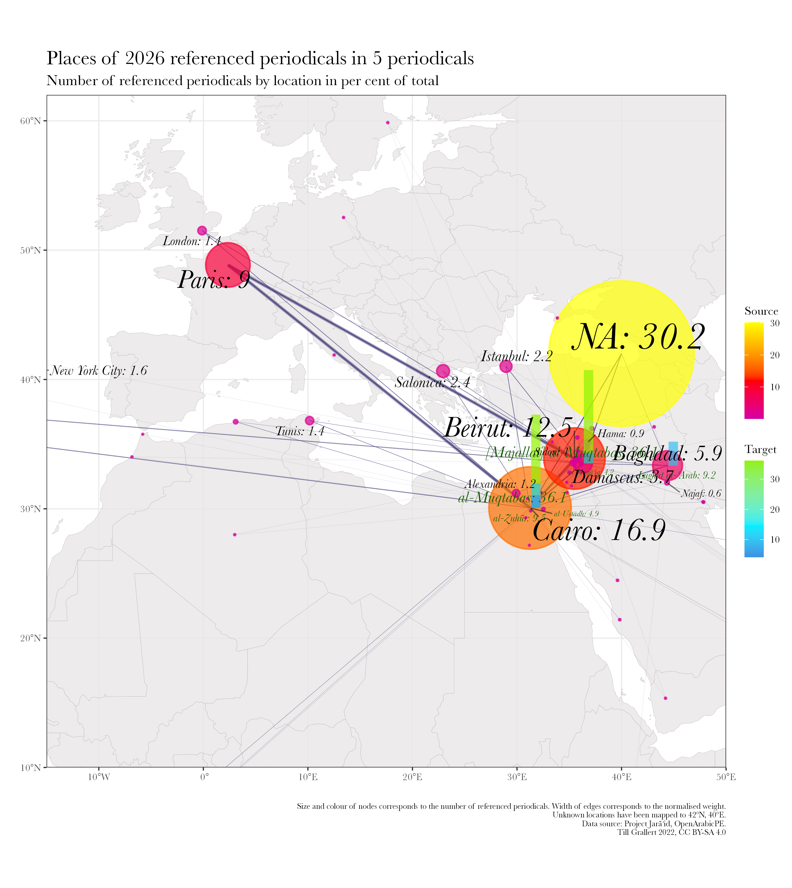
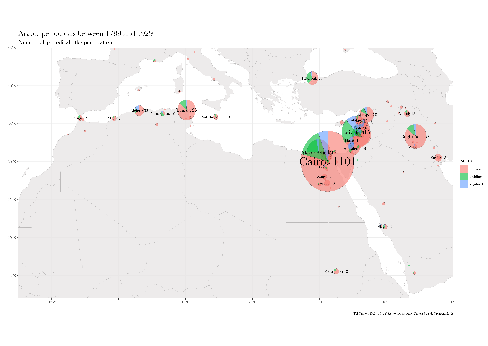

# Background {data-background-image="../../assets/OpenArabicPE/front-pages_strip.png" data-background-size="90%"}
## Arabic periodicals

::: columns
:::: column

- Periodical press as agent of change
    + first mass medium
    + central medium of the literary and cultural Arabic renaissance (*nahḍa*)
    + medium of linguistic change
    + central forum for negotiations over modernity, nationalism, Islamism etc.

::::
:::: column

- Periodicals as *source* but not a *subject*
- Research is dominated by
    + national(ist) narratives
    + bias on two places and small no. of titles
    + implicit hypotheses

::::
:::

{#fig:map-jaraid}

## Research interest: intellectual networks

::: columns
:::: column

{#fig:network-authors-2}

::::
:::: column

### Aims

- empirical testing of hypotheses
- evaluate existing literature

### Observations

<!-- * Nur wenige Knoten sind von relativer Bedeutung (14 von 319) -->
- very limited overlap between periodicals from the same place
- core network (14 of 319 nodes):
    - absent from the literature
    - suprising set up: many Iraqis (6), few Syrians (2), few Christians (2)

::::
:::

::: notes
- of the 14, Ayalon mentions only ʿIsā Iskandar al-Maʿlūf 
:::

## Research interest: intellectual networks

::: columns
:::: column

{#fig:network-periodicals}

::::
:::: column

{#fig:map-referenced}

::::
:::

## Data requirements

::: columns-3
:::: column

### modelled text

+ e.g. "The newspaper *al-ʿAṣr al-Jadīd* from Damascus reported in its last issue that ..."
+ (semi)automated extraction based on
    * named entity recognition (NER)
+ problems
    * state of OCR/HTR
    * state of Layout recognition
    * state of NER

::::
:::: column

### structured bibliographic metadata

+ e.g. "*Sātisnā* dispatched this report from *al-Shahbāʾ*"
+ (semi)automated extraction based on
    * presence of information in the material artefact
    * a modelled digital surrogate
+ problems
    * absence of explicit information

::::
:::: column

### norm data

- *Sātisnā*
    + Pseudonym and anagramme of *Anastās al-Karmilī*, editor of *Lughat al-ʿArab* in Baghdad
- *al-Shahbāʾ*, "the grey"
    + one of the epithets of Aleppo
    + geo coordinates: `36.20124, 37.16117`
- problems
    + bias on Global North in form and content

::::
:::

# Closing the `<gap/>`(s)
## Closing the knowledge `<gap/>`  [Project Jarāʾid](https://projectjaraid.github.io/) (2012--)

::: columns
:::: column

- Bibliographic record of **all** Arabic periodical titles published between 1798 and 1929
    - websits and open datasets ([TEI XML](https://tei-c.org/)) for more than 3500 periodicals
    - additional norm data for c.2700 persons, 220 places, 180 libraries
- Unfunded collaboration with Adam Mestyan (Duke), "crowd"-sourcing
- Ongoing since 2021/22: Integration of holding information from library catalogues such as ZDB, AUB, BnF, HathiTrust

::::
:::: column

{#fig:holding-stats}

::::
:::
