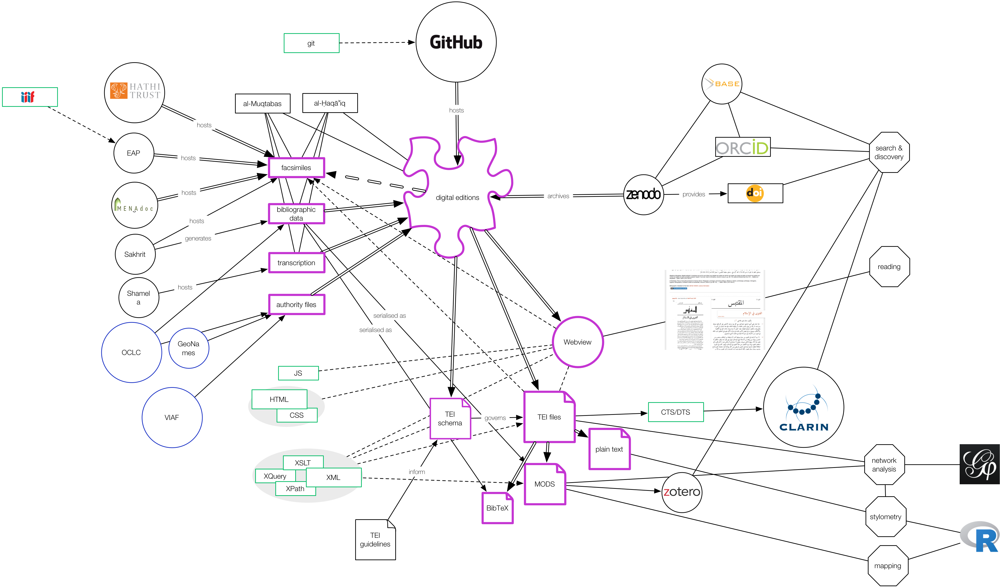

# Introduction
## My background
### Research interest: intellectual networks

::: columns
:::: wide

{#fig:network-authors}

::::
:::: narrow

### Aims

- empirical testing of hypotheses
- evaluate existing literature


::::
:::

::: notes

- very limited overlap between periodicals from the same place
- core network (14 of 319 nodes):
    - absent from the literature
    - suprising set up: many Iraqis (6), few Syrians (2), few Christians (2)
- of the 14, Ayalon mentions only ʿIsā Iskandar al-Maʿlūf 
:::

## My background
### Research interest: intellectual networks

::: columns
:::: column

{#fig:network-periodicals}

::::
:::: column

{#fig:map-referenced}

::::
:::

## My background
### Data requirements


::: columns-3
:::: column

### modelled text

+ e.g. "The newspaper *al-ʿAṣr al-Jadīd* from Damascus reported in its last issue that ..."
+ (semi)automated extraction based on
    * named entity recognition (NER)
+ problems
    * state of OCR/HTR
    * state of Layout recognition
    * state of NER

::::
:::: column

### structured bibliographic metadata

+ e.g. "*Sātisnā* dispatched this report from *al-Shahbāʾ*"
+ (semi)automated extraction based on
    * presence of information in the material artefact
    * a modelled digital surrogate
+ problems
    * absence of explicit information

::::
:::: column

### authority files / norm data

- *Sātisnā*
    + Pseudonym and anagramme of *Anastās al-Karmilī*, editor of *Lughat al-ʿArab* in Baghdad
- *al-Shahbāʾ*, "the grey"
    + one of the epithets of Aleppo
    + geo coordinates: `36.20124, 37.16117`
- problems
    + bias on Global North in form and content

::::
:::

## Today's talk

::: columns-3
:::: column

### Topic

digital and infrastructual divide(s) between the hegemonic, Anglophone North and societies/communities of the Global South with a focus on Arabic as one of the main human languages and scripts

::::
:::: column

### Case study

*Minimal computing* approaches to address the affordances of the digital (or lack thereof) "without the help we can't get": technological resistance to languages other than English, neo-colonial silencing of the cultural record, complete lack of funds.

::::
:::: column

### Projects

1. Creating knowledge about artefacts: Project Jarāʾid (2011--), a crowd-sourced union list of all Arabic periodicals published before 1930
2. Providing access to artefacts: Open Arabic Periodical Editions (2015--), a framework for bootstrapped scholarly editions outside the global north

::::
:::

## Today's talk
### Overview

::: columns
:::: column

1. The problem or why do we need rescue
2. Minimal computing to the rescue

::::
:::: column

3. Minimal computing approach to the digitisation of Arabic periodicals
4. A minimal workflow for bootstrapping digital editions 

::::
:::


<!-- structure along the workflow:
- knowledge gathering
- digitisation
- publication
 -->
 <!-- 

- why do we need to be rescued
- what do we need to be rescued from

 -->

# The problem or why do we need rescue
## digital divide and affordances of the Global South

::: columns
:::: column

- electricty
- internet 
- literacy

::::
:::: column

](/Users/Shared/BachUni/publications/github/p8fc0a1bd/assets/images/tweet_ 627223846244847616.png){#fig:power-baghdad}

::::
:::


::: notes

- global north / south
    + not homogenous block but the term has analytical value
    + global north: 
        * hegemonic author of all standards and best practices of the digital
        * owner of the infrastructures
    - global south
        + not the universal other
        + plurality of heterogeneous regions
        * shared experience of constantly negotiating the hegemony of the anglophone global north.
- digital divide
    - electricity
        + 800 mio have no access
        + by 2030: 
            * 600 mio
            * 33 per cent of all Africans
        - access: 
            + 250--500 kWh per year and household
            + less than 14 hours of a 100W lightbulb per day
    - internet
        + 36,6 Prozent der Weltbevölkerung, oder 2,93 Milliarden do not participate
        + 85 per cent of them live in Africa, South, East and South-East Asia
        + lower speed
        + higher latency
        + higher cost per unit of traffic
    - literacy
        + Südasien und Afrika:
            * zwischen 49 und 66 Prozent bei Frauen und 67 bis 80 Prozent bei Männern
        + Interfaces and content is dominated by hegemonial languages and scripts of the Global North

:::

## *linguistic imperialism* and the Absence of Arabic

::: columns
:::: column

- Arabic is one of the major human languages and scripts
- Inadequately supported in the digital realm
    + character encoding: Unicode is not enough!
    + rendering
    + computational methods

)](../../assets/dh/arabic-script_unicode-example-wikidata_narrow.png){#fig:arabic-mecca-2 height="300px"}

::::
:::: column

<!--  project (Bonn). Facsimile of Arabic original on the left. Yellow = English UI; purple = Arabic metadata in Latinised transcription;  green = German metadata](/Users/Shared/BachUni/BachBibliothek/GitHub/slides/assets/OpenArabicPE/translatio_interface-languages_annotated.png){#fig:translatio-interface} -->

](../../assets/dh/arabic_failure-browser.png){#fig:zakham-ar-failure}

{#fig:html}

::::
:::

::: notes

- [@Phillipson1997RealitiesAndMyths]
- Arabic: script and language
    + one of six official languages of the UN
    + spoken by 420 mio people
    + most common script after Latin and chinese
- script
    + right to left
    + connected
    + 
- data: 
    - character encoding -> transliteration
    - automated layout and text recognition
    - data models
    - NER
- interfaces
    + languages of the global north
    + search queries normalised to ASCII

:::

## Digitisation bias
### Collection biases perpetuated

::: columns
:::: column

{#fig:holding-map}

::::
:::: column

|      periodicals       | --1918 |       | --1929 |               |
|  :-------------------  | ----:  | ----: | ----:  |     ----:     |
|       published        |  2054  |       |  3550  |               |
|     known holdings     |  540   |       |  775   |               |
|       % of total       |        | 26.29 |        | [21.83]{.red} |
|------------------------|--------|-------|--------|---------------|
| digitized              |    156 |       |    233 |               |
| % of total             |        |  7.59 |        | [6.56]{.red}  |
|------------------------|--------|-------|--------|---------------|
| multiple digitisations |     51 |       |     66 |               |
| % of total             |        |  2.48 |        | 1.86          |
| % of digitised         |        | 32.69 |        | [28.33]{.red} |

Table: Periodical holdings and digitization {#tbl:jaraid-holdings}

::::
:::

::: notes

- collection bias is more of a knowledge bias
- While the digitization quote of roughly 50% of titles in collections is surprisingly high, it must be kept in mind that we cannot resolve information on the extent of digitization. Even if only a single issue of hundreds published was digitized, the periodical title will be included in this count.
- 66 periodicals or 28,33% have been digitized by multiple institutions and 21 of this subset by three and more.

:::

## Digitisation biases
### illustrating the divide

|             | Arabic periodicals (1798--1918) | [WWI as mirrored by Hessian regional papers](https://hwk1.hebis.de) |
|-------------|---------------------------------|---------------------------------------------------------------------|
| community   | c. 420 million Arabic speakers  | c. 6.2 million inhabitants                                          |
| periodicals | 2054 newspapers and journals    | 125 newspapers                                                      |
| digitized   | 156 periodicals                 | 125 newspapers with more than 1.5 million pages                     |
| type        | mostly facsimiles               | facsimiles and full text                                            |
| access      | paywalls, geo-fencing           | open access                                                         |
| interface   | mostly foreign languages only   | local and foreign languages                                         |

Table: Comparison of digitized periodicals between the Global South and the Global North {#tbl:digitisation}

## Digitisation biases
### Quality of metadata

Bibliographic metadata is faulty throughout, mostly unstructured, and subject to *linguistic imperialism*

::: columns
:::: column

 as it appeared in 2019](https://openarabicpe.github.io/slides/assets/shamela_muqtabas-annotated.png){#fig:muqtabas-6-2-shamela}

::::
:::: column

](../../assets/OpenArabicPE/eap119-1-4-5-muqtabas-133_annotated.jpg){#fig:muqtabas-6-2-133-eap}

::::
:::

::: notes

- faulty on shadow libraries and official digitisation efforts
    - publication dates
        + inferred from vol. and issue number: 1 Ṣafar 1329 aH / c. 1 February 1911
        + EAP: March 1911
        + secondary sources: probably delayed by up to four months
    - volume and issue numbers
        + shamela: no.61
        + correct: vol. 6, no. 2
    - pagination:
        + shamela = 45, correct = 133
    - publication place
        + EAP lists Jerusalem
- linguistic imperialism
    + script
    + calendars

:::

## Digitisation biases
### Traditional OCR

>language [is] not currently OCRable.

<cite>Archive.org's item description for [@KurdAli+1923+GharaibAlGharba]</cite>

::: columns
:::: wide


| Font Type          | Sakhr (%)           | ABBYY (%)           | RDI(%)              | Tesseract (%)       |
| -----------------  | -------:            | --------:           | ------:             | -----------:        |
| Traditional Arabic | 48.54               | 67.66               | [**51.88**]{.green} | 47.04               |
| Tahoma             | 10.52               | 69.91               | 26.38               | 38.37               |
| Simplified Arabic  | 52.97               | 67.69               | 44.94               | 46.75               |
| M Unicode Sara     | 36.03               | 59.40               | 25.92               | 33.72               |
| Diwani letter      | [**18.13**]{.red}   | [**18.47**]{.red}   | [**18.13**]{.red}   | [**23.32**]{.red}   |
| DecoType Thuluth   | 36.12               | 37.71               | 24.26               | 32.48               |
| Deco'Type Naskh    | 48.88               | 50.22               | 41.63               | 40.92               |
| Arabic transparent | 51.56               | [**75.19**]{.green} | 46.00               | [**48.61**]{.green} |
| Andalus            | 28.07               | 37.53               | 21.68               | 25.34               |
| AdvertisingBold    | [**57.35**]{.green} | 70.26               | 27.20               | 39.39               |

Table: Evaluation of traditional OCR software for Arabic font types from [@Alghamdi.Teahan+2017+ExperimentalEvaluationArabic, table IV]. Values show percentage of correctly recognised characters {#tbl:ocr-ar-trad}

::::
:::: narrow

<!-- , quality of the OCR layer (requires US IP)](../../assets/OpenArabicPE/hathi_muqtabas-ocr-3.png) -->
, quality of the OCR layer](../../assets/OpenArabicPE/gpa_bashir-i_487-p_1_ocr.png){#fig:gpa-ocr}

::::
:::

::: notes

- technical problems
    + layout recognition
    + segmentation
    + text recognition
- what do you do if you have none of the resources mentioned in the toot
- problems with platform providers
    + Unstructured text, no APIs, propriertary interfaces
    + Algorithms and evaluation are kept secret
        *  unknown numbers of *false positives* and *false negatives*

:::

## Digitisation biases
### machine-learning approaches to OCR 

>For old prints, there's [...] kraken/calamari for coders, Transkribus if you've got money and just want to have the results[,] and OCR-D if you've got an IT department.

<cite>[@Winkler20230307OCR]</cite>


| ID      | ground truth    | words   | lines  | epochs  | CER train  | CER validation     |
| ------- | --------------- | ------: | -----: | ------: | ---------: | --------------:    |
| 15946   | *al-Ustādh*     | 192829  | 18732  | 200     | 2.01       | [**2.09**]{.green} |
| 13864   | *al-Muqtabas*   | 11116   | 1013   | 200     | 0.07       | [**8.40**]{.red}   |

Table: Evaluation of my own Transkribus models {#tbl:ocr-ar-ml}


::: notes

- results are great (layout recognition still lacking)
- but digitised collections need to be re-processed (expensive)

:::


## Accessibility
### Catalogue searches

::: columns-3
:::: column

No Arabic script

 for "الجنة"](../../assets/jaraid/zdb_janna-ar.png){#fig:zdb-ar}

::::
:::: column

Which Latinized transcription was used?

 for "al-Ǧanna"](../../assets/jaraid/zdb_janna-ar-Latn.png){#fig:zdb-dmg}

::::
:::: column

What are the normalization rules for the search algorithm?

 for "Ganna"](../../assets/jaraid/zdb_janna-ar-Latn-no-al.png){#fig:zdb-functional}

::::
:::

::: notes

- catalogue could be searched in Arabic but the data is missing
- Latin input is mostly reduced to ASCII
    + Hamza and ʿAyn escape this algorithm on ZDB
- determined article is not automatically removed

:::

## Accessibility
### Interfaces

 project (Bonn). Facsimile of Arabic original on the left. Yellow = English UI; purple = Arabic metadata in DMG transcription;  green = German metadata](../../assets/OpenArabicPE/translatio_interface-languages_annotated.png){#fig:translatio-interface}

## Accessibility
### copyright regimes, paywalls, and geo fencing

cataloging rules and algorithmic copyright detection cause further inaccessibilities

::: columns
:::: column

 (Original in Princeton) outside the USA](../../assets/OpenArabicPE/hathi_muqtabas-1.png){#fig:hathi-muqtabas-global}

::::
:::: column

![The page from [@fig:hathi-muqtabas-global] with a US-IP](../../assets/OpenArabicPE/hathi_muqtabas-2.png){#fig:hathi-muqtabas-us}

::::
:::


::: notes

Beispiel: unklares Enddatum eines Erscheinungsverlaufs im 20. Jahrhundert wird korrekt als 19uu katalogisiert und dann Copyrightstatus sicherheitshalber als 1999 angenommen.

:::


# Minimal Computing to the rescue
## Building what **we need** with what **we have** at hand

>minimal computing connotes digital humanities work undertaken in the context of some set of constraints. This could include lack of access to hardware or software, network capacity, technical education, or even a reliable power grid

<cite>[@RisamGil2022Introduction, §3]</cite>

>this implies learning how to produce, disseminate, and preserve digital scholarship ourselves, without the help we can’t get, even as we fight to build the infrastructures we need at the intersection of, with, and beyond institutional libraries and schools.

<cite>[@Gil+2016, 29]</cite>


::: notes

- minimal computing is a result of GO::DH and events and conditions in Cuba
- Alex Gil's ideas resonated with me, upon meeting in Beirut in April 2015

:::

## What do we need?

<!-- We need to digitise the cultural record -->

::: columns
:::: column

### Access

- Societies of the Global South have a right to access their own cultural record
- Scholarship can immensely profit from broadening the scope of our sources

::::
:::: column

### Preservation

- Periodicals are a volatile and dispersed cultural artefact
- libraries, archives, personal collections are under threat of destruction, defunding, neglect

::::
:::

::: notes

We need to digitise the cultural record

:::


## Centering the *we* in "what do we need?"

::: columns
:::: column

*we* is defined by shared 

- interests
- ethics, e.g.
    + [FAIR](https://www.go-fair.org/fair-principles/) principles
    + [CARE](https://www.gida-global.org/care) principles
    + -> digital commons

::::
:::: column

*we* defines

- the specific context and and working conditions
- our access to skills, methods, labour time, tools, materials ...

::::
:::

::: notes

- FAIR: **F**indability, **A**ccessability, **I**nteroperability, **R**euse
- [CARE](https://www.gida-global.org/care): **C**ollective benefit, **A**uthority to control, **R**esponsibility, **E**thics 
    + developped in the context of indigenous communities

:::


## What about the *minimal* in minimal computing?

<!-- add images -->

::: columns
:::: column

### from a position of privilege

- minimalism as an end in itself
    + destroying resources already at hand
    + fashion
    + purist principles

 selling luxury kitchens](../../assets/dh/bulthaupt.png){#fig:bulthaupt}

::::
:::: column

### from a position of exclusion

- minimalism as a means to an end
    + balance our needs against the resources at hand
    + acknowledge the inevitable impact of our actions
    + minimal computing as *meaningful* computing

](https://upload.wikimedia.org/wikipedia/commons/thumb/f/f1/SchutteLihotzky_FrankfurtKitchen_MIA_2004195_001.jpg/450px-SchutteLihotzky_FrankfurtKitchen_MIA_2004195_001.jpg?uselang=de){#fig:bauhaus}

::::
:::


::: notes

1. minimalism as an end
    - resource-intensive
    - example: Mary Condo
    - example: purist computing infrastructures
        + you got to run your own server and never use evil platforms
2. minimalism as a means to an end 
    + meaningful connectivity
    + original Bauhaus / modernist design:
        * form follows function to 
            - decrease the cost of industrial production
            - increase the material benefits of the expended resources

:::

## Finally, there is computing

::: columns
:::: column

- use what we already know
- use what we can afford long-term
- do not impose unnecessary costs on our users
- do not waste resources to the detriment of our planet

::::
:::: column

- learn techniques new to you
- develop skills

::::
:::


::: notes

- first column
    + proven technologies and established standards
    + not the latest framework
        * think of what we do as space travel: Voyager I and II are still functioning with rudimentary computing powers
    + flat technology stacks
    + nothing shiny

:::


# Minimal computing approach to the digitisation of Arabic periodicals
## Contributing to the *digital commons* <br/> without the help we can't get

::: columns
:::: column

### ideas

- unite **existing** gray transcriptions with digital facsimiles
- learn from free and open-source software development
<!-- - model everything to make components citable
- harvest, generate, validate and share open metadata -->


### minimal computing principles

- build what **we need** with what **we have** at hand
- as **few** as possible, **open** and **established** formats and tools
- running on **our** hardware
- with **our** skills and knowledge
- **free-to-use** platforms without lock-in of data

::::
:::: column

### aims

<!-- + **validate** and **improve** the transcription with the facsimiles
- **train** text and layout recognition algorithms to make the textual heritage accessible to digitisation efforts
- **citable** for scholars, **linkable** for machines to facilitate use and adoption of the resources
- **open licences** to facilitate re-use -->

- make Arabic periodicals **accessible** on a shoestring budget
- **validate** and improve utilization of transcriptions
    + reliablity: content and citations
    + accessibility: for readers and computational analysis
    + ground truth for ML-based OCR/HTR
- establish an open, sustainable **infrastructure** of workflows, models, authority files
<!-- - With the affordances of the Global South -->

::::
:::

::: notes

- minimal computing
- meaningful connectivity: focus on practicability instead of principled stance
- result: bootstrapped scholarly editions

:::

#  A minimal workflow for bootstrapping digital editions 
## 1. get the data

::: columns
:::: column

- facsimiles
    + link to existing facsimiles from [British Library's "Endangered Archives Programme" (EAP)](http://eap.bl.uk/), <!-- [HathiTrust](http://hathitrust.org/), --> [Translatio Bonn](https://digitale-sammlungen.ulb.uni-bonn.de/topic/view/3085779), [*Arshīf al-majallāt [...] al-ʿarabiyya*](http://archive.alsharekh.org/) etc., preferably through [IIIF](https://iiif.io/)
    + scan/ photograph your physical artefacts (at the lowest sustainable resolution)
- text
    + scrape existing transcriptions from [*shamela.ws*](http://shamela.ws/index.php/book/26523), et al.
    + use [Transkribus](https://transkribus.eu/), [eScripta](https://escripta.hypotheses.org)/[eScriptorium](https://www.https://escriptorium.fr/) for HTR (with our model trained on 1000+ pages from the OpenArabicPE corpus)


::::
:::: column

EPub (HTML) for *al-Zuhūr* 2(4) from shamela.ws

```html
<div dir="rtl" id="book-container">
    <hr/>
    <a id='C232'></a>
    <span class="title">صحافة سورية ولبنان</span><br /><span class="red">3 - </span>المجلات<br />هذه مقالتي الثالثة عن صحافة سورية ولبنان. . . ولا يخفى أن للانقلاب العثماني الأخير فضلاً عظيماً على هذه المجلات التي أنا ذاكر. فمل يكن منها قبل إعلان الدستور إلا مجلة المشرق ومجلة المقتبس.<br />أما بقية المجلات فقد صدرت في العامين الأخيرين كما يظهر لك في هذا المقال.<br />وقد اجتهدت، في هذا القسم، أن أذكر تاريخ صدور لهذه المجلات متخيراً أوثق المصادر في ذلك فأقول:<br />
</div>
```

OCR output from Transkribus for *al-Ḥasnāʾ* (PAGE XML)

```xml
<TextLine id="r1l5" custom="readingOrder {index:4;}">
    <Coords points="470,548 2191,527 1648,462 470,464"/>
    <Baseline points="480,542 565,540 650,537 735,534 820,533 905,531 990,530 1075,528 1160,528 1245,527 1330,527 1415,527 1500,527 1585,527 1670,528 1755,528 1840,530 1925,531 2010,531 2095,534 2180,536"/>
    <TextEquiv>
        <Unicode>من عسر سنوات مجلة بسائة في الاستارة اعتمد في تحريرها على أقلامهن فزيئها</Unicode>
    </TextEquiv>
</TextLine>
```
::::
:::

::: notes

- IIIF allows to set a very low quality to reduce bandwidth and traffic
- what do you need to know
    - HTML
    - XML
    - JSON: for IIIF
    - wget, cURL: for scraping

:::

## 2. model the data

Structure the text string into issues, sections, articles with bylines ...

::: columns
:::: column

- widely accepted standard for textual editions: [Text Encoding Initiative](https://tei-c.org/) (TEI XML)
    - active community
    - pre-requisite for grant funding
    - easy to archive (XML = plain text)
- re-use / adapt domain specific encoding schemas within the TEI
- try to script basic modelling using patterns in your source text:
    + regular expressions
    + XSLT, Python, R, whatever you are most comfortable with
- automatically model derivative bibliographic data: MODS, METS, BibTeX, ...

::::
:::: column

The same section of *al-Zuhūr* 2(4) modelled in TEI

```xml
<body xml:lang="ar">
<pb corresp="../epub/shamela_36534/OEBPS/xhtml/P744.xhtml" ed="shamela" n="n2-p184"/>
<pb ed="print" edRef="#edition_1" facs="#facs_184" n="184"/>
    <div prev="oclc_1034545644-i_13.TEIP5.xml#div_1.d2e2766" subtype="article" type="item" xml:id="div_1.d2e634">
        <head>صحافة <placeName>سورية</placeName> و<placeName>لبنان</placeName></head>
        <div type="section" xml:id="div_3.d2e1200">
            <head> ٣ - المجلات</head>
            <p>هذه مقالتي الثالثة عن صحافة سورية ولبنان. . . ولا يخفى أن للانقلاب العثماني الأخير فضلاً عظيماً على هذه المجلات التي أنا ذاكر. فلم يكن منها قبل إعلان الدستور إلا <bibl>مجلة <title level="j">المشرق</title></bibl>  و<bibl>مجلة <title level="j">المقتبس</title></bibl> .</p>
            <p>أما بقية المجلات فقد صدرت في العامين الأخيرين كما يظهر لك في هذا المقال.</p>
            <p>وقد اجتهدت، في هذا القسم، أن أذكر تاريخ صدور لهذه المجلات متخيراً أوثق المصادر في ذلك فأقول:</p>
        </div>
    </div>
</body>
```

::::
:::

::: notes

- why TEI?
    + I knew it already
    + widely adopted standard in the digital editing world
    + necessary for grant-funding in the Global North
- why not TEI
    + steep learning curve
    + not particularly well-suited to Arabic texts?

:::

## 3. edit the data

::: columns
:::: column

- make use of version control <!-- and stable IDs (e.g. [ORCID](https://orcid.org)) --> for **transparent authorship attribution** and **damage control**:
    + [.git](https://git-scm.com/) is open source and available for all OSs
- plain-text (including XML) editors
    + should be **syntax aware**
    - **RTL**: support in text editors is a mixed bag

](../../assets/OpenArabicPE/vscode_zuhur.png){#fig:zuhur-vscode}

<!-- ](../../assets/OpenArabicPE/sublime_zuhur.png) -->

<!-- ](../../assets/OpenArabicPE/assets/textmate_zuhur.png) -->

::::
:::: column

- XML editors proper
    + should be **schema aware** to validate the encoding
    - **RTL**:
        1. [oXygen XML editor](https://www.oxygenxml.com/) (99 USD) allows to separate content and tags<!-- : [TextGrid Lab](https://textgrid.de/index) -->
        2. [Visual Studio Code](https://code.visualstudio.com/) (free) with the right extensions is a viable second

's  author mode. Styling relies on CSS.](../../assets/OpenArabicPE/oxygen_zuhur-author.png){#fig:zuhur-oxygen}

::::
:::

::: notes

- editing tools depend on modelling decisions and file formats

:::

## 4. save and share the data

::: columns
:::: column

- facsimiles: [Internet Archive](https://archive.org) (supports [IIIF](https://iiif.io/))
- working copy of everything else: distributed version control platforms ([GitHub](https://github.com/), [GitLab](https://about.gitlab.com/))
- longterm preservation: publicly-funded, open repository ([Zenodo](https://zenodo.org/))
    + make sure to add [ORCID](https://orcid.org)s for all contributors
- authority data (people, titles, etc.): [Wikidata](https://wikidata.org/)
- provide suitable open licenses for re-use: [Creative Commons](https://creativecommons.org/), [MIT](), Public Domain (CC0)

::::
:::: column

](../../assets/OpenArabicPE/zenodo_zuhur.png){#fig:zuhur-zenodo}

::::
:::

## 5. present the data
<!-- ### presentation layers and access for human readers -->

::: columns
:::: column

- Hosting: [GitHub Pages](https://pages.github.com/) can expose your data repository to the web
- Generate static webviews
    + removes need for backend and minimises traffic
    + easy to archive
    - on the fly: XSLT1 ([TEI Boilerplate](http://dcl.slis.indiana.edu/teibp/)) or JS ([CETEICEan](https://github.com/TEIC/CETEIcean)) to render XML files in the client's web browser
    - pre-computed: [GitHub actions](https://github.com/features/actions) give access to virtual machines
- bibliographic database: [Zotero group](https://www.zotero.org/groups/openarabicpe/items/)
    + mitigates against the absent backend
    + **browse** and **search** independent of file structure
- full-text search across the entire corpus: [Google's programmable search engine](https://cse.google.com/cse?cx=012251040084107011117:jof1v_ejndo)

::::
:::: column


": details in mobile view](../../assets/OpenArabicPE/zotero-group_openarabicpe-mobile-details_small.png){#fig:zuhur-zotero}

](../../assets/OpenArabicPE/boilerplate_zuhur-v_2-i_4_small.png){#fig:zuhur-webview}

<!-- ": search in mobile view](../assets/zotero-group_openarabicpe-mobile-search.png) -->

::::
:::

# Open Arabic Periodical Editions
## Resources

::: columns
:::: column

- social resources
    + one after-hours postdoc
    + 13 interns

::::
:::: column

- physical resources
    + no funding
    + work-issued / private laptops
    + internet connections

::::
:::


## Resulting Corpus


| Title                                                                           | Place             | Proprietor                    | DOI                                                                | Volumes  | Issues  | Articles | Words   |
| ------------------------------------------------------------------------------- | ----------------- | ----------------------------- | ------------------------------------------------------------------ | -------: | ------: | -------: | ------: |
| [al-Ḥaqāʾiq](https://www.github.com/openarabicpe/digital-haqaiq)                | Damascus          | Abd al-Qādir al-Iskandarānī   | [10.5281/zenodo.1232016](https://doi.org/10.5281/zenodo.1232016)   | 3        | 35      | 389      | 298090  |
| [al-Ḥasnāʾ](https://www.github.com/openarabicpe/journal_al-hasna)               | Beirut            | Niqūlā Bāz                    | [10.5281/zenodo.3556246](https://doi.org/10.5281/zenodo.3556246)   | 1        | 12      | 201      | NA      |
| [al-Manār](https://www.github.com/openarabicpe/journal_al-manar)                | Cairo             | Muḥammad Rashīd Riḍā          |                                                                    | 35       | 537     | 4300     | 6144593 |
| [al-Muqtabas](https://www.github.com/tillgrallert/digital-muqtabas)             | Cairo, Damascus   | Muḥammad Kurd ʿAlī            | [10.5281/zenodo.597319](https://doi.org/10.5281/zenodo.597319)     | 9        | 96      | 2964     | 1981081 |
| [al-Ustādh](https://www.github.com/openarabicpe/journal_al-ustadh)              | Cairo             | Abdallāh Nadīm al-Idrīsī      | [10.5281/zenodo.3581028](https://doi.org/10.5281/zenodo.3581028)   | 1        | 42      | 435      | 221447  |
| [al-Zuhūr](https://www.github.com/openarabicpe/journal_al-zuhur)                | Cairo             | Anṭūn al-Jumayyil             | [10.5281/zenodo.3580606](https://doi.org/10.5281/zenodo.3580606)   | 4        | 39      | 436      | 292333  |
| [Lughat al-ʿArab](https://www.github.com/openarabicpe/journal_lughat-al-arab)   | Baghdad           | Anastās Mārī al-Karmalī       | [10.5281/zenodo.3514384](https://doi.org/10.5281/zenodo.3514384)   | 3        | 34      | 939      | 373832  |
| **total**                                                                       |                   |                               |                                                                    | 56       | 795     | 9664     | 9311376 |


::: columns
:::: column

- TEI/XML files for each issue with structural mark-up on the article level
- mark-up of named entities in bylines


::::
:::: column

- authority files (TEI/XML)
- bibliographic metadata on the article level (MODS/XML, Zotero RDF, BibTeX)

::::
:::


## Important findings
### Fakesimiles are a thing

<!-- original facsimile: [EAP](http://images.eap.bl.uk/EAP119/EAP119_1_4_4/463.jp2/full/800,/0/gray.jpg) -->

*al-Muqtabas* 5(7), pp.[463](https://openarabicpe.github.io/journal_al-muqtabas/tei/oclc_4770057679-i_54.TEIP5.xml#pb_61.d1e2036)--[466](https://openarabicpe.github.io/journal_al-muqtabas/tei/oclc_4770057679-i_54.TEIP5.xml#pb_64.d1e2045)

::: columns-3
:::: column

{#fig:muq-eap}

::::
:::: column

{#fig:muq-shamela}

::::
:::: column

!["fakesimile" from [*arshīf al-majallāt [...] al-ʿarabiyya*](https://archive.alsharekh.org/MagazinePages/Magazine_JPG/AL_moqtabs/Al_moqtabs_1910/Issue_7/605.JPG)](../../assets/OpenArabicPE/sakhrit_muqtabas-v_5-i_7-p_605.jpg){#fig:muq-fakesimile}

::::
:::


## Beware: Bootstrapping relies on the work of others
### All dependencies will eventually break / need repair

::: columns
:::: column

- Reliance on external data providers: link rot
    - links to facsimiles broke twice in four years
- Reliance on free tools and services: link rot
    + URLs to our editions had to be changed once
- XSLT1 in web browsers: will fall victim to JSON and security features
    + over the last 5 years support has markedly decreased
<!-- - Full-text search across issues and periodicals without a backend
    + [Google's programmable search engines](https://cse.google.com/cse?cx=012251040084107011117:jof1v_ejndo): requires internet connection (and Google account!) -->

::::
:::: column



::::
:::


# Thank you!
## Thank you!

- Contributors to [OpenArabicPE][openarabicpe_website]: Jasper Bernhofer, Dimitar Dragnev, Patrick Funk, Talha Güzel, Hans Magne Jaatun, Daniel Kolland, Jakob Koppermann, Xaver Kretzschmar, Daniel Lloyd, Klara Mayer, Tobias Sick, Manzi Tanna-Händel, and Layla Youssef
- Contributors to [Project Jarāʾid][jaraid_website]: Hala Auji, Philippe Chevrant, Marina Demetriadou, Lamia Eid, Stacy Fahrenthold, Ulrike Freitag, Till Grallert, Rana Issa, Nicole Khayat, Peter Magierski, Leyla von Mende, Adam Mestyan, Christian Meier, Daniel Newman, Geoffrey Roper, Sinai Rusinek, Philip Sadgrove, Ola Seif, and Rogier Visser
- Links:
    + Slides: [https://tinyurl.com/dighis23-grallert](https://tillgrallert.github.io/slides/dh/2023-regensburg/index.html)
    + Project blog: [https://openarabicpe.github.io](https://openarabicpe.github.io)
    + Papers: <http://digitalhumanities.org/dhq/vol/16/2/000593/000593.html>, <https://doi.org/10/gkhrjr>
    + Mastodon: [\@tillgrallert\@digitalcourage.social](https://digitalcourage.social/@tillgrallert)
    + Email: <till.grallert@fu-berlin.de>, <till.grallert@hu-berlin.de>
- Licence: slides and images are licenced as [CC BY-SA 4.0](http://creativecommons.org/licenses/by-sa/4.0/)

## References {#refs}