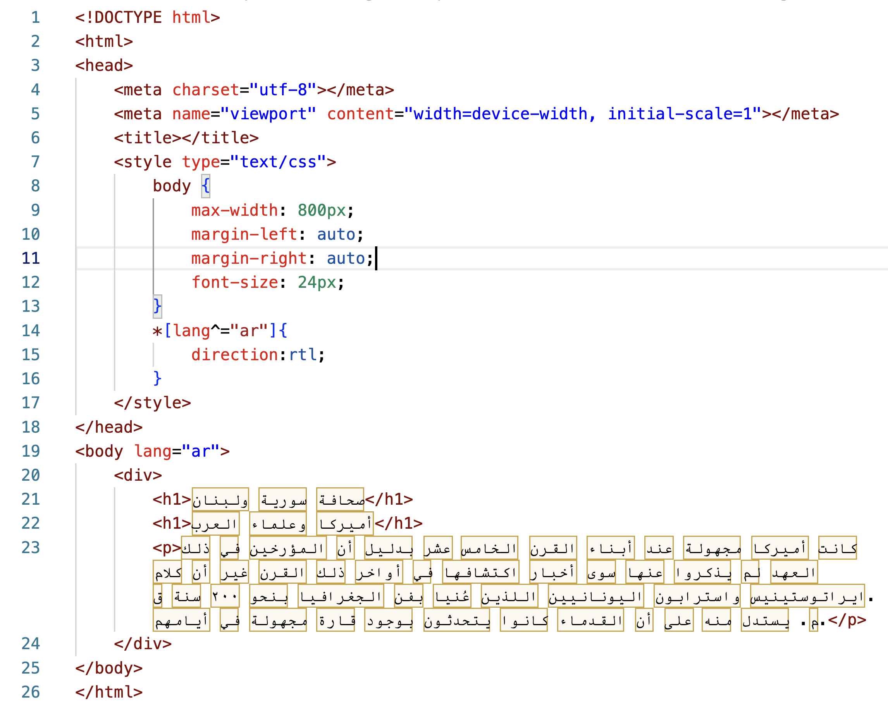

<!-- fix the problem with a cross reference to @fig:zakham-ar -->

## Outline

1. Introduction
2. Arabic
2. Multilinguality and linguistic imperialism of socio-technologic infrastructures
3. Arabic textual heritage online

# Background
## My research interests

::: columns
:::: column

{#fig:network-authors-1}

::::
:::: column

{#fig:network-mentioned-periodicals-1}

::::
:::

## Late-Ottoman Eastern Mediterranean

![Map showing the colonial spheres of interest agreed upon by France and UK. Signed by Sir Mark Sykes and Fr[ançois] Georges-Picot, 8 May 1916. Source: @SykesPicot1916Map](https://upload.wikimedia.org/wikipedia/commons/thumb/f/f9/MPK1-426_Sykes_Picot_Agreement_Map_signed_8_May_1916.jpg/1055px-MPK1-426_Sykes_Picot_Agreement_Map_signed_8_May_1916.jpg){#fig:sykes-picot}

## Late-Ottoman Eastern Mediterranean  Diversity across the board

::: columns-3
:::: column

### Languages

+ Administrative: Ottoman, Arabic, Persian
+ Quotidian: Turkic languages, Arabic, Greek, Slavic languages, Armenian, Ladino ...
+ Lithurgic: Arabic, Greek, Armenia, Coptic, Russian, Hebrew ...
+ Educational: Ottoman, Arabic, French, English, Russian ...

### Scripts

+ From right to left:
    * Arabic, Hebrew, Assyrian
+ Fro left to right:
    * Greek, Armenian, Latin, Cyrillic, Coptic

::::
:::: {.column .small-font}

### Religions

+ Muslims: Sunni, Shi'ite
+ Christians: div. Orthodox, Eastern Catholic, Western Catholic, Assyrian, Protestant ...
+ Jews: sephardic, ashkenazic
+ Zoroastrians

::::
:::: {.column .small-font}

### Calendars

- Islamic (*hijri*): **lunar**, observed, epoch begins with Muḥammad's exodus from Mecca
- Reformed Julian: **solar**; year begins on 1. January, epoch begins with Christ's birth
- Ottoman fiscal (*mālī*): **lunisolar**; year begins on 1. March, eepoch begins with Muḥammad's exodus from Mecca
- Gregorian: **solar**; year begins on 1. January, epoch begins with Christ's birth
- Jewish: **lunar**; epoch begins with the creation of the world

### Days, hours

- *alla turca*: day begins with sundown, 12 unequal hours each for day and night
- *alle franca*: day begins at midnight. 24 equinoctial hours

::::
:::

::: notes

- this slide could/ should be split into multiple slides with more visual content

:::

# Arabic
## Arabic

::: columns
:::: column

### Script

- Second most important script after Latin
    + currently used by 14 languages: Arabic, Persian, Urdu, Pashto, Uzbek, Uighur ...

::::
:::: column

### Language

+ Fifth most important language
    * One of six official languages of the United Nations
    * Official language in 26 countries
    * \>420 million speakers
+ Lithurgical language of 1,6 billion Muslims

::::
:::

![Approximate distribution of Arabic script use along current national boundaries [@Nemeth+2017, fig 1.1]](../../assets/maps/map_arabic-script-nemeth-fig_1-1-small.png){#fig:arabic-script}

## Arabic Script Grammar

::: columns
:::: column

+ Written from **right** to left (RTL)
+ Letters (*graphemes*)
    * mostly connected in direction of writing
    * letterform depends of position within the string (*allographs*): [ج جـ ـجـ ـج]{.c_rtl lang="ar"}
    * combination of basic letterforms (*archigraphemes*, Arab. *rasm*) and diacritic marks (*iʿjām*)
- diacritics 
    + reduce semantic ambiguity
    + subject to regional preferences and change of time 
- Vocalisation (*tashkīl*) is **optional** and changes the semantics 

::::
:::: column

{#fig:zakham-ar}

{#fig:zakham-ar-rasm}

::::
:::

::: notes

- note: 
    + gaps within words
    + tilted base lines
    + ligatures
    + vertical overlap
- "*allograph*"  is Thomas Milo's terminology
- I am showing this in order to demonstrate the epistemic violence exercised by the paradigm of 
    + discrete letters, 
    + the Latin alphabet with its rather small number of letters, 
    + movable type printing
        * magazines become unfeasibly large
            - unwieldy
            - expensive: 
                + more material 
                + more machinery
                + more time for composing
- tilted baselines and vertical overlap of words makes things even more unwieldy
- 
:::

# multilinguality and *linguistic imperialism*
## multilinguality

>Indigenous peoples have the right to revitalize, use, develop and transmit to future generations their histories, languages, oral traditions, philosophies, writing systems and literatures, and to designate and retain their own names for communities, places and persons.

<cite>[@UNDRIP2007, §13]<cite>

::: notes

The human condition, historically, is one of multilinguality. People speak different languages, dialects, sociolects etc. in different contexts: at home, at work, at social gatherings, for worship etc.. Sometimes we share a language with people across geographic distances, just as in this meeting, and sometimes, we do not understand our direct neighbours.

:::

## Linguistic imperialism

>'Linguistic imperialism' is shorthand for a multitude of activities, ideologies, and structural relationships. Linguistic imperialism takes place within an overarching structure of asymmetrical North/ South relations, where language interlocks with other dimensions, cultural (particularly in education, science, and the media), economic and political

<cite>[@Phillipson1997RealitiesAndMyths, 239]</cite>

>The basis for the codes, languages, methodologies, and technical instruments of the digital humanities is English; the written and spoken language of all the main conferences, the most prestigious journals, the institutions that control the discipline, the organizations and international consortia, and the central authorities of knowledge is, with few exceptions, some dialect of British or American English.

<cite>[@Fiormonte+2021+TaxationagainstOverrepresentation, 334-335]</cite>

::: notes

- UNDRIP: United Nations Declaration on the Rights of Indigenous Peoples.
- this  ties back to the map I showed you at the very beginning

:::

## Technical affordances

![Arabic Linotype, 1910s. Source: [@Nemeth+2017, fig. 2.7]](../../assets/dh/arabic-linotype_nemeth-p_46.png){#fig:ar-linotype}

::: notes

- keyboard with 180 keys 
- two magazines  were required for a single Arabic fount

:::

## Encoding characters
### Unicode is awesome ...

::: columns
:::: column

{#fig:unicode-1}

::::
:::: column

{#fig:unicode-15-missing}

::::
:::

::: notes

- unicode can be traced back to the 1980s
- Unicode has become the dominant encoding standard in the 2000s
- almost universal support across operating systems has been driven by people's fondness of emojis
- Arabic has been part of Unicode since v 1.0.0
- linguisting imperialism
    + consortium: Adobe, Airbnb, Amazon, Apple, Yat, Google, ETCO, Meta, Microsoft, Netflix, SAP and Salesforce
    + character encoding is part of the history of a global hegemonic technology stack  bound up in historically contingent cultural traditions of the Global North. 
    + Mechanically and, later, electronically recording information in scripts other than Latin---particularly complex scripts with a much larger number of graphemes and different writing directions--- was never considered sufficiently important or profitable to be supported out-of-the-box.
    + Character encoding enforces Latin script grammar
        * unicode insufficiently distinguishes between languages and scripts
    + The standard is written in English
    + Current v 15:
        *  we know at least 300 writing systems
        *  127 are currently not encoded

:::

## Unicode is awesome ...

... but standards depend on implementation and software support

### Encoding nightmares

<!-- change this slide to show rendering issues ([@fig:arabic-fail-covid]) AND encoding issues -->

::: columns
:::: wide

![32 variants of encoding "Meccan" ([مكية]{lang="ar"}) [@Milo2014VisuallyMisleading, 4]](../../assets/dh/arabic-script_unicode-example-makkiyya-milo_4.png){#fig:arabic-mecca-1}

::::
:::: narrow

![In-browser search for "[مك]{lang="ar"}" in the Wikidata entry for "Mecca" ([Q5806](https://www.wikidata.org/wiki/Q5806))](../../assets/dh/arabic-script_unicode-example-wikidata_narrow.png){#fig:arabic-mecca-2 height="300px"}

::::
:::

::: notes

- unicode insufficiently distinguishes between languages and scripts
    + violating two of its principles
        * characters not glyphs
        * unification: no duplicates within a script
- yet, rendering depends on software support
    <!-- + see [@fig:arabic-fail-covid] -->

:::

## Unicode is awesome ...

<!-- [... but standards depend on implementation and software support]{.c_right} -->

... did I mention industry consortia?

>HTML elements all have names that only use ASCII alphanumerics [@HTMLLivingStandard2023, §13.1.2]

::: columns
:::: column

](../../assets/dh/arabic_failure-browser.png){#fig:zakham-ar-failure}

::::
:::: column

{#fig:html}

::::
:::
::: notes

- Arabic has been part of Unicode since its inception
- yet, software support is a different question, as we have seen 
- HTML5 is a *living standard* maintained by yet another consortium Web Hypertext Application Technology Working Group (WHATWG) 
    + members are leading browser vendors such as Apple, Google, Microsoft and Mozilla
    + all but Mozilla are also members of the Unicode consortium
- `@lang` attribute not used by standard CSS
    + everyone has to add `*[lang="ar"] {direction:rtl;}`

:::

## Bidirectional texts

The mandatory XML declaration `<?xml version="1.0" encoding="UTF-8"?>` sets left-to-right as the base direction.

::: columns
:::: wide

{#fig:bidi-xml}

::::
:::: narrow

's  author mode. Styling relies on CSS.](../../assets/OpenArabicPE/oxygen_zuhur-author_small.png){#fig:zuhur-oxygen}

::::
:::
::: notes

- the Oxygen developers added support for Arabic in `@xml:lang` on our suggestion in 2015.
- but only for TEI/XML and not for all RTL languages.

:::

<!-- ## Transliteration, the undead solution of yore

Transliteration into Latin script served the need of colonial administrations and academics with the technological affordances of the time.

::: columns-3
:::: column

### Amīrkā wa ʿulamāʾ al-ʿArab

>Kānat Amīrkā majhūla ʿinda abnāʾ al-qarn al-khāmis ʿashr bi-dalīl an al-muʾarrikhīn fī dhalika al-ʿahd lam yadhkarū ʿanhā siwā akhbār iktishāfihā fī awākhir dhalika al-qarn.

<cite>Transliteration according to the *International Journal of Middle East Studies*</cite>

::::
:::: column

### Amīrkā wa ʿulamāʾ al-ʿarab

>Kānat Amīrkā ma[ǧ]{.red}hūla ʿinda abnāʾ al-qarn al-[ḫ]{.red}āmis ʿa[š]{.red}r bi-dalīl an al-muʾarri[ḫ]{.red}īn fī [ḏ]{.red}alika al-ʿahd lam ya[ḏ]{.red}karū ʿanhā siwā a[ḫ]{.red}bār ikti[š]{.red}āfihā fī awā[ḫ]{.red}ir [ḏ]{.red}alika al-qarn.

<cite>Transliteration according to the *Deutsche Morgenländische Gesellschaft*</cite>

::::
:::: column

### Amīrikā wa-ʻulamāʼ al-ʻArab

>Kānat Amīrikā majhūlah [ʻ]{.red}inda abnā[ʼ]{.red} al-qarn al-khāmis [ʻ]{.red}ashar bi-dalīl an al-mu[ʼ]{.red}arrikhīn fī dhālika al-[ʻ]{.red}ahd lam [ydhkrwā]{.red} [ʻ]{.red}anhā saw[á]{.red} Akhbār [aktshāfhā]{.red} fī awākhir dhālika al-qarn

<cite>Automated ALA-LC transcription into Latin script with the [romanize Arabic demo](http://romanize-arabic.camel-lab.com)</cite>

::::
:::

::: notes

- Depend on input and output **languages**
- Subject to traditions and taste
- Error prone

::: -->

## Transliteration, the undead solution of yore

Transliteration into Latin script served the need of colonial administrations and academics with the technological affordances of the time.

::: columns-3
:::: column

### [مرآة الشرق]{lang="ar"}

The Arabic original

### Meraat al-Sherk

The official transcription provided by the paper's masthead

::::
:::: column

.](https://images.eap.bl.uk/EAP119/EAP119_1_24_1/1.jp2/full/600,/0/gray.jpg){#fig:mirat}

::::
:::: column

### Mirʾāt al-Sharq

Following the system of the *International Journal of Middle East Studies* (IJMES)

### Mirʾāt aš-Šarq

Following the system of the *Deutsche Morgenländische Gesellschaft* (DMG)

### mrMp Alcrq

Buckwalter transliteration

::::
:::

::: notes

- transliteration
    + Depend on input and output **languages**
    - Subject to traditions and taste
    - Error prone
    - if 1:1 grapheme replacement is intended, it becomes unreadable for casual readers
- published by Būlus Shaḥāda in Jerusalem between 1919 and 1938 

:::

# Arabic textual heritage online
## The long tail of ASCII in discovery systems

::: columns-3
:::: column

### [الجنة]{lang="ar"}?

No Arabic script

 for "[الجنة]{lang="ar"}"](../../assets/jaraid/zdb_janna-ar.png){#fig:zdb-ar}

::::
:::: column

### al-Ǧanna?

Which Latinized transcription was used?

 for "al-Ǧanna"](../../assets/jaraid/zdb_janna-ar-Latn.png){#fig:zdb-dmg}

::::
:::: column

### Ganna!

What are the normalization rules for the search algorithm?

 for "Ganna"](../../assets/jaraid/zdb_janna-ar-Latn-no-al.png){#fig:zdb-functional}

::::
:::

::: notes

- catalogue could be searched in Arabic but the data is missing
- catalogues are historical artefacts
    + digitisation of catalogues: NOT re-cataloguing of original material
        * card catalogue
        * ASCII OPAC
        * automated transcription of the card catalogue
        * human cataloguers depend on the technology they have at hand, which means they might be unable to enter the correct string
        * errors perpetuate
- Latin input is mostly reduced to ASCII
    + Hamza and ʿAyn escape this algorithm on ZDB
- determined article is not automatically removed
- The choices are not transparently documented
- no software on-screen keyboards provided
- additional problems
    + catalogues are inherently local documents
    + aggregated, if at all, on a national level
    + frequently accessible only through Web interfaces and not APIs

:::

# Thank you!
## Thank you!

- Contributors to [OpenArabicPE](https://openarabicpe.github.io/): Jasper Bernhofer, Dimitar Dragnev, Patrick Funk, Talha Güzel, Hans Magne Jaatun, Daniel Kolland, Jakob Koppermann, Xaver Kretzschmar, Daniel Lloyd, Klara Mayer, Tobias Sick, Manzi Tanna-Händel, and Layla Youssef
- Contributors to [Project Jarāʾid](https://projectjaraid.github.io/): Hala Auji, Philippe Chevrant, Marina Demetriadou, Lamia Eid, Stacy Fahrenthold, Ulrike Freitag, Till Grallert, Rana Issa, Nicole Khayat, Peter Magierski, Leyla von Mende, Adam Mestyan, Christian Meier, Daniel Newman, Geoffrey Roper, Sinai Rusinek, Philip Sadgrove, Ola Seif, and Rogier Visser
- Links:
    + Slides: <https://tillgrallert.github.io/slides/dh/2024-03-luxembourg/>
    + Project blog: [https://openarabicpe.github.io](https://openarabicpe.github.io)
    + Papers: <http://digitalhumanities.org/dhq/vol/16/2/000593/000593.html>, <https://doi.org/10/gkhrjr>
    + Mastodon: [\@tillgrallert\@digitalcourage.social](https://digitalcourage.social/@tillgrallert)
    + Email: <till.grallert@hu-berlin.de>

## References {#refs}
