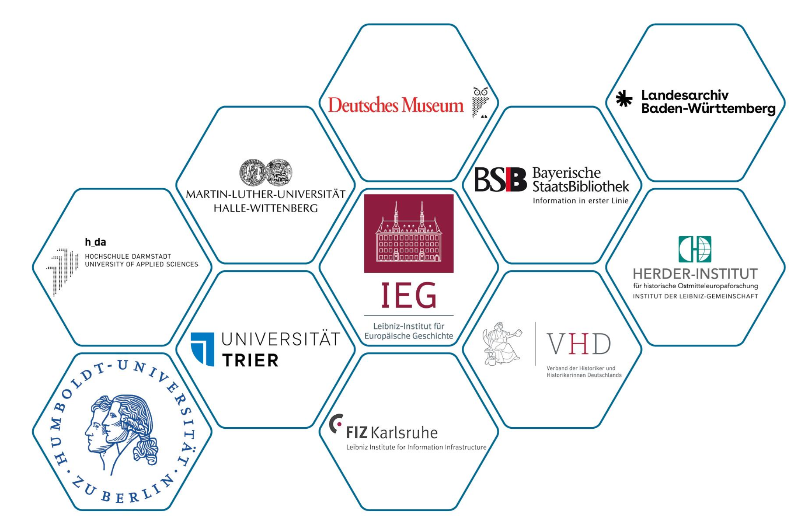
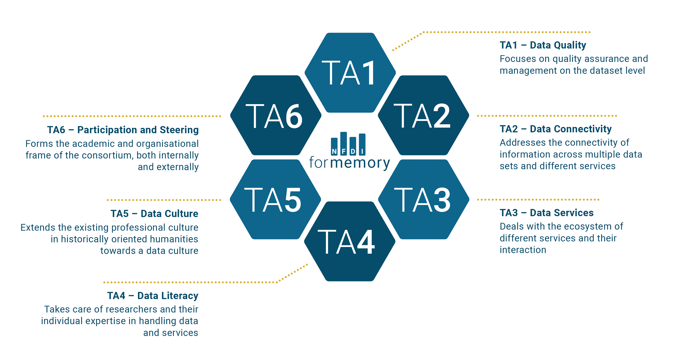
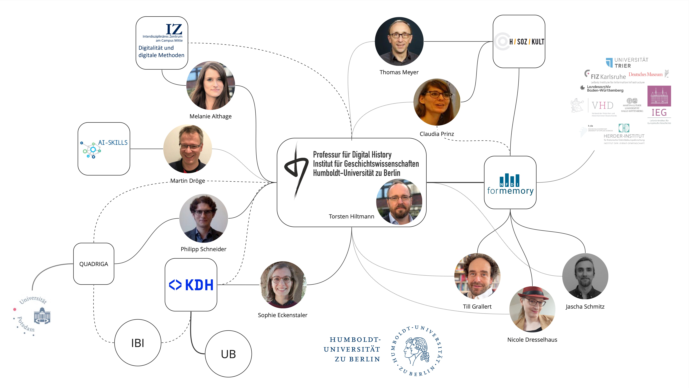
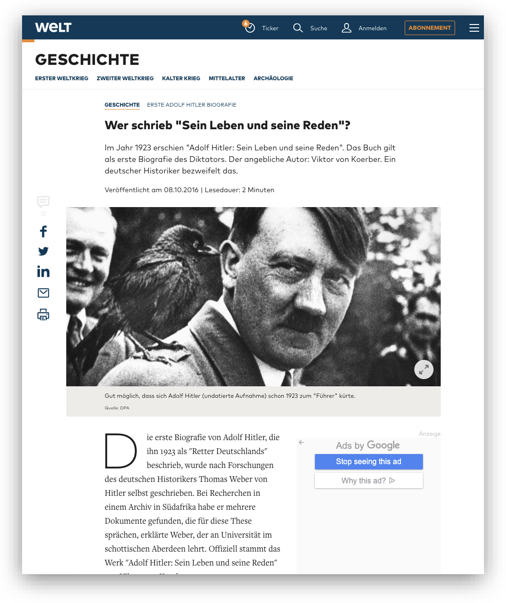
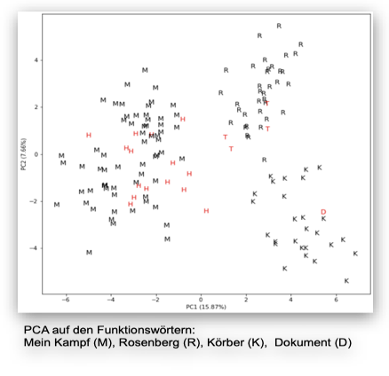
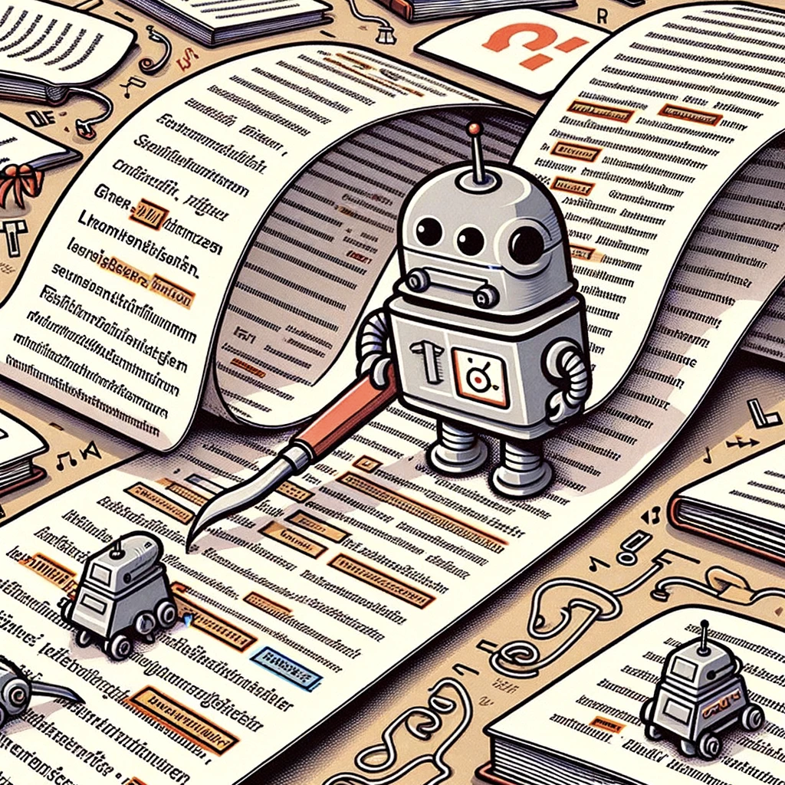

# Background:  NFDI4Memory  Digital history at HU Berlin
## Nationale Forschungsdateninfrastruktur (NFDI)

::: columns
:::: column

### today

1. Association with more than 260 member institutions from all academic disciplines: research institutes, universities, GLAM, academic associations ...
2. 26 independent consortia (five-year funding), among them four from the humanities and social sciences:
    - NFDI4Culture
    - NFDI4Objects
    - Text+
    - NFDI4Memory

::::
:::: column

### back story

- 2016--18: Council for Information Infrastructures recommends creating a national research data infrastructure
    - sustainable infrastructure for research data
    - bottom-up and federated 
    - centered around data providers and users
    - disciplines and domain experts "at the helm"
    - organised into disciplinary communities
- 2018- : NFDI
    - three rounds of applications: 2020, 2021, 2022
    - funded by the federal and state governments
    - organised by the Deutsche Forschungsgemeinsschaft 

::::
:::

## NFDI4Memory
### NFDI Consortium for the historically oriented humanities (2023--)

::: columns
:::: column

- Unites research, memory and information infrastructure institutions in a digital research infrastructure
- Drives forward the digital transformation of the historically oriented humanities 
- Develops digital historical source criticism for the humanities and for the NFDI 

::::
:::: column

- 11 **Co-applicants**: lead 6 *task areas*
- 81 **Participants**: contribute ideas, expertise and networks

::::
:::

::: notes

- NFDI4Memory
    - since 2023
    - one of 26 consortia, one of four consortia in the humanities and social sciences
    - at HU: task area "data culture", together with VHD

:::

## NFDI4Memory
### Task areas

{#fig:4mem-tas}

## Digital history at HU Berlin

::: notes

- Chair of Digital History: 
    - Torsten Hiltmann, since 2020
    - Since 2018: MA specialisation programme *Digital History* as part of the MA in History
        1. Algorithmic thinking, 
        2. methodological competence through 
        3. theoretical foundations, and
        4. critical reflection in a historical context
- HSozKult
    - since 1996 at the IfG
    - information and communications platform
    - announcements, reviews
- IZ
    - since 2024
    - collaboration of all DH initiatives at HU in order to increase visibility and collaboration

:::

# Digital history  what is it and why does it matter?
## What is *digital History*?

>In a strict sense, digital history characterizes an approach to history that utilizes digital technologies for researching the past, and in the North American context, it also stands for digital representations of the past. 

>digital history is conceived as a new kind of studying, researching, and writing history that takes into account what Rosenzweig called "a fundamental paradigm shift from a culture of scarcity to a culture of abundance."

<cite>@Laessig2021DigitalHistory, 6, 7</cite>

::: notes

Digital history, then, accepts that the human cultural record is being *datafied* and we need computational methods in order to make historical arguments [cf. @DigitalHistoryArgument2017, 2; @Laessig2021DigitalHistory, 6]

:::

## Why does *digital history* matter?

::: columns
:::: wide

**Datafication** emphasises the epistemic shift from a world where data were a closely defined part of the output of research processes towards the new status quo in which all research processes are always already computationally mediated through information and communication technologies.

::::
:::: narrow

[we live in *datafied* societies]{.keyphrase}

::::
:::

::: columns
:::: narrow

[being *digital* has become meaningless]{.keyphrase}

::::
:::: wide

>We think of the 'digital' as a previous historic movement when computation as digitality was understood in opposition to the analogue, rather than complementary [...]

<cite>@Berry+2017, 2</cite>

::::
:::

::: columns
:::: narrow

[*algorithms* as part of the social fabric]{.keyphrase}

::::
:::: wide

>Today, algorithms are such an intrinsic and fundamental part of how daily life is experienced that some scholars even argue that we live in "algorithmic  cultures" [...]. This evocative notion points to the increasing difficulty of separating  algorithms from the activities that make up culture. It also evinces the complex ways in which human agency and algorithmic actions are intertwined [...] 

<cite>@Siles2023Living, 1</cite>

::::
:::

::: notes

- "epoch of computationability" orginates with Berry
- Digital history, then, accepts that the human cultural record is being *datafied* and we need computational methods in order to make historical arguments [cf. @DigitalHistoryArgument2017, 2; @Laessig2021DigitalHistory, 6]
- Digital history also addresses the age of abundance, as postulated by Roy Rosenzweig, and epitomised by the recent advances in generative AI and LLMs, which will create an infinite amount of absolutely plausible and convincing yet utterly false sources 
- 

:::

## Academic history in the epoch of computationability

[To make sense of *datafication* we need cultural change within the discipline]{.keyphrase}

::: columns
:::: column

### Status quo

- very little computational research
- limited understanding of the epistemoloigcal and ontological dimentions of **datafication**
- limited understanding of the concept of **research data** and their enourmous potential for historical research  
- limited practical computational skills
- constantly and rapidly evolving environment -> generative AI, ML
- resentment towards "the digital"

::::
:::: column

### Aims

- Establish a robust and sustainable **data culture** in order to *emerge from our self-incurred immaturity*
    - make sense of the new episteme
    - develop the necessary skills to conduct historical research
    - negotiate new understandings of history as a discipline

::::
:::

## What do we mean by **data culture**?

::: columns
:::: column

### broad sense

Data culture as a disciplinary culture, in which (research) data and computational methods form an integral part of historical research and reasoning.

This requires:

- fundamental theoretical, epistemological, and ontological knowledge of *datafication*
- reflection on its implications for all parts of the research process
- ongoing discussion on the necessary changes within the discipline

::::
:::: column

### narrow sense

Data culture as quotidian practices, skill sets, and disciplinary protocolls for handling (research) data and computational research.

This requires:

- orientation
- training
- support 

::::
:::

::: notes

- broad:
    - (research) data cannot, anymore, be perceived as an appendix / addendum to the "actual" research process
- narrow
    - orientation: guidelines, best practices, white papers
        - through and by example
    - training: across the board
    - support: technical, ethical, judicial

:::

## Data, data everywhere

::: columns
:::: narrow

[All digital information is data]{.keyphrase} ...

::::
:::: wide

>Data are forms of information, a larger concept that is even more difficult to define. Epistemological and ontological problems abound, resulting in many books devoted to explicating information and knowledge 

<cite>@Borgman2015BigData, 18</cite>

::::
:::

::: columns
:::: wide

>[Datafication/modeling] is the work of abstracting discrete values from a phenomenon or artifact. These values may be expressed in numbers or texts and are necessarily a reduction of complex materials into a form for computation. <!--With data we can automate processes -->

<cite>@Drucker2021DHCoursebook, 3</cite>

>Data need to be imagined *as* data to exist and function as such, and the imagination of data entails an interpretive base.

<cite>@Gitelman2013Introduction, 3</cite>

::::
:::: narrow

... and [all data is modelled]{.keyphrase}

<!-- - Mapping
- Reduction
- Purpose -->

::::
:::

::: notes 

- Data literacy as part of data culture
- data are always a concrete embodyment and a socio-technological stack: serialisation
- If we subscribe to social constructivism then all models are historically situated
    - Data and models are situated in historical processes of knowledge production
- Models have three characteristics [@Stachowiak1973AllgemeineModelltheorie]
    - Mapping/ replacing: model for something
    - Reduction: abstracts aspects of interest
    - Purpose: models have a purpose for something
- drucker: capta

:::

# Data culture by way of an example
## Who wrote "Sein Leben und seine Reden?"

::: columns
:::: column

{#fig:hitler-welt}

::::
:::: column

- Research question
    - Who wrote Adolf Hitler's short biography published as part of @Koerber1923AdolfHitler?
- Background
    - The book is an important source for research on the early phase of National Socialism and the rise of Adolf Hitler
    - Hypothesis of Hitler's authorship stoked up considerable public controversy in the 2010s
- Context
    - MA seminar "Who wrote it? Authorship Attribution as a method of Digital History" 2023
    - Research paper

::::
:::

::: notes

- historical background
    - 1923: Hitlerputsch of 9. November in Munich, Bürgerbräukeller. Consequences: prison sentence, writing "mein Kampf"
    - book was published immediately after the coup with 70.000 copies. read as handbook to the court proceedings
- public controversy in the 2010s
    -  Thomas Weber (Aberdeen)
        - "found" "new" documentes in South Africa, in which Koebers admits to Hitler's authorship
        - The hypothesis garners much attention and is reported as a fact
    - Othmar Plöckinger (Hg. der kritischen Edition von "Mein Kampf"): doubtful
    - Winfried Meyer (Berlin)
        - provides a source critique of Weber's hermeneutic (and source critique)
            - extremely eccelctic choice of sources
            - a qualitative stilistic analysis indicates a high degree of similarity with Koebers's writing
        - argues that Koebers ennunciations post 1945 must be read as an attempt at distancing himself from his Nazi past

:::

## Methods and tool criticism
### Designing a research project

1. Are there computational methods to investigate the question of authorship?
2. What are the epistemological implications and consequences of applying a specific method and its concrete implementation for our research project?
3. What are the infrastructural requirements for using concrete tools?

::: notes

- infrastructures are always socio-technical
    - requirements
        - knowledge
        - skills
        - access to hard- and software
        - licences
        - data formats etc.

:::

## Methods and tool criticism
### Stilometric authorship attribution

::: columns
:::: column

[background]{.keyphrase} ...

- Authorship signal is prevalent in most frequent features (MFF)
    - comparative method
    - sharp decline in reliability below a mininmal text length (>2500 tokens)

::::
:::: column

... [workflow]{.keyphrase} ...

1. compute frequencies of features for every text
2. compare all frequencies
3. validate through voting (*consensus*) of multiple iterations

::::
:::

::: columns
:::: column

... [decisions all along the way]{.keyphrase}

- corpus building
- pre-processing to turn the corpus into a data set
- feature extraction
- feature count
- statistical analysis
- presentation and visualisation

::::
:::: column

{#fig:hitler-pca}

::::
:::

::: notes

- comparative method
    - most frequent features (MFF) as reliable indicator of authorship
    - sharp decline in reliability below a mininmal text length (>2500 tokens)
        - text in question is 3461 tokens long
- corpus building: requires detailed historical domain knowlege
    - Hitler: 
        - 42 essays and 3 Denkschriften
        - c. 55000 Tokens
    - Koerber: 
        - 5 texts from 1917--24
        - c.96000 Tokens
    - Rosenberg
        - 4 texts, 1920--24
        - c. 127000 Tokens
- pre-processing to turn the corpus into a data set: 
    - OCR, 
    - orthographic normalisation, 
    - removing pronomina
    - sampling
- feature extraction: which kind of MFF? Characters, words, n-grams?
- feature count:
    - how many MFF?
    - iteration?
- statistical analysis:
    - which distance measure?
    - cluster analysis, PCA?
- presentation and visualisation: 
    - dendrogramm
    - bootstrapped consensus network
    - scatterplot

:::

## How to publish datafied historiography?

::: columns
:::: wide

- How to publish the historical narrative, the data set, methodological discussions, computer code for analysis and visualisation, and our interpretation of the results?
- Which levels of transparency, reproducability, and interactivity shall be reached (and for how long)?
- How stable should publications be?
- How to review such new historiographies (both pre and post publication)?

::::
:::: narrow

::::
:::

## ethical and legal dimensions of **data culture**

::: columns
:::: column

### legal dimension

- **are we allowed** to *datafy*, save, and process copyrighted or censored material?
- which *research data* **can we** publish to ensure transparency and reproducability?
- which *research data* **do we have to** publish?

::::
:::: column

### ethical dimension

- **should we** make racist material accessible and visible?
- which *research data* **should we** publish to ensure transparency and reproducability?
- **should we** and **can we** prevent the decontextualisation of published data?
- which expense of natural and social resources is **justified**? 

::::
:::

::: notes

- ethical dimensions:
    - stilometry works on a bag of words. Sequence of tokens is irrelevant.
    - we can, therefore, publish a derivate format for replication studies without being able to re-constitute the texts from the derivate format

:::

# How do we foster *data culture*?
## Measures

::: columns
:::: narrow

[M1: questioning knowledge orders]{.keyphrase}

::::
:::: wide

- **expert group** on cultural change in the historically oriented humanities
- **round tables** with academic associations
- international **workshops** with GHI Paris and Washington
- **travel grants** for Early Career Researchers (twice per year)

::::
:::

::: columns
:::: wide

- **field survey** of computational methods in the historically oriented humanities
    - Registry of methods, tools, publications on Wikidata
- **Data Stories** (Clio Guides) introducing and reflecting on computational methods
- Developing **collaborative case studies** with the community

::::
:::: narrow

[M2: Methods Innovation Lab]{.keyphrase}

::::
:::
::: columns
:::: narrow

[M3: ethical and legal frameworks]{.keyphrase}

::::
:::: wide

- **expert group** on ethical and legal questions
- **guidelines** and FAQs
- VH|D|igital lecture series

::::
:::
::: columns
:::: wide

- **expert group** 
- developing **criteria for evaluating** the quality of data sets and data papers
- developing **workflows** 
- Exemplary implementation on H-Soz-Kult

::::
:::: narrow

[M4: Publishing and reviewing cultures]{.keyphrase}

::::
:::
::: columns
:::: narrow

[M5: Engaging the community]{.keyphrase}

::::
:::: wide

- interdisziplinary **summer schools**
- **FAIR Data Fellowships**
- Clio Online 2.0
- NFDI4Memory **graduate network** Digital History, annual retreats

::::
:::

# Conclusion
## making sense of the new episteme

::: columns
:::: column

- shifting epistemologies
    - added value of datafication: new answers, new questions
    - algorithmicity: allows for frequent testing of hypotheses
- shifting knowledge orders
    - knowledge as being formalised and embodied in algorithms, models, corpora
    - changing forms of traceability and transparency, potential for replication
- shifting discipline?
    - new modes of working: interdisciplinary collaboration
    - new skills: require novel training and qualifications
    - new forms of output: require novel indicators of reputation
    - new hiring processes?

::::
:::: column

{#fig:hitler-pca-2}

::::
:::

::: notes

- epistomoligical and methodological changes
    - added value from datafication: increasing our options through a changing perspective on the information to be extracted from sources
    - expanding hermeneutics through datafied approaches (as hermeneutical instruments)
    - algorithmicity: chances and challenges of explorative scaling as an approach to research questions
    - grounded with the processes of knowledge producation and narration within academic history
    - expanding source criticism into  computational source criticism?
- changing knowledge orders
    - knowledge as being formalised and embodied in algorithms, models, and corpora
    - changing forms of traceability and transparency, potential for replication
- new skills, formats of output, and genuine research
    - changing courses of study and qualification
    - changing indicators of reputation
    - changing hiring processes

:::

## Thank you

This work was created as part of the NFDI consortium 4Memory ([www.4memory.de](www.4memory.de)). 

We gratefully acknowledge the financial support of the German Research Foundation (DFG) – project number 501609550.

## Bibliography {#refs}