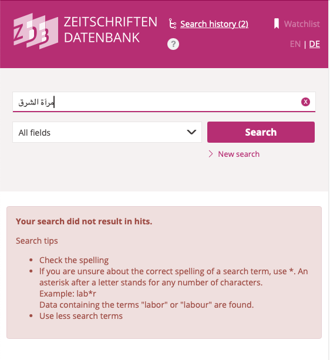
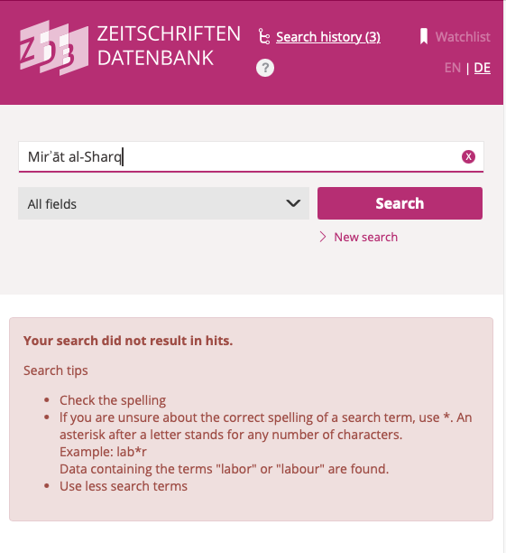
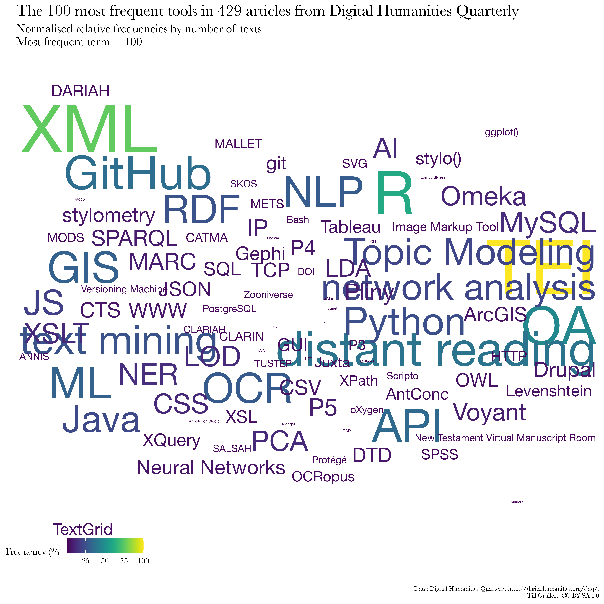
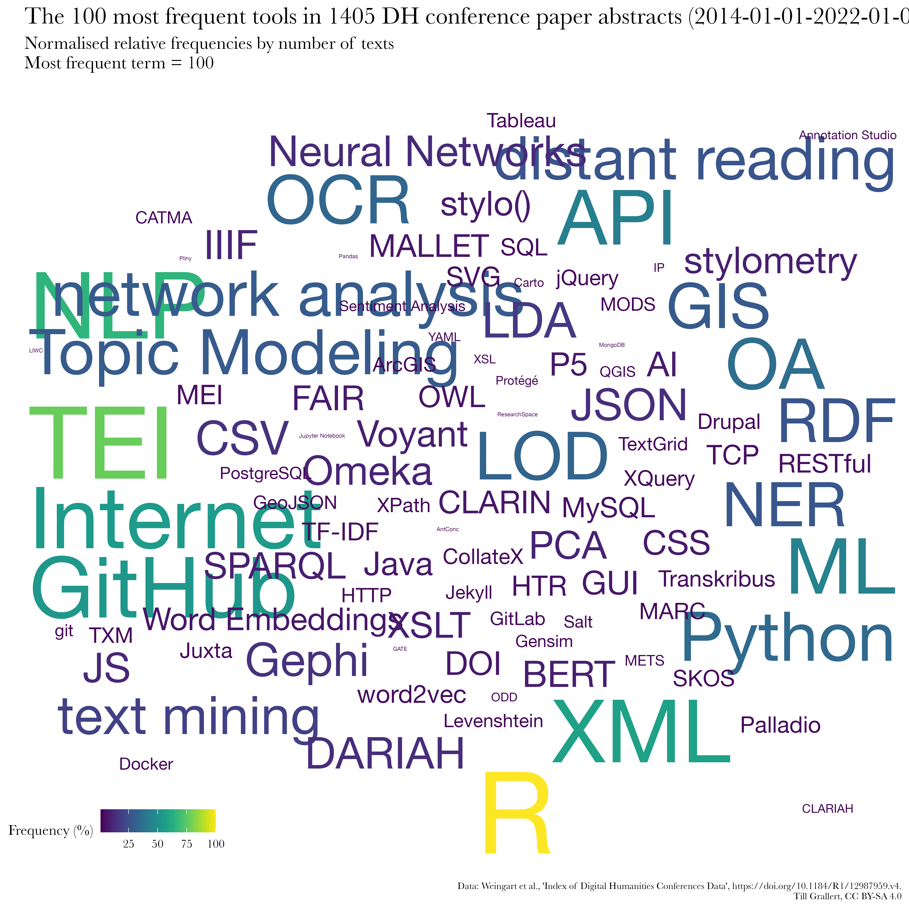
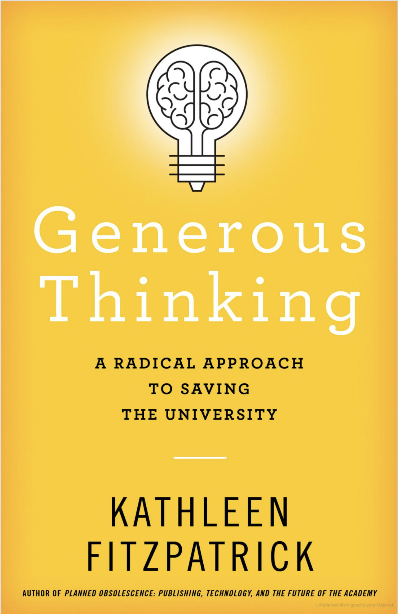
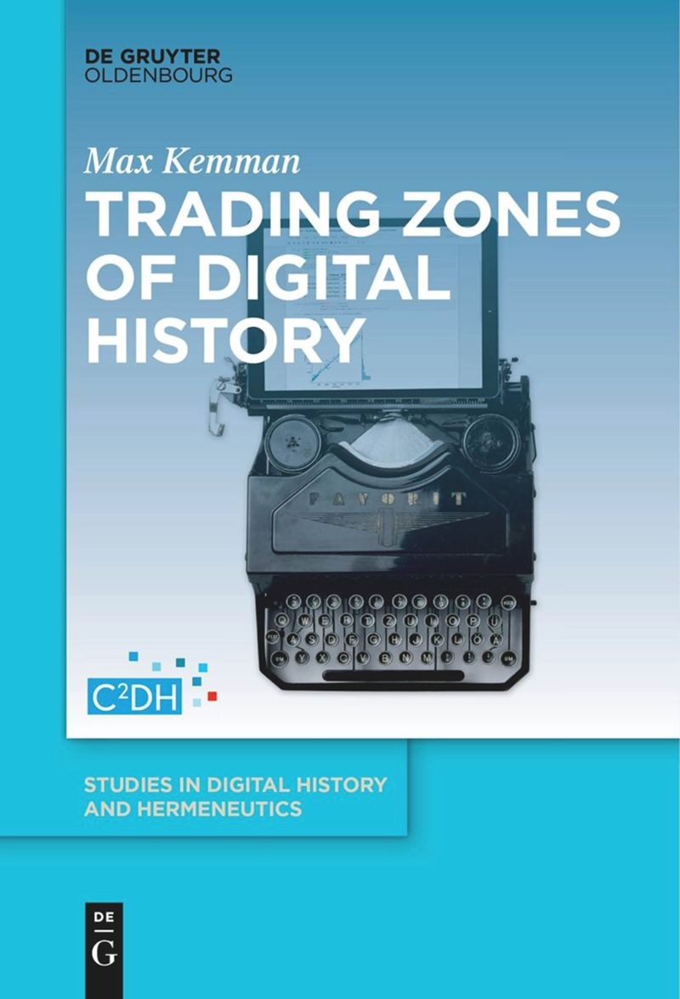
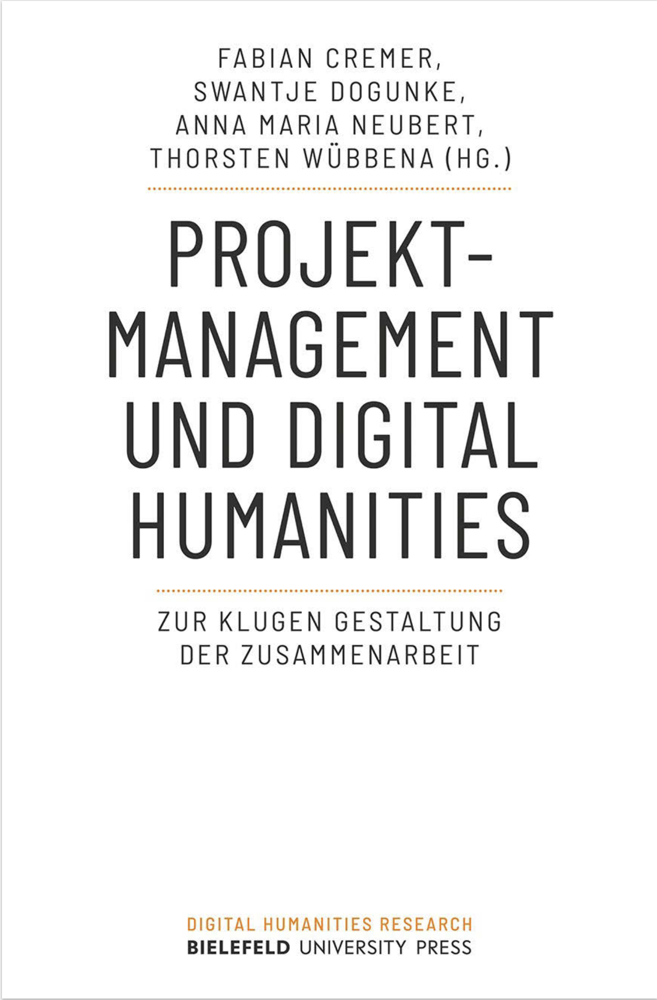
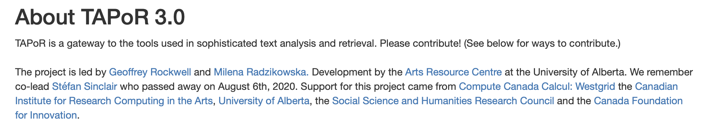
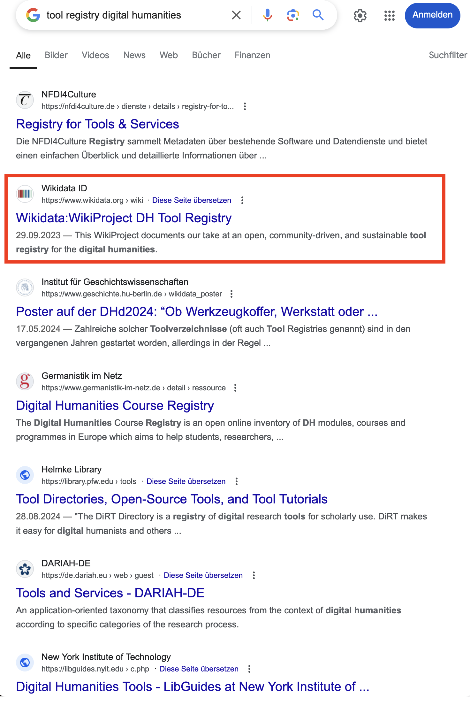

# Ein neues Epistem 
## *Digital* als ein historischer Begriff 

::: columns
:::: wide

<!-- **Datafication** emphasises the epistemic shift from a world where data were a closely defined part of the output of research processes towards the new status quo in which all research processes are always already computationally mediated through information and communication technologies. -->

**Datafizierung** unterstreicht den fundamentalen  epistemischen und konzeptionellen Wandel von einer Welt, in der Daten ein eng definierter Teil der Ergebnisse von Forschungsprozessen waren, hin zu einem neuen Status Quo, in dem alle  Forschungsprozesse immer bereits durch Informations- und Kommunikationstechnologien (ICT) computationell mediiert sind. 

::::
:::: narrow

[wir leben in *datafizierten* Gesellschaften]{.keyphrase}

::::
:::

::: columns
:::: narrow

["*digital*" hat seine Bedeutung verloren]{.keyphrase}

::::
:::: wide

>We think of the 'digital' as a previous historic movement when computation as digitality was understood in opposition to the analogue, rather than complementary [...]

<cite>@Berry+2017, 2</cite>

::::
:::

::: columns
:::: narrow

[*Algorithmen* sind Teil des sozialen Gewebes]{.keyphrase}

::::
:::: wide

>Today, algorithms are such an intrinsic and fundamental part of how daily life is experienced that some scholars even argue that we live in "algorithmic  cultures" [...]. This evocative notion points to the increasing difficulty of separating  algorithms from the activities that make up culture. It also evinces the complex ways in which human agency and algorithmic actions are intertwined [...] 

<cite>@Siles2023Living, 1</cite>

>It is our position that the "digital" cannot be understood as a separate domain of culture. If we actually examine the digital [...] we see that today digital information processing is present in every aspect of our lives.

<cite>[@CPCAbout]</cite>

::::
:::

::: notes

- das ist die Ausgangsprämisse unserer Arbeit für NFDI4Memory

- Digital history, then, accepts that the human cultural record is being *datafied* and we need computational methods in order to make historical arguments [cf. @DigitalHistoryArgument2017, 2; @Laessig2021DigitalHistory, 6]
- Digital history also addresses the age of abundance, as postulated by Roy Rosenzweig, and epitomised by the recent advances in generative AI and LLMs, which will create an infinite amount of absolutely plausible and convincing yet utterly false sources 
- Daraus folgt aber auch, dass **digital** history oder **digital** humanities hilfreiche Begriffe einer Übergangsphase sind. Sie sind Label mit einem hohen symbolischen und ökonomischen Kapital. 

:::

## Datum? captum? raw? meta?

::: columns
:::: narrow

[Jegliche digitale Informationen sind Daten]{.keyphrase} ...

::::
:::: wide

>Data are forms of information, a larger concept that is even more difficult to define. Epistemological and ontological problems abound, resulting in many books devoted to explicating information and knowledge 

<cite>@Borgman2015BigData, 18</cite>

::::
:::

::: columns
:::: wide

>[Datafication/modeling] is the work of abstracting discrete values from a phenomenon or artifact. These values may be expressed in numbers or texts and are necessarily a reduction of complex materials into a form for computation. <!--With data we can automate processes -->

<cite>@Drucker2021DHCoursebook, 3</cite>

>Data need to be imagined *as* data to exist and function as such, and the imagination of data entails an interpretive base.

<cite>@Gitelman2013Introduction, 3</cite>

::::
:::: narrow

... und [alle Daten sind modelliert]{.keyphrase}

<!-- - Mapping
- Reduction
- Purpose -->

::::
:::

::: notes 

- Data literacy as part of data culture
- data are always a concrete embodyment and a socio-technological stack: serialisation
- Models have three characteristics [@Stachowiak1973AllgemeineModelltheorie]
    - Abbildung: model for something
    - Reduktion: abstracts aspects of interest
    - Zweck: models have a purpose for something
- If we subscribe to social constructivism then all models are historically situated
- Wenn wir dem Konstruktivismus folgen, dann sind alle Modelle historisch situiert. Sie haben einen konkreten Ort und eine spezifische Zeitlichkeit
    - Daten und Modelle sind in historischen Prozessen der Wissensproduktion, des Wissenschaffens verortet
- drucker: capta

:::

## Die falsche Vertrautheit

{#fig:google-docs}

::: notes

- Digitalität **simuliert** Stasis und Vertrautheit
    + Metaphern
    + semantische Modelle
- Digitalität ist hochgradig ephemer und wird kontinuierlich remediiert
- Google docs
    - UI für eine distribuierte Datenbank
    - Die "Seite" wird konstant erzeugt und existiert so nur im Bildschirmausschnitt des Betrachters
    - Datenzentren
    - Netzwerkprotokolle
    - Inhaltsanalysen für Werbung, Kommerzialisierung
    - Interaktion mit Embeddings, Sprachmodellen of sorts
- Suchschlitz
    - simuliert Einfachheit
- Mein Punkt ist, dass wir nicht auf Papier schreiben und nicht in einer Bibliothek durch die Regale streifen

:::

## Ein Dokument?

::: columns
:::: column

{#fig:google-network}

::::
:::: column

{#fig:google-cdn}

::::
:::
::: notes

- Google docs
    - UI für eine distribuierte Datenbank
    - Die "Seite" wird konstant erzeugt und existiert so nur im Bildschirmausschnitt des Betrachters
    - Datenzentren
    - Netzwerkprotokolle

:::
## "Du bist so schön wie eine weitere Stunde Strom!"

::: columns-3
:::: column

<blockquote class="twitter-tweet" data-partner="tweetdeck">
&quot;حبيبتي، انت جميلة، كساعة اضافية من الكهرباء&quot;  هذا غزل أحد المتظاهرين في ساحة التحرير اليوم. رائعة حقيقة! <a href="http://t.co/KI8sAkY719">pic.twitter.com/KI8sAkY719</a>
&mdash; aya mansour (\@aya_mansour_11_) <a href="https://twitter.com/aya_mansour_11_/status/627223846244847616?ref_src=twsrc%5Etfw">July 31, 2015</a></blockquote>

<blockquote class="twitter-tweet" data-partner="tweetdeck">
مريم .. أنتِ جميلة كساعة إضافية من الكهرباء ..  كتبها عاشق في فلسطين - غزة <a href="https://t.co/W3QvpmaE3O">pic.twitter.com/W3QvpmaE3O</a>
&mdash; Jawdat Alsaleh (\@JawdatAlsaleh) <a href="https://twitter.com/JawdatAlsaleh/status/879683252184903681?ref_src=twsrc%5Etfw">June 27, 2017</a></blockquote>

:::: 
:::: column

<iframe src="https://data.worldbank.org/share/widget?indicators=EG.ELC.ACCS.ZS&view=map" width='500' height='500' frameBorder='0' scrolling="no" ></iframe>

:::: 
:::: column

<iframe src="https://data.worldbank.org/share/widget?indicators=IT.NET.BBND.P2&view=map" width='500' height='500' frameBorder='0' scrolling="no" ></iframe>

::::
:::

::: notes

- very unequal access to the means of digital production
- sustainable development goals (SDG) of the UN
- electricity
    + 800 mio have no access
        * almost exclusively in the global south
        * vast majority in subsaharan Africa
    + by 2030 according to projections of the International Energy Agency (IEA): 
        * 600 mio
        * 33 per cent of all Africans
    - access: 
        + 250--500 kWh per year and household
        + less than 14 hours of a 100W lightbulb per day
 - internet
        + 36,6 percent of the world population, or 2,93 billion people do not participate
        + 85 per cent of them live in Africa, South, East and South-East Asia
        + lower speed
        + higher latency
        + higher cost per unit of traffic

- At my former home institution, a well-funded foreign research institute, for instance, we shared a single connection of 24Mbps. Simply loading the landing page for a single volume of al-Muqtabas at the Endangered Archives Programme will require three seconds of load time even under perfect conditions. With 20 colleagues and another 20 library users equally trying to access online services and resources, load time quickly multiplies tenfold and more. Browsing through a large number of scanned images behind such a bottleneck is a daunting task. Uploading multiple gigabytes of high-resolution scans to a cloud computing service for machine-learning based OCR, for instance, is practically impossible and we rather ship hard drives and wait for months for the results.

:::

## Vom Suchen und Finden

::: columns-3
:::: narrow

{#fig:mirat-ar}

{#fig:mirat-ijmes}

::::
:::: column

{#fig:mirat-dmg}

::::
:::: column

{#fig:mirat-dmg-flat}

::::
:::

::: notes

- von Bulus Šahade von 1919 bis 1938 in Jerusalem herausgegebene Wochenzeitung [Mirʾāt aš-Šarq](https://www.wikidata.org/wiki/Q124971778)
- catalogue could be searched in Arabic but the data is missing
- catalogues are historical artefacts
    + digitisation of catalogues: NOT re-cataloguing of original material
        * card catalogue
        * ASCII OPAC
        * automated transcription of the card catalogue
        * human cataloguers depend on the technology they have at hand, which means they might be unable to enter the correct string
        * errors perpetuate
- Latin input is mostly reduced to ASCII
    + Hamza and ʿAyn escape this algorithm on ZDB
- determined article is not automatically removed
- The choices are not transparently documented
- no software on-screen keyboards provided
- additional problems
    + catalogues are inherently local documents
    + aggregated, if at all, on a national level
    + frequently accessible only through Web interfaces and not APIs

:::

## Die Humanities in der Epoche der Berechenbarkeit

[Für einen aufgeklärten Umgang mit *Datafizierung* brauchen wir einen fundamentalen **Kulturwandel**]{.keyphrase}

::: columns
:::: column

[Kennen Sie die?]{.keyphrase}

{#fig:wordcloud-dhq}

<!-- {#fig:wordcloud-dh-conferences} -->

::::
:::: column

Es herrscht in der Breite ein Mangel an 

- **Diskurs**: Austausch über unser (disziplinäres) Selbstverständnis 
+ **Theorie**: Verständnis des epistemischen Wandels und der ontologischen Dimensionen der *Datafizierung*
+ **Praktiken**: Beherrschung der notwendigen Methoden und Werkzeuge
+ positivem **Wissen**: Überblick über die Möglichkeiten in einem sich rapide wandelnden Umfeld 

<!-- - Es gibt ein starkes Ressentiment gegenüber allem "digitalen"
- *"Digital" Humanities* als Indikator -->

::::
:::

::: notes

- David Berry "epoch of computationability" 

:::

## Von *digital consumers* zu *digital citizens*, oder warum wir eine Datenkultur brauchen

<!-- requires some work -->

<!-- [*digital natives* sind nicht automatisch *digital citizens*]{.keyphrase} -->

::: columns
:::: column

### im weiteren Sinn

eine **Fachkultur**, bei der (Forschungs-)daten und datengetriebener Methoden ein integraler Bestandteil sind, die Arbeit mit und an Daten also nicht mehr als ein netter Appendix zum “eigentlichen” Forschungsprozess verstanden wird.

::::
:::: column

### im engeren Sinn

**alltägliche Praktiken** und Verantwortlichkeiten (auch rechtlich und ethisch) im Umgang mit Forschungsdaten, bei deren Erzeugung, Bereitstellung und Nutzung mit Hilfe von computationellen Methoden und Werkzeugen.

::::
:::

::: columns

### braucht

:::: column

Verständnis der theoretischen und epistemologischen Grundlagen und Implikationen der Datafizierung und Diskussion über deren Folgen

::::
:::: column

Orientierung, Guidelines und Unterstützung

::::
:::

::: notes

- *digital citizenry* ist von [@Rankin2018PeoplesHistory, 11] geprägt
    - >Kurtz, the director of the Computation Center, used the language of “citizenship” to describe the relationship between a user and the user’s computing network. A good computing citizen respected the college’s ongoing computer memory limitations. [@Rankin2018PeoplesHistory, 43-44]
- Ziel ist *digital* or *computing citizens*, die über ihre Teilnahme  und -habe an einer Gemeinschaft definiert sind. 
    + Unterschied zu Produzenten und *Makers*
    + **ABER** Digital natives sind nicht automatisch digital citizens
        + >despite what the term “digital natives” invokes, it does not mean that those who are digital natives (born after 1980) understand digital technology. In fact, digital natives may not remember life before the internet, but that does not mean they understand the complex systems that supports it or the nuances of communication and knowledge creation in the digital age [@Levy2017DigitalZombies, §16].
- kann **nur kollaborativ** adäquat bewältigt werden. 
+ ich fokussiere heute eher auf die Datenkultur im engeren Sinn, und schlage alltägliche Praktiken vor, die uns erlauben auch eine Datenkultur im weiteren Sinn zu etablieren.

:::

# DIY  Do it yourself
## Making

::: columns
:::: narrow

>Do artefacts have politics? 

<cite>[@Winner+1980]</cite>

>Do politics have artefacts? 

<cite>[@DunbarHester2014LowPower]</cite>

::::
:::: wide

>To use [...] tools well, we must, in some real sense, understand them better than the tool makers. [...] The best kind of tools are therefore the ones that we make ourselves. 

<cite>[@Tenen2016BluntInstrumentalism, 85]</cite>

>Without access to the code, whether because it is proprietary or generated on the fly, as in the case of some machine-learning algorithms, analysts can only comment on the apparent operations of the code based on its effects. The operations of the code are left in the hands of those who can access it, usually those who have made or maintain it, and those who can read it. 

<cite>[@Marino2020CriticalCodeStudies, 4]</cite>

::::
:::

::: columns
:::: column

### Making

- Experimentieren, Tüfteln, Ausprobieren, Werkeln 
- Selbstermächtigung mit dem Ziel der (Wieder)Aneignung der Produktionsmittel

::::
:::: column

### Maker turn

Kreativität von Design, Herstellung und Erfahrung von (digitalen) Objekten als From von Wissenschaft

::::
:::

::: notes

- Grundsatz: Werkzeuge und Methoden sind mit Machtverhältnissen verwoben
    - >The Cloud *is* a factory. Your AI *is* a human. Sexism *is* a feature, not a bug. [@Mullaney2021Intro, 7, Hervorhebung im Original]
- Geschichte
    + 1970er Kalifornien: kooperative Werkstätten
    + Recht auf Reparatur
    + DIY: do it yourself culture
    + "Maker Movement Manifesto" von Hatch (2013)
        * make, share, give, learn, tool up, play, participate, support, change
- bezieht sich auf [@Wythoff2022MinimalComputing], der die beiden Fragen verknüpft hat
    + Do artefacts have politics? [@Winner+1980]
    + Do politics have artefacts? [@DunbarHester2014LowPower]
- Kritik an Maker culture als omnipotenter maskuliner Raum:
    - >knowledge of circuitry is often conflated with (superheroic) command over people, situations, and things. In present-day “maker” cultures, consider the ubiquity of remarks such as “getting under the hood” or “knowing the nuts and bolts,” which tend to fuse logic with mastery, control with masculinity, engineering with rationality, and programming with revealing. [@Sayers2017Introduction, 3]
- Scheitern als wichtiges Moment

:::

## Unser Scholarly Makerspace

DFG-Projekt "Future e-Research Support in the Humanities II" an der UB der Humboldt-Universität zum Aufbau eines **prototypischen *Scholarly Makerspace*** zur Förderung **digitaler** und **computationaler Werkzeugkompetenz** (*tool literacy*) in den Geistes- und Kulturwissenschaften (2022--25)

::: columns
:::: narrow

::::
:::: wide

>Der Grundgedanke von Makerspaces ist das Teilen von **Räumen**, **Ressourcen** und **Wissen** innerhalb einer **Gemeinschaft**, welche Einzelpersonen sonst nicht zur Verfügung stünden 

<cite>[@Spath2019Makerspaces, 41]</cite>

::::
:::

::: notes

- Ergebnisse
    - Gescheitert: das Experiment wird nicht fortgesetzt und heisst seit längerem Kompetenzwerkstatt DH
    - Gelernt: Gemeinschaftlich! Es kann nur um die Menschen gehen!
    - Der duale Ansatz unseres Verständnisses davon wie der Kulturwandel in den Geisteswissenschaften gestaltet werden kann/sollte ist hier entscheident entwickelt worden.

- 2 Dimensionen von *tool literacy*
    1. das ganz konkrete Erlernen von Werkzeugen und computergestützten Verfahren: Wie kann ich Korpus von Digitalisaten mit Methoden des *distant reading* analysieren? Was ist eine Netzwerkanalyse? Was sind die Möglichkeiten der Datenvisualisierung? Wie kann ich die Disinformationskampagnien rechter Trollfarmen in Social Media sinnvoll analysieren?
    2. Zum anderen wird *tool literacy* aber mit dem Fokus auf Werkzeuge und Methoden als Gegenstand der Untersuchung weiter gedacht und mit  [*Critical Code Studies*](https://criticalcodestudies.com/) [@Marino2020CriticalCodeStudies] und den *Science and Technology Studies* in Beziehung gesetzt: von der Reflexion über die hermeneutischen und epistemologischen Folgen bestimmter Werkzeuge und Zugänge zu digitalen Daten bis zu den ethischen und ökologischen Folgen im Bereich der künstlichen Intelligenz bzw. des maschinellen Lernens
- >Kontext entscheidend. Als **wichtige Schnittstelle zwischen formellem und informellem Lernen** verfolgen Makerspaces an Bildungseinrichtungen sehr unterschiedliche Ansätze, die von offenen interdisziplinären Werkstätten über mobile Fab Labs bis hin zu großflächigen 3D-Technologie-Laboren reichen. [@Heinzeletal2020Einleitung, 1]
- >Die Ermöglichung des Zugangs für alle, stellt so einen zentralen Faktor für eine offene und demokratische Gesellschaft dar. [@Heinzeletal2020Einleitung, 2]

:::

# Do it yourself, but not alone!
## Gemeinschaftlich und kollaborativ

::: columns
:::: narrow

{#fig:wordcloud-dh-conferences}

::::
:::: wide

>I also remind DH is an imposter syndrome house of mirrors. You look around and see experts in GIS, TEI, dataviz, etc.; it's hard to remember that people tend to be good at *one* of those things when the collective appears to be good at *all* of them. **We all suck at most of DH**.

<cite>[@Weingart2021AlsoRemindDH]</cite>

>Unfortunately, I'm not particularly handy. On every new project, the tools require blood.

<cite>[@Graham2023FindMyselfCharge]</cite>

::::
:::

::: notes

- daraus folgt, dass es neue Rollen und neue Anforderungen gibt

:::

## Interdisziplinäres Zentrum für Digitalität und digitale Methoden am Campus Mitte

](../../assets/dh/website_iz-digitalität.png){#fig:website-iz}

{.c_logo .c_qr .c_right}

::: notes

- neue Initiative, seit 2024
- soll die vielen Menschen, die bereits zu Themen der Digitalität arbeiten zusammenbringen
- ihnen Raum für Austausch bieten
- ihre Arbeit sichtbar machen nach außen und nach innen

:::

## Generous thinking: zuhören und lernen

::: columns
:::: wide

>Generous Thinking [begins] by proposing that rooting the humanities in generosity, and in particular in the practices of thinking *with* rather than reflexively *against* both the people and the materials with which we work, might invite more productive relationships and conversations not just among scholars but between scholars and the surrounding community.

<cite>[@Fitzpatrick2016GenerousThinking]</cite>

::::
:::: narrow

{#fig:book-fitzpatrick2019}

::::
:::

::: notes

- frage:
    - Wie kann Kollaboration zum Nutzen aller gestaltet werden?
- sie entwirft eine Kritik der neoliberalen Universität, in der, vor allem in den Humanities, eine destruktive Kritik geübt wird

:::

## trading zones, contact languages, and project management

>to coordinate and develop [...] ‘contact languages’ [..] is the necessary underpinning of a stable, respectful and hybrid form of interdisciplinary collaboration. Done correctly they can create something new: Galison’s ‘full-fledged creoles’  supporting ‘activities as complex as poetry and metalinguistic reflection’.  They can create new disciplinary spaces and practices in their own right. 

<cite>[@AhnertEtAl2023CollaborativeHistoricalResearch]</cite>

::: columns
:::: column

{#fig:book-kemman2021}

::::
:::: column

{#fig:book-cremer2024}

::::
:::

::: notes

- Max Kemman und andere auf der Basis von Peter Galison
- contact zones müssen in "trading zones" verwandelt werden
    - Aber allein der Aufenthalt in einer Kontaktzone erfordert ein Mindestmaß an Toleranz
- Zonen der lokalen Verständigung, in den sich erst ein 
    - Pidgin und dann 
        - Pidgnization als die Periode, in der Labels, wie Digital History, sinnvoll sein können
    - Kreolisch entwickeln kann

- Peter Galison:
            >employed the metaphor of a ‘trading zone’ to explain  how engineers and physicists from a number of different sub-fields went about  collaborating with each other to develop particle detectors and radar.

:::

## Leistungen anerkennen

::: columns
:::: column

{#fig:credit}

::::
:::: column

[Anteile an jeglichem Output transparent klassifizieren]{.keyphrase}

- Seit 2012: [Contributor Role Taxonomy (CRediT)](https://credit.niso.org)
    - ANSI/NISO Standard (seit 2022)
    - 14 Rollen im gesamten Forschungsprozess
    - einige Zeitschriften erlauben weitere Unterscheidung als _lead_ ,_equal_ oder _supporting_
- Die [relators](http://id.loc.gov/vocabulary/relators) Taxonomie der LoC
- Und natürlich gibt es Zeitschriften zum Thema, z.B. [Accountability in Research](https://www.tandfonline.com/journals/gacr20)

[Unsere Stakeholder und ihre Bedürfnisse kennen]{.keyphrase}

- z.B. über die Entwicklung von Personae

::::
:::

::: notes

- CRediT
    - Rollen
        1. Conceptualization  
        2. Data curation  
        3. Formal analysis  
        4. Funding acquisition  
        5. Investigation  
        6. Methodology  
        7. Project administration  
        8. Resources  
        9. Software  
        10. Supervision  
        11. Validation  
        12. Visualization  
        13. Writing – original draft  
        14. Writing – review & editing
    - Außerhalb der Geisteswissenschaften weithin umgesetzt
    - >CRediT grew from a practical realization that bibliographic conventions for describing and listing authors on scholarly outputs are increasingly outdated and fail to represent the range of contributions that researchers make to published output. Furthermore, there is growing interest among researchers, funding agencies, academic institutions, editors, and publishers in increasing both the transparency and accessibility of research contributions.

:::

# KISS  keep it simple, stupid
## minimal computing
### Was **wir brauchen** müssen **wir** schaffen mit dem was **wir zuhanden haben**

::: columns
:::: narrow

](../../assets/dh/website_mincomp.png){#fig:mincomp-website}

::::
:::: wide

>Das Haus ist gebaut aus den Steinen, die vorhanden waren 

<cite>[@Brecht1967SchlechteZeiten]</cite>

>minimal computing connotes digital humanities work undertaken in the context of some set of constraints. This could include lack of access to hardware or software, network capacity, technical education, or even a reliable power grid

<cite>[@RisamGil2022Introduction, §3]</cite>

>this implies learning how to produce, disseminate, and preserve digital scholarship ourselves, **without the help we can’t get**, even as we fight to build the infrastructures we need at the intersection of, with, and beyond institutional libraries and schools.

<cite>[@Gil+2016, 29]</cite>

::::
:::

::: notes

- minimal computing ist ein Ergebnis von GO::DH und Ereignissen und Bedingungen der Digitalität in Cuba
- Alex Gil's ideas resonated with me, upon meeting in Beirut in April 2015

:::

## Centering the *we* in "what do we need?"

::: columns
:::: column

### *wir* ist bestimmt durch geteilte

- Interessen
- Werte
    + Zugänglichkeit
    + Teilhabe
    + Nachhaltigkeit: sozial, ökologisch, technologisch
    + Verantwortlichkeit
    + Gerechtigkeit
    + [FAIR](https://www.go-fair.org/fair-principles/) principles
    + [CARE](https://www.gida-global.org/care) principles
    + -> digital commons

::::
:::: column

### *wir* bestimmt

- den spezifischen Kontext und die Arbeitsbedingungen
- unseren Zugang zu Fähigkeiten, Methoden, Arbeitszeit, Werkzeug, Material ...

::::
:::

::: notes

- FAIR: **F**indability, **A**ccessability, **I**nteroperability, **R**euse
- [CARE](https://www.gida-global.org/care): **C**ollective benefit, **A**uthority to control, **R**esponsibility, **E**thics 
    + developped in the context of indigenous communities
- commons: Allmende 

:::

## Was bedeutet *minimal*?

<!-- add images -->

::: columns
:::: column

### Aus einer privilegierten Position

- Minimalismus als Selbstzweck
    - Vorhandene Resourcen zerstörend
    - Mode
    - Prinzipieller Purismus

 für Luxus-Küchen](../../assets/dh/bulthaupt.png){#fig:bulthaupt}

::::
:::: column

### Aus einer marginalisierten Position

- Minimalismus als ein *Mittel* zum Zweck
    - Abwägung unserer Bedürfnisse und unserer Ressourcen
    - Anerkennung der unausweichlichen Folgen unserer Handlungen
    - minimal computing als *meaningful* computing

](https://upload.wikimedia.org/wikipedia/commons/thumb/f/f1/SchutteLihotzky_FrankfurtKitchen_MIA_2004195_001.jpg/450px-SchutteLihotzky_FrankfurtKitchen_MIA_2004195_001.jpg){#fig:bauhaus}

::::
:::

::: notes

1. minimalism as an end
    - resource-intensive
    - example: Mary Condo
    - example: purist computing infrastructures
        + you got to run your own server and never use evil platforms
2. minimalism as a means to an end 
    + meaningful connectivity
    + original Bauhaus / modernist design:
        * form follows function to 
            - decrease the cost of industrial production
            - increase the material benefits of the expended resources

:::

## Und schließlich was ist mit *computing*<!-- in minimal computing-->?

::: columns
:::: column

- Nutze was wir bereits kennen
- Nutze was wir uns langfristig leisten könne
- Lege den Nutzer_innen keine unnötigen Kosten auf
- Verschwende keine Resourcen zum Schaden unsers Planeten

::::
:::: column

- Lerne *für uns* neue Techniken
- Entwickle Fähigkeiten
- Fördere und nähre Communities of Practice

::::
:::

::: notes

- first column
    + Etablierte Standards und bewährte Technologien
    + nicht das neuest Framework
        + es muss nicht glitzern und funkeln, es soll mit minimalem Aufwand lange laufen
        + Hier sollten wir uns an der Raumfahrtindustrie (nicht SpaceX) ein Beispiel nehmen: Voyager I and II are still functioning with rudimentary computing powers
    - Flache technology stacks

:::

## *Project Endings*

::: columns
:::: narrow

"](../../assets/dh/website_project-endings-principles.png){#fig:endings-principles}

{.c_logo .c_qr .c_right}

::::
:::: wide

Kollaboratives Projekt von Faculty, Bibliothekar_innen, Entwickler_innen an der University of Victoria, Kanada

- Problem: 
    - Mit enormen Funding haben die DH vor allem viele tote Projekte hervor gebracht, von denen nur noch URLs in Publikationen existieren
- Hauptziele
    - Belange von Forscher_innen und Archivar_innen bei der langfristigen Kuratierung und Erhaltung von DH-Projekten in Einklang zu bringen
    - Entwicklung praktischer Werkzeuge.

::::
:::

::: notes

- 2016: multi-year grant
    - survey and interviews
    - mehr als die Hälfte aller Interviewten hatte keinerlei Plan für die langfristige Erhaltung ihrer Projekte
- bei den gezeigten Prinzipien wird ganz klar ein *minimal computing* Ansatz deutlich
- tools to assist with the archiving of both data and interactive elements of digital projects.

:::

## Digital Humanities Climate Coalition

it all started with a manifesto <!-- "Digital Humanities and the Climate Crisis" (2021)-->

::: columns
:::: column

](../../assets/dh/website_dhcc.png){#fig:website-dhcc}

{.c_logo .c_qr .c_right}

::::
:::: column

>The digital is material. As digital humanists, every project we create, every software application we use, every piece of hardware we purchase impacts our environment. [...] we aim to surface the ecological impacts of our work while learning with and from our DH community about ways to reduce harm to the environment and to the people most impacted by environmental injustices.
>As humanities researchers, it is also our role to probe the values, the power structures, and the future imaginaries that underpin sustainable solutions. Given, especially, the immense and monopolistic power wielded by the global tech sector, and the critiques of this power that are part of DH, our use of their resources should be informed by the ways corporate economic, cultural, and scientific power perpetuates and exacerbates the crisis.

<cite>[@BaillotEtAl2021DHCCManifesto]</cite>

::::
:::

::: notes

- 2021 manifesto
- seit 2022: Entwicklung des Toolkits
- DHd AG Greening DH

:::

# Tool Registry und Survey als Beispiel
## Tool Registries sind Legion und ein eigenes Genre der DH

::: columns
:::: column

- DiRT -> Bamboo -> [TAPoR (3.0)][tapor]
- [Social Sciences and Humanities (SSH) Open Marketplace][sshmarketplace]
    + DARIAH, CLARIN, CESSDA
- NFDIs
    + [fortext](https://fortext.net/tools)
    + [NFDI4culture](https://nfdi4culture.de/resources/registry.html)
    + Basisdienste ...
- [Research Software Directory](https://www.esciencecenter.nl/rsd/), Netherlands eScience Center

::::
:::: column

{#fig:websites}

::::
:::

::: notes

- Abkürzungen
    + Bamboo DiRT, 2011, 2012--
    + CESSDA: Consortium of European Social Science Data Archives
    + CLARIN: Common Language Resources and Technology Infrastructure
    + DARIAH: Digital Research Infrastructure for the Arts and Humanities, 2011
    + DiRT: Digital Research Tools, 2008--
    + TaDiRAH: developed as collaboration between DiRT and DARIAH-DE, 2013
    + TAPoR: Text Analysis Portal for Research, maintained by Geoffrey Roper
:::

## Hintergrund

::: columns
:::: column

{#fig:wordcloud-dh-conferences-2}

::::
:::: column

- Toolverzeichnisse bedienen einen evidenten Bedarf
* Informationen zu Werkzeugen: 
    - Was gibt es?
    - Wofür kann es im DH Kontext eingesetzt werden?
* Informationen zum Gebrauch von Werkzeugen: 
    - Wie kann ich das Lernen?
    - Wer hat es wie und mit welchem Ergebnis bereits angewendet?

::::
:::

::: notes

- klare Antwort auf die Frage: Was brauchen wir?
- hier können wir kurz über den Kontext unserer beiden Projekte reden
- FuReSH bzw. Kompetenzwerkstatt DH
- NFDI4Memory Methodenlabor

:::

## Schwächen

<!-- Problem: "DiRT trap" [@Dombrowski2021DirectoryParadox] -->

>directories require ongoing upkeep, and it is unrealistic for an individual -- particularly in an alternative academic career track -- to do that work indefinitely. 

<cite>@Dombrowski2021DirectoryParadox</cite>

::: columns
:::: column

- Projektfinanzierung
- Datensilos 
    + Fokus auf Präsentationsschicht
    + Proprietäre bzw. custom Infrastrukturen
    + schlecht dokumentierte oder gar keine Schnittstellen (API's)
    + Kein Normdatensätze
- Kuratierung
    + (unbezahlte) Expert_innen und Gremien
    + praktisch kein community engagement
    + unmöglich Informationen aktuel zu halten

::::
:::: column

{#fig:tapor-about}

{#fig:tapor-contribute}

::::
:::

::: notes

- Sehr eingeschränkter Einsatz von APIs
    + Bsp. TAPoR hat eine nicht-dokumentierte API, auf die wir nur durch eine Analyese des  [ToolXtractor](https://github.com/lehkost/ToolXtractor)  [@BarbotEtAl2019ToolsMentioned; @BarbotEtAl2019WhichDHTools] gestoßen sind.
    + Bsp. SSH Open Marketplace hat eine dokumentierte API, aber es lassen sich nicht alle Werkzeuge abfragen, die mit einem bestimmten TaDiRAH-Konzept kategorisiert sind
- Folge: Momentaufnahme
    + IDs können nicht von externen für LOD benutzt werden 
    + Es können keine neuen Werkzeuge hinzugefügt werden
    + Es gibt keine dauerhafte Maintenance (Finanzierung)
        * Bsp.: TAPoR listet immer noch Stéfan Sinclairs Email für die Einreichung neuer Werkzeuge, obwohl Stéfan im August 2020 verstorben ist.
        * Die API des SSH Open Marketplace liefert `informationContributor` und `lastInfoUpdate`
:::

## Das Ganze mit DIY und KISS

Wir müssen die Frage "was brauchen *wir*" mit "was haben *wir*" beantworten können

::: columns
:::: column

### Was brauchen *wir*?

- Toolverzeichnis (s.o.), als Abbild 
    + der sich wandelden *Tool-Landschaft* bzw. *Tool-Bandbreite*
    + des *Toolgebrauchs* in den Digital Humanities, Digital History ...
- Tools sollen
    + beschrieben werden
    + klassifiziert werden
    + referenzierbar sein
    + auffindbar sein
- Einbettung in bestehende Infrastruktur
    + Linked Open Data
    + hohe Sichtbarkeit
    + Community Management

::::
:::: column

### Wer sind *wir*?

+ 4 Personen (2 Humanists, 2 RSE)
+ Projektfinanziert
+ Gemeinschaft von Praktitioners

### Was haben *wir*?

+ Know-how
+ Kontakte
+ Anschubfinanzierung
+ anteilige Arbeitszeit

::::
:::

::: notes

- Funktionen von Toolverzeichnissen
    * Informationen zu Werkzeugen: 
        - Was gibt es?
        - Wofür kann es im DH Kontext eingesetzt werden?
    * Informationen zum Gebrauch von Werkzeugen: 
        - Wie kann ich das Lernen?
        - Wer hat es wie und mit welchem Ergebnis bereits angewendet?

:::

## Folglich haben wir eine weitere Registry aufgesetzt

::: columns
:::: narrow

{#fig:search-google}

::::
:::: wide

[Sustainable und FAI]{.keyphrase} ...

- Setzen alles auf [Wikidata][wikidata] auf
    + (Linked) Open Data, CC0, quelloffene Software
    + Community und User Management
    + Multilingualität von Interface und Daten
    + hohe Sichtbarkeit: Suchmaschinen, Integration in Normdateien ([VIAF](https://viaf.org/))
- minimales, domänenspezifisch erweiterbares Datenmodell

... [R]{.keyphrase}

- (Nach)-nutzung bestehender Datensätze
    + Mapping nach Wikidata
        - Registries: [TAPoR][tapor], [SSH Open Marketplace][sshmarketplace]
        - Taxonomien: [TaDiRAH][tadirah]
        - Literatur: DHQ, DHd Konferenzen ...
- Versionierte Publikation des Graphen als RDF
    - GitLab und Zenodo

::::
:::

::: notes

- nachhaltige, offene Infrastruktur seit 2012
- etablierte Governancestruktur für nutzergenerierte und -kuratierte Inhalte mit einer aktiven Community.
- CC0 lizensierte Daten, quelloffener Softwarestack.
- Linked Open Data (LOD) über SPARQL, APIs, sowie das etablierte Webinterface out- of- the- box.
- Hohe Sichtbarkeit in Suchmaschinen und Forschungszusammenhängen
- Mehrsprachigkeit von Interfaces und Datensätzen
- wichtiger Baustein der digital commons mit zunehmender Nutzung in Forschungs- und Kulturerbeinstitutionen

:::

# Conclusion
## Summary

::: columns-3
:::: column

### DIY

- Wir müssen uns selbst ermächtigen und Blackboxes öffnen!
- Wer, wenn nicht wir, baut die Dinge, die wir benötigen?

::::
:::: column

### but not alone

<!-- - Die Aufgabe ist zu groß und zu komplex um sie allein bewältigen zu können. -->
- Niemand kann alleine Wissen schaffen
- Zusammenarbeit kann gelernt werden
- Befähigung von Menschen als nachhaltigste Investition

::::
:::: column

### and KISS

- Verantwortungsvoller Umgang mit menschlichen und natürlichen Ressourcen
- Ermöglicht Transparenz und Weiternutzung
- Ermächtigt alle Beteiligten

::::
:::

<!-- - Die minimale Lösung 
    - ist unter den Rahmenbedingungen zeitgenössischen Wissenschaft im Kontext von Polykrisen, **die einzig machbare**.
    - schont natürliche und menschliche Ressourcen.
    - trägt dazu bei, dass Forschung im Einklang mit guter Wissenschaftlicher Praxis steht.
    - **ermächtigt** alle Beteiligten am Forschungsprozess.
    - ermöglicht die Weiternutzung und Archivierung ihrer Ergebnisse. -->

<!-- ### minimal computing principles

- build what **we need** with what **we have** at hand
    - *vorhanden* reicht im Sinne Heideggers nicht, Dinge müssen *zuhanden* sein
- as **few** as possible, **open** and **established** formats and tools
- running on **our** hardware
- with **our** skills and knowledge
- **free-to-use** platforms without lock-in of data -->

## Literatur

[huberlin]: https://hu-berlin.de/
[scholia]: https://scholia.toolforge.org/
[sshmarketplace]: https://marketplace.sshopencloud.eu/
[tadirah]: https://vocabs.dariah.eu/tadirah/
[tapor]: https://tapor.ca/
[viaf]: https://viaf.org/
[wikidata]: https://wikidata.org/
[wikiproject]: https://www.wikidata.org/wiki/Wikidata:WikiProject_DH_Tool_Registry
[4memory]: https://4memory.de/