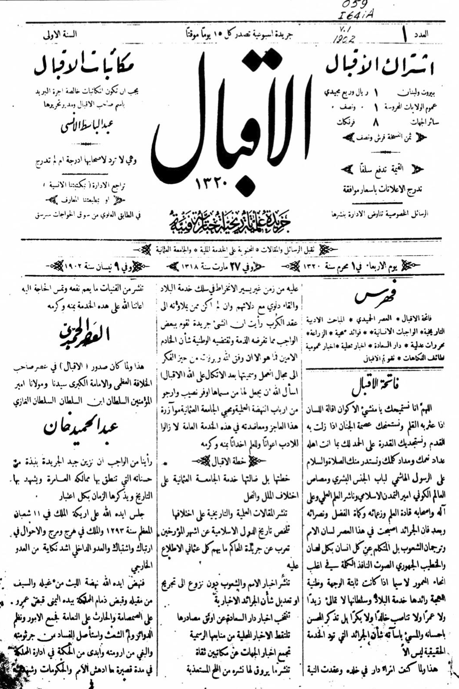
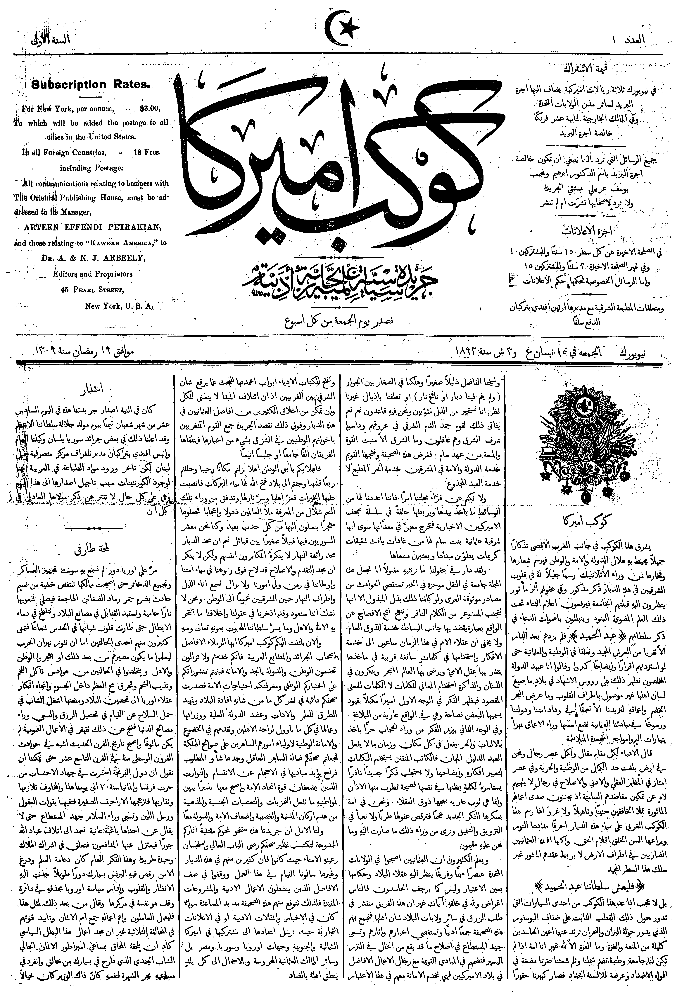
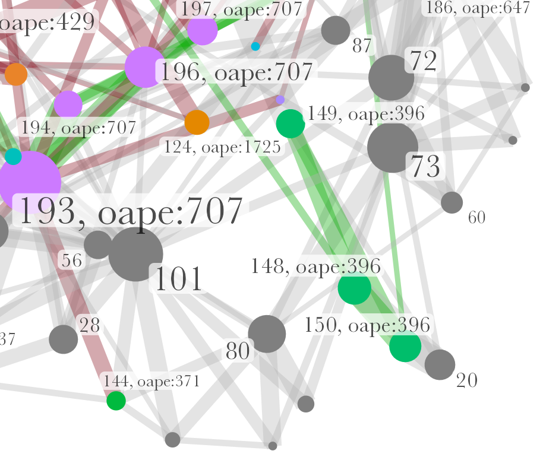

## outline

1. Background
    - Arab periodical studies
    - Research question
2. Method: stylometric authorship attribution
3. Corpus, data sets
4. Results

# Background
## Arabic periodicals

::: columns
:::: column

- Periodical press as agent of change
    + first mass medium
    + central medium of the literary and cultural Arabic renaissance (*nahḍa*)
    + medium of linguistic change
    + central forum for negotiations over modernity, nationalism, Islamism etc.

::::
:::: column

- Periodicals as *source* but not a *subject*
- Research is dominated by
    + national(ist) narratives
    + bias on two places and small no. of titles
    + implicit hypotheses

::::
:::

{#fig:map-jaraid}

## Arabic periodicals

::: columns-3
:::: column

<!-- {#fig:al-quds} -->
, 1906, Cairo](../../assets/OpenArabicPE/front-pages/al-muqtabas-m-v_1-i_1.png){#fig:muqtabas-1}

::::
:::: column

{#fig:iqbal-1}

::::
:::: column

{#fig:kawkab-1}

::::
:::

<!-- - Green: Ottoman crescent with 3 stars and slogan of the Young Turk Revolution of 1908: "Liberty, Equality, Fraternity"
- Blue: French title
- Red: Date line according to 3 calendars
    + reformed Julian: 28 Dec. 1912
    + Gregorian: 10 Jan. 1913
    + Islamic: 2 Ṣafar 1331 -->

::: notes

- striking similarity in layouts of newspapers
    + despite temporal and geographic distance

:::

## Research interest: intellectual networks

::: columns
:::: column

{#fig:network-authors-2}

::::
:::: column

### Aims

- empirical testing of hypotheses
- evaluate existing literature

### Observations

<!-- * Nur wenige Knoten sind von relativer Bedeutung (14 von 319) -->
- very limited overlap between periodicals from the same place
- core network (14 of 319 nodes):
    - absent from the literature
    - suprising set up: many Iraqis (6), few Syrians (2), few Christians (2)

::::
:::

::: notes
- of the 14, Ayalon mentions only ʿIsā Iskandar al-Maʿlūf 
:::

## Problem: missing bylines

::: columns
:::: column

::::
:::: column

- About 4/5 of all articles or 2/3 of all words carry no byline
* Commonly ignored in scholarship 
* Implicit hypothesis is implausible and untested
* Stylometric authorship attribution is untested for this material

::::
:::

# Method
## Stylometric authorship attribution

Authorship signal is prevalent in most frequent words, i.e. function words

::: columns
:::: column

### comparative method

- steps:
    1. compute frequencies for every text
    2. compare every text with every text
    3. validate through voting (*consensus*) of multiple iterations

::::
:::: column

### challenges

- novel application to Arabic and this genre
- comparison depends on input
- reliability depends on a minimal length of texts

::::
:::

::: notes

- stylometry is old, compution has supercharged it
- Computational Stylometry Group
    + Maciej Eder
    + Mike Kestemont
    + Jan Rybicki

:::

## Stylometry

- In R with the `stylo()` package [@Eder+2016b]
- Based on parameter settings established in our tests [@RomanovGrallert2022Stylometry]

::: columns
:::: column

### `stylo()` settings

- Tokens: words
- Sampling: 2500 tokens
- Most Frequent Features: 200--500 tokens, incremented by 100
- Culling: 0
- distance measure: Eder's simple delta

::::
:::: column

### Analysis

- edges (and nodes) tables from `stylo()`
- computing network measures with `tidygraph()` and `igraph()`
    + centrality
    + community detection
- plotting results with `ggraph()` and `ggplot2()`

::::
:::

::: notes

- Maxim designed and ran parameter test on a corpus of 300 nineteenth-century books
- I confirmed the viability of these settings in my work on periodicals

:::

## Parameter testing

[@RomanovGrallert2022Stylometry]

::: columns
:::: column

- [corpus](https://zenodo.org/record/5772261)
    + 300 books from 28 authors
    + 19th and early 20th century
- parameters
    + MFF: 100--500 tokens and character n-grams in increments of 100
    + culling: 0--50% in increments of 10 
    + distance measure: all 14
    + sample length: 100 to 12000 tokens in increments of 100

::::
:::: column

- testing
    + all possible combinations
    + Ward’s clustering (`ward.D2` in `hclust`) for authors and works
- infrastructure
    + Server from the [KITAB project]()
    + 20--30 cores
    + multiple weeks

::::
:::

## Parameter testing

{#fig:param-test}

# Corpus and data sets
## Corpus

| Periodical                      | Place             | Dates[^tb1]   | Vol.s   | No.s    | Words       | Articles | with author     | 2500+ words | words/ article | Authors | DOI                                                              |
| ------------------------------- | ----------------- | ------------- | ------: | ------: | ------:     | ------:  | ------:         | -----:      | ------:        | ------: | ------------------------                                         |
| [*al-Ḥaqāʾiq*][haqaiq_git]      | Damascus          | 1910--13      | 3       | 35      | 298090      | 389      | [41.90]{.green} | 22          | 832.66         | 104     | [10.5281/zenodo.1232016](https://doi.org/10.5281/zenodo.1232016) |
| [*al-Muqtabas*][muqtabas_git]   | Cairo, Damascus   | 1906--18      | [9]{.green}   | [96]{.green}  | [1981081]{.green} | [2964]{.green} | [12.72]{.red}   | [241]{.green}     | 873.34         | 140     | [10.5281/zenodo.597319](https://doi.org/10.5281/zenodo.597319)   |
| [*al-Zuhūr*][zuhur_git]         | Cairo             | 1910--13      | 4       | 39      | 292333      | 436      | [41.51]{.green} | [6]{.red}     | 695.09         | 112     | [10.5281/zenodo.3580606](https://doi.org/10.5281/zenodo.3580606) |
| [*Lughat al-ʿArab*][lughat_git] | Baghdad           | 1911--14      | 3       | 34      | 373832      | 939      | 16.19           | 21          | 485.21         | 53      | [10.5281/zenodo.3514384](https://doi.org/10.5281/zenodo.3514384) |
| total                           |                   |               | 19      | 204     | 2945336     | 4728     |                 | 290         | 622.96         |         |                                                                  |
|                                 |                   |               |         |         |             |          |                 |             |                |         |                                                                  |
| --- | --- | --- | --- | --- | --- | --- | --- | --- | --- | --- | --- |
| [*al-Ustādh*][ustadh_git]       | Cairo             | [1892--93]{.red} | 1       | 42      | 221447      | 435      | [5.52]{.red}    | 13          | 582.21         | 8       | [10.5281/zenodo.3581028](https://doi.org/10.5281/zenodo.3581028) |

Table: Our corpus from "[Open Arabic Periodical Editions](https://openarabicpe.github.io/)" {#tbl:openarabicpe-corpus}

[^tb1]: The current cut-off date is 1918.

[muqtabas_git]: https://github.com/OpenArabicPE/journal_al-muqtabas
[haqaiq_git]: https://github.com/OpenArabicPE/journal_al-haqaiq
[lughat_git]: https://github.com/OpenArabicPE/journal_lughat-al-arab
[ustadh_git]: https://github.com/OpenArabicPE/journal_al-ustadh
[zuhur_git]: https://www.github.com/openarabicpe/journal_al-zuhur

::: notes

- human-transcribed full text from a major Arabic shadow library
- modelled in TEI/XML
- mark-up of  
    + sections
    + articles
    + heads
    + bylines, as far as they exist

:::

## Why this corpus?
### Collection and digitisation biases

::: columns
:::: wide

{#fig:map-periodicals-status}

::::
:::: narrow

|      periodicals       | --1918 |       | --1929 |               |
|  :-------------------  | ----:  | ----: | ----:  |     ----:     |
|       published        |  2054  |       |  3550  |               |
|     known holdings     |  540   |       |  775   |               |
|       % of total       |        | 26.29 |        | [21.83]{.red} |
|------------------------|--------|-------|--------|---------------|
| digitized              |    156 |       |    233 |               |
| % of total             |        |  7.59 |        | [6.56]{.red}  |
|------------------------|--------|-------|--------|---------------|
| multiple digitisations |     51 |       |     66 |               |
| % of total             |        |  2.48 |        | 1.86          |
| % of digitised         |        | 32.69 |        | [28.33]{.red} |

Table: Periodical holdings and digitization {#tbl:jaraid-holdings}

::::
:::

::: notes

- collection bias is more of a knowledge bias
- While the digitization quote of roughly 50% of titles in collections is surprisingly high, it must be kept in mind that we cannot resolve information on the extent of digitization. Even if only a single issue of hundreds published was digitized, the periodical title will be included in this count.
- 66 periodicals or 28,33% have been digitized by multiple institutions and 21 of this subset by three and more.

:::

## Data sets

All data sets consist of plain text files with minimal normalisation generated from the TEI/XML in our corpus.

::: columns-3
:::: column

### Data set 1

- 215 articles of 2.500+ tokens
- 74 authors with only one or two texts
- 103 unattributed texts

::::
:::: column

### Data set 2

- 88 texts of 2.500+ tokens
- compilations of smaller anonymous texts from rubrics
- most likely written by editors

::::
:::: column

### Data set 3

- 612 full issues
- for basic sanity checks

::::
:::

::: notes

- data set 1 includes texts from some of the periodicals's known editors, it is unclear to which extent included authors could or should be considered potential candidates for authorship of the unattributed texts.
- data set 1: test the method
    - large number of authors with only a small number of text
    - large number of unattributed texts
    - relatively short texts (close to the minimal length)
    + unclear if the actual authors are part of the data set
    + -> **very different from [@RomanovGrallert2022Stylometry]'s test corpus**
- data set 2: test the hypothesis

:::

# Results
## Sanity check: data set 3

Questions:

1. Are individual periodicals stylistically distinguishable?
2. Do they a single auctorial voice?

::: columns
:::: column

{#fig:dataset3-publication}

::::
:::: column

{#fig:dataset3-walktrap}

::::
:::

::: notes

- two issues of al-Zuhūr are stylistically different from the rest of the journal 
    - These are issues no. 88 and 91 in the plot, which refer to vol.3, no.8 and 9.,
    - confirmed by community-detection algorithms 
    - might indicate a shift in editorship. 
- Similar shifts seemingly happened at other periodicals as well.
    - at least at al-Muqtabas as indicated by walktrap and Louvain.
        - There is one issue of al-Muqtbas, vol. 4, no.5-6, which is stylistically part of al-Zuhūr.
        - There are two issues of al-Muqtabas which are pretty close to al-Ḥaqāʾiq
    - using walktrap we get two communities at al-Ḥaqāʾiq as well.

:::

## Test the hypothesis: data set 1

Questions:

1. Do anonymous articles cluster by periodical? 
2. Can the owners-cum-editors present in this data set be considered strong candidates for their authorship?

::: columns
:::: column

{#fig:articles-publications}

::::
:::: column

{#fig:articles-louvain}

::::
:::

::: notes

- both hypotheses can be rejected for al-Muqtabas and Lughat al-ʿArab, whose editors, Muḥammad Kurd ʿAlī, Anastās Mārī al-Karmalī, and  Kāẓim al-Duyalī, are present in the data set (labelled with their respective identifiers as oape:878, oape:227, and oape:396). 
- The anonymous articles from al-Muqtabas form two distinct clusters with substantial internal differences and thus force us to reject any notion of single authorship ([@fig:articles-louvain]). 
- neither Muḥammad Kurd ʿAlī nor Anastās Mārī al-Karmalī and Kāẓim al-Duyalī seemingly authored a significant number of articles in their respective journals.
- The small cluster of texts from al-Zuhūr in the top left can all be attributed to Shakespeare through close reading

:::

## Test the hypothesis on stronger candidates: data set 2

::: columns
:::: wide

{#fig:muqtabas-editors-louvain}

::::
:::: narrow

Muḥammad Kurd ʿAlī might have authored some texts in his journal *al-Muqtabas* but he was certainly not alone

::::
:::
::: notes

we divided data set 2 by source publication and added texts from data set 1 authored by the owners-cum-editors.

:::

## Test the hypothesis on stronger candidates: data set 2

Adding unlikely contenders to amplify the signal

::: columns
:::: column

{#fig:muqtabas-authors-louvain}

::::
:::: column

{#fig:lughat-authors-louvain}

::::
:::

::: notes

- added all attributed articles from data set 1 as a control group. We argue that if they were less likely to be editors (and thus more stylistically different), they would push the assumed owner-com-editors closer to the anonymous articles.
- not the case for al-Muqtabas nor Lughat al-ʿArab. This indicates that Muḥammad Kurd ʿAlī and Anastās Mārī al-Karmalī should not be considered strong contenders for the authorship of anonymous  reporting in their journals. 
- We can also safely exclude all other 73 authors in data set 1 as potential candidates for the editorship.

:::

## All isn't in vain: individual authors

::: columns
:::: narrow

Let's return to a slightly different version of @fig:articles-publications ...

::::
:::: wide

{#fig:network-author}

::::
:::

## All isn't in vain: individual authors
### Kāẓim al-Dujaylī

Anonymous travellogue in *Lughat al-ʿArab* most likely written by the magazine's editor Kāẓim al-Dujaylī

::: columns
:::: column

{#fig:network-detail-dujayli}

::::
:::: column

](../../assets/OpenArabicPE/stylometry/stylo_NN_oclc.472450345_v.3_i.1_div_7.d2e1438_lollipop.png){#fig:radar-dujayli}

::::
:::

## All isn't in vain: individual authors
### Ibn al-Muqaffaʿ?

A cluster of texts potentially written by Ibn al-Muqaffaʿ (d. 759) and edited by Ṭāhir al-Jazāʾirī

::: columns
:::: column

{#fig:network-detail-muqaffa}

::::
:::: column

](../../assets/OpenArabicPE/stylometry/stylo_NN_oclc.4770057679_v.3_i.1_div_3.d1e733_lollipop.png){#fig:radar-muqaffa}

::::
:::

::: notes

- this is a case where the algorithm for extracting bibliographic information did not work as expected
    + the title clearly mentions Ibn al-Muqaffaʿ as the author

:::

## All isn't in vain: individual authors
### Shukrī al-ʿAsalī: resolving acronyms

Texts by Shukrī al-ʿAsalī, later MP for Damascus and co-editor of one of Muḥammad Kurd ʿAlī's newspapers

::: columns
:::: column 

{#fig:network-detail-asali}

<!-- this is currently the wrong image -->

::::
:::: column

](../../assets/OpenArabicPE/stylometry/stylo_oape.460_oclc.4770057679_v.4_i.2_div_4.d1e2328_lollipop.png){#fig:radar-asali}

::::
:::

::: notes

- This information could also be gathered from close reading
    + based on the title
    + the text in *al-Muqtabas* 4(2) mentions the one in 2(4) in a footnote, which, however, is not part of the transcription from Shamela
- authors:
    + 482: Jamāl al-Dīn al-Qāsimī

:::

# Conclusion
## Summary

- We tested and falsified a hypothesis: anonymous articles in *al-Muqtabas* from Cairo and, later, Damascus, and *Lughat al-ʿArab* from Baghdad were not authored by their respective owners-cum-editors.
- A small number of anonymous articles could be attributed

### Future work

- identify potential candidates for authorship
- build the necessary data sets for these candidates
- expand the scope by systematically digitising a representative sample of Arabic periodicals

## Thank you!

- Maxim Romanov for his work on parameter testing
- Contributors to OpenArabicPE: Jasper Bernhofer, Dimitar Dragnev, Patrick Funk, Talha Güzel, Hans Magne Jaatun, Daniel Kolland, Jakob Koppermann, Xaver Kretzschmar, Daniel Lloyd, Klara Mayer, Tobias Sick, Manzi Tanna-Händel, and Layla Youssef
- Links:
    + Slides: [https://tillgrallert.github.io/slides/dh/2024-davo/](https://tillgrallert.github.io/slides/dh/2024-davo/index.html)
    + Project blog: [https://openarabicpe.github.io](https://openarabicpe.github.io)
    + Papers: <https://doi.org/10.5281/zenodo.10159446>, <http://digitalhumanities.org/dhq/vol/16/2/000593/000593.html>, <https://doi.org/10/gkhrjr>
    + Mastodon: [\@tillgrallert\@digitalcourage.social](https://digitalcourage.social/@tillgrallert)
    + Email: <till.grallert@fu-berlin.de>, <till.grallert@hu-berlin.de>
- Licence: slides and images are licenced as [CC BY-SA 4.0](http://creativecommons.org/licenses/by-sa/4.0/)

## References {#refs}