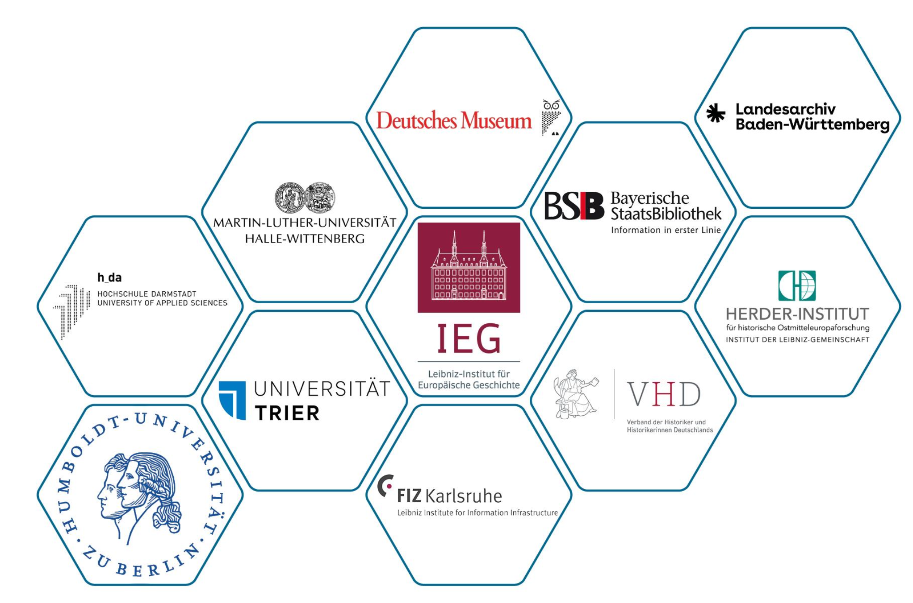
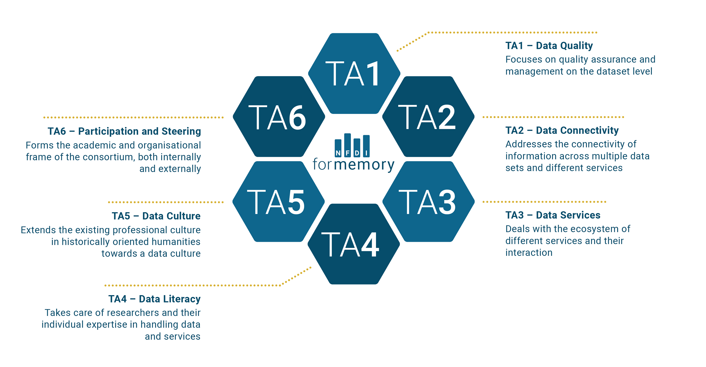
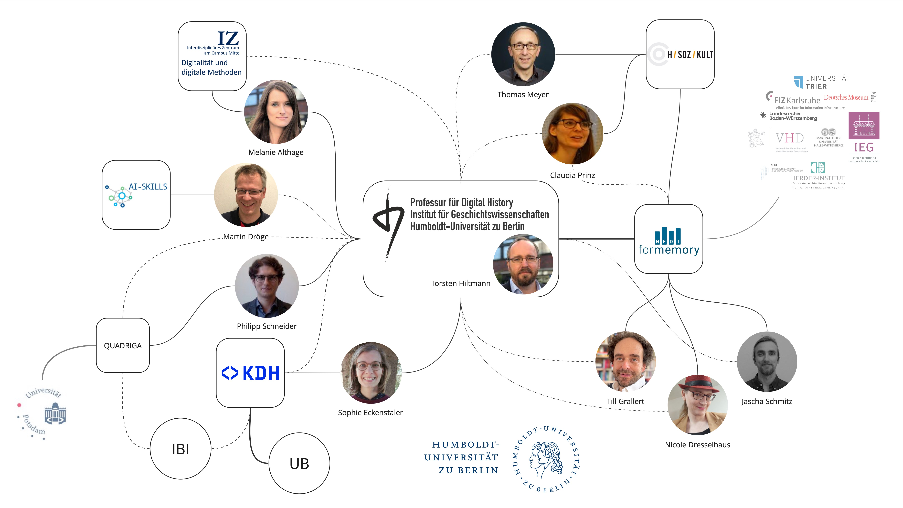

# Drei Thesen

## 1. Wir leben im Zeitalter der Digitalität und Berechenbarkeit

::: columns
:::: wide

*Datafizierung* markiert den epistemischen Wandel von einer Welt in der Daten ein engdefinierter Teil der Ergebnisse von Forschungsprozessen waren hin zu einem Status Quo in dem alle Forschungsprozesse immer schon durch Informations- und Kommunikationstechnologien vermittelt sind.

::::
:::: narrow

[Gesellschaft und Wissenschaft sind bereits *datafiziert*]{.keyphrase}

::::
:::

::: notes

- "epoch of computationality" orginates with Berry
- Unsere Interaktion mit der Welt ist immer schon durch ICTs vermittelt
- Digital history, then, accepts that the human cultural record is being *datafied* and we need computational methods in order to make historical arguments [cf. @DigitalHistoryArgument2017, 2; @Laessig2021DigitalHistory, 6]
- Digital history also addresses the age of abundance, as postulated by Roy Rosenzweig, and epitomised by the recent advances in generative AI and LLMs, which will create an infinite amount of absolutely plausible and convincing yet utterly false sources 
- 

:::

## 2. "analog" war (vor) gestern

::: columns
:::: narrow

[Die Unterscheidung zwischen *analog* und *digital* hat ihren analytischen Wert verloren]{.keyphrase}

::::
:::: wide

>We think of the 'digital' as a previous historic movement when computation as digitality was understood in opposition to the analogue, rather than complementary [...]

<cite>@Berry+2017, 2</cite>

::::
:::

## 3. Algorithmen sind Akteure

::: columns
:::: narrow

[*Algorithmen* sind Teil des sozialen Geflechts]{.keyphrase}

::::
:::: wide

>Today, algorithms are such an intrinsic and fundamental part of how daily life is experienced that some scholars even argue that we live in "algorithmic  cultures" [...]. This evocative notion points to the increasing difficulty of separating  algorithms from the activities that make up culture. It also evinces the complex ways in which human agency and algorithmic actions are intertwined [...] 

<cite>@Siles2023Living, 1</cite>

::::
:::

# Was tun?
## Geschichtswissenschaft im Zeitalter der Berechenbarkeit

[To make sense of *datafication* we need cultural change within the discipline]{.keyphrase}

::: columns
:::: column

### Status quo

- very little computational research
- limited understanding of the epistemoloigcal and ontological dimentions of **datafication**
- limited understanding of the concept of **research data** and their enourmous potential for historical research  
- limited practical computational skills
- constantly and rapidly evolving environment -> generative AI, ML
- resentment towards "the digital"

::::
:::: column

### Aims

- Establish a robust and sustainable **data culture** in order to *emerge from our self-incurred immaturity*
    - make sense of the new episteme
    - develop the necessary skills to conduct historical research
    - negotiate new understandings of history as a discipline

::::
:::

## What do we mean by **data culture**?

::: columns
:::: column

### broad sense

Data culture as a disciplinary culture, in which (research) data and computational methods form an integral part of historical research and reasoning.

This requires:

- fundamental theoretical, epistemological, and ontological knowledge of *datafication*
- reflection on its implications for all parts of the research process
- ongoing discussion on the necessary changes within the discipline

::::
:::: column

### narrow sense

Data culture as quotidian practices, skill sets, and disciplinary protocolls for handling (research) data and computational research.

This requires:

- orientation
- training
- support 

::::
:::

::: notes

- broad:
    - (research) data cannot, anymore, be perceived as an appendix / addendum to the "actual" research process
- narrow
    - orientation: guidelines, best practices, white papers
        - through and by example
    - training: across the board
    - support: technical, ethical, judicial

:::

## Data, data everywhere

::: columns
:::: narrow

[All digital information is data]{.keyphrase} ...

::::
:::: wide

>Data are forms of information, a larger concept that is even more difficult to define. Epistemological and ontological problems abound, resulting in many books devoted to explicating information and knowledge 

<cite>@Borgman2015BigData, 18</cite>

::::
:::

::: columns
:::: wide

>[Datafication/modeling] is the work of abstracting discrete values from a phenomenon or artifact. These values may be expressed in numbers or texts and are necessarily a reduction of complex materials into a form for computation. <!--With data we can automate processes -->

<cite>@Drucker2021DHCoursebook, 3</cite>

>Data need to be imagined *as* data to exist and function as such, and the imagination of data entails an interpretive base.

<cite>@Gitelman2013Introduction, 3</cite>

::::
:::: narrow

... and [all data is modelled]{.keyphrase}

<!-- - Mapping
- Reduction
- Purpose -->

::::
:::

::: notes 

- Data literacy as part of data culture
- data are always a concrete embodyment and a socio-technological stack: serialisation
- If we subscribe to social constructivism then all models are historically situated
    - Data and models are situated in historical processes of knowledge production
- Models have three characteristics [@Stachowiak1973AllgemeineModelltheorie]
    - Mapping/ replacing: model for something
    - Reduction: abstracts aspects of interest
    - Purpose: models have a purpose for something
- drucker: capta

:::

# NFDI4Memory and  Digital history at HU Berlin
## Nationale Forschungsdateninfrastruktur (NFDI)

::: columns
:::: column

### today

1. Association with more than 260 member institutions from all academic disciplines: research institutes, universities, GLAM, academic associations ...
2. 26 independent consortia (five-year funding), among them four from the humanities and social sciences:
    - NFDI4Culture
    - NFDI4Objects
    - Text+
    - NFDI4Memory

::::
:::: column

### back story

- 2016--18: Council for Information Infrastructures recommends creating a national research data infrastructure
    - sustainable infrastructure for research data
    - bottom-up and federated 
    - centered around data providers and users
    - disciplines and domain experts "at the helm"
    - organised into disciplinary communities
- 2018- : NFDI
    - three rounds of applications: 2020, 2021, 2022
    - funded by the federal and state governments
    - organised by the Deutsche Forschungsgemeinsschaft 

::::
:::

## NFDI4Memory
### NFDI Consortium for the historically oriented humanities (2023--)

::: columns
:::: column

- Unites research, memory and information infrastructure institutions in a digital research infrastructure
- Drives forward the digital transformation of the historically oriented humanities 
- Develops digital historical source criticism for the humanities and for the NFDI 

::::
:::: column

- 11 **Co-applicants**: lead 6 *task areas*
- 81 **Participants**: contribute ideas, expertise and networks

::::
:::

::: notes

- NFDI4Memory
    - since 2023
    - one of 26 consortia, one of four consortia in the humanities and social sciences
    - at HU: task area "data culture", together with VHD

:::

## NFDI4Memory
### Task areas

{#fig:4mem-tas}

## Digital history at HU Berlin

::: notes

- Chair of Digital History: 
    - Torsten Hiltmann, since 2020
    - Since 2018: MA specialisation programme *Digital History* as part of the MA in History
        1. Algorithmic thinking, 
        2. methodological competence through 
        3. theoretical foundations, and
        4. critical reflection in a historical context
- HSozKult
    - since 1996 at the IfG
    - information and communications platform
    - announcements, reviews
- IZ
    - since 2024
    - collaboration of all DH initiatives at HU in order to increase visibility and collaboration

:::

# Conclusion
## Kontinuierlicher Wandel

::: columns-3
:::: column

### Epistemologie

- Mehrwert der Datafizierung: neue Anworten, **neue Fragen**
- Algorithmizität: erlaubt schnelles Testenvon Hypothesen

::::
:::: column

### Wissenordnungen

- Wissen als formalisiert und eingeschrieben in Algorithmen, Modelle, Copora
- Sich wandelnde Formen von Nachvollziehbarkeit und Transparenz
- Potential der Replikation

::::
:::: column

### Innerdisziplinär

- Neue Arbeitsformen: interdisziplinär und kollaborativ
- Neue Fähigkeiten: benötigen neue Ausbildungsformen und Inhalte
- Neue Formate von Ergebnissen: benötigen neue Bewertungs- und Gütekategorien
- Neue Karrierepfade und Reform von Berufungsprozessen?

::::
:::

::: notes

- epistomoligical and methodological changes
    - added value from datafication: increasing our options through a changing perspective on the information to be extracted from sources
    - expanding hermeneutics through datafied approaches (as hermeneutical instruments)
    - algorithmicity: chances and challenges of explorative scaling as an approach to research questions
    - grounded with the processes of knowledge producation and narration within academic history
    - expanding source criticism into  computational source criticism?
- changing knowledge orders
    - knowledge as being formalised and embodied in algorithms, models, and corpora
    - changing forms of traceability and transparency, potential for replication
- new skills, formats of output, and genuine research
    - changing courses of study and qualification
    - changing indicators of reputation
    - changing hiring processes

:::

## Thank you

This work was created as part of the NFDI consortium 4Memory ([www.4memory.de](www.4memory.de)). 

We gratefully acknowledge the financial support of the German Research Foundation (DFG) – project number 501609550.

## Bibliography {#refs}