# Introduction
## My research interests

[... or what I would want to do]{.c_center .keyphrase}

::: columns
:::: column

Who are the most important authors?

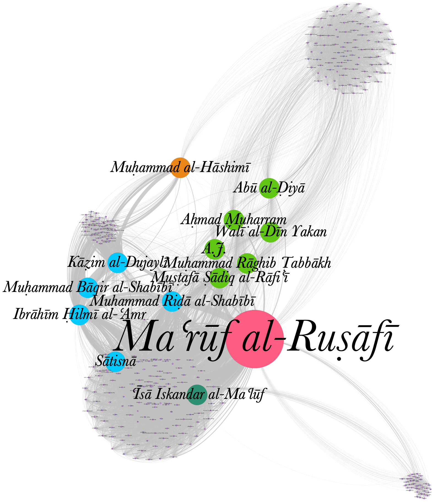{#fig:network-authors-1}

::::
:::: column

What are the most important periodicals?

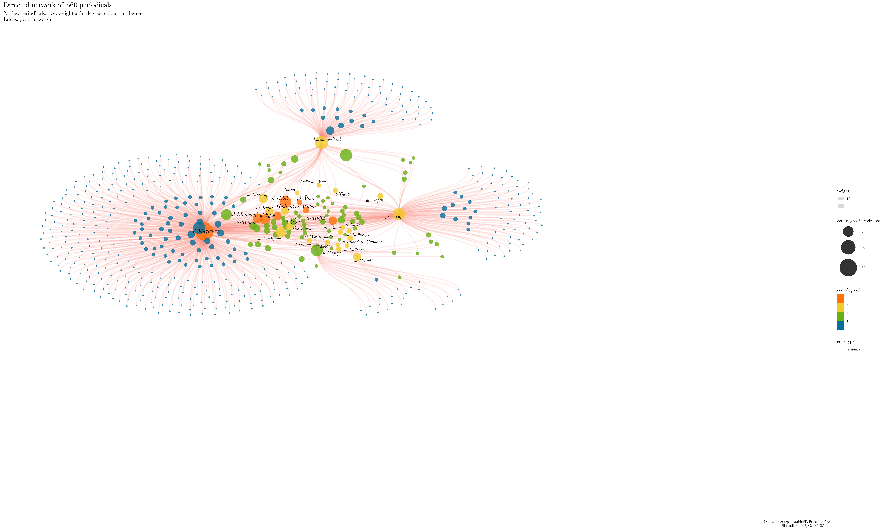{#fig:network-mentioned-periodicals-1}


::::
:::

## My research interests

[... or what I would want to do]{.c_center .keyphrase}

::: columns
:::: column

<!-- {#fig:stylo-muqtabas-anonymous} -->

Do periodicals speak with one auctorial voice?

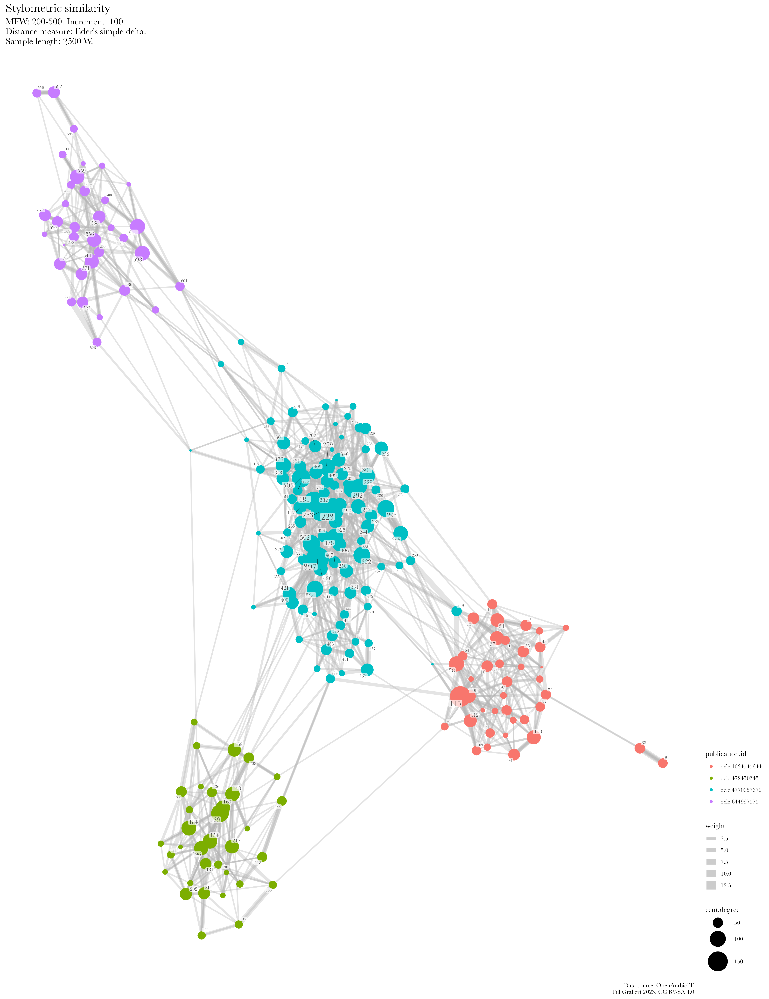{#fig:dataset3-publication}


::::
:::: column

Should we conflate editors with "their" periodical?

{#fig:muqtabas-authors-louvain}

::::
:::


::: notes

Note how the anonymous articles cluster on the left.

:::


## ... and what I spend my time on
### [Project Jarāʾid](https://projectjaraid.github.io/) (2012--) <br/>Closing the knowledge `<gap/>`

::: columns
:::: column

- Bibliographic record of **all** Arabic periodical titles published between 1798 and 1929
    - websites and open datasets ([TEI/XML](https://tei-c.org/)) for more than 3500 periodicals
    - additional authority files for c.2700 persons, 220 places, 180 libraries
- Unfunded collaboration with Adam Mestyan (Duke), "crowd"-sourcing
- Networking and reconciling existing information: 
    - Integration of holding information from library catalogues such as ZDB, AUB, BnF, HathiTrust
    - Publish everything as Linked Open Data on [Wikidata](https://w.wiki/9UDd)

::::
:::: column

<!-- 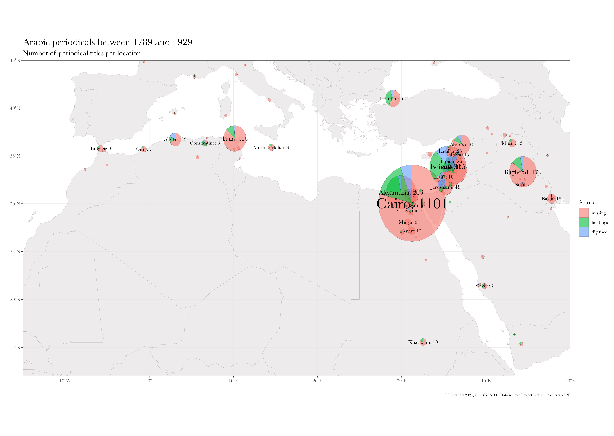{#fig:holding-stats} -->

{#fig:history-arab-press}

::::
:::

## ... and what I spend my time on
### Open Arabic Periodical Editions ([OpenArabicPE](https://openarabicpe.github.io), 2015--) <br/>Closing the infrastructural `<gap/>`

::: columns
:::: wide

- Digital scholarly editions
    + 6 Arabic magazines from Baghdad, Cairo, Damascus with c.800 issues and more than 9 million words.
    + full text and facsimiles modelled in TEI/XML
    - Bibliographic metadata (MODS, BibTeX, Zotero RDF)
    - Open licenses: [CC BY-SA 4.0](http://creativecommons.org/licenses/by-sa/4.0/)
       <!--  - on the article level for the entire corpus plus 2 additional magazines
        - on the issue level for 7 additional newspapers
        - on the title level for 3300+ periodicals (in collaboration with [Project Jarāʾid](https://projectjaraid.github.io)) -->
- Infrastructure:
    + [TEI Boilerplate]((https://github.com/openarabicpe/tei-boilerplate-arabic-editions)): static websites. No need for backend, database or internet connection
    + [GitHub](https://github.com/openarabicpe) / [Zenodo](https://zenodo.org): free hosting and archiving with DOIs
    - [Zotero group](https://zotero.org/groups/openarabicpe) as gateway to search/browse the corpus
- Workflows and tools

::::
:::: narrow

](../../assets/OpenArabicPE/boilerplate_zuhur-v_1-i_1.png){#fig:webview-zuhur}

](../../assets/OpenArabicPE/boilerplate_muqtabas-v_3-i_2.png){#fig:webview-muqtabas}

::::
:::

# Background
## Arabic periodicals

The first mass medium of the Eastern Mediterranean and a global Arabic ideosphere

::: columns-3
:::: column

 #1, 20 April 1875, Beirut](../../assets/OpenArabicPE/front-pages/thamarat-al-funun-v_1-i_1.jpg){#fig:tf-1}

::::
:::: column

<!-- 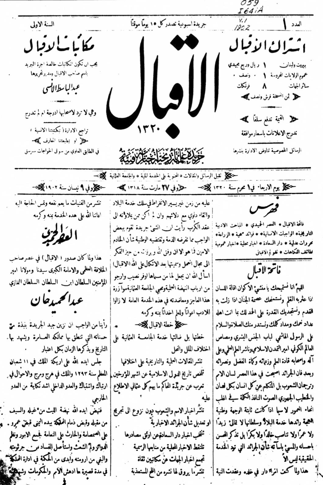{#fig:iqbal-1} -->
 #1, 15 April 1892, New York](../../assets/OpenArabicPE/front-pages/kawkab-amirka-v_1-i_1.png){#fig:kawkab-1}

::::
:::: column

 #2, 22 Sep. 1908, Jerusalem](../../assets/OpenArabicPE/front-pages/al-quds-v_1-i_2.jpg){#fig:quds-2}

::::
:::


::: notes

- striking similarity in layouts of newspapers
    + despite temporal and geographic distance
- note the Ottoman symbolism
- note the absence of visual / typographic segmentation for Thamarāt al-Funūn 

:::


## Late-Ottoman Eastern Mediterranean <br/>Diversity across the board

::: columns
:::: column

![Map showing the colonial spheres of interest agreed upon by France and UK. Signed by Sir Mark Sykes and Fr[ançois] Georges-Picot, 8 May 1916. Source: @SykesPicot1916Map](../../assets/dh/1280px-MPK1-426_Sykes_Picot_Agreement_Map_signed_8_May_1916.jpg){#fig:sykes-picot}

::::
:::: column

::: columns
:::: wide

### Languages

+ Administrative: Ottoman, Arabic, Persian
+ Quotidian: Turkic languages, Arabic, Greek, Slavic languages, Armenian, Ladino ...
+ Lithurgic: Arabic, Greek, Armenia, Coptic, Russian, Hebrew ...
+ Educational: Ottoman, Arabic, French, English, Russian ...

### Scripts

+ From right to left:
    * Arabic, Hebrew, Assyrian
+ Fro left to right:
    * Greek, Armenian, Latin, Cyrillic, Coptic

::::
:::: {.narrow .small-font}

### Religions

+ Muslims: Sunni, Shi'ite
+ Christians: div. Orthodox, Eastern Catholic, Western Catholic, Assyrian, Protestant ...
+ Jews: sephardic, ashkenazic
+ Zoroastrians


::: {.small-font}

### Calendars

- Islamic (*hijri*): **lunar**, observed, epoch begins with Muḥammad's exodus from Mecca
- Reformed Julian: **solar**; year begins on 1. January, epoch begins with Christ's birth
- Ottoman fiscal (*mālī*): **lunisolar**; year begins on 1. March, eepoch begins with Muḥammad's exodus from Mecca
- Gregorian: **solar**; year begins on 1. January, epoch begins with Christ's birth
- Jewish: **lunar**; epoch begins with the creation of the world

### Days, hours

- *alla turca*: day begins with sundown, 12 unequal hours each for day and night
- *alle franca*: day begins at midnight. 24 equinoctial hours

:::
::::
:::

::::
:::


::: notes

- this slide could/ should be split into multiple slides with more visual content

:::

<!-- add  slides on the disadvantages in the technical infrastructure -->

## "You are as beautiful as an additional hour of electricity!"

::: columns
:::: column

<blockquote class="twitter-tweet" data-partner="tweetdeck"><p lang="ar" dir="rtl">&quot;حبيبتي، انت جميلة، كساعة اضافية من الكهرباء&quot;<br><br>هذا غزل أحد المتظاهرين في ساحة التحرير اليوم.<br>رائعة حقيقة! <a href="http://t.co/KI8sAkY719">pic.twitter.com/KI8sAkY719</a></p>&mdash; aya mansour (\@aya_mansour_11_) <a href="https://twitter.com/aya_mansour_11_/status/627223846244847616">July 31, 2015</a></blockquote>

<blockquote class="twitter-tweet" data-partner="tweetdeck"><p lang="ar" dir="rtl">مريم .. أنتِ جميلة كساعة إضافية من الكهرباء ..<br><br>كتبها عاشق في فلسطين - غزة <a href="https://t.co/W3QvpmaE3O">pic.twitter.com/W3QvpmaE3O</a></p>&mdash; Jawdat Alsaleh (\@JawdatAlsaleh) <a href="https://twitter.com/JawdatAlsaleh/status/879683252184903681">June 27, 2017</a></blockquote>

<blockquote class="twitter-tweet" data-partner="tweetdeck"><p lang="ar" dir="rtl"><a href="https://twitter.com/hashtag/%D8%B3%D8%A3%D9%83%D8%AA%D8%A8_%D8%B9%D9%84%D9%89_%D8%A7%D9%84%D8%AC%D8%AF%D8%A7%D8%B1?src=hash&amp;ref_src=twsrc%5Etfw">#سأكتب_على_الجدار</a><br>أنتِ جميلة كساعة إضافية من الكهرباء <a href="https://t.co/jKpLnnlorR">pic.twitter.com/jKpLnnlorR</a></p>&mdash; A - M .. Syria (\@Azrael90) <a href="https://twitter.com/Azrael90/status/953594519836135436">January 17, 2018</a></blockquote>

::::
:::: column

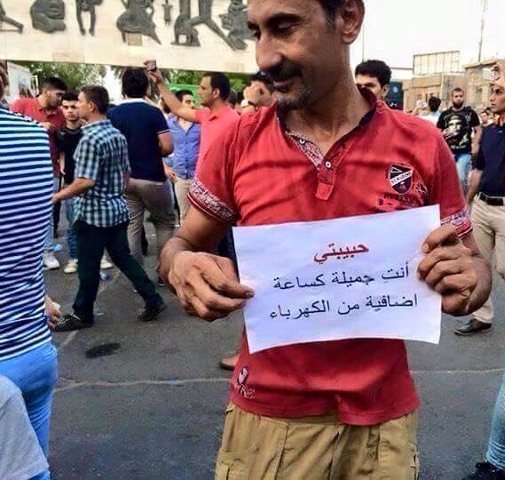

::::
:::

::: notes

- very unequal access to the means of digital production
- 
:::

## Access to power and the internet

::: columns
:::: column

<iframe src="https://data.worldbank.org/share/widget?indicators=EG.ELC.ACCS.ZS&view=map" width='500' height='500' frameBorder='0' scrolling="no" ></iframe>

::::
:::: column

<iframe src="https://data.worldbank.org/share/widget?indicators=IT.NET.BBND.P2&view=map" width='500' height='500' frameBorder='0' scrolling="no" ></iframe>

::::
:::

::: notes

- very unequal access to the means of digital production
- sustainable development goals (SDG) of the UN
- electricity
    + 800 mio have no access
        * almost exclusively in the global south
        * vast majority in subsaharan Africa
    + by 2030 according to projections of the International Energy Agency (IEA): 
        * 600 mio
        * 33 per cent of all Africans
    - access: 
        + 250--500 kWh per year and household
        + less than 14 hours of a 100W lightbulb per day
 - internet
        + 36,6 percent of the world population, or 2,93 billion people do not participate
        + 85 per cent of them live in Africa, South, East and South-East Asia
        + lower speed
        + higher latency
        + higher cost per unit of traffic

:::

## Destruction

::: columns-2
:::: column

### Syria

{#fig:archives-dam}

::::
:::: column

### Palestine

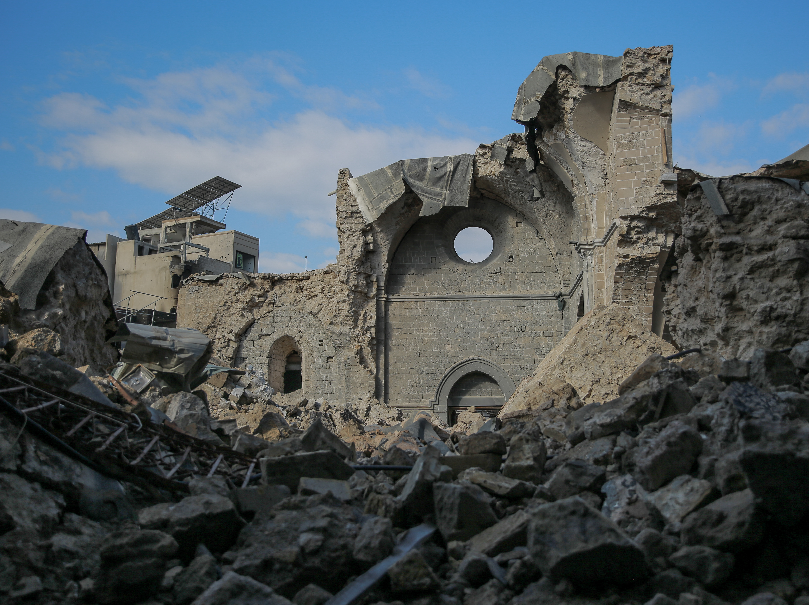{#fig:gaza-mosque}

::::
:::

::: columns
:::: column

### Lebanon

 damaged by the Beirut Port explosion on 4 August 2020. Source: OIB](../../assets/dh/2020-08-04-oib-damage.jpg){#fig:oib-explosion}

::::
:::: column

### Iraq

](https://upload.wikimedia.org/wikipedia/en/c/cf/Iraq_National_Library_Destroyed.jpg){#fig:inla}

::::
:::

::: notes

- Beirut: Port explosion on 4 Aug 2020
    + 2750t of ammonium nitrate
    + one of the largest non-nuclear explosions ever
- Damascus: Conflagration of the Dār al-Wathāʾiq al-Tārīkhiyya in Sūq Sārūjā on 16 July 2023
- Gaza: scholasticide and cultural genocide
    - Great ʿUmarī Mosque of , including its library, was destroyed by Israeli bombardment on 8. Dec 2023
        - part of the manuscript collection were digitised in [collaboration with Hmml](https://hmml.org/about/global-operations/gaza/) through an [EAP grant](https://eap.bl.uk/project/EAP1285) from 2020 onwards
        - This is not the first bombardment though: British naval bombardment destroyed the Mosquer in 1917 <https://commons.wikimedia.org/wiki/File:Gaza_Mosque_Nave.jpg>, <https://commons.wikimedia.org/wiki/File:A_general_view_of_the_ruins_of_the_Great_Mosque_at_Gaza,_c._1918.jpg> 
    - this part of Southafrica's case against Israel at the ICJ
:::

## Absences and exclusions

::: columns
:::: column

](../../assets/dh/map_dhcenters.png){#fig:dh-centres}

::::
:::: column

<!-- <iframe src="https://hcommons.social/@dh_potsdam/110696533309515172/embed" width="400" allowfullscreen="allowfullscreen" sandbox="allow-scripts allow-same-origin allow-popups allow-popups-to-escape-sandbox allow-forms"></iframe> -->

](../../assets/maps/map_dh2023.jpeg){#fig:map-dh2023}

::::
:::

::: notes

- these distributions illustrate the gaps shown before
- access to infrastructures of the digital is limited in the Arabic world
- support for Arabic is limited in the digital
- I should also show a map of migrations showing the massive exodus from the Arabic speaking regions of the world
    + significant brain drain contributes to these absences

:::

# Let's talk about Arabic!
## Arabic

::: columns
:::: column

### Script

- Second most important script after Latin
    + currently used by 14 languages: Arabic, Persian, Urdu, Pashto, Uzbek, Uighur ...

::::
:::: column

### Language

+ Fifth most important language
    * One of six official languages of the United Nations
    * Official language in 26 countries
    * \>420 million speakers
+ Lithurgical language of 1,6 billion Muslims

::::
:::

![Approximate distribution of Arabic script use along current national boundaries. Solid colours: contemporary primary script; vertical stripes: contemporary use as a secondary national script; horizontal stripes historical use [@Nemeth+2017, fig 1.1]](../../assets/maps/map_arabic-script-nemeth-fig_1-1-small.png){#fig:arabic-script}

## Arabic Script Grammar

::: columns
:::: column

+ Written from **right** to left (RTL)
+ Letters (*graphemes*)
    * mostly connected in direction of writing
    * letterform depends on position within the string (*allographs*): [ج جـ ـجـ ـج]{lang="ar"}
    * combination of basic letterforms (*archigraphemes*, Arab. *rasm*) and diacritic marks (*iʿjām*)
- diacritics 
    + reduce semantic ambiguity
    + subject to regional preferences and change of time 
- Vocalisation (*tashkīl*) is **optional** and changes the semantics 

::::
:::: column

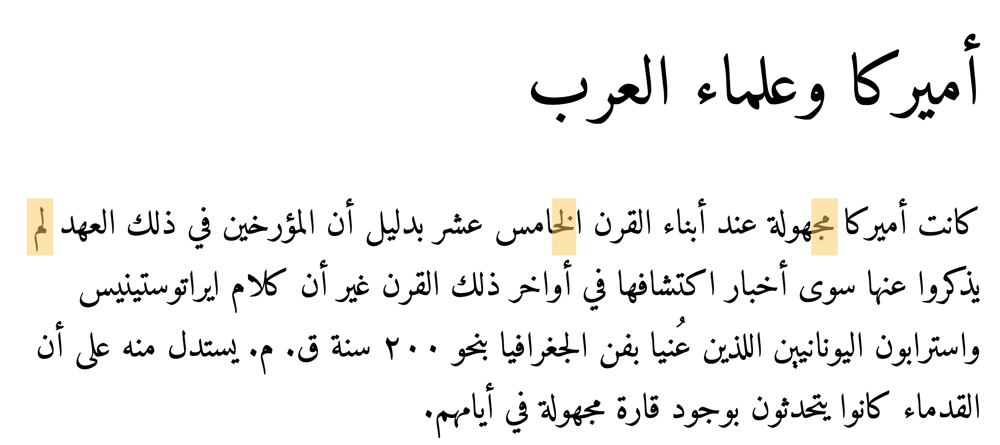{#fig:zakham-ar}

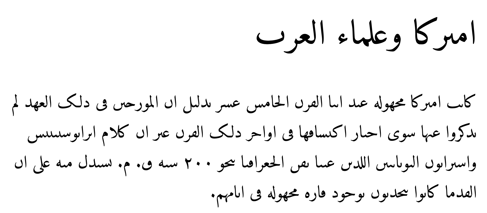{#fig:zakham-ar-rasm}

::::
:::

::: notes

- note: 
    + gaps within words
    + tilted base lines
    + ligatures
    + vertical overlap
- "*allograph*"  is Thomas Milo's terminology
- I am showing this in order to demonstrate the epistemic violence exercised by the paradigm of 
    + discrete letters, 
    + the Latin alphabet with its rather small number of letters, 
    + movable type printing
        * magazines become unfeasibly large
            - unwieldy
            - expensive: 
                + more material 
                + more machinery
                + more time for composing
- tilted baselines and vertical overlap of words makes things even more unwieldy
- 
:::

# multilinguality and *linguistic imperialism*
## multilinguality and *linguistic imperialism*

>Indigenous peoples have the right to revitalize, use, develop and transmit to future generations their histories, languages, oral traditions, philosophies, writing systems and literatures, and to designate and retain their own names for communities, places and persons.

<cite>[@UNDRIP2007, §13]<cite>

::: notes

The human condition, historically, is one of multilinguality. People speak different languages, dialects, sociolects etc. in different contexts: at home, at work, at social gatherings, for worship etc.. Sometimes we share a language with people across geographic distances, just as in this meeting, and sometimes, we do not understand our direct neighbours.

:::


>'Linguistic imperialism' is shorthand for a multitude of activities, ideologies, and structural relationships. Linguistic imperialism takes place within an overarching structure of asymmetrical North/ South relations, where language interlocks with other dimensions, cultural (particularly in education, science, and the media), economic and political

<cite>[@Phillipson1997RealitiesAndMyths, 239]</cite>

>The basis for the codes, languages, methodologies, and technical instruments of the digital humanities is English; the written and spoken language of all the main conferences, the most prestigious journals, the institutions that control the discipline, the organizations and international consortia, and the central authorities of knowledge is, with few exceptions, some dialect of British or American English.

<cite>[@Fiormonte2021Taxation, 334-335]</cite>

::: notes

- UNDRIP: United Nations Declaration on the Rights of Indigenous Peoples.
- this  ties back to the map I showed you at the very beginning

:::

## Technical affordances

![Arabic Linotype, 1910s. Source: [@Nemeth+2017, fig. 2.7]](../../assets/dh/arabic-linotype_nemeth-p_46.png){#fig:ar-linotype}

::: notes

- we talked about the situatedness of knowledge production and path dependencies
- Arabic script is much for challenging for mechanical reproduction than Latin script
- keyboard with 180 keys 
- two magazines  were required for a single Arabic fount

:::

## Encoding characters

[Unicode is awesome ...]{.c_left-align .keyphrase}

[... but many contemporary and historical human writing systems are not supported even in its latest iteration]{.c_center}

::: columns
:::: column

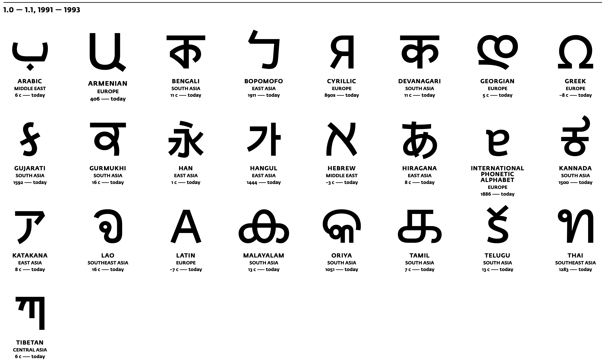{#fig:unicode-1}

::::
:::: column

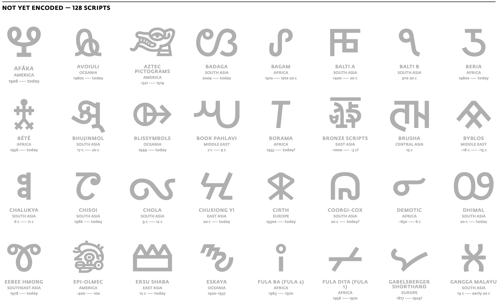{#fig:unicode-15-missing}

::::
:::


::: notes

- unicode can be traced back to the 1980s
- Unicode has become the dominant encoding standard in the 2000s
- almost universal support across operating systems has been driven by people's fondness of emojis
- Arabic has been part of Unicode since v 1.0.0
- linguisting imperialism
    + consortium: Adobe, Airbnb, Amazon, Apple, Yat, Google, ETCO, Meta, Microsoft, Netflix, SAP and Salesforce
    + character encoding is part of the history of a global hegemonic technology stack  bound up in historically contingent cultural traditions of the Global North. 
    + Mechanically and, later, electronically recording information in scripts other than Latin---particularly complex scripts with a much larger number of graphemes and different writing directions--- was never considered sufficiently important or profitable to be supported out-of-the-box.
    + Character encoding enforces Latin script grammar
        * unicode insufficiently distinguishes between languages and scripts
    + The standard is written in English
    + Current v 15:
        *  we know at least 300 writing systems
        *  127 are currently not encoded

:::

## Unicode is awesome ...

[... but standards depend on implementation and software support]{.c_center}

### Encoding nightmares

<!-- change this slide to show rendering issues ([@fig:arabic-fail-covid]) AND encoding issues -->

::: columns
:::: wide

![32 variants of encoding "Meccan" ([مكية]{lang="ar"}) [@Milo2014VisuallyMisleading, 4]](../../assets/dh/arabic-script_unicode-example-makkiyya-milo_4.png){#fig:arabic-mecca-1}

::::
:::: narrow

![In-browser search for "[مك]{lang="ar"}" in the Wikidata entry for "Mecca" ([Q5806](https://www.wikidata.org/wiki/Q5806))](../../assets/dh/arabic-script_unicode-example-wikidata_narrow.png){#fig:arabic-mecca-2 height="300px"}

::::
:::

::: notes

- unicode insufficiently distinguishes between languages and scripts
    + violating two of its principles
        * characters not glyphs
        * unification: no duplicates within a script
- yet, rendering depends on software support
    <!-- + see [@fig:arabic-fail-covid] -->


:::

## Unicode is awesome ...

[... but standards depend on implementation and software support]{.c_center}

### Rendering nightmares

::: columns
:::: wide

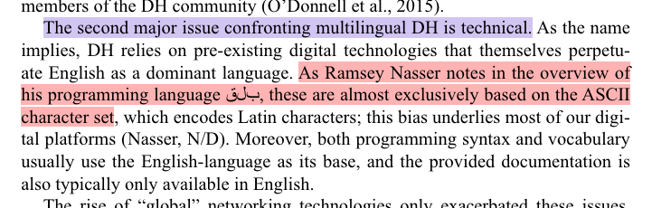{#fig:spence-arabic-fail}

<!-- <iframe src="https://fedihum.org/@jomla/112094232400811983/embed" width="400" allowfullscreen="allowfullscreen" sandbox="allow-scripts allow-same-origin allow-popups allow-popups-to-escape-sandbox allow-forms"></iframe> -->

::::
:::: narrow

This ought to be the **perfect example**:

>As Ramsey Nasser notes in the overview of his programming language [ب ل ق]{.c_rtl .red lang="ar"} [pre-existing digital techonologies] are almost exclusively based on the ASCII character set

<cite>[@IsasiEtAl2023ModelMultilingual, 19]</cite>

[ب ل ق]{.c_rtl .red lang="ar"} should have been  [قلب]{.c_rtl .green lang="ar"}

::::
:::

::: notes

- yet, rendering depends on software support
- example from a £130 book from a major publisher
    <!-- + see [@fig:arabic-fail-covid] -->


:::

## Unicode is awesome ...

<!-- [... but standards depend on implementation and software support]{.c_right} -->

[... did I mention industry consortia?]{.c_center}

>HTML elements all have names that only use ASCII alphanumerics [@HTMLLivingStandard2023, §13.1.2]

::: columns
:::: column

](../../assets/dh/arabic_failure-browser.png){#fig:zakham-ar-failure}

::::
:::: column

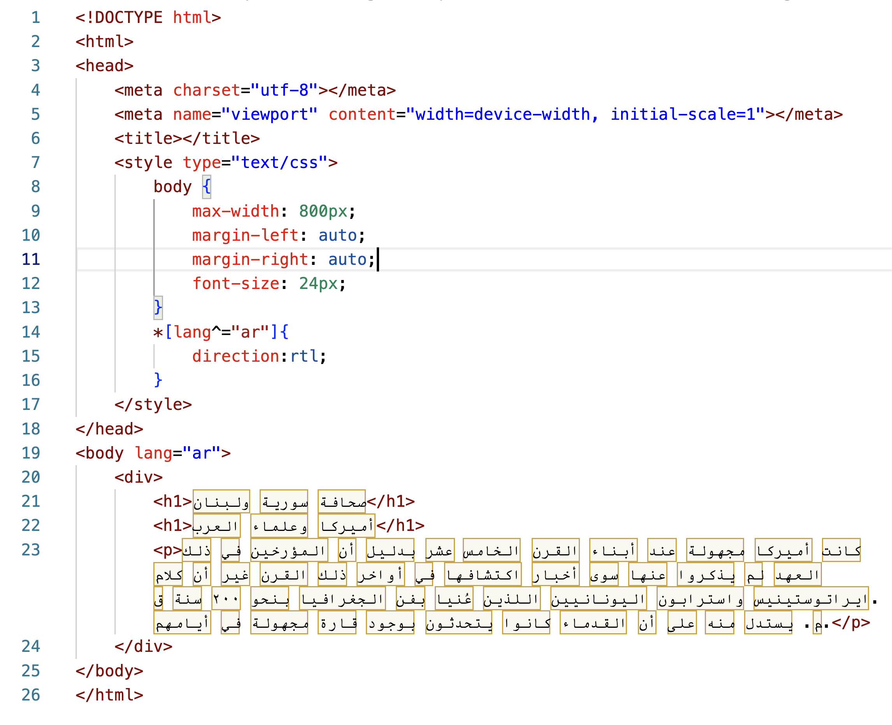{#fig:html}

::::
:::
::: notes

- Arabic has been part of Unicode since its inception
- yet, software support is a different question, as we have seen 
- HTML5 is a *living standard* maintained by yet another consortium Web Hypertext Application Technology Working Group (WHATWG) 
    + members are leading browser vendors such as Apple, Google, Microsoft and Mozilla
    + all but Mozilla are also members of the Unicode consortium
- `@lang` attribute not used by standard CSS
    + everyone has to add `*[lang="ar"] {direction:rtl;}`

:::


## Bidirectional texts

The mandatory XML declaration `<?xml version="1.0" encoding="UTF-8"?>` sets left-to-right as the base direction.

::: columns
:::: wide

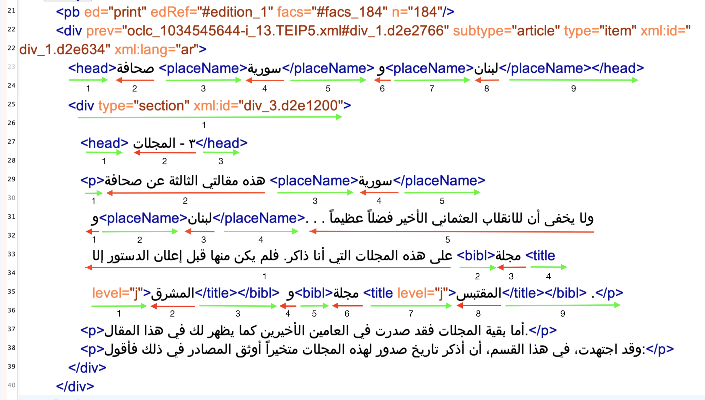{#fig:bidi-xml}

::::
:::: narrow

's  author mode. Styling relies on CSS.](../../assets/OpenArabicPE/oxygen_zuhur-author_small.png){#fig:zuhur-oxygen}

::::
:::
::: notes

- the Oxygen developers added support for Arabic in `@xml:lang` on our suggestion in 2015.
- but only for TEI/XML and not for all RTL languages.

:::

<!-- ## Transliteration, the undead solution of yore

Transliteration into Latin script served the need of colonial administrations and academics with the technological affordances of the time.


::: columns-3
:::: column

### Amīrkā wa ʿulamāʾ al-ʿArab

>Kānat Amīrkā majhūla ʿinda abnāʾ al-qarn al-khāmis ʿashr bi-dalīl an al-muʾarrikhīn fī dhalika al-ʿahd lam yadhkarū ʿanhā siwā akhbār iktishāfihā fī awākhir dhalika al-qarn.

<cite>Transliteration according to the *International Journal of Middle East Studies*</cite>


::::
:::: column

### Amīrkā wa ʿulamāʾ al-ʿarab

>Kānat Amīrkā ma[ǧ]{.red}hūla ʿinda abnāʾ al-qarn al-[ḫ]{.red}āmis ʿa[š]{.red}r bi-dalīl an al-muʾarri[ḫ]{.red}īn fī [ḏ]{.red}alika al-ʿahd lam ya[ḏ]{.red}karū ʿanhā siwā a[ḫ]{.red}bār ikti[š]{.red}āfihā fī awā[ḫ]{.red}ir [ḏ]{.red}alika al-qarn.

<cite>Transliteration according to the *Deutsche Morgenländische Gesellschaft*</cite>

::::
:::: column

### Amīrikā wa-ʻulamāʼ al-ʻArab

>Kānat Amīrikā majhūlah [ʻ]{.red}inda abnā[ʼ]{.red} al-qarn al-khāmis [ʻ]{.red}ashar bi-dalīl an al-mu[ʼ]{.red}arrikhīn fī dhālika al-[ʻ]{.red}ahd lam [ydhkrwā]{.red} [ʻ]{.red}anhā saw[á]{.red} Akhbār [aktshāfhā]{.red} fī awākhir dhālika al-qarn

<cite>Automated ALA-LC transcription into Latin script with the [romanize Arabic demo](http://romanize-arabic.camel-lab.com)</cite>

::::
:::

::: notes

- Depend on input and output **languages**
- Subject to traditions and taste
- Error prone

::: -->

## Transliteration, the undead solution of yore

Transliteration into Latin script served the need of colonial administrations and academics with the technological affordances of the time.

::: columns-3
:::: column

### [مرآة الشرق]{lang="ar"}

The Arabic title of a newspaper published by [بولس شحادة]{lang="ar"} in Jerusalem, 1919--38

### Meraat al-Sherk

The official transcription provided by the paper's masthead

::::
:::: column

* #192, 22 Nov. 1922, Jerusalem. Source: [EAP](https://eap.bl.uk/archive-file/EAP119-1-24-1).](https://images.eap.bl.uk/EAP119/EAP119_1_24_1/1.jp2/full/600,/0/gray.jpg){#fig:mirat-1}

::::
:::: column

### Mirʾāt al-Sharq

Following the system of the *International Journal of Middle East Studies* (IJMES)

### Mirʾāt aš-Šarq

Following the system of the *Deutsche Morgenländische Gesellschaft* (DMG)

### mrMp Alcrq

Buckwalter transliteration

::::
:::

::: notes

- *Mirʾāt al-Sharq* published by 
- transliteration
    + Depend on input and output **languages**
    - Subject to traditions and taste
    - Error prone
    - if 1:1 grapheme replacement is intended, it becomes unreadable for casual readers
- published by Būlus Shaḥāda in Jerusalem between 1919 and 1938 

:::

# Arabic textual heritage online
## The long tail of ASCII in discovery systems

[How do we search for [[مرآة الشرق]{lang="ar"}](https://www.wikidata.org/wiki/Q124971778)?]{.c_center}

::: columns-3
:::: column

- original Arabic: [مرآة الشرق]{lang="ar"}
- original Latin: Meraat al-Sherk
- IJMES: Mirʾāt al-Sharq
- DMG: Mirʾāt aš-Šarq
- Buckwalter: mrMp Alcrq

.](https://images.eap.bl.uk/EAP119/EAP119_1_24_1/1.jp2/full/600,/0/gray.jpg){#fig:mirat-2}

::::
:::: column

### failure

- Arabic script (data or interface)
- IJMES
- removing or substituting *hamza* and *ʿayn*: `mir'at sarq`

 for "mir'at sarq"](../../assets/jaraid/zdb_mirat-ar-Latn-hamza.png){#fig:zdb-hamza}
 

::::
:::: column

### success

- original Latin title
- DMG
- removing all diacritics and articles: `mirʾat sarq`

 for "Mirʾāt aš-Šarq"](../../assets/jaraid/zdb_mirat-ar-Latn-x-dmg.png){#fig:zdb-dmg}

::::
:::

::: notes

- catalogue could be searched in Arabic but the data is missing
- catalogues are historical artefacts
    + digitisation of catalogues: NOT re-cataloguing of original material
        * card catalogue
        * ASCII OPAC
        * automated transcription of the card catalogue
        * human cataloguers depend on the technology they have at hand, which means they might be unable to enter the correct string
        * errors perpetuate
- Latin input is mostly reduced to ASCII
    + Hamza and ʿAyn escape this algorithm on ZDB
- determined article is not automatically removed
- The choices are not transparently documented
- no software on-screen keyboards provided
- additional problems
    + catalogues are inherently local documents
    + aggregated, if at all, on a national level
    + frequently accessible only through Web interfaces and not APIs

:::

<!-- # Digitisation bias -->
## Collection bias

::: columns
:::: column

![Periodicals and their holding institutions ([Wikidata][rq:map-holdings])](../../assets/jaraid/map-data-set-periodical-holdings-med-na_mapped.png){#fig:holding-map}

::::
:::: column

|      periodicals       | --1918 |       | --1929 |               |
|  :-------------------  | ----:  | ----: | ----:  |     ----:     |
|       published        |  2054  |       |  3550  |               |
|     known holdings     |  540   |       |  775   |               |
|       % of total       |        | 26.29 |        | [21.83]{.red} |
|------------------------|--------|-------|--------|---------------|
| digitized              |    156 |       |    233 |               |
| % of total             |        |  7.59 |        | [6.56]{.red}  |
|------------------------|--------|-------|--------|---------------|
| multiple digitisations |     51 |       |     66 |               |
| % of total             |        |  2.48 |        | 1.86          |
| % of digitised         |        | 32.69 |        | [28.33]{.red} |

Table: Periodical holdings and digitization {#tbl:jaraid-holdings}

::::
:::

::: notes

- collection bias is more of a knowledge bias
- While the digitization quote of roughly 50% of titles in collections is surprisingly high, it must be kept in mind that we cannot resolve information on the extent of digitization. Even if only a single issue of hundreds published was digitized, the periodical title will be included in this count.
- 66 periodicals or 28,33% have been digitized by multiple institutions and 21 of this subset by three and more.

:::

## Digitisation bias
### mind the `<gap/>`!

|             | Arabic periodicals (1798--1918) | [WWI as mirrored by Hessian regional papers](https://hwk1.hebis.de) |
|-------------|---------------------------------|---------------------------------------------------------------------|
| community   | c. **420 mio.** Arabic speakers  | c. **6.2 mio.** inhabitants                                          |
| periodicals | 2054 newspapers and journals    | 125 newspapers                                                      |
| digitized   | [156]{.red} periodicals                 | [125]{.green} newspapers with more than 1.5 million pages                     |
| type        | mostly facsimiles               | facsimiles and full text                                            |
| access      | paywalls, geo-fencing           | open access                                                         |
| interface   | mostly foreign languages only   | local and foreign languages                                         |

Table: Comparison of digitized periodicals between the Global South and the Global North {#tbl:digitisation}


::: columns
:::: column

](../../assets/maps/lMBwUARaIVBp5EUfx5yp4onMAtfAQsgRevtxTopNl98.png.webp){#fig:map-arabic-dialects}

::::
:::: column

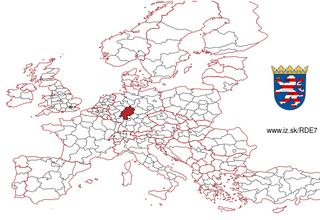{#fig:map-hesse}

::::
:::

::: notes

- price of digitisation is part of the equation
- infrastructures of knowledge creation 
- linguistic imperialism embodied in the technology stack

:::

## mind the `<gap/>`!
### Interfaces

 project (Bonn). Facsimile of Arabic original on the left. Yellow = English UI; purple = Arabic metadata in DMG transcription;  green = German metadata](../../assets/OpenArabicPE/translatio_interface-languages_annotated.png){#fig:translatio-interface}

## mind the `<gap/>`!
### copyright regimes, paywalls, and geo fencing

[cataloguing rules and algorithmic copyright detection cause further inaccessibilities]{.c_center}

::: columns
:::: column

 (Original in Princeton) outside the USA](../../assets/OpenArabicPE/hathi_muqtabas-1.png){#fig:hathi-muqtabas-global}

::::
:::: column

![The page from [@fig:hathi-muqtabas-global] with a US-IP](../../assets/OpenArabicPE/hathi_muqtabas-2.png){#fig:hathi-muqtabas-us}

::::
:::


::: notes

Beispiel: unklares Enddatum eines Erscheinungsverlaufs im 20. Jahrhundert wird korrekt als 19uu katalogisiert und dann Copyrightstatus sicherheitshalber als 1999 angenommen.

:::

## Quality of metadata

Bibliographic metadata is faulty throughout, mostly unstructured, and subject to *linguistic imperialism*

::: columns
:::: column

 as it appeared in 2019](https://openarabicpe.github.io/slides/assets/shamela_muqtabas-annotated.png){#fig:muqtabas-6-2-shamela-2}

::::
:::: column

](../../assets/OpenArabicPE/eap119-1-4-5-muqtabas-133_annotated.jpg){#fig:muqtabas-6-2-133-eap-2}

::::
:::

::: notes

- faulty on shadow libraries and official digitisation efforts
    - publication dates
        + inferred from vol. and issue number: 1 Ṣafar 1329 aH / c. 1 February 1911
        + EAP: March 1911
        + secondary sources: probably delayed by up to four months
    - volume and issue numbers
        + shamela: no.61
        + correct: vol. 6, no. 2
    - pagination:
        + shamela = 45, correct = 133
    - publication place
        + EAP lists Jerusalem
- linguistic imperialism
    + script
    + calendars

:::

## Quality of metadata

Bibliographic metadata is faulty throughout, mostly unstructured, and subject to *linguistic imperialism*

::: columns
:::: wide

*al-Quds* was "published twice a week every Tuesday and Friday" by [جرجي حبيب حنانيا]{lang="ar"} in Jerusalem from Friday, 18 September, 1908 onwards. The masthead records three calendars: Julian, Gregorian, Hijrī.

: the dateline states "Jerusalem, Friday, 5 and 18 September 1908, which corresponds to 22 Shaʾbān 1316 aH"](../../assets/jaraid/al-quds_nloi_annotated.png){#fig:al-quds-dateline}

::::
:::: narrow

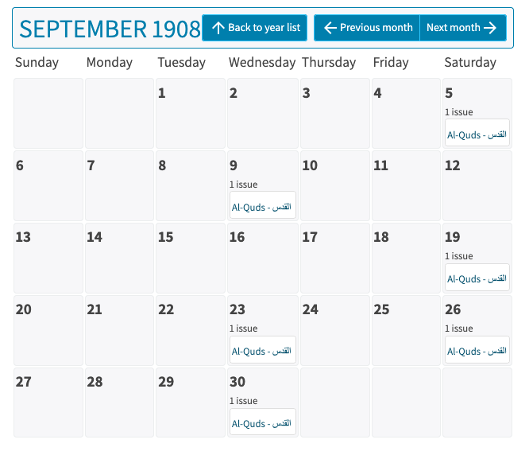{#fig:al-quds-nloi}

{#fig:al-quds-ips}

::::
:::

::: notes

- cataloguers are frequently unfamiliar with the cultural artefacts in front of them
- *al-Quds* was published on Wed and Fri, according to the mastheads, which provided the day of the week as well as Julian, Gregorian, and Hijrī dates
- both the NLoI and the Institute for Palestine Studies in Beirut, misread the Julian dates for Gregorian ones and then computed weekdays that do not match the ones recorded in the masthead

:::

## mind the `<gap/>`!
### Traditional OCR

>language [is] not currently OCRable.

<cite>Archive.org's item description for [@KurdAli+1923+GharaibAlGharba]</cite>

::: columns
:::: wide


| Font Type          | Sakhr (%)           | ABBYY (%)           | RDI(%)              | Tesseract (%)       |
| -----------------  | -------:            | --------:           | ------:             | -----------:        |
| Traditional Arabic | 48.54               | 67.66               | [**51.88**]{.green} | 47.04               |
| Tahoma             | 10.52               | 69.91               | 26.38               | 38.37               |
| Simplified Arabic  | 52.97               | 67.69               | 44.94               | 46.75               |
| M Unicode Sara     | 36.03               | 59.40               | 25.92               | 33.72               |
| Diwani letter      | [**18.13**]{.red}   | [**18.47**]{.red}   | [**18.13**]{.red}   | [**23.32**]{.red}   |
| DecoType Thuluth   | 36.12               | 37.71               | 24.26               | 32.48               |
| Deco'Type Naskh    | 48.88               | 50.22               | 41.63               | 40.92               |
| Arabic transparent | 51.56               | [**75.19**]{.green} | 46.00               | [**48.61**]{.green} |
| Andalus            | 28.07               | 37.53               | 21.68               | 25.34               |
| AdvertisingBold    | [**57.35**]{.green} | 70.26               | 27.20               | 39.39               |

Table: Evaluation of traditional OCR software for Arabic font types from [@Alghamdi.Teahan+2017+ExperimentalEvaluationArabic, table IV]. Values show percentage of correctly recognised characters {#tbl:ocr-ar-trad}

::::
:::: narrow

<!-- , quality of the OCR layer (requires US IP)](../../assets/OpenArabicPE/hathi_muqtabas-ocr-3.png) -->
, quality of the OCR layer](../../assets/OpenArabicPE/gpa_bashir-i_487-p_1_ocr.png){#fig:gpa-ocr}

::::
:::

::: notes

- technical problems
    + layout recognition
    + segmentation
    + text recognition
- what do you do if you have none of the resources mentioned in the toot
- problems with platform providers
    + Unstructured text, no APIs, propriertary interfaces
    + Algorithms and evaluation are kept secret
        *  unknown numbers of *false positives* and *false negatives*

:::


## machine-learning approaches to OCR

>For old prints, there's [...] kraken/calamari for coders, Transkribus if you've got money and just want to have the results[,] and OCR-D if you've got an IT department.

<cite>[@Winkler20230307OCR]</cite>

::: columns
:::: narrow

| training set     | *al-Ustādh*        | *al-Muqtabas*    |
| ---------------- | -----------------: | ---------------: |
| words            | 192829             | 11116            |
| lines            | 18732              | 1013             |
| epochs           | 200                | 200              |
| CER train        | 2.01               | 0.07             |
| CER validation   | [**2.09**]{.green} | [**8.40**]{.red} |

Table: Evaluation of my our Transkribus models {#tbl:ocr-ar-ml}

::::
:::: wide

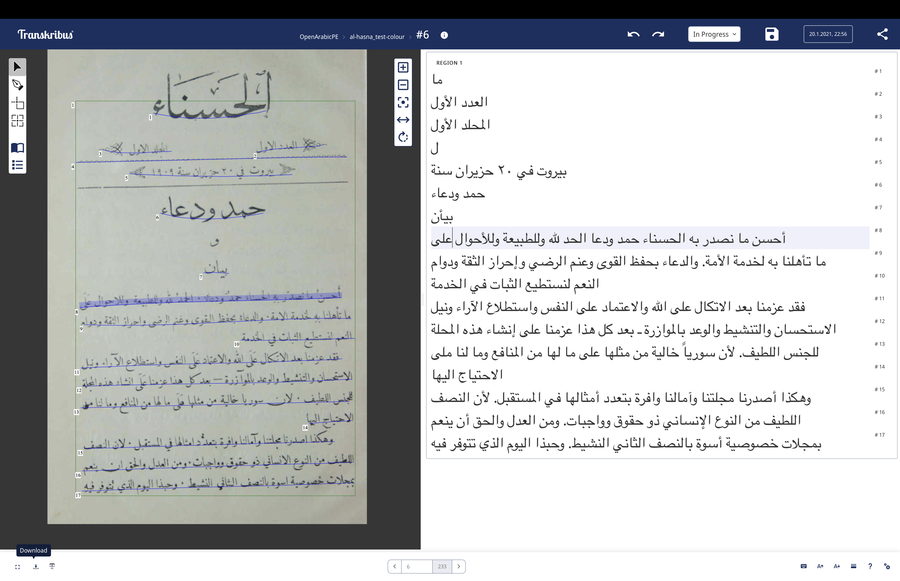{#fig:transkribus-web-app}

::::
:::

::: notes

- models were trained in late 2019 in collaboration with Sinai Rusinek
- results are great (layout recognition still lacking)
    + *al-Muqtabas* model suffers from over-fitting
    + digitised collections need to be re-processed (expensive)
- OpenITI
    + Mellon fund for model training to re-process Arabic-script material on HathiTrust

:::

# Our proposal: <br/>DIY, but not alone, and KISS!
## build the digital commons **we need** <br/>with what **we have** at hand

::: columns
:::: narrow

1. Do it yourself
    - but not alone
2. keep it simple
    - for the sake of the people and spaceship earth
3. there will be a future

::::
:::: wide

>Contemporary research instrumentation in our field, from natural language processing to network analysis, involves complex mechanisms. Their inner workings often lie beyond the full comprehension of the casual user. **To use such tools well, we must, in some real sense, understand them better than the tool makers**. At the very least, we should know them well enough to comprehend their biases and limitations. 

<cite>[@Tenen2016BluntInstrumentalism, 85]</cite>

>this implies learning how to produce, disseminate, and preserve digital scholarship ourselves, **without the help we can’t get**, even as we fight to build the infrastructures we need at the intersection of, with, and beyond institutional libraries and schools.

<cite>[@Gil+2016, 29]</cite>


::::
:::

# Implementation 1: <br/>Publishing metadata on Wikidata
## 1. Gather the data: [Project Jarāʾid](https://projectjaraid.github.io/) (2012--)

::: columns
:::: column

- Bibliographic record of **all** Arabic periodical titles published between 1798 and 1929
    - websites and open datasets ([TEI/XML][tei]) for more than 3500 periodicals
    - additional authority files for c.2700 persons, 220 places, 180 libraries
- Crowd-sourcing among scholars
- Networking and reconciling existing information: 
    - Integration of holding information from library catalogues such as ZDB, AUB, BnF, HathiTrust
    - Conversions from MARC, MODS, and HTML to 
    - Publish everything as Linked Open Data on [Wikidata](https://w.wiki/9UDd)

### Problems

- Sustainability of dataset and code
    - Unfunded collaboration with Adam Mestyan (Duke)
- Findability
- Usability of static, monolingual website
- Interoperability

::::
:::: column

```xml
<biblStruct source="https://projectjaraid.github.io oape:org:420" subtype="journal" type="periodical">
   <monogr>
      <title level="j" xml:lang="ar">الوقائع المصرية</title>
      <title level="j" source="https://projectjaraid.github.io" xml:lang="ota-Latn-x-ijmes">Veḳāʾiʿ-i Miṣriye</title>
      <title level="j" source="oape:org:420" xml:lang="ota-Latn-x-dmg">Weqāyi'-i miṣrīye</title>
      <title level="j" source="https://projectjaraid.github.io" xml:lang="ar-Latn-x-ijmes">al-Waqāʾiʿ al-Miṣriyya</title>
      <title level="j" source="https://projectjaraid.github.io" xml:lang="ota">وقايع مصرية</title>
      <title type="sub" xml:lang="ar">جريدة رسمية للحكومة المصرية</title>
      <idno type="OCLC">243469010</idno>
      <idno type="OCLC">299999503</idno>
      <!-- ... -->
      <idno type="oape">281</idno>
      <idno type="wiki">Q4703322</idno>
      <idno type="zdb">2457471-5</idno>
      <textLang mainLang="ar"/>
      <editor source="../../../../TEI/oclc_165855925/tei/oclc_165855925-v_3.TEIP5.xml#p_775.d2e5787">
         <persName ref="viaf:96964876 oape:pers:2863 wiki:Q981929" xml:lang="ar">
            <forename xml:lang="ar">رفاعة</forename>
            <surname xml:lang="ar">الطهطاوي</surname>
         </persName>
      </editor>
      <editor source="../../../../TEI/oclc_165855925/tei/oclc_165855925-v_3.TEIP5.xml#p_2236.d2e17318">
         <persName ref="oape:pers:3667 wiki:Q328734" xml:lang="ar">
            <forename>سعد</forename>
            <surname>زغلول</surname>
         </persName>
      </editor>
      <!-- ... -->
      <imprint>
         <date type="onset" when="1828-12-03"/>
         <pubPlace>
            <placeName ref="geon:1146359 jaraid:place:6 oape:place:468" xml:lang="ar">بولاق</placeName>
         </pubPlace>
         <!-- ... -->
      </imprint>
   </monogr>
</biblStruct>
```

::::
:::

## 2. Import data to Wikidata

::: columns-3
:::: column

### Wikidata

- community driven
    - integrated into larger knowledge environments
- FAIR knowledge graph
    - [CC][cc]0 license
- Open software stack
- multilingual

::::
:::: column

### Workflow

1. Create a data model (schema)
1. Import [TEI/XML][tei] in [OpenRefine](https://openrefine.org)
    - [XSL](https://github.com/OpenArabicPE/convert_tei-to-bibliographic-data/xslt/convert_tei-to-wikidata-import_file.xsl) for transforming [TEI/XML][tei]  to custom XML
2. Reconcile entities with [Wikidata][wd] items
4. Create new [Wikidata][wd] items for unreconciled entities
5. Link items and enrich with local data 

::::
:::: column

](../../assets/jaraid/wikidata_Q4703322.png){#fig:wikidata-Q4703322}

::::
:::

::: notes

- reconciliation:
    - suffers from the same problems as any other discovery system: string matching is insufficient
    - allows for complex queries
:::

## 3. Query Wikidata

::: columns-3
:::: column

![[Map of all periodicals, March 2024][rq:map-periodicals-all-2024-03-16-cluster]](../../assets/jaraid/wikidata-map_periodicals-all-2024-03-16_markercluster.png){#fig:map-periodicals-all-2024-03-cluster}

![[Map of all periodicals, Aug. 2024, after we added our data][rq:map-periodicals-all-2024-08-21-cluster]](../../assets/jaraid/wikidata-map_periodicals-all-2024-08-21_markercluster.png){#fig:map-periodicals-all-2024-08-cluster}

::::
:::: column

- Pros
    - Multilingual interface and dataset
    - Allows complex queries ([SPARQL][sparql], APIs)
- Cons 
    - Complex queries require knowledge of [SPARQL][sparql] (click on the links to the left and right)

::::
:::: column

![[Map of newspapers published in Palestine until 1930][rq:press-palestine]](../../assets/jaraid/wikidata-map_periodicals-palestine-1930_cropped.png){#fig:map-palestine-1930}

::::
:::

## 4. Archive data

[all dependencies will break eventually]{.keyphrase}

::: columns
:::: column

- Everyone can edit Wikidata
- WikiMedia will fold
- One might need to cite a specific version

::::
:::: column

- [SPARQL][sparql] and RESTful APIs to the rescue
    - save a copy local copy of the graph
- `bash` script as a wrapper
- deploy via [GitHub][github], [GitLab][gitlab] actions for periodic runs
- push periodic release to publicly-funded, open repository ([Zenodo][zenodo]) for long-term preservation [@Grallert2024jaraidData]
    + make sure to add [ORCID][orcid]s for all contributors
    + provides versioned [DOI][doi]s

::::
:::


# Implementation 2: <br/>Workflow for digital scholarly editions ([OpenArabicPE](https://openarabicpe.github.io), 2015--)
## 1. get the data

::: columns
:::: column

- facsimiles
    + link to existing facsimiles from [British Library's "Endangered Archives Programme" (EAP)](http://eap.bl.uk/), <!-- [HathiTrust](http://hathitrust.org/), --> [Translatio Bonn](https://digitale-sammlungen.ulb.uni-bonn.de/topic/view/3085779), [*Arshīf al-majallāt [...] al-ʿarabiyya*](http://archive.alsharekh.org/) etc., preferably through [IIIF](https://iiif.io/)
    + scan/ photograph your physical artefacts (at the lowest sustainable resolution)
- text
    + scrape existing transcriptions from [*shamela.ws*](http://shamela.ws/index.php/book/26523), et al.
    + use [Transkribus](https://transkribus.eu/), [eScripta](https://escripta.hypotheses.org)/[eScriptorium](https://www.https://escriptorium.fr/) for HTR (with our model trained on 1000+ pages from the OpenArabicPE corpus)


::::
:::: column

EPub (HTML) for *al-Zuhūr* 2(4) from shamela.ws

```html
<div dir="rtl" id="book-container">
    <hr/>
    <a id='C232'></a>
    <span class="title">صحافة سورية ولبنان</span><br /><span class="red">3 - </span>المجلات<br />هذه مقالتي الثالثة عن صحافة سورية ولبنان. . . ولا يخفى أن للانقلاب العثماني الأخير فضلاً عظيماً على هذه المجلات التي أنا ذاكر. فمل يكن منها قبل إعلان الدستور إلا مجلة المشرق ومجلة المقتبس.<br />أما بقية المجلات فقد صدرت في العامين الأخيرين كما يظهر لك في هذا المقال.<br />وقد اجتهدت، في هذا القسم، أن أذكر تاريخ صدور لهذه المجلات متخيراً أوثق المصادر في ذلك فأقول:<br />
</div>
```

OCR output from Transkribus for *al-Ḥasnāʾ* (PAGE XML)

```xml
<TextLine id="r1l5" custom="readingOrder {index:4;}">
    <Coords points="470,548 2191,527 1648,462 470,464"/>
    <Baseline points="480,542 565,540 650,537 735,534 820,533 905,531 990,530 1075,528 1160,528 1245,527 1330,527 1415,527 1500,527 1585,527 1670,528 1755,528 1840,530 1925,531 2010,531 2095,534 2180,536"/>
    <TextEquiv>
        <Unicode>من عسر سنوات مجلة بسائة في الاستارة اعتمد في تحريرها على أقلامهن فزيئها</Unicode>
    </TextEquiv>
</TextLine>
```
::::
:::

::: notes

- IIIF allows to set a very low quality to reduce bandwidth and traffic
- what do you need to know
    - HTML
    - XML
    - JSON: for IIIF
    - wget, cURL: for scraping

:::

## 2. model the data

Structure the text string into issues, sections, articles with bylines ...

::: columns
:::: column

- widely accepted standard for textual editions: [Text Encoding Initiative][tei] (TEI/XML)
    - active community
    - pre-requisite for grant funding
    - easy to archive (XML = plain text)
- re-use / adapt domain specific encoding schemas within the TEI
- try to script basic modelling using patterns in your source text:
    + regular expressions
    + XSLT, Python, R, whatever you are most comfortable with
- automatically model derivative bibliographic data: MODS, METS, BibTeX, ...

::::
:::: column

The same section of *al-Zuhūr* 2(4) modelled in TEI

```xml
<body xml:lang="ar">
<pb corresp="../epub/shamela_36534/OEBPS/xhtml/P744.xhtml" ed="shamela" n="n2-p184"/>
<pb ed="print" edRef="#edition_1" facs="#facs_184" n="184"/>
    <div prev="oclc_1034545644-i_13.TEIP5.xml#div_1.d2e2766" subtype="article" type="item" xml:id="div_1.d2e634">
        <head>صحافة <placeName>سورية</placeName> و<placeName>لبنان</placeName></head>
        <div type="section" xml:id="div_3.d2e1200">
            <head> ٣ - المجلات</head>
            <p>هذه مقالتي الثالثة عن صحافة سورية ولبنان. . . ولا يخفى أن للانقلاب العثماني الأخير فضلاً عظيماً على هذه المجلات التي أنا ذاكر. فلم يكن منها قبل إعلان الدستور إلا <bibl>مجلة <title level="j">المشرق</title></bibl>  و<bibl>مجلة <title level="j">المقتبس</title></bibl> .</p>
            <p>أما بقية المجلات فقد صدرت في العامين الأخيرين كما يظهر لك في هذا المقال.</p>
            <p>وقد اجتهدت، في هذا القسم، أن أذكر تاريخ صدور لهذه المجلات متخيراً أوثق المصادر في ذلك فأقول:</p>
        </div>
    </div>
</body>
```

::::
:::

::: notes

- why TEI?
    + I knew it already
    + widely adopted standard in the digital editing world
    + necessary for grant-funding in the Global North
- why not TEI
    + steep learning curve
    + not particularly well-suited to Arabic texts?

:::

## 3. edit the data

::: columns
:::: column

- make use of version control <!-- and stable IDs (e.g. [ORCID](https://orcid.org)) --> for **transparent authorship attribution** and **damage control**:
    + [.git](https://git-scm.com/) is open source and available for all OSs
- plain-text (including XML) editors
    + should be **syntax aware**
    - **RTL**: support in text editors is a mixed bag

](../../assets/OpenArabicPE/vscode_zuhur.png){#fig:zuhur-vscode}

<!-- ](../assets/sublime_zuhur.png) -->

<!-- ](../assets/textmate_zuhur.png) -->

::::
:::: column

- XML editors proper
    + should be **schema aware** to validate the encoding
    - **RTL**:
        1. [oXygen XML editor](https://www.oxygenxml.com/) (158 USD [2024]) allows to separate content and tags<!-- : [TextGrid Lab](https://textgrid.de/index) -->
        2. [Visual Studio Code](https://code.visualstudio.com/) (free) with the right extensions is a viable second

's  author mode. Styling relies on CSS.](../../assets/OpenArabicPE/oxygen_zuhur-author.png){#fig:zuhur-oxygen-1}

::::
:::

::: notes

- editing tools depend on modelling decisions and file formats

:::

## 4. save and share the data

::: columns
:::: column

- facsimiles: [Internet Archive][internetarchive] (supports [IIIF][iiif])
- working copy of everything else: distributed version control platforms ([GitHub][github], [GitLab][gitlab])
- longterm preservation: publicly-funded, open repository ([Zenodo][zenodo])
    + make sure to add [ORCID][orcid]s for all contributors
    + provides versioned [DOI][doi]s
- authority data (people, titles, etc.): [Wikidata][wd]
- provide suitable open licenses for re-use: [Creative Commons][cc], [MIT](), Public Domain (CC0)

::::
:::: column

](../../assets/OpenArabicPE/zenodo_zuhur.png){#fig:zuhur-zenodo}

::::
:::

## 5. present the data
<!-- ### presentation layers and access for human readers -->

::: columns
:::: column

- Hosting: [GitHub Pages](https://pages.github.com/) can expose your data repository to the web
- Generate static webviews
    + removes need for backend and minimises traffic
    + easy to archive
    - on the fly: XSLT1 ([TEI Boilerplate](http://dcl.slis.indiana.edu/teibp/)) or JS ([CETEICEan](https://github.com/TEIC/CETEIcean)) to render XML files in the client's web browser
    - pre-computed: [GitHub actions](https://github.com/features/actions) give access to virtual machines
- bibliographic database: [Zotero group](https://www.zotero.org/groups/openarabicpe/items/)
    + mitigates against the absent backend
    + **browse** and **search** independent of file structure
- full-text search across the entire corpus: [Google's programmable search engine](https://cse.google.com/cse?cx=012251040084107011117:jof1v_ejndo)

::::
:::: column


": details in mobile view](../../assets/OpenArabicPE/zotero-group_openarabicpe-mobile-details_small.png){#fig:zuhur-zotero}

](../../assets/OpenArabicPE/boilerplate_zuhur-v_2-i_4_small.png){#fig:zuhur-webview}

<!-- ": search in mobile view](../assets/zotero-group_openarabicpe-mobile-search.png) -->

::::
:::

## Resulting Corpus


| Title                                                                           | Place             | Proprietor                    | DOI                                                                | Volumes  | Issues  | Articles | Words   |
| ------------------------------------------------------------------------------- | ----------------- | ----------------------------- | ------------------------------------------------------------------ | -------: | ------: | -------: | ------: |
| [al-Ḥaqāʾiq](https://www.github.com/openarabicpe/journal_al-haqaiq)                | Damascus          | Abd al-Qādir al-Iskandarānī   | [10.5281/zenodo.1232016](https://doi.org/10.5281/zenodo.1232016)   | 3        | 35      | 389      | 298090  |
| [al-Ḥasnāʾ](https://www.github.com/openarabicpe/journal_al-hasna)               | Beirut            | Niqūlā Bāz                    | [10.5281/zenodo.3556246](https://doi.org/10.5281/zenodo.3556246)   | 1        | 12      | 201      | NA      |
| [al-Manār](https://www.github.com/openarabicpe/journal_al-manar)                | Cairo             | Muḥammad Rashīd Riḍā          |                                                                    | 35       | 537     | 4300     | 6144593 |
| [al-Muqtabas](https://www.github.com/openarabicpe/journal_al-muqtabas)             | Cairo, Damascus   | Muḥammad Kurd ʿAlī            | [10.5281/zenodo.597319](https://doi.org/10.5281/zenodo.597319)     | 9        | 96      | 2964     | 1981081 |
| [al-Ustādh](https://www.github.com/openarabicpe/journal_al-ustadh)              | Cairo             | Abdallāh Nadīm al-Idrīsī      | [10.5281/zenodo.3581028](https://doi.org/10.5281/zenodo.3581028)   | 1        | 42      | 435      | 221447  |
| [al-Zuhūr](https://www.github.com/openarabicpe/journal_al-zuhur)                | Cairo             | Anṭūn al-Jumayyil             | [10.5281/zenodo.3580606](https://doi.org/10.5281/zenodo.3580606)   | 4        | 39      | 436      | 292333  |
| [Lughat al-ʿArab](https://www.github.com/openarabicpe/journal_lughat-al-arab)   | Baghdad           | Anastās Mārī al-Karmalī       | [10.5281/zenodo.3514384](https://doi.org/10.5281/zenodo.3514384)   | 3        | 34      | 939      | 373832  |
| **total**                                                                       |                   |                               |                                                                    | 56       | 795     | 9664     | 9311376 |


::: columns
:::: column

- TEI/XML files for each issue with structural mark-up on the article level
- mark-up of named entities in bylines


::::
:::: column

- authority files (TEI/XML)
- bibliographic metadata on the article level (MODS/XML, Zotero RDF, BibTeX)

::::
:::

## Final warning
### All dependencies will eventually break and need repair

::: columns
:::: column

- Reliance on external data providers: link rot
    - links to facsimiles broke twice in four years
- Reliance on free tools and services: link rot
    + URLs to our editions had to be changed once
- XSLT1 in web browsers: will fall victim to JSON and security features
    + over the last 5 years support has markedly decreased
<!-- - Full-text search across issues and periodicals without a backend
    + [Google's programmable search engines](https://cse.google.com/cse?cx=012251040084107011117:jof1v_ejndo): requires internet connection (and Google account!) -->

::::
:::: column

{#fig:components}

::::
:::


::: notes

Bootstrapping relies on the work of others


:::

# Thank you
## Thank you!

::: columns
:::: column

- Contributors to [OpenArabicPE](https://openarabicpe.github.io/): Jasper Bernhofer, Dimitar Dragnev, Patrick Funk, Talha Güzel, Hans Magne Jaatun, Daniel Kolland, Jakob Koppermann, Xaver Kretzschmar, Daniel Lloyd, Klara Mayer, Tobias Sick, Manzi Tanna-Händel, and Layla Youssef
- Contributors to [Project Jarāʾid](https://projectjaraid.github.io/): Hala Auji, Philippe Chevrant, Marina Demetriadou, Lamia Eid, Stacy Fahrenthold, Ulrike Freitag, Till Grallert, Rana Issa, Nicole Khayat, Peter Magierski, Leyla von Mende, Adam Mestyan, Christian Meier, Daniel Newman, Geoffrey Roper, Sinai Rusinek, Philip Sadgrove, Ola Seif, and Rogier Visser

::::
:::: column

+ Slides: [tillgrallert.eu/slides/de/2025-mpiw/](http://tillgrallert.eu/slides/dh/2025-mpiw/index.html)
+ Project blog: [openarabicpe.github.io](https://openarabicpe.github.io)
+ Papers: <http://digitalhumanities.org/dhq/vol/16/2/000593/000593.html>, <https://doi.org/10/gkhrjr>
+ Mastodon: [\@tillgrallert\@digitalcourage.social](https://digitalcourage.social/@tillgrallert)
+ Email: <till.grallert@hu-berlin.de>, <till.grallert@fu-berlin.de>
+ ADHO SIG multilingual DH: [multilingualdh.org](https://multilingualdh.org/)
+ DHd AG multilingual DH: [ag.multilingualdh.de](http://ag.multilingualdh.de)

::::
:::


## References {#refs}

[cc]: https://creativecommons.org/
[doi]: https://doi.org/
[github]: https://github.com/
[gitlab]: https://about.gitlab.com/
[iiif]: https://iiif.io/
[internetarchive]: https://archive.org
[orcid]: https://orcid.org
[sparql]: https://www.w3.org/TR/sparql11-query/
[tei]: https://tei-c.org/
[wd]: https://wikidata.org/
[zenodo]: https://zenodo.org/

<!-- maps -->
[rq:press-palestine]: https://query-main.wikidata.org/embed.html#%23title%3A%20الصحافة%20في%20فلسطين%20حتى%20سنة%20١٩٣%D9%A0%0A%23title%3A%0A%23defaultView%3AMap%7B%22hide%22%3A%5B%22%3Fcoords%22%2C%20%22%3FpubPlace%22%2C%20%22lang%22%5D%2C%20%22markercluster%22%3A%20%22true%22%7D%0ASELECT%20DISTINCT%0A%20%20%3Fcoords%0A%20%20%28URI%28%20CONCAT%20%28%22https%3A%2F%2Freasonator.toolforge.org%2F%3F%26q%3D%22%2C%20STRAFTER%28STR%28%3Fperiodical%29%2C%20STR%28wd%3A%29%20%29%29%29%20as%20%3Fitem%29%20%23%20link%20to%20item%20on%20Reasonator%0A%20%20%23%20%28URI%28str%28%3Fperiodical%29%29%20as%20%3Fitem%29%20%23%20link%20to%20the%20wikidata%20item%0A%20%20%28CONCAT%28%3FperiodicalLabel%2C%20%22%3A%20%22%2C%20%3FperiodicalDesc%29%20as%20%3FitemLabel%29%20%23%20construct%20a%20label%20for%20the%20item%0AWITH%20%7B%0A%20%20SELECT%20DISTINCT%0A%20%20%20%20%3Fperiodical%20%3FpubPlace%20%3FdateOnset%20%3Flang%0A%20%20WHERE%20%7B%0A%20%20%20%20VALUES%20%3FdateOfInterest%20%7B%221930-01-01%22%5E%5Exsd%3AdateTime%7D.%0A%20%20%20%20%3Fperiodical%20wdt%3AP31%2Fwdt%3AP279%2a%20wd%3AQ1002697%3B%0A%20%20%20%20%20%20%20%20%20%20%20%20%20%20%28wdt%3AP571%20%7C%20wdt%3AP580%29%20%3FdateOnset.%0A%20%20%20%20FILTER%28%3FdateOnset%20%3C%20%3FdateOfInterest%29.%20%20%20%20%20%20%20%20%20%20%20%20%20%20%20%20%20%20%20%23%20published%20before%20a%20specific%20date%0A%20%20%20%20%3Fperiodical%20%28wdt%3AP291%20%7C%20wdt%3AP276%20%7C%20wdt%3AP495%20%7C%20wdt%3AP131%29%20%3FpubPlace.%20%23%20locations%0A%20%20%7D%0A%20%20LIMIT%2040000%0A%7D%20as%20%25periodicals%0AWITH%20%7B%0A%20%20SELECT%20DISTINCT%0A%20%20%20%20%3Fcoords%20%3Fperiodical%20%3FpubPlace%20%3FdateOnset%20%3Flang%0A%20%20WHERE%20%7B%0A%20%20%20%20INCLUDE%20%25periodicals%0A%20%20%20%20%23%20query%20for%20values%20within%20a%20bounding%20box%0A%20%20%20%20SERVICE%20wikibase%3Abox%20%7B%0A%20%20%20%20%20%20%3FpubPlace%20wdt%3AP625%20%3Fcoords.%20%23%20get%20coordinates%20of%20locations%0A%20%20%20%20%20%20%23%20limit%20bounding%20box%20by%20Western%20and%20Eastern%20corners%3A%20Palestine%0A%20%20%20%20%20%20%20%20bd%3AserviceParam%20wikibase%3AcornerSouthWest%20%22Point%2834.11074%2031.2163%29%22%5E%5Egeo%3AwktLiteral.%0A%20%20%20%20%20%20%20%20bd%3AserviceParam%20wikibase%3AcornerNorthEast%20%22Point%2835.97328%2033.34235%29%22%5E%5Egeo%3AwktLiteral.%0A%20%20%20%20%20%7D%0A%20%20%7D%0A%7D%20as%20%25area%0AWHERE%20%7B%0A%20%20%20%20INCLUDE%20%25area%0A%20%20%20%20%23%20get%20labels%20and%20descriptions%0A%20%20%20%20SERVICE%20wikibase%3Alabel%20%7B%0A%20%20%20%20%20%20%20%20bd%3AserviceParam%20wikibase%3Alanguage%20%22ar%2C%20%5BAUTO_LANGUAGE%5D%22.%0A%20%20%20%20%20%20%20%20%3Fperiodical%20rdfs%3Alabel%20%3FperiodicalLabel%3B%0A%20%20%20%20%20%20%20%20%20%20%20%20schema%3Adescription%20%3FperiodicalDesc.%0A%20%20%20%20%7D%0A%7D%0AORDER%20BY%20%3FdateOnset%0ALIMIT%20300

[rq:press-bilad-sham-1910-holdings]: https://query.wikidata.org/embed.html#%23title%3A%20Periodicals%20published%20within%20a%20certain%20area%20at%20a%20given%20point%20in%20time%20and%20with%20known%20holdings%0A%23defaultView%3AMap%7B%22hide%22%3A%5B%22%3Fcoords%22%2C%20%22%3FpubPlace%22%5D%7D%0ASELECT%20DISTINCT%0A%20%20%3Fcoords%0A%20%20%28URI%28%20CONCAT%20%28%22https%3A%2F%2Freasonator.toolforge.org%2F%3F%26q%3D%22%2C%20STRAFTER%28STR%28%3Fperiodical%29%2C%20STR%28wd%3A%29%20%29%29%29%20as%20%3Fitem%29%20%23%20link%20to%20item%20on%20Reasonator%0A%20%20%23%20%28URI%28str%28%3Fperiodical%29%29%20as%20%3Fitem%29%20%23%20link%20to%20the%20wikidata%20item%0A%20%20%28CONCAT%28%3FperiodicalLabel%2C%20%22%3A%20%22%2C%20%3FperiodicalDesc%29%20as%20%3FitemLabel%29%20%23%20construct%20a%20label%20for%20the%20item%0A%23%20all%20periodicals%20before%20the%20date%20of%20interest%0AWITH%20%7B%0A%20%20SELECT%20DISTINCT%0A%20%20%20%20%3Fperiodical%20%3FpubPlace%20%3FdateOfInterest%20%3FdateOnset%0A%20%20WHERE%20%7B%0A%20%20%20%20VALUES%20%3FdateOfInterest%20%7B%221910-06-01%22%5E%5Exsd%3AdateTime%7D.%20%20%20%23%20set%20a%20date%20of%20interest%0A%20%20%20%20%3Fperiodical%20wdt%3AP31%2Fwdt%3AP279%2a%20wd%3AQ11032%3B%20%20%20%20%20%20%20%20%20%20%20%20%20%20%20%23%20newspapers%0A%20%20%20%20%20%20%20%20%20%20%20%20%20%20%28wdt%3AP571%20%7C%20wdt%3AP580%29%20%3FdateOnset.%20%0A%20%20%20FILTER%28%3FdateOnset%20%3C%20%3FdateOfInterest%29.%20%20%20%20%20%20%20%20%20%20%20%20%20%20%20%20%20%20%20%23%20limit%20to%20titles%20published%20before%20a%20specific%20date%0A%20%20%20%3Fperiodical%20%28wdt%3AP291%20%7C%20wdt%3AP276%20%7C%20wdt%3AP495%29%20%3FpubPlace.%20%23%20retrieve%20more%20properties%3A%20locations%0A%20%20%7D%0A%20%20LIMIT%2050000%0A%7D%20AS%20%25periodicals%0A%23%20items%20within%20a%20bounding%20box%0AWITH%20%7B%0A%20%20SELECT%20DISTINCT%0A%20%20%20%20%3Fcoords%20%3Fperiodical%20%3FpubPlace%20%3FdateOnset%0A%20%20WHERE%20%7B%0A%20%20%20%20INCLUDE%20%25periodicals%0A%20%20%20%20SERVICE%20wikibase%3Abox%20%7B%0A%20%20%20%20%20%20%3FpubPlace%20wdt%3AP625%20%3Fcoords.%20%23%20get%20coordinates%0A%20%20%20%20%20%20%23%20limit%20Western%20and%20Eastern%20corners%3A%20Levant%0A%20%20%20%20%20%20%20%20bd%3AserviceParam%20wikibase%3AcornerSouthWest%20%22Point%2832.11074%2031.2163%29%22%5E%5Egeo%3AwktLiteral.%20%20%23%20SW%0A%20%20%20%20%20%20%20%20bd%3AserviceParam%20wikibase%3AcornerNorthEast%20%22Point%2837.97328%2037.34235%29%22%5E%5Egeo%3AwktLiteral.%20%23%20NE%0A%20%20%20%20%20%7D%0A%20%20%7D%0A%7D%20as%20%25area%0A%23%20items%20in%20holdings%0AWITH%20%7B%0A%20%20SELECT%20DISTINCT%0A%20%20%20%3Fcoords%20%3Fperiodical%20%3FpubPlace%20%3FdateOnset%0A%20%20%20%3FcatalogueId%20%3Fcollection%0A%20%20WHERE%20%7B%0A%20%20%20%20INCLUDE%20%25area%0A%20%20%20%20%23%20holdings%3A%20P1042%3DZDB%2C%20P243%3DOCLC%2C%20P1844%3DHathi%2C%20P6721%3DKOBV%0A%20%20%20%20%7B%3Fperiodical%20%28wdt%3AP1042%20%7C%20wdt%3AP243%20%7C%20wdt%3AP1844%20%7C%20wdt%3AP6721%29%20%3FcatalogueId.%7D%0A%20%20%20%20UNION%0A%20%20%20%20%7B%3Fperiodical%20wdt%3AP195%20%3Fcollection%7D%0A%20%20%7D%0A%7D%20as%20%25holdings%0AWHERE%20%7B%0A%20%20%20%20INCLUDE%20%25holdings%0A%20%20%20%20%23%20exclude%20discontinued%20papers%0A%20%20%20%20OPTIONAL%7B%20%3Fperiodical%20%28wdt%3AP582%29%20%3FdateTerminus.%7D%20%0A%20%20%20%20FILTER%28%21bound%28%3FdateTerminus%29%20%7C%7C%20%3FdateTerminus%20%3E%20%3FdateOfInterest%29.%0A%20%20%20%20%23%20get%20labels%20and%20descriptions%0A%20%20%20%20SERVICE%20wikibase%3Alabel%20%7B%0A%20%20%20%20%20%20%20%20bd%3AserviceParam%20wikibase%3Alanguage%20%22ar%2C%20%5BAUTO_LANGUAGE%5D%22.%0A%20%20%20%20%20%20%20%20%3Fperiodical%20rdfs%3Alabel%20%3FperiodicalLabel%3B%0A%20%20%20%20%20%20%20%20%20%20%20%20schema%3Adescription%20%3FperiodicalDesc.%0A%20%20%20%20%7D%0A%7D%0AORDER%20BY%20%3FdateOnset%20%3FperiodicalLabel

[rq:map-periodicals-all-2024-03-16-cluster]: https://query.wikidata.org/embed.html#%23title%3A%20The%20global%20periodical%20press%20until%201930%20%28items%20present%20before%20March%202024%29%0A%23defaultView%3AMap%7B%22hide%22%3A%5B%22%3Fcoords%22%5D%2C%20%22markercluster%22%3A%22true%22%7D%0ASELECT%20DISTINCT%0A%20%20%3Fcoords%0A%20%20%28URI%28str%28%3Fperiodical%29%29%20as%20%3Fitem%29%20%23%20link%20to%20wikidata%20item%0A%20%20%28CONCAT%28%3FperiodicalLabel%2C%20%22%3A%20%22%2C%20%3FperiodicalDesc%29%20as%20%3FitemLabel%29%20%23%20label%20for%20the%20item%0AWITH%20%7B%0A%20%20SELECT%20DISTINCT%0A%20%20%20%20%3Fperiodical%20%3FdateOnset%0A%20%20WHERE%20%7B%0A%20%20%20%20%3Fperiodical%20wdt%3AP31%2Fwdt%3AP279%2a%20wd%3AQ1002697%3B%0A%20%20%20%20%20%20%20%20%20%20%20%20%20%20%20%28wdt%3AP571%20%7C%20wdt%3AP580%29%20%3FdateOnset.%0A%20%20%20%20FILTER%28%20YEAR%28%3FdateOnset%29%20%3C%201930%29.%0A%20%20%20%20%7D%0A%20%20LIMIT%2040000%0A%20%20%7D%20as%20%25periodicals%0AWITH%20%7B%0A%20%20SELECT%20DISTINCT%0A%20%20%20%20%3Fperiodical%20%3FdateOnset%0A%20%20WHERE%7B%0A%20%20%20%20INCLUDE%20%25periodicals%0A%20%20%20%20%3Fperiodical%20schema%3AdateModified%20%3Fmodified.%0A%20%20%20%20FILTER%28%3Fmodified%20%3C%3D%20%222024-03-16%22%5E%5Exsd%3AdateTime%29.%0A%20%20%20%20%7D%0A%20%20%7D%20as%20%25lastWeek%0AWHERE%20%7B%0A%20%20%20%20INCLUDE%20%25lastWeek%0A%20%20%20%20OPTIONAL%20%7B%0A%20%20%20%20%20%20%3Fperiodical%20%28wdt%3AP291%20%7C%20wdt%3AP276%20%7C%20wdt%3AP495%29%20%3FpubPlace.%0A%20%20%20%20%20%20%3FpubPlace%20wdt%3AP625%20%3Fcoords.%7D%0A%20%20%20%20SERVICE%20wikibase%3Alabel%20%7B%0A%20%20%20%20%20%20%20%20bd%3AserviceParam%20wikibase%3Alanguage%20%22%5BAUTO_LANGUAGE%5D%22.%0A%20%20%20%20%20%20%20%20%3Fperiodical%20rdfs%3Alabel%20%3FperiodicalLabel%3B%0A%20%20%20%20%20%20%20%20%20%20%20%20schema%3Adescription%20%3FperiodicalDesc.%0A%20%20%20%20%7D%0A%7D%0AORDER%20BY%20%3FdateOnset

[rq:map-periodicals-all-2024-08-21-cluster]: https://query.wikidata.org/embed.html#%23title%3A%20The%20global%20periodical%20press%20until%201930%20%28items%20present%20on%2021%20August%202024%29%0A%23defaultView%3AMap%7B%22hide%22%3A%5B%22%3Fcoords%22%5D%2C%20%22markercluster%22%3A%22true%22%7D%0ASELECT%20DISTINCT%0A%20%20%3Fcoords%0A%20%20%28URI%28str%28%3Fperiodical%29%29%20as%20%3Fitem%29%20%23%20link%20to%20wikidata%20item%0A%20%20%28CONCAT%28%3FperiodicalLabel%2C%20%22%3A%20%22%2C%20%3FperiodicalDesc%29%20as%20%3FitemLabel%29%20%23%20label%20for%20the%20item%0AWITH%20%7B%0A%20%20SELECT%20DISTINCT%0A%20%20%20%20%3Fperiodical%20%3FdateOnset%0A%20%20WHERE%20%7B%0A%20%20%20%20%3Fperiodical%20wdt%3AP31%2Fwdt%3AP279%2a%20wd%3AQ1002697%3B%0A%20%20%20%20%20%20%20%20%20%20%20%20%20%20%20%28wdt%3AP571%20%7C%20wdt%3AP580%29%20%3FdateOnset.%0A%20%20%20%20FILTER%28%20YEAR%28%3FdateOnset%29%20%3C%201930%29.%0A%20%20%20%20%7D%0A%20%20LIMIT%2040000%0A%20%20%7D%20as%20%25periodicals%0AWITH%20%7B%0A%20%20SELECT%20DISTINCT%0A%20%20%20%20%3Fperiodical%20%3FdateOnset%0A%20%20WHERE%7B%0A%20%20%20%20INCLUDE%20%25periodicals%0A%20%20%20%20%3Fperiodical%20schema%3AdateModified%20%3Fmodified.%0A%20%20%20%20FILTER%28%3Fmodified%20%3C%3D%20%222024-08-21%22%5E%5Exsd%3AdateTime%29.%0A%20%20%20%20%7D%0A%20%20%7D%20as%20%25lastWeek%0AWHERE%20%7B%0A%20%20%20%20INCLUDE%20%25lastWeek%0A%20%20%20%20OPTIONAL%20%7B%0A%20%20%20%20%20%20%3Fperiodical%20%28wdt%3AP291%20%7C%20wdt%3AP276%20%7C%20wdt%3AP495%29%20%3FpubPlace.%0A%20%20%20%20%20%20%3FpubPlace%20wdt%3AP625%20%3Fcoords.%7D%0A%20%20%20%20SERVICE%20wikibase%3Alabel%20%7B%0A%20%20%20%20%20%20%20%20bd%3AserviceParam%20wikibase%3Alanguage%20%22%5BAUTO_LANGUAGE%5D%22.%0A%20%20%20%20%20%20%20%20%3Fperiodical%20rdfs%3Alabel%20%3FperiodicalLabel%3B%0A%20%20%20%20%20%20%20%20%20%20%20%20schema%3Adescription%20%3FperiodicalDesc.%0A%20%20%20%20%7D%0A%7D%0AORDER%20BY%20%3FdateOnset

[rq:map-holdings]: https://query-main.wikidata.org/embed.html#%23title%3AHoldings%20of%20Arabic%20periodicals%0A%23defaultView%3AMap%7B%22hide%22%3A%5B%22%3Fcoords%22%5D%2C%20%22markercluster%22%3A%22true%22%7D%0APREFIX%20medium%3A%20%3Chttp%3A%2F%2Fwww.wikidata.org%2Fentity%2FQ1002697%3E%20%20%20%20%23%20set%20a%20publication%20type%3A%20periodicals%20%28wd%3AQ1002697%29%2C%20newspapers%20%28wd%3AQ11032%29%0ASELECT%20DISTINCT%0A%20%20%28URI%28str%28%3Fperiodical%29%29%20as%20%3Fitem%29%20%23%20link%20to%20the%20wikidata%20item%0A%20%20%28CONCAT%28%3FperiodicalLabel%2C%20%22%3A%20%22%2C%20%3FperiodicalDesc%29%20as%20%3FitemLabel%29%20%23%20construct%20a%20label%20for%20the%20item%0A%20%20%3Fcoords%0A%20%20%3Fcollection%20%3FcollectionLabel%0AWITH%20%7B%0A%20%20SELECT%20DISTINCT%0A%20%20%20%20%3Fperiodical%20%3FdateOnset%0A%20%20WHERE%20%7B%0A%20%20%20%20VALUES%20%3FdateOfInterest%20%7B%221930-01-01%22%5E%5Exsd%3AdateTime%7D.%20%23%20set%20a%20date%20of%20interest%0A%20%20%20%20%3Fperiodical%20wdt%3AP31%2Fwdt%3AP279%2a%20medium%3A%20%3B%20%20%20%20%20%20%20%20%20%20%20%20%20%20%23%20limit%20to%20medium%0A%20%20%20%20%20%20%20%20%20%20%20%20%20%20%28wdt%3AP571%20%7C%20wdt%3AP580%29%20%3FdateOnset.%0A%20%20%20%20%3Fperiodical%20wdt%3AP407%2Fwdt%3AP279%2a%20wd%3AQ13955.%20%20%20%20%20%20%20%20%20%20%20%20%23%20limit%20by%20publication%20language%20%28Arabic%20%3D%20Q13955%29%0A%20%20%20%20FILTER%28%3FdateOnset%20%3C%20%3FdateOfInterest%29.%20%20%20%20%20%20%20%20%20%20%20%20%20%20%20%20%23%20published%20before%20a%20specific%20date%0A%20%20%7D%0A%20%20ORDER%20BY%20%3FdateOnset%0A%20%20LIMIT%204000%0A%7D%20as%20%25periodicals%0AWITH%20%7B%0A%20%20SELECT%20DISTINCT%0A%20%20%20%3Fperiodical%20%3FdateOnset%20%3Fcollection%0A%20%20WHERE%20%7B%0A%20%20%20%20INCLUDE%20%25periodicals%0A%20%20%20%20%3Fperiodical%20wdt%3AP195%20%3Fcollection%20.%0A%20%20%7D%0A%20%20%23LIMIT%2010000%0A%7D%20as%20%25holdings%0AWHERE%20%7B%0A%20%20INCLUDE%20%25holdings%0A%20%20OPTIONAL%7B%0A%20%20%20%20%7B%3Fcollection%20wdt%3AP625%20%3Fcoords%20.%7D%20%20%20%20%20%20%20%20%20%20%20%20%23%20coordinates%20of%20the%20collection%0A%20%20%20%20UNION%0A%20%20%20%20%7B%3Fcollection%20p%3AP159%20%5Bps%3A625%20%3Fcoords%5D.%7D%20%20%20%20%20%20%23%20or%20cords%20of%20the%20HQ%20location%0A%20%20%20%20UNION%0A%20%20%20%20%7B%3Fcollection%20wdt%3AP276%20%5Bwdt%3AP625%20%3Fcoords%5D.%20%7D%20%23%20or%20cords%20of%20the%20location%0A%20%20%20%20%7D%0A%20%20SERVICE%20wikibase%3Alabel%20%7B%0A%20%20%20%20%20%20bd%3AserviceParam%20wikibase%3Alanguage%20%22%5BAUTO_LANGUAGE%5D%2C%20ar%22.%0A%20%20%20%20%20%20%3Fperiodical%20rdfs%3Alabel%20%3FperiodicalLabel%3B%0A%20%20%20%20%20%20%20%20%20%20schema%3Adescription%20%3FperiodicalDesc.%0A%20%20%20%20%20%20%3Fcollection%20rdfs%3Alabel%20%3FcollectionLabel.%0A%20%20%7D%0A%7D%0AORDER%20BY%20%3FdateOnset%0ALIMIT%2010000