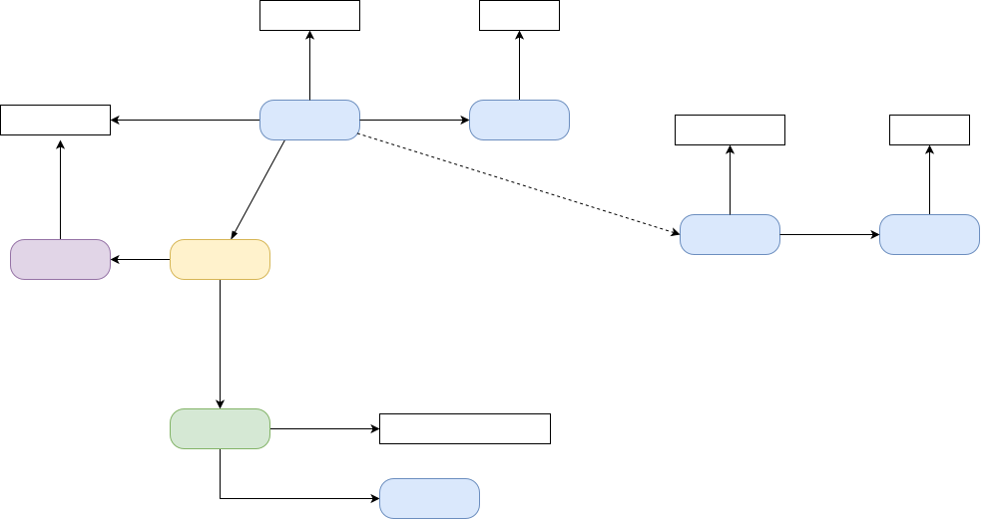

# Background
## Arabic periodicals

The first mass medium of the Eastern Mediterranean and a global Arabic ideosphere

<!-- ::: columns-3
:::: column

 #1, 20 April 1875, Beirut](../../assets/OpenArabicPE/front-pages/thamarat-al-funun-v_1-i_1.jpg){#fig:tf-1}

::::
:::: column

 #1, 15 April 1892, New York](../../assets/OpenArabicPE/front-pages/kawkab-amirka-v_1-i_1.png){#fig:kawkab-1}

::::
:::: column

 #2, 22 Sep. 1908, Jerusalem](../../assets/OpenArabicPE/front-pages/al-quds-v_1-i_2.jpg){#fig:quds-2}

::::
::: -->

<!-- {#fig:holding-stats} -->

::: columns
:::: wide

{#fig:history-arab-press}

::::
:::: narrow

 #1, 15 April 1892, New York](../../assets/OpenArabicPE/front-pages/kawkab-amirka-v_1-i_1.png){#fig:kawkab-1}

::::
:::


::: notes

- striking similarity in layouts of newspapers
    + despite temporal and geographic distance
- note the Ottoman symbolism
- note the absence of visual / typographic segmentation for Thamarāt al-Funūn 

:::

## My research interests

[... or what I would want to do]{.c_center .keyphrase}

::: columns
:::: column

Who are the most important authors?

{#fig:network-authors-1}

::::
:::: column

What are the most important periodicals?

{#fig:network-mentioned-periodicals-1}


::::
:::


# neo-colonial absences
## what are we up against

::: columns-3
:::: narrow

 for "[مرآة الشرق]{lang="ar"}"](../../assets/jaraid/zdb_mirat-ar.png){#fig:mirat-ar}

::::
:::: wide

1. limited knowledge of the "original" artefact
2. survival and collection bias leads to digitisation bias
3. networked digital infrastructures and global capitalism
5. digital divides between the global south and the global north
6. *linguistic imperialism* and the digital artefact 

::::
:::: narrow

 (Original in Princeton) outside the USA](../../assets/OpenArabicPE/hathi_muqtabas-1.png){#fig:hathi-muqtabas-global}

::::
:::

::: notes

1. limited knowledge of the "original" artefact
2. survival and collection bias leads to digitisation bias
    - jaraid data 
3. digital infrastructures and capitalism
    - minimise cost of digitisation
        + outsourcing to cheap workers without domain knowledge
        + outsourcing to vendors with technology stack is not tailored to the artefact
    - maximise rent: sell to the rich
        + data silos
        + paywalls
        + geofencing
        + no APIs
4. linguistic imperialism and the digital artefact
    - data: 
        - character encoding -> transliteration
        - automated layout and text recognition
        - data models
        - NER
    - interfaces
        + languages of the global north
        + search queries normalised to ASCII
5. digital divide and affordances of the Global South
    - electricity
    - internet connections
    - literacy

>'Linguistic imperialism' is shorthand for a multitude of activities, ideologies, and structural relationships. Linguistic imperialism takes place within an overarching structure of asymmetrical North/ South relations, where language interlocks with other dimensions, cultural (particularly in education, science, and the media), economic and political

<cite>[@Phillipson1997RealitiesAndMyths, 239]</cite>

>The basis for the codes, languages, methodologies, and technical instruments of the digital humanities is English; the written and spoken language of all the main conferences, the most prestigious journals, the institutions that control the discipline, the organizations and international consortia, and the central authorities of knowledge is, with few exceptions, some dialect of British or American English.

<cite>[@Fiormonte2021Taxation, 334-335]</cite>

:::

## Survival bias: violent destruction

::: columns-2
:::: column

### Syria

{#fig:archives-dam}

::::
:::: column

### Palestine

{#fig:gaza-mosque}

::::
:::

::: columns
:::: column

### Lebanon

 damaged by the Beirut Port explosion on 4 August 2020. Source: OIB](../../assets/dh/2020-08-04-oib-damage.jpg){#fig:oib-explosion}

::::
:::: column

### Iraq

](https://upload.wikimedia.org/wikipedia/en/c/cf/Iraq_National_Library_Destroyed.jpg){#fig:inla}

::::
:::

::: notes

- Beirut: Port explosion on 4 Aug 2020
    + 2750t of ammonium nitrate
    + one of the largest non-nuclear explosions ever
- Damascus: Conflagration of the Dār al-Wathāʾiq al-Tārīkhiyya in Sūq Sārūjā on 16 July 2023
- Gaza: scholasticide and cultural genocide
    - Great ʿUmarī Mosque of , including its library, was destroyed by Israeli bombardment on 8. Dec 2023
        - part of the manuscript collection were digitised in [collaboration with Hmml](https://hmml.org/about/global-operations/gaza/) through an [EAP grant](https://eap.bl.uk/project/EAP1285) from 2020 onwards
        - This is not the first bombardment though: British naval bombardment destroyed the Mosquer in 1917 <https://commons.wikimedia.org/wiki/File:Gaza_Mosque_Nave.jpg>, <https://commons.wikimedia.org/wiki/File:A_general_view_of_the_ruins_of_the_Great_Mosque_at_Gaza,_c._1918.jpg> 
    - this part of Southafrica's case against Israel at the ICJ
:::

## Collection (and cataloguing) bias

::: columns
:::: column

![Periodicals and their holding institutions ([Wikidata][rq:holdings_periodicals-lang_ar-disp_map])](../../assets/jaraid/map-data-set-periodical-holdings-med-na_mapped.png){#fig:holding-map}

::::
:::: column

|      periodicals       | --1918 |       | --1929 |               |
|  :-------------------  | ----:  | ----: | ----:  |     ----:     |
|       published        |  2054  |       |  3550  |               |
|     known holdings     |  540   |       |  775   |               |
|       % of total       |        | 26.29 |        | [21.83]{.red} |
|------------------------|--------|-------|--------|---------------|
| digitized              |    156 |       |    233 |               |
| % of total             |        |  7.59 |        | [6.56]{.red}  |
|------------------------|--------|-------|--------|---------------|
| multiple digitisations |     51 |       |     66 |               |
| % of total             |        |  2.48 |        | 1.86          |
| % of digitised         |        | 32.69 |        | [28.33]{.red} |

Table: Periodical holdings and digitization {#tbl:jaraid-holdings}

::::
:::

::: notes

- collection bias is more of a knowledge bias
- While the digitization quote of roughly 50% of titles in collections is surprisingly high, it must be kept in mind that we cannot resolve information on the extent of digitization. Even if only a single issue of hundreds published was digitized, the periodical title will be included in this count.
- 66 periodicals or 28,33% have been digitized by multiple institutions and 21 of this subset by three and more.

:::

## Digitisation bias
### mind the `<gap/>`!

|             | Arabic periodicals (1798--1918) | [WWI as mirrored by Hessian regional papers](https://hwk1.hebis.de) |
|-------------|---------------------------------|---------------------------------------------------------------------|
| community   | c. **420 mio.** Arabic speakers  | c. **6.2 mio.** inhabitants                                          |
| periodicals | 2054 newspapers and journals    | 125 newspapers                                                      |
| digitized   | [156]{.red} periodicals                 | [125]{.green} newspapers with more than 1.5 million pages                     |
| type        | mostly facsimiles               | facsimiles and full text                                            |
| access      | paywalls, geo-fencing           | open access                                                         |
| interface   | mostly foreign languages only   | local and foreign languages                                         |

Table: Comparison of digitized periodicals between the Global South and the Global North {#tbl:digitisation}


::: columns
:::: column

](../../assets/maps/lMBwUARaIVBp5EUfx5yp4onMAtfAQsgRevtxTopNl98.png.webp){#fig:map-arabic-dialects}

::::
:::: column

{#fig:map-hesse}

::::
:::

::: notes

- price of digitisation is part of the equation
- infrastructures of knowledge creation 
- linguistic imperialism embodied in the technology stack

:::


## Digital divides: Access to power and the internet

::: columns
:::: column

<iframe src="https://data.worldbank.org/share/widget?indicators=EG.ELC.ACCS.ZS&view=map" width='500' height='500' frameBorder='0' scrolling="no" ></iframe>

::::
:::: column

<!-- <iframe src="https://data.worldbank.org/share/widget?indicators=IT.NET.BBND.P2&view=map" width='500' height='500' frameBorder='0' scrolling="no" ></iframe> -->

](../../assets/dh/twitter_CLRYwKiUsAAILP8.jpeg){#fig:7abibti}

::::
:::

::: notes

- very unequal access to the means of digital production
- sustainable development goals (SDG) of the UN
- electricity
    + 800 mio have no access
        * almost exclusively in the global south
        * vast majority in subsaharan Africa
    + by 2030 according to projections of the International Energy Agency (IEA): 
        * 600 mio
        * 33 per cent of all Africans
    - access: 
        + 250--500 kWh per year and household
        + less than 14 hours of a 100W lightbulb per day
 - internet
        + 36,6 percent of the world population, or 2,93 billion people do not participate
        + 85 per cent of them live in Africa, South, East and South-East Asia
        + lower speed
        + higher latency
        + higher cost per unit of traffic

:::

## Arabic

::: columns
:::: column

### Script

- Second most important script after Latin
    + currently used by 14 languages: Arabic, Persian, Urdu, Pashto, Uzbek, Uighur ...
+ Writing direction: **right** to left (RTL)
+ Letters: mostly connected in direction of writing, letterform depends on position within the string
 
::::
:::: column

### Language

+ Fifth most important language
    * One of six official languages of the United Nations
    * Official language in 26 countries
    * \>420 million speakers
+ Lithurgical language of 1,6 billion Muslims

::::
:::

![Approximate distribution of Arabic script use along current national boundaries. Solid colours: contemporary primary script; vertical stripes: contemporary use as a secondary national script; horizontal stripes historical use [@Nemeth+2017, fig 1.1]](../../assets/maps/map_arabic-script-nemeth-fig_1-1-small.png){#fig:arabic-script}

## epistemic violence of the means of knowledge production

::: columns
:::: column

![Arabic Linotype, 1910s. Source: [@Nemeth+2017, fig. 2.7]](../../assets/dh/arabic-linotype_nemeth-p_46.png){#fig:ar-linotype}

::::
:::: column

Arabic can be "reliably" shared with Unicode since 1991 ... if protocolls, software, fonts etc. supports it across the entire stack.

![32 variants of encoding "Meccan" ([مكية]{lang="ar"}) [@Milo2014VisuallyMisleading, 4]](../../assets/dh/arabic-script_unicode-example-makkiyya-milo_4.png){#fig:arabic-mecca-1}

![In-browser search for "[مك]{lang="ar"}" in the Wikidata entry for "Mecca" ([Q5806](https://www.wikidata.org/wiki/Q5806))](../../assets/dh/arabic-script_unicode-example-wikidata_narrow.png){#fig:arabic-mecca-2 height="300px"}

::::
:::


::: notes

I am showing this in order to demonstrate the epistemic violence exercised by the paradigm of 

+ discrete letters, 
+ the Latin alphabet with its rather small number of letters, 
+ movable type printing
    * magazines become unfeasibly large
        - unwieldy
        - expensive: 
            + more material 
            + more machinery
            + more time for composing

:::

## Transliteration, the undead solution of yore

Transliteration into Latin script served the need of colonial administrations and academics with the technological affordances of the time.

::: columns-3
:::: column

### [مرآة الشرق]{lang="ar"}

The Arabic title of a newspaper published by [بولس شحادة]{lang="ar"} in Jerusalem, 1919--38

### Meraat al-Sherk

The official transcription provided by the paper's masthead

::::
:::: column

* #192, 22 Nov. 1922, Jerusalem. Source: [EAP](https://eap.bl.uk/archive-file/EAP119-1-24-1).](https://images.eap.bl.uk/EAP119/EAP119_1_24_1/1.jp2/full/600,/0/gray.jpg){#fig:mirat-1}

::::
:::: column

### Mirʾāt al-Sharq

Following the system of the *International Journal of Middle East Studies* (IJMES)

### Mirʾāt aš-Šarq

Following the system of the *Deutsche Morgenländische Gesellschaft* (DMG)

### mrMp Alcrq

Buckwalter transliteration

::::
:::

::: notes

- *Mirʾāt al-Sharq* published by 
- transliteration
    + Depend on input and output **languages**
    - Subject to traditions and taste
    - Error prone
    - if 1:1 grapheme replacement is intended, it becomes unreadable for casual readers
- published by Būlus Shaḥāda in Jerusalem between 1919 and 1938 

:::

## The long tail of ASCII in discovery systems

[How do we search for [[مرآة الشرق]{lang="ar"}](https://www.wikidata.org/wiki/Q124971778)?]{.c_center}

::: columns-3
:::: column

- original Arabic: [مرآة الشرق]{lang="ar"}
- original Latin: Meraat al-Sherk
- IJMES: Mirʾāt al-Sharq
- DMG: Mirʾāt aš-Šarq
- Buckwalter: mrMp Alcrq

.](https://images.eap.bl.uk/EAP119/EAP119_1_24_1/1.jp2/full/600,/0/gray.jpg){#fig:mirat-2}

::::
:::: column

### failure

- Arabic script (data or interface)
- IJMES
- removing or substituting *hamza* and *ʿayn*: `mir'at sarq`

 for "mir'at sarq"](../../assets/jaraid/zdb_mirat-ar-Latn-hamza.png){#fig:zdb-hamza}
 

::::
:::: column

### success

- original Latin title
- DMG
- removing all diacritics and articles: `mirʾat sarq`

 for "Mirʾāt aš-Šarq"](../../assets/jaraid/zdb_mirat-ar-Latn-x-dmg.png){#fig:zdb-dmg}

::::
:::

::: notes

- catalogue could be searched in Arabic but the data is missing
- catalogues are historical artefacts
    + digitisation of catalogues: NOT re-cataloguing of original material
        * card catalogue
        * ASCII OPAC
        * automated transcription of the card catalogue
        * human cataloguers depend on the technology they have at hand, which means they might be unable to enter the correct string
        * errors perpetuate
- Latin input is mostly reduced to ASCII
    + Hamza and ʿAyn escape this algorithm on ZDB
- determined article is not automatically removed
- The choices are not transparently documented
- no software on-screen keyboards provided
- additional problems
    + catalogues are inherently local documents
    + aggregated, if at all, on a national level
    + frequently accessible only through Web interfaces and not APIs

:::

# Proposed solution
## Minimal computing
## Wikidata

::: columns
:::: wide

- largest public knowledge graph
    - 5-star *linked open data*
    - FAIR, [CC][cc]0 (public domain)
- community driven
    - integrated into larger knowledge environments
    - robust user management
- multilingual by design
- Open software stack

::::
:::: narrow

*](../../assets/jaraid/wikidata_Q25212027-lang_ko.png){#fig:Q25212027-ko}

::::
:::

# Workflow for publishing metadata on Wikidata
## Data collection: [Project Jarāʾid](https://projectjaraid.github.io/) (2012--)

::: columns
:::: column

- Bibliographic record of **all** Arabic periodical titles published between 1798 and 1929
    - websites and open datasets ([TEI/XML][tei]) for more than 3500 periodicals
    - additional authority files for c.2700 persons, 220 places, 180 libraries
- Crowd-sourcing among scholars
- Networking and reconciling existing information: 
    - Integration of holding information from library catalogues such as ZDB, AUB, BnF, HathiTrust
    - Conversions from MARC, MODS, and HTML to TEI/XML
    <!-- - Publish everything as Linked Open Data on [Wikidata](https://w.wiki/9UDd) -->

### Problems

- Sustainability of dataset and code
- Findability
- Usability of static, monolingual website
- Interoperability

::::
:::: column

```xml
<biblStruct source="https://projectjaraid.github.io wd:Q186844 wd:Q124855340 wd:Q107011742" subtype="newspaper" type="periodical">
   <monogr>
      <title level="j" xml:lang="ar">مرآة الشرق</title>
      <title level="j" source="wd:Q186844" type="sub" xml:lang="ar">جريدة اسبوعية حرة</title>
      <title level="j" source="https://jrayed.org/en/newspapers/meraatalsherk/1919/09/17/01/ wd:Q124855340" type="sub" xml:lang="ar">جريدة عربية سياسية حرة</title>
      <title level="j" source="wd:Q124855340" xml:lang="ar-Latn-EN">Meraat al-Sherk</title>
      <title level="j" xml:lang="ar-Latn-x-ijmes">Mirʾāt al-Sharq</title>
      <title level="j" source="wd:Q186844" xml:lang="ar-Latn-x-dmg">Mirʾāt aš-Šarq</title>
      <title level="j" source="wd:Q186844" type="alt" xml:lang="ar-Latn-FR">Meraat alsherq</title>
      <title level="j" source="wd:Q186844" type="sub" xml:lang="ar-Latn-x-dmg">ǧarīda usbūʿīya ḥurra</title>
      <idno type="OCLC">33001662</idno>
      <idno type="OCLC">50276604</idno>
      <!-- ... -->
      <idno type="wiki">Q25212027</idno>
      <idno type="wiki">Q124971778</idno>
      <idno source="wd:Q186844" type="zdb">1019615-8</idno>
      <textLang mainLang="ar"/>
      <editor type="owner">
         <persName ref="wd:Q125160760" xml:lang="ar">
            <forename>بولس</forename>
            <surname>شحادة</surname>
         </persName>
      </editor>
      <editor source="wd:Q124855340" type="editor">
         <persName ref="wd:Q125159749" xml:lang="ar">
            <forename>نقولا</forename>
            <surname>شحادة</surname>
         </persName>
      </editor>
      <imprint>
         <pubPlace>
            <placeName ref="geon:281184 wd:Q1218" xml:lang="ar">القدس</placeName>
         </pubPlace>
         <publisher source="wd:Q124855340">
            <orgName xml:lang="ar">مطبعة مرآة الشرق</orgName>
         </publisher>
         <date type="onset" when="1919-09-17" xml:lang="und-Latn">1919</date>
         <date resp="#hEAP119" type="terminus" when="1938">1938</date>
      </imprint>
   </monogr>
</biblStruct>
```

::::
:::

## Import data to Wikidata

::: columns
:::: column

### model

1. Create a data model of Wikidata entities and property statements
2. Map the original data model ([TEI/XML][tei]) to the new data model
    - to custom XML for import into [OpenRefine](https://openrefine.org)
    - to QuickStatements for direct import to Wikidata

::::
:::: column

### reconcile

Reconcile entities with existing [Wikidata][wd] items with [OpenRefine](https://openrefine.org)


### upload

Create new [Wikidata][wd] items and statements with QuickStatements
<!-- 5. Link items and enrich with local data  -->

::::
:::

<!-- ](../../assets/jaraid/wikidata_Q4703322.png){#fig:wikidata-Q4703322} -->

{#fig:wd-data-model}


::: notes

- reconciliation:
    - suffers from the same problems as any other discovery system: string matching is insufficient
    - allows for complex queries
:::


## Archive data

[all dependencies will break eventually]{.keyphrase}

::: columns
:::: column

- Everyone can edit Wikidata
- WikiMedia will fold
- One might need to cite a specific version

::::
:::: column

- [SPARQL][sparql] and RESTful APIs to the rescue
    - save a copy local copy of the graph
- `bash` script as a wrapper
- deploy via [GitHub][github], [GitLab][gitlab] actions for periodic runs
- push periodic release to publicly-funded, open repository ([Zenodo][zenodo]) for long-term preservation [@Grallert2024jaraidData]
    + make sure to add [ORCID][orcid]s for all contributors
    + provides versioned [DOI][doi]s

::::
:::

# Results
## Visibility

::: columns
:::: column

### before

![Map of all Arabic periodicals published before 1930 (items created before 18 March 2024, [SPARQL][rq:map-periodicals-ar-2024-03-18-cluster])](../../assets/jaraid/wikidata-map_periodicals-arabic-2024-03-18_markercluster.png){#fig:wd-map-2024}

::::
:::: column

### after

![Map of all Arabic periodicals published before 1930 ([SPARQL][rq:periodicals-lang_ar-basic-disp_map])](../../assets/jaraid/periodicals-lang_ar-basic-disp_map.png){#fig:wd-map}

::::
:::

## Visibility

::: columns
:::: column

### before

![Bubble chart of publication languages (items created before 18 March 2024). Note the surprising prominence of Swedish ([SPARQL][rq:bubble-lang-2024-03-18])](../../assets/jaraid/wikidata-bubble_periodicals-languages-2024-03-18.png){#fig:wd-bubble-2024}

::::
:::: column

### after

![Bubble chart of publication languages ([SPARQL][rq:languages-disp_bubble])](../../assets/jaraid/languages-disp_bubble.png){#fig:wd-bubble}

::::
:::

## Complex queries

<!-- ::: columns-3
:::: column

![[Map of all periodicals, March 2024][rq:map-periodicals-all-2024-03-16-cluster]](../../assets/jaraid/wikidata-map_periodicals-all-2024-03-16_markercluster.png){#fig:map-periodicals-all-2024-03-cluster}

![[Map of all periodicals, Aug. 2024, after we added our data][rq:map-periodicals-all-2024-08-21-cluster]](../../assets/jaraid/wikidata-map_periodicals-all-2024-08-21_markercluster.png){#fig:map-periodicals-all-2024-08-cluster}

::::
:::: column

- Pros
    - Multilingual interface and dataset
    - Allows complex queries ([SPARQL][sparql], APIs)
- Cons 
    - Complex queries require knowledge of [SPARQL][sparql] (click on the links to the left and right)

::::
:::: column

![[Map of newspapers published in Palestine until 1930][rq:press-palestine]](../../assets/jaraid/wikidata-map_periodicals-palestine-1930_cropped.png){#fig:map-palestine-1930}

::::
::: -->

SPARQL is powerful BUT has a steep learning curve

::: columns
:::: column

<iframe src="https://query-chest.toolforge.org/redirect/aDYfGc5U3MCeOaWIg0OcKoYK2MMweuiOo8KGA26yOib" title="Palestinian periodicals before the Nakba: digitised titles"></iframe>

::::
:::: column

### Sample queries

- [All Arabic periodicals published before 1930, including information on holdings and digitised copies][rq:periodicals-lang_ar-basic]
- [Map of all Arabic periodicals][rq:periodicals-lang_ar-basic-disp_map]
- [Arabic periodicals, ranked by number of digitised collections][rq:count-digitised]
- [Map of Arabic periodicals with kown holdings. Periodicals are mapped to the location of the holding institution][rq:holdings_periodicals-lang_ar-disp_map]
- [Bubble graph of collections of Arabic periodicals][rq:holdings_periodicals-lang_ar-disp_bubble]

::::
:::


## References {#refs}

[cc]: https://creativecommons.org/
[doi]: https://doi.org/
[github]: https://github.com/
[gitlab]: https://about.gitlab.com/
[iiif]: https://iiif.io/
[internetarchive]: https://archive.org
[orcid]: https://orcid.org
[sparql]: https://www.w3.org/TR/sparql11-query/
[tei]: https://tei-c.org/
[wd]: https://wikidata.org/
[zenodo]: https://zenodo.org/

<!-- external IDs -->

[rq:periodicals-lang_ar-filter_ids-hathi]: https://query-chest.toolforge.org/redirect/rLaytNA78qsiw2uAuusEMCwESG8yEwqIOWE2AOwwoIZ
[rq:periodicals-lang_ar-filter_ids-oclc]: https://query-chest.toolforge.org/redirect/kChWMCQzq2YAy6o0SsAikiouKgIMaqWIos0WwkwuCoa


<!-- links -->

[rq:publications-transliterated-title]: https://query-chest.toolforge.org/redirect/dSZmMD4FSCeucOakcKCuKkYSg6wo8GCeyO8YqugMe2z 

[rq:periodicals-holdings-2024-03-18]: https://query-chest.toolforge.org/redirect/eKwMLGU9oGqiEqCI2OUqKw2uy60KoKscqQgsWmwcaU6 

[rq:arabic-periodicals-images]: https://query-chest.toolforge.org/redirect/nNIwitQHCq02U4Ww8MwIGS4EcY4y6qCO2uOWqGwWoGU 


<!-- basic tables -->

[rq:periodicals-lang_ar-basic]: https://query-chest.toolforge.org/redirect/5NZuEN6OBMmiWm0IoYYU6caa2q6AKeqUKEKe0uqy4Ml

[rq:count-collections]: https://query-chest.toolforge.org/redirect/wnhAUtiqI4MQyW0MOsqAyOqOwSuE6iSUcU28oCUAqkY 

[rq:count-digitised]: https://query-chest.toolforge.org/redirect/JwwYdMXGLosUGeSKCucwckW0gMmEqAY2Uosa2MiMYev

<!-- maps -->

[rq:periodicals-lang_ar-basic-disp_map]: https://query-chest.toolforge.org/redirect/KkTnCUlWc4MI6WKwSm6CeY4GM8EGOyScEsi4Sw0oOq4

[rq:map-periodicals-ota-cluster]: https://query-chest.toolforge.org/redirect/wLTnRa9d2GceWkacK6Ek8uSUaWIGaamSsqe8C6kaMCI 

[rq:map-periodicals-all-2024-03-18-cluster]: https://query-chest.toolforge.org/redirect/8K4bVhyOmm6seAwkmiIqsGEEY4yCooU6YMGsKSYQ2Eb 

[rq:map-periodicals-all-2024-08-08-cluster]: https://query-chest.toolforge.org/redirect/mYSKHVP1qQamkCeYQmSsKMWMGwg266UqEayEcYwgUy7 

[rq:map-periodicals-ar-2024-03-18-cluster]: https://query-chest.toolforge.org/redirect/LAwIgT9wqucyaW0mCQ0Ms2uKGUmygM6mwcSIuKKKyc0 

[rq:map-periodicals-ar-2024-08-08-cluster]: https://query-chest.toolforge.org/redirect/obqUZJy6sY448EAesSQSaW80kAsYucuIiE8sO8kY2Gd 

[rq:map-periodicals-ota-2024-08-01-cluster]: https://query-chest.toolforge.org/redirect/7c5YPWykbICAWcWaAYqYwMqEo6qUaaou0WaIugIqGYu

<!-- counts -->

[rq:count-arabic-periodicals-2024-03-18]: https://query-chest.toolforge.org/redirect/oYNezk1fgs8UQyCQoKsSemEiWu6oiWSAq0As6k2QISv 

[rq:count-periodicals-all-2024-03-18]: https://query-chest.toolforge.org/redirect/BGlKl7mq24UyuaKyESSwQMYUS4S2qgwgUg4OuuOYksf 

[rq:count-arabic-periodicals-2024-08-08]: https://query-chest.toolforge.org/redirect/eO3ox4S9FwUeY24gs24CU6OOqiI0WiYKiEKmggM46sn 

[rq:periodicals-lang_ar-digitised-count]: https://query-chest.toolforge.org/redirect/RAvRJunsMyIeGyeeIaCo6cCukCi6YCkik8sSIkGkAq9

<!-- languages -->

[rq:periodicals-filter_missing-lang]: https://query-chest.toolforge.org/redirect/xXzyJrwD4qGACuAcayGyGEW4AUE8G8Y8wmCMc8cqKwG

[rq:periodicals-layers_languages-disp_map]: https://query-chest.toolforge.org/redirect/uAOfzguDGgAA6Ma2yseCsOOmGOOmaq8Go6sQQ6YEMWh

[rq:languages-disp_bubble]: https://w.wiki/ArRb

[rq:bubble-lang-2024-03-18]: https://query-chest.toolforge.org/redirect/dMk3vPTaZkuiqe804Wqeqkmi8SooO260qSCmAG08MI7 

[rq:bubble-lang-2024-08-08]: https://query-chest.toolforge.org/redirect/26dFDncq2WMkmei8eg26qwISOKyMAmioq6Co8WwUIKQ 

[rq:periodicals-lang_ar-holdings-filter_count-1]: https://query-chest.toolforge.org/redirect/r9Gn5nKhkWUYgyYwOU08qAk64wWOQO4ycuCcsSi6Syc

[rq:periodicals-lang_ar-holdings-disp_map]: https://query-chest.toolforge.org/redirect/w3zZsU79KQEuYUk8kk2MEwGaQg08w0GkYo2wYSksGGY

[rq:holdings_periodicals-lang_ar-disp_map]: https://query-chest.toolforge.org/redirect/WvUD5eWjtQqKOEC02cQKmCQguM2okyIaAW46giAaGuX

[rq:holdings_periodicals-lang_ar-disp_bubble]: https://query-chest.toolforge.org/redirect/5jePPWeZe42UCWwCmYyIc2mmcW242euOIeaEUiS0O0j

<!-- holdings -->

[rq:periodicals-lang_ar-filter_collection-disp_map]: https://query-chest.toolforge.org/redirect/qmTkCttCikGMoCI8kSkS4Uq8MuyS8EyMKS6KaOQQqsf

[rq:periodicals-lang_ar-holdings-filter_count-1]: https://query-chest.toolforge.org/redirect/r9Gn5nKhkWUYgyYwOU08qAk64wWOQO4ycuCcsSi6Syc

[rq:periodicals-lang_ar-holdings-disp_map]: https://query-chest.toolforge.org/redirect/w3zZsU79KQEuYUk8kk2MEwGaQg08w0GkYo2wYSksGGY

[rq:holdings_periodicals-lang_ar-disp_map]: https://query-chest.toolforge.org/redirect/WvUD5eWjtQqKOEC02cQKmCQguM2okyIaAW46giAaGuX

[rq:holdings_periodicals-lang_ar-disp_bubble]: https://query-chest.toolforge.org/redirect/5jePPWeZe42UCWwCmYyIc2mmcW242euOIeaEUiS0O0j

<!-- specific regions -->

[rq:map-levant-1910-06]: https://query-chest.toolforge.org/redirect/v8e8UlL8s2gM46Ieou4UeMOimUSsyUS40uso0OAaIUL 

[rq:map-levant-1910-06-holdings]: https://query-chest.toolforge.org/redirect/W5asaV1sTwmMoAogKO8ckaoOgyIGU2Aq8QSQKWYkcSS 

[rq:map-levant-1910-06-digitised]: https://query-chest.toolforge.org/redirect/ZtdJnjhGtM4SGUks2GEYwcAmwKGeCmS8icSua0ISkwW 

[rq:palestine-1948_periodicals_map]: https://query-chest.toolforge.org/redirect/WSB7DBbD7oYkIU2k8KoksQkaauOu8ew8cEOs4CCyCID

[rq:palestine-1948_periodicals-holdings_map]: https://query-chest.toolforge.org/redirect/FastY9YqoKky0AAggWsk4mMeQW284SIOkIGGiEEMQKd

[rq:palestine-1948_periodicals-holdings_map-collection]: https://query-chest.toolforge.org/redirect/Bsfc1wk38K2WEaQk84qGkyeOkggEea8kGuSMqgGOEU1

[rq:palestine-1948_periodicals-digitised_map]: https://query-chest.toolforge.org/redirect/aDYfGc5U3MCeOaWIg0OcKoYK2MMweuiOo8KGA26yOib

<!-- editors -->

[rq:editors-disp_imagegrid]: https://query-chest.toolforge.org/redirect/vWy7oAd56GAWYscO0wyQkQ2M4UQmG4m4AMk8MiAcSEw

<!-- images -->
[rq:periodicals-lang_ar-image-disp_graph]: https://query-chest.toolforge.org/redirect/q8HKXkolw8uYgywMEgGsywuqWSMymGWyCEIEoiqku4Z

<!-- dimensions -->
[rq:periodicals-lang_ar-dimensions.rq]: https://query-chest.toolforge.org/redirect/1yFIBRrWui6qQQAGAimCOW8gYg08syeWCmIAkG0sSai