# Vorbemerkungen
## Wer bin ich und warum stehe ich vor Ihnen

![Straßenbahnen auf dem Marja-Platz in Damaskus, 1920er [@DamasPlaceMerdjé+1928; @DamasMerdjé+1928]](../../assets/phd/Panorama-Marja-707-708.jpg){#fig:marja}

::: columns
:::: column

{#fig:network-mentioned-periodicals-1}

<!-- potentially replace with a more recent plot or an awesome map of correspondence -->

::::
:::: column

Some image of NFDI4Memory

::::
:::


<!-- Bilder von Strassenbahnen, Zeitungen, Protesten, NFDI4Memory -->

::: notes

- das wird im Folgenden noch wichtig
- Was bin ich
    - Ich bin Historiker
    - Sozial- und Medienhistoriker des mehrheitlich arabischsprachigen östlichen Mittelmeerraumes ab dem späten 18. Jahrhundert.
    - Studium der Islamwissenschaft, Judaistik, VWL und Geschichte
- was mache ich
    - praktische Kritik der Digitalität 
    - Leitung der Task Area *Data Culture* und des *Methods Innovation Lab* von [NFDI4Memory] and der [HU Berlin].
    - Co-Convenor von AGs zu Multilingual DH
- Was bin ich nicht: 
    - Technikphilosophie

:::

## Worüber werde ich sprechen?

::: columns
:::: column

1. Thema: Affordancen der Digitalität und epistemische Gewalt von Infrastrukturen
2. Fallstudie: Geschriebene Sprache als Mensch-Maschine Schnittstelle
3. Frage: Wie kann eine Datenkultur in den Geisteswissenschaften aussehen

::::
:::: column

::::
:::

::: notes

- Beispiel/ Case Study: epistemische Gewalt in der Sprach- und Textverarbeitung als Grundlage
    - Es bieten sich auch andere Beispiele an, aber meine Kompetenz fokussiert nun genau auf jenes
        - LLMs sind der elephant in the room
        - synthetic text extrusion machines preconfiguring the discursive field
        - in the tradition of fencing the commons and cultural appropriation

:::

# These
## Wir leben in einem neuen Epistem -- dem Zeitalter der Digitalität und Computationalität


::: columns
:::: narrow

[Gesellschaft und Wissenschaft sind bereits *datafiziert*]{.keyphrase}

::::
:::: wide

<!-- 
>I would like to explore here a tentative path for a third wave of the digital humanities, concentrated around the underlying computationality of the forms held within a computational medium. That is, I propose to look at the digital component of the digital humanities in the light of its medium specificity, as a way of thinking about how medial changes produce epistemic changes.

<cite>[Berry2011ComputationalTurn, 4]</cite> -->

>Computationality might then be understood as an ontotheology, creating a new ontological ‘epoch’ as a new historical constellation of intelligibility. <!-- The digital humanists could therefore orient themselves to questions raised when computationality is itself problematized in this way-->

<cite>[Berry2011ComputationalTurn, 16; @Berry2011Philosophy, 27]</cite>

>Die Digitalität [...] ist das, was entsteht, wenn der Prozess der Digitalisierung eine gewisse Tiefe und eine gewisse Breite erreicht hat und damit ein neuer Möglichkeitsraum entsteht, der geprägt ist durch digitale Medien. Digitalität verhält sich Digitalisierung wie die Buchkultur zur Alphabetisierung. Aufgrund der breiten Verfügbarkeit und Anwendung neuer Kulturtechniken entsteht ein neuer kultureller Möglichkeitsraum, der natürlich immer auch mit spezifischen Einschränkungen verbunden ist.

<cite>[Stalder2021WasIst, 4]</cite>

::::
:::

<!-- **Datafication** emphasises the epistemic shift from a world where data were a closely defined part of the output of research processes towards the new status quo in which all research processes are always already computationally mediated through information and communication technologies. -->

**Datafizierung** markiert den fundamentalen epistemischen und konzeptionellen Wandel von einer Welt, in der Daten ein eng definierter Teil der Ergebnisse von Forschungsprozessen waren, hin zu einem neuen Status Quo, in dem alle Forschungsprozesse immer bereits durch Informations- und Kommunikationstechnologien (ICT) computationell mediiert sind. 


::: notes


- Wir leben in einem neuem Epistem, dem Zeitalter der Digitalität und Computationalität. - Alles ist bereits durch die Infrastrukturen der Digitalität vermittelt (mediiert).
    - Infrastrukturen als Assemblagen von Norman, Praktiken, Materialität
- Jedem Epistem und jeder Vermittlung wohnt (epistemische) Gewalt inne (was sind die Grenzen des Sagbaren, was ist das nicht Sagbare? etc.).
- Wir machen dabei Rückgriffe auf 
    - Poststrukturalismus
        - Foucault
        - Said
        - Spivak
    - Theorie der Digitalität
        - Stadler
        - Dobson
        - Berry 
- "epoch of computationality" orginates with @Berry2011ComputationalTurn
    - ontotheology rekuriert auf Heidegger und Kant
- Unsere Interaktion mit der Welt ist immer schon durch ICTs vermittelt
- Digital history, then, accepts that the human cultural record is being *datafied* and we need computational methods in order to make historical arguments [cf. @DigitalHistoryArgument2017, 2; @Laessig2021DigitalHistory, 6]
- Digital history also addresses the age of abundance, as postulated by Roy Rosenzweig, and epitomised by the recent advances in generative AI and LLMs, which will create an infinite amount of absolutely plausible and convincing yet utterly false sources 
- “The concept of digitality focuses on something fundamental. It marks, first of all, a humanities-based perspective on the totality of the far-reaching and deep-rooted developments that may also be summarised as computerisation. Therein lies the commonality of the various notions of digitality: Namely, the totality and peculiarity of the conditions and consequences of electronic digital computing in all its forms. [Digitality and Critique by Distelmeyer 2022]

:::

## Die Grenzen des Wissens

::: columns
:::: column


>Die fundamentalen Codes einer Kultur, die ihre Sprache, ihre Wahrnehmungsschemata, ihren Austausch, ihre Techniken, ihre Werte, die Hierarchien ihrer Praktiken beherrschen, fixieren gleich zu Anfang für jeden Menschen die empirischen Ordnungen, mit denen er zu tun haben und in denen er sich wiederfinden wird. 

<cite>[Foucault1974OrdnungDinge, 22]</cite>

::::
:::: column

>Die herrschenden Ideen einer Zeit waren stets nur die Ideen der herrschenden Klasse. 

<cite>[MarxEngels1958ManifestKommunistischen]</cite>

::::
:::

::: notes

Es geht um die Möglichkeiten des Wissens.

- Foucault:  
    -  Epistem als das historische a priori, welches das Wissen und dessen Diskurse begründet. Es repräsentiert dadurch die Bedingung der Möglichkeit von Wissen innerhalb einer bestimmten Epoche.
    -  >Die fundamentalen Codes einer Kultur, die ihre Sprache, ihre Wahrnehmungsschemata, ihren Austausch, ihre Techniken, ihre Werte, die Hierarchien ihrer Praktiken beherrschen, fixieren gleich zu Anfang für jeden Menschen die empirischen Ordnungen, mit denen er zu tun haben und in denen er sich wiederfinden wird. [@Foucault1974OrdnungDinge, 22]
        -  damit ist das a priori, das epistem immer auch das Meistererzählungen
        -  die herrschenden Ideen sind immer die Ideen der Herrschenden
    -  Damit zugleich immer auch das nicht sagbare, der Andere, die epistemische Gewalt

- Marx
    - >Die Gedanken der herrschenden Klasse sind in jeder Epoche die herrschenden Gedanken, d.h. die Klasse, welche die herrschende materielle Macht der Gesellschaft ist, ist zugleich ihre herrschende geistige Macht. [@Marx+1969, 46]
    - >Die herrschenden Ideen einer Zeit waren stets nur die Ideen der herrschenden Klasse. [@MarxEngels1958ManifestKommunistischen]
- Epistemische Gewalt ist dann das Sprechen über den Anderen
    - Said: Orientalism
    - Spivak: 

:::

# Dimensionen der der Digitalität
## Datum? captum? raw? meta?


::: columns
:::: narrow

[Jegliche digitale Informationen sind Daten]{.keyphrase} ...

::::
:::: wide

>Data are forms of information, a larger concept that is even more difficult to define. Epistemological and ontological problems abound, resulting in many books devoted to explicating information and knowledge 

<cite>[Borgman2015BigData, 18]</cite>

::::
:::

::: columns
:::: wide

>[Datafication/modeling] is the work of abstracting discrete values from a phenomenon or artifact. These values may be expressed in numbers or texts and are necessarily a reduction of complex materials into a form for computation. <!--With data we can automate processes -->

<cite>[Drucker2021DHCoursebook, 3]</cite>

>Data need to be imagined *as* data to exist and function as such, and the imagination of data entails an interpretive base.

<cite>[Gitelman2013Introduction, 3]</cite>

::::
:::: narrow

... und [alle Daten sind modelliert]{.keyphrase} 

Modelle sind Abbildungen, die Phänomene auf das für einen spezischen Zweck Wesentliche reduzieren 


::::
:::


::: notes 

Modellierung, Formalisierung, Serialisierung

- data are always a concrete embodyment and a socio-technological stack: serialisation
- Models have three characteristics [@Stachowiak1973AllgemeineModelltheorie]
    - Abbildung: model for something
    - Reduktion: abstracts aspects of interest
    - Zweck: models have a purpose for something
- Wenn wir dem Konstruktivismus folgen, dann sind alle Modelle historisch situiert. Sie haben einen konkreten Ort und eine spezifische Zeitlichkeit
    - Daten und Modelle sind in historischen Prozessen der Wissensproduktion, des Wissenschaffens verortet
- drucker: capta

:::

<!-- ## "analog" war (vor)gestern

::: columns
:::: narrow

[Die Unterscheidung zwischen *analog* und *digital* hat ihren analytischen Wert verloren]{.keyphrase}

::::
:::: wide

>We think of the 'digital' as a previous historic movement when computation as digitality was understood in opposition to the analogue, rather than complementary [...]

<cite>[Berry+2017, 2]</cite>

::::
::: -->

## Algorithmen und Daten sind Akteure

::: columns
:::: narrow

[*Algorithmen* sind Teil des sozialen Gewebes]{.keyphrase}

::::
:::: wide

>Today, algorithms are such an intrinsic and fundamental part of how daily life is experienced that some scholars even argue that we live in "algorithmic  cultures" [...]. This evocative notion points to the increasing difficulty of separating  algorithms from the activities that make up culture. It also evinces the complex ways in which human agency and algorithmic actions are intertwined [...] 

<cite>[Siles2023Living, 1]</cite>

>It is our position that the "digital" cannot be understood as a separate domain of culture. If we actually examine the digital [...] we see that today digital information processing is present in every aspect of our lives.

<cite>[@CPCAbout]</cite>

::::
:::

::: notes

- Daraus folgt aber auch, dass **digital** history oder **digital** humanities hilfreiche Begriffe einer Übergangsphase sind. Sie sind Label mit einem hohen symbolischen und ökonomischen Kapital. 


:::

## Infrastrukturen der Digitalität

>What distinguishes infrastructures from technologies is that they are objects that create the grounds on which other objects operate, and when they do so they operate as systems.
>
>Infrastructure in this sense is a kind of mentality and way of living in the world

<cite>[Larkin2013PoliticsPoetics, 329, 331]</cite>

::: columns
:::: column

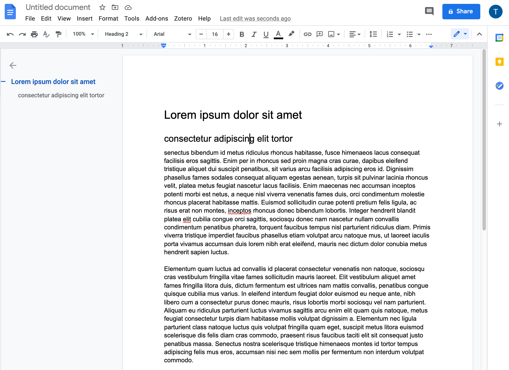{#fig:google-docs}


::::
:::: column

{#fig:google-network}

{#fig:google-cdn}

::::
:::

::: notes

- Digitalität **simuliert** Stasis und Vertrautheit
    + Metaphern
    + semantische Modelle
    + Performanz
- Digitalität ist hochgradig ephemer und wird kontinuierlich remediiert
- Google docs
    - UI für eine distribuierte Datenbank
    - Die "Seite" wird konstant erzeugt und existiert so nur im Bildschirmausschnitt des Betrachters
    - Datenzentren
    - Netzwerkprotokolle
    - Inhaltsanalysen für Werbung, Kommerzialisierung
    - Interaktion mit Embeddings, Sprachmodellen of sorts
- Suchschlitz
    - simuliert Einfachheit
- Mein Punkt ist, dass wir nicht auf Papier schreiben und nicht in einer Bibliothek durch die Regale streifen
- @Larkin2013PoliticsPoetics
    - >Infrastructures are built networks that facilitate the flow of goods, people, or ideas and allow for their exchange over space. As physical forms they shape the nature of a network, the speed and direction of its movement, its temporalities, and its vulnerability to breakdown. They comprise the architecture for circulation, literally providing the undergirding of modern societies, and they generate the ambient environment of everyday life. (328)
    * >What distinguishes infrastructures from technologies is that they are objects that create the grounds on which other objects operate, and when they do so they operate as systems. (329)
    * >Infrastructure in this sense is a kind of mentality and way of living in the world (331)
- @Star1999EthnographyInfrastructure; 
    - Definition / Phänomenologie von Infrastrukturen (basierend auf Star und Ruhleder 1996) über verschiedene Dimensionen (380-).
        1. **embeddedness**
        2. **transparency**
        3. **reach or scope**
        4. **learned as part of membership**
        5. **links with conventions of practice**
        6. **embodiment of standards**
        7. **built on an installed base**
        8. **becomes visible upon breakdown**
        9. **is fixed in modular increments, not all at once or globally**

:::

## Googles Donnerschlag von letzter Woche

::: columns
:::: column

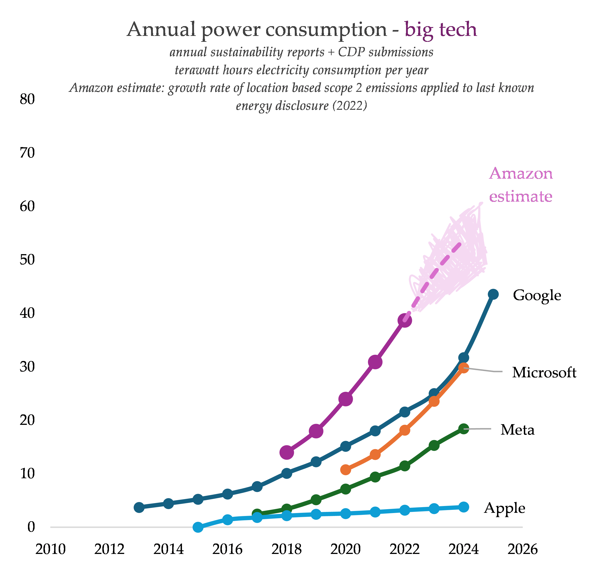{#fig:power-consumption}

::::
:::: column

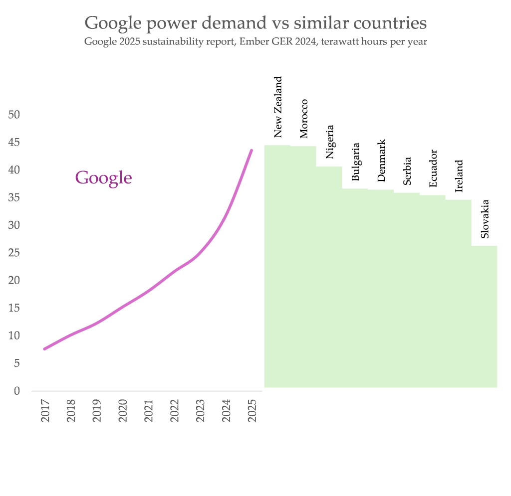{#fig:google-country}

::::
:::


[Nur so zum Spaß: kontrastieren Sie die Inhalte von @Google2026EnvironmentalReport mit deren [Präsentation](https://sustainability.google/google-2026-environmental-report/)]{.post-it .c_right}


::: notes

Google hat Anfang Juli seinen Environmental Report für 2026 vorgestellt

:::

## "Du bist so schön wie eine weitere Stunde Strom!"

::: columns-3
:::: column

![Demonstrant mit einem Schild "[حبيبتي انت جميلة، كساعة اضافية من الكهرباء]{lang="ar"} in Bagdad, Juli 2015. Quelle: [Twitter](https://twitter.com/aya_mansour_11_/status/627223846244847616)](../../assets/dh/twitter_CLRYwKiUsAAILP8.jpeg)

<!-- <blockquote class="twitter-tweet" data-partner="tweetdeck"><p lang="ar" dir="rtl">&quot;حبيبتي، انت جميلة، كساعة اضافية من الكهرباء&quot;<br><br>هذا غزل أحد المتظاهرين في ساحة التحرير اليوم.<br>رائعة حقيقة! <a href="http://t.co/KI8sAkY719">pic.twitter.com/KI8sAkY719</a></p>&mdash; aya mansour (\@aya_mansour_11_) <a href="https://twitter.com/aya_mansour_11_/status/627223846244847616?ref_src=twsrc%5Etfw">July 31, 2015</a></blockquote>

<blockquote class="twitter-tweet" data-partner="tweetdeck"><p lang="ar" dir="rtl">مريم .. أنتِ جميلة كساعة إضافية من الكهرباء ..<br><br>كتبها عاشق في فلسطين - غزة <a href="https://t.co/W3QvpmaE3O">pic.twitter.com/W3QvpmaE3O</a></p>&mdash; Jawdat Alsaleh (\@JawdatAlsaleh) <a href="https://twitter.com/JawdatAlsaleh/status/879683252184903681?ref_src=twsrc%5Etfw">June 27, 2017</a></blockquote> -->

:::: 
:::: column

<iframe src="https://data.worldbank.org/share/widget?indicators=EG.ELC.ACCS.ZS&view=map" width='500' height='500' frameBorder='0' scrolling="no" ></iframe>

:::: 
:::: column

<iframe src="https://data.worldbank.org/share/widget?indicators=IT.NET.BBND.P2&view=map" width='500' height='500' frameBorder='0' scrolling="no" ></iframe>

::::
:::

::: notes

- Digitalität ist nicht voraussetzungslos:
- very unequal access to the means of digital production
- sustainable development goals (SDG) of the UN
- electricity
    + 800 mio have no access
        * almost exclusively in the global south
        * vast majority in subsaharan Africa
    + by 2030 according to projections of the International Energy Agency (IEA): 
        * 600 mio
        * 33 per cent of all Africans
    - access: 
        + 250--500 kWh per year and household
        + less than 14 hours of a 100W lightbulb per day
 - internet
        + 36,6 percent of the world population, or 2,93 billion people do not participate
        + 85 per cent of them live in Africa, South, East and South-East Asia
        + lower speed
        + higher latency
        + higher cost per unit of traffic
- weitere Beobachtung:
    - digitale Artefakte und Infrastrukturen sind nicht beständig!
    - Tweets sind nicht mehr verfügbar
    - Map widgets stop working
    - Arabisch führt zu Darstellungsproblemen

- At my former home institution, a well-funded foreign research institute, for instance, we shared a single connection of 24Mbps. Simply loading the landing page for a single volume of al-Muqtabas at the Endangered Archives Programme will require three seconds of load time even under perfect conditions. With 20 colleagues and another 20 library users equally trying to access online services and resources, load time quickly multiplies tenfold and more. Browsing through a large number of scanned images behind such a bottleneck is a daunting task. Uploading multiple gigabytes of high-resolution scans to a cloud computing service for machine-learning based OCR, for instance, is practically impossible and we rather ship hard drives and wait for months for the results.

:::


# Epistemische Gewalt in den Infrastrukturen unserer vernetzten Wissensökologien
## Dimensionen epistemischer Gewalt

<!-- do we need this slide? -->

::: notes

Constructing the other, the one being spoken about but not talked to. The other, that is unspeakable

:::

## Linguistic imperialism

>'Linguistic imperialism' is shorthand for a multitude of activities, ideologies, and structural relationships. Linguistic imperialism takes place within an overarching structure of asymmetrical North/ South relations, where language interlocks with other dimensions, cultural (particularly in education, science, and the media), economic and political

<cite>[Phillipson1997RealitiesAndMyths, 239]</cite>

>The basis for the codes, languages, methodologies, and technical instruments of the digital humanities is English; the written and spoken language of all the main conferences, the most prestigious journals, the institutions that control the discipline, the organizations and international consortia, and the central authorities of knowledge is, with few exceptions, some dialect of British or American English.

<cite>[Fiormonte2021Taxation, 334-335]</cite>

## Sprache ≠ Schrift

|          |         Latein         |           Hebräisch           |          |
|----------|------------------------|-------------------------------|----------|
| Deutsch  | [Gewalt]{lang="de"}    | [געװאַלד]{lang="yid"}         | Jiddisch |
| Spanisch | [Violencia]{lang="es"} | [‏בֿייולינסייא ‏]{lang="lad"} | Ladino   |


::: columns
:::: column

>Dem Auswärtigen Amte beehre ich
>mich in Erwiderung des hohen Erlasses vom
>5. Mai d.J (I4456/12650), den Antrag das Kaiser-
>lichen Konsuls in Aleppo auf Bewilligung

::::
:::: column

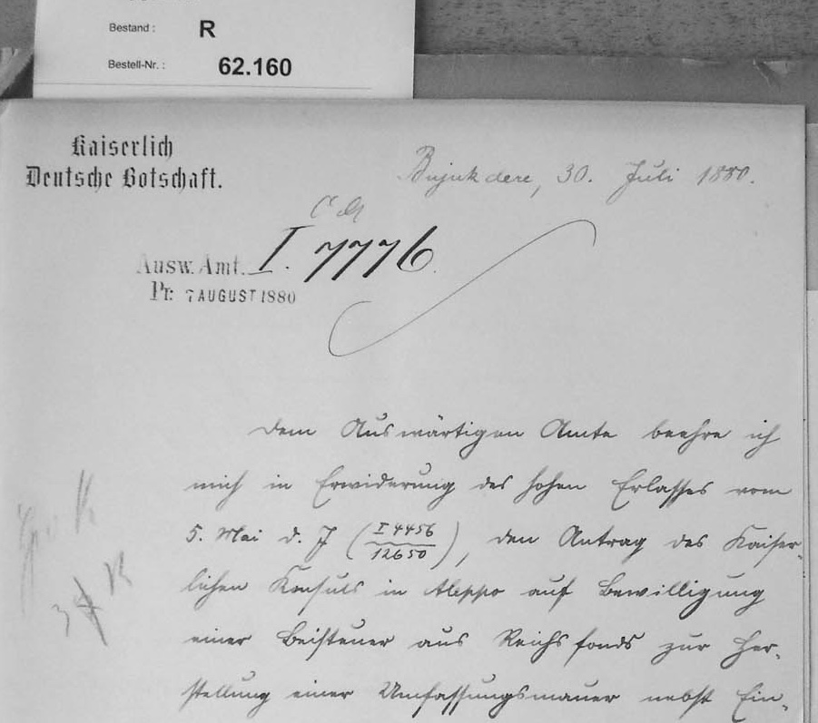{#fig:current}

::::
:::

::: notes

- Die klare 1:1 Assoziation zwischen Sprachen, Schriften (und Nationalstaaten) ist Teil eines monolingualen Habitus
    - Auf Computern, wir die Sprache-Schrift Kombination mit Nationalflaggen symbolisiert
- Beispiele:
  - Jiddisch: zu weiten Teilen Mittelhochdeutsch mit hebräischen Buchstaben geschrieben
  - Ladino: mittelalterliches Spanisch mit hebräischen Buchstaben geschrieben
  - Osmanisch vs zeitgenössisches Türkisch
  - Serbo-Kroatisch
      - Kyrillische Schrift: heutiges Serbien
      - Lateinische Schrift mit Anpassungen: heutiges Kroatien
      - Yugoslawisches Braille: für Blinde
  - Currentschrift

:::

## Sprache, Zeichensystem, Computer

<!-- ::: columns
:::: narrow

[Jegliche digitale Informationen sind Daten]{.keyphrase} ...

::::
:::: wide

>Data are forms of information, a larger concept that is even more difficult to define. Epistemological and ontological problems abound, resulting in many books devoted to explicating information and knowledge 

<cite>[Borgman2015BigData, 18]</cite>

::::
::: -->

[... alle Daten sind modelliert]{.keyphrase .c_left} 

::: columns
:::: column


](https://upload.wikimedia.org/wikipedia/commons/thumb/3/33/The_Rosetta_Stone.jpg/500px-The_Rosetta_Stone.jpg){#fig:rosetta}


::::
:::: column


](https://upload.wikimedia.org/wikipedia/commons/thumb/1/16/Claire_Schultz_IBM_punch_card_98.06_recto.tif/lossy-page1-960px-Claire_Schultz_IBM_punch_card_98.06_recto.tif.jpg){#fig:punch-card}


::::
:::

::: notes

Siehe oben zu Daten und Modellierung: Modelle sind Abbildungen, die Phänomene auf das für einen spezischen Zweck Wesentliche reduzieren

Damit Computer Schriftsprache erfassen können, sind viele Dinge notwendig, die in direkter Tradition früherer technischer Entwicklungen stehen und in die bestehenden gesellschaftichen Machtverhälttnisse eingebunden sind.

Wir brauchen mindestens

1. Zeichensystem (Schrift)
    - Rosetta: Hiroglyphen, Demotisch (Kursivschrift, RTL), Greek
    - > Stele aus Memphis (Ägypten) aus Granodiorit und enthält ein mehrsprachiges Synodaldekret von 196 v. Chr. aus der Zeit der altgriechisch-makedonisch-ptolemäischen Dynastie, erstellt im Auftrag des Königs Ptolemaios V. Epiphanes, eines Nachfolgers von Alexander dem Großen.
2. Zeichenkodierung 
    - Regelwerk zur Übersetzung von menschenlesbaren Symbole in maschinenlesbare, eindeutige Identifikatoren.
    - Wie bei Modellierungen gilt: sie sind ein Akt der Interpretation.
    - Es muss entschieden werden welche Aspekte des Zeichensystems modelliert und kodiert werden: visuelle Form (Font) oder konzeptuelle Einheit (i.e. Buchstaben)
3. Eingabesystem
    - übersetzt Symbole in konzeptuelle Einheiten auf Basis eines Standards zur Zeichenkodierung
    - eine mensch-maschine Schnittstelle
        - Lochkarten: die Kodierung übernimmt der Mensch vor der Eingabe
        - Tastaturen: die Kodierung ist in einen Stack aus Hardware, Software, Standards eingeschrieben
4. Ausgabesystem
    - benötigt metainformation zum Schriftsystem: Richtung und Positionierung der Zeichenzueinander
    - Fonts/Schrifttypen, die den Standard der Zeichenkodierung und das Schriftsystem unterstützen
    - Glyphen für alle verwendeten Zeichen
    - Eine Infrastruktur zur Anzeige der Glyphen auf einer zweidimensionalen Oberfläche
        - Druck
        - Bildschirm

:::

## Infrastrukturen und Pfadabhängigkeiten


::: columns
:::: column

](https://upload.wikimedia.org/wikipedia/commons/thumb/5/52/Timezones_UTC%2B14.png/330px-Timezones_UTC%2B14.png){#fig:timezones}

::::
:::: column

](https://upload.wikimedia.org/wikipedia/commons/thumb/d/d6/STS120LaunchHiRes-edit1.jpg/250px-STS120LaunchHiRes-edit1.jpg){#fig:shuttle}

::::
:::

::: notes

Eine Folie, die die Bedeutung von Pfadabhängigkeiten für Infrastrukturen darstellt:

- Am Anfang ist alles im Fluß
- Infrastrukturen werden erfolgreich und verschwinden aus der Wahrnehmung, wenn sie "universell" und selbstverständlich werden.
- Miteinander nicht kompatible Systeme können keine gemeinsame Infrastruktur bilden
- Beispiele
    - Eisenbahn [@Schivelbusch1977GeschichteEisenbahnreise]
        - Spurweite: warum sind die Booster des Spaceshuttles so breit, wie römische Wagen?
            - The United States and most of the world use a standard railway gauge of 4 feet, 8.5 inches.
            - his measurement stems from 19th-century English tramways, which mirrored the ancient ruts found on Roman roads.
            - George Stephenson formally established this 4-foot, 8.5-inch width for the Liverpool and Manchester Railway in 1830.
            - Transporting the Space Shuttle’s Solid Rocket Boosters from Utah to Florida required using the national rail network.
            - Mountain tunnels built for 19th-century trains limited the maximum diameter of these modern rocket components.
        - vereinheitlichte Zeit und Kalender: lokale Zeiten und Kalender lassen sich nur mir zusätzlichem Aufwand erhalten

- @Larkin2013PoliticsPoetics
    - >Infrastructures are built networks that facilitate the flow of goods, people, or ideas and allow for their exchange over space. As physical forms they shape the nature of a network, the speed and direction of its movement, its temporalities, and its vulnerability to breakdown. They comprise the architecture for circulation, literally providing the undergirding of modern societies, and they generate the ambient environment of everyday life. (328)
    * >What distinguishes infrastructures from technologies is that they are objects that create the grounds on which other objects operate, and when they do so they operate as systems. (329)
    * >Infrastructure in this sense is a kind of mentality and way of living in the world (331)
- @Star1999EthnographyInfrastructure; 
    - Definition / Phänomenologie von Infrastrukturen (basierend auf Star und Ruhleder 1996) über verschiedene Dimensionen (380-).
        1. **embeddedness**
        2. **transparency**
        3. **reach or scope**
        4. **learned as part of membership**
        5. **links with conventions of practice**
        6. **embodiment of standards**
        7. **built on an installed base**
        8. **becomes visible upon breakdown**
        9. **is fixed in modular increments, not all at once or globally**

:::

## Druck mit beweglichen Lettern als Paradigma


](https://upload.wikimedia.org/wikipedia/commons/thumb/6/69/Upperandlowercase.jpg/330px-Upperandlowercase.jpg)

<!-- ::: columns
:::: column

### Ostasien, 10. Jhd.

::::
:::: column

### Mitteleuropa, 15. Jhd.


::::
:::
 -->

::: notes

- wurde in Ostasien / China erfunden!
- Druck ist Teil eines Publikationswesens und des Kapitalismus und unterliegt eigenen Affordancen
- Benötigte Ressourcen (übersetzen sich in Kosten)
    - Werkzeug
        - Maschinen
        - Satzschriften / Zeichensätze (en. "typeface") mit Lettern (en. "sort") für alle druckbaren Zeichen
            - Innerhalb der Zeichensätze gibt es Schriftschnitte (en. "fonts") für 
                - Stärke
                - Laufweite
                - Lage
            - Muss für mindestens eine ganze Seite reichen
    - Verbrauchsmaterial
        - Papier
        - Farbe
    - Personal
- Anreize
    - je einfacher das Schriftsystem (wenige Formen, keine Ligaturen, nur eine Dimension von Zeichen innerhalb des Wortes), desto einfacher ist es zu mechanisieren
        - das ist der Grund, warum Gutenberg sooo viel erfolgreicher war, als die chinesischen Erfinder_innen 400 Jahre vorher
    - je einfacher, desto kostengünstiger lässt sich Text verfielfältigen
        - mit dem gleichen Aufwand, lassen sich mit einfacherer Schriftsystemen mehr Menschen erreichen

:::

## Beispiel Schreibmaschine und Linotype

::: columns
:::: column

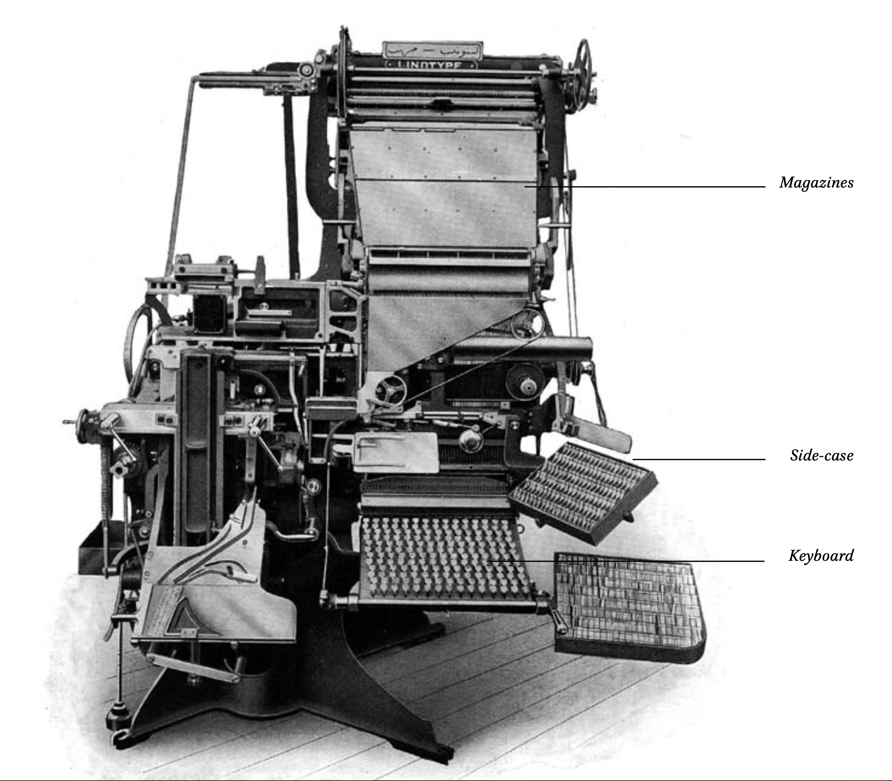{#fig:ar-linotype}

::::
:::: column

{#fig:zh-typewriter}

::::
:::

::: notes

- we talked about the situatedness of knowledge production and path dependencies
- Arabic script is much for challenging for mechanical reproduction than Latin script
- keyboard with 180 keys 
- two magazines  were required for a single Arabic fount

:::

## "Lösung": Komplexitätsreduktion durch Schriftreform

::: columns
:::: column

](https://upload.wikimedia.org/wikipedia/commons/thumb/1/18/Ataturk-September_20%2C_1928.jpg/500px-Ataturk-September_20%2C_1928.jpg){#fig:ataturk}

::::
:::: column

<!-- Ostasien -->


::::
:::

::: notes

- Es gibt einen großen Anreiz zur Komplexitätsreduktion
- Beispiele
    - Globale Bestrebungen zur Schriftreform im ausgehenden 19. Jhd
    - Anreize: Volksbildung und effiziente Mechanisierung
    - Schriften, die "erfolgreich" reformiert wurden
        - Japanisch
        - Türkisch
        - Chinesisch: hier wurde zumindest die Schriftrichtung geändert

:::

## "Lösung": Komplexitätsreduktion durch Transliteration

Transliteration into Latin script served the need of colonial administrations and academics with the technological affordances of the time.

::: columns-3
:::: column

### [مرآة الشرق]{lang="ar"}

The Arabic title of a newspaper published by [بولس شحادة]{lang="ar"} in Jerusalem, 1919--38

### Meraat al-Sherk

The official transcription provided by the paper's masthead

::::
:::: column

* #192, 22 Nov. 1922, Jerusalem. Source: [EAP](https://eap.bl.uk/archive-file/EAP119-1-24-1).](https://images.eap.bl.uk/EAP119/EAP119_1_24_1/1.jp2/full/600,/0/gray.jpg){#fig:mirat-1}

::::
:::: column

### Mirʾāt al-Sharq

Following the system of the *International Journal of Middle East Studies* (IJMES)

### Mirʾāt aš-Šarq

Following the system of the *Deutsche Morgenländische Gesellschaft* (DMG)

### mrMp Alcrq

Buckwalter transliteration

::::
:::

::: notes

- *Mirʾāt al-Sharq* published by Būlus Shaḥāda in Jerusalem between 1919 and 1938 
- transliteration
    + Depend on input and output **languages**
    - Subject to traditions and taste
    - Error prone
    - if 1:1 grapheme replacement is intended, it becomes unreadable for casual readers
    - back transliteration doesn't work
- Transliteration ist in der Wissenschaft in dem Moment notwendig geworden, als mechanisierte Schriften die Grundlage für Prüfung und Verbreitung wurden. In einer Monographie, ließ sich der teure Druck mit litographierten Textteilen vielleicht noch rechfertigen
- In der Wissenschaft wurde der Lückentext praktiziert, bei dem die originalschriftlichen Anteile frei gelassen und dann mit Hand gefüllt wurden
- Das gilt auch für die diakritischen Zeichen, die auf der Schreibmaschine fehlen

:::


<!-- ## Teure Lösungen: Bildvervielfältigung und semi-manuelle Ergänzungen

::: notes

- Lange Zeit hat sich Litographie als Drucktechnik für nicht-lateinische Schriftsysteme erhalten
- In der Wissenschaft wurde der Lückentext praktiziert, bei dem die originalschriftlichen Anteile frei gelassen und dann mit Hand gefüllt wurden
- Das gilt auch für die diakritischen Zeichen, die auf der Schreibmaschine fehlen

::: -->

# Die epistemische Gewalt der Zeichenkodierung
## Überblick

::: columns
:::: column

### 1960s: American Standard Code for Information Interchange (ASCII)

- 95 druckbaren Zeichen (die restlichen 33 sind Steuerzeichen): die Ziffern 0-9, die 26 Buchstaben des englischen Alphabets in Groß- und Kleinschreibung und 33 Satzzeichen und Symbolen.
- wurde 1967 zu einem ISO Standard (ISO 646). 
- ASCII ist eigentlich nur für das Englische geeignet -- schon Deutsch oder Französisch können nicht direkt abgebildet werden

::::
:::: column

### 1980s: Unicode

- Industriekonsortium: Adobe, Airbnb, Amazon, Apple, Yat, Google, ETCO, Meta, Microsoft, Netflix, SAP und Salesforce
- Millionen von Zeichen
- Prinzipien: 
    - abstrakte Zeichen und nicht ihre graphische Form (characters, not glyphs)
    - keine Duplikate innerhalb einer Schrift (unification) 

::::
:::

::: notes

- Unicode
    - 1991 als Standard veröffentlicht
    - Die Schriftgrammatik des Lateinischen wird beibehalten
    - in der realität können gleiche Formen, verschiedene Codepoints haben


:::

## Unicode

[Unicode ist fantastisch ...]{.c_left-align .keyphrase}

[... aber viele zeitgenössische und historische Zeichensysteme werden auch in der neuesten Version nicht unterstützt]{.c_center}

::: columns
:::: column

](../../assets/dh/twws-poster-22-960.jpg){#fig:poster-wws}

::::
:::: column

{#fig:unicode-1}

{#fig:unicode-15-missing}

::::
:::


::: notes

- unicode can be traced back to the 1980s
- Unicode has become the dominant encoding standard in the 2000s
- almost universal support across operating systems has been driven by people's fondness of emojis
- Arabic has been part of Unicode since v 1.0.0
- linguisting imperialism
    + consortium: Adobe, Airbnb, Amazon, Apple, Yat, Google, ETCO, Meta, Microsoft, Netflix, SAP and Salesforce
    + character encoding is part of the history of a global hegemonic technology stack  bound up in historically contingent cultural traditions of the Global North. 
    + Mechanically and, later, electronically recording information in scripts other than Latin---particularly complex scripts with a much larger number of graphemes and different writing directions--- was never considered sufficiently important or profitable to be supported out-of-the-box.
    + Character encoding enforces Latin script grammar
        * unicode insufficiently distinguishes between languages and scripts
    + The standard is written in English
    + Current v 15:
        *  we know at least 300 writing systems
        *  127 are currently not encoded

- potentiell Poster nutzen für den Überblick
:::

## Unicode ist fantastisch ...

[... aber Standards sind nur nur so gut, wie ihre Implementierung]{.c_right}

### Kodierungsalbträume

<!-- change this slide to show rendering issues ([@fig:arabic-fail-covid]) AND encoding issues -->

::: columns
:::: wide

![32 variants of encoding "Meccan" ([مكية]{lang="ar"}) [@Milo2014VisuallyMisleading, 4]](../../assets/dh/arabic-script_unicode-example-makkiyya-milo_4.png){#fig:arabic-mecca-1}

::::
:::: narrow

![In-browser search for "[مك]{lang="ar"}" in the Wikidata entry for "Mecca" ([Q5806](https://www.wikidata.org/wiki/Q5806))](../../assets/dh/arabic-script_unicode-example-wikidata_narrow.png){#fig:arabic-mecca-2 height="300px"}

::::
:::

::: notes

- unicode insufficiently distinguishes between languages and scripts
    + violating two of its principles
        * characters not glyphs
        * unification: no duplicates within a script
- yet, rendering depends on software support
    <!-- + see [@fig:arabic-fail-covid] -->


:::

## Unicode ist fantastisch ...

[... aber Standards sind nur nur so gut, wie ihre Implementierung]{.c_right}

::: columns
:::: wide

>As Ramsey Nasser notes in the overview of his programming language [ب ل ق]{.c_rtl .red lang="ar"} [, pre-existing digital techonologies] are almost exclusively based on the ASCII character set

<cite>[IsasiEtAl2023ModelMultilingual, 19]</cite>

::::
:::: narrow

[ب ل ق]{.c_rtl .red lang="ar"} hätte [قلب]{.c_rtl .green lang="ar"} sein müssen.

::::
:::


::: notes

- yet, rendering depends on software support
- example from a £130 book from a major publisher
    <!-- + see [@fig:arabic-fail-covid] -->


:::

## Unicode ist fantastisch ...

<!-- [... but standards depend on implementation and software support]{.c_right} -->

[... haben wir schon Industriekonsortien erwähnt?]{.c_right}

>HTML elements all have names that only use ASCII alphanumerics

<cite>[HTMLLivingStandard2023, §13.1.2]</cite>

::: columns
:::: column

](../../assets/dh/html5-lang_ar-chrome-2.png){#fig:zakham-ar-failure}

::::
:::: column

{#fig:html}

::::
:::
::: notes

- Arabic has been part of Unicode since its inception
- yet, software support is a different question, as we have seen 
- HTML5 is a *living standard* maintained by yet another consortium Web Hypertext Application Technology Working Group (WHATWG) 
    + members are leading browser vendors such as Apple, Google, Microsoft and Mozilla
    + all but Mozilla are also members of the Unicode consortium
- `@lang` attribute not used by standard CSS
    + everyone has to add `*[lang="ar"] {direction:rtl;}`
- URIs nutzen URL escaping für nicht lateinische Zeichen

:::

# Was sind die Konsequenzen für Sprachgemeinschaften und Forschung?
## Unsichtbarkeit

Wie finde ich eigentlich die arabische Zeitung [مرآة الشرق]{lang="ar"} in deutschen Bibliotheken?

::: columns-3
:::: narrow

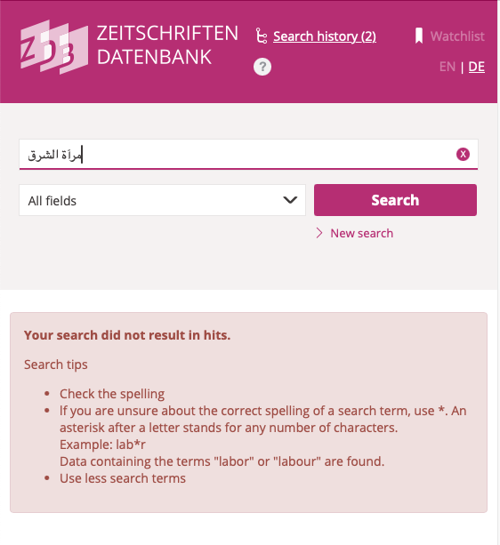{#fig:mirat-ar}

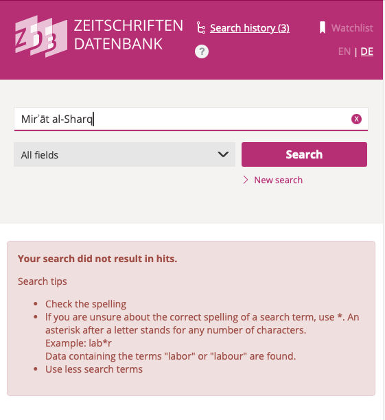{#fig:mirat-ijmes}

::::
:::: column

{#fig:mirat-dmg}

::::
:::: column

{#fig:mirat-dmg-flat}

::::
:::


::: notes

- **Cosima**!!!
    - Discovery-Systeme
    - Bibliothekssysteme
    - Marktdiskriminierung
    - Verlage zahlen wahrscheinlich auch für Ranking
- was nicht erfasst werden kann, kann nicht gesucht werden, kann nicht gefunden werden
- Recherchesysteme unterstützen von Haus aus oft nur Sprachen in lateinischer Schrift
- Kommerzielle Lösungen mit hermetischen Feature Request-Workflows
- Fehlende Auffindbarkeit je nach Index, Erschließung, Schreibweise
- Bestände werden unwillentlich dem wissenschaftlichen Zugriff vorenthalten


:::

## Work-arounds, hacks

Menschen versuchen das wünschbare Ergebnis mit den vorhandenen Werkzeugen zu approximieren

::: columns
:::: column

ägyptische Präferenz für das Weglassen der beiden Punkte unter dem finalen *yāʾ* (U+064A: [ي]{lang="ar"}) am Ende eines Wortes

::::
:::: column

Unicode bietet zwei Möglichkeiten:

- das Arabische *alif maqṣūra* (U+0649: [ى]{lang="ar"}) 
- das Persische *ye* (U+06CC: [ی]{lang="ar"})

::::
:::

::: notes

**Till**

- Probleme:
    - keine geeignete Eingabeschnittstelle
    - kulturelle Präferenzen
    - Zensur
- Beispiel der kulturellen Präferenz in Ägypten
    - für Computer ist es nicht der gleiche String
    - für Suchalgorithmen ist es nicht das Gleiche
        - Schlecht: wenn etwas Katalogen gesucht wird. 
            - Beispiel geraubte palästinensische Bestände in der israelischen Nationalbibliothek
        - gut: Zensur kann umgangen werden
- Ostasien
    - Homonyme und Homophone
    - es bedarf der korrekten Zeichen! No hack, no workaround!

:::


## linguistic imperialism und monolingualer habitus

::: columns
:::: column

### CSS

```css
body {
    background: white;
    color: black;
}
```

### R

```R
library(tidyverse)
setwd("/path/to/folder/")
load("oape_stats.rda")
المجلات <- c("4770057679", "644997575", "472450345", "792756327")
المشار.اليها <- المشار.اليها %>%
    filter(source.id.oclc %in% المجلات)
write.table(المشار.اليها, file = "csv/oape_stats.csv", row.names = FALSE, quote = TRUE, sep = ",")
```

::::
:::: column

Technische Sprachen folgen dem monolinguale Habitus des Englischen:

- Englische Semantik
- Englische Grammatik
- Lateinisches Alphabet (ASCII)

::::
:::

::: notes

- Die monolingualen Infrastrukturen erfordern, dass alle ein grundsätzliches Verständnis der englischen Sprache erwerben
- Beispiele
    - Programmiersprachen
        - Englische Grammatik
        - Englische Semantik
        - Lateinisches Alphabet
    - Die sitemap des iranischen Nationalarchives
        - So finden sich die Sammmlungen unter <https://nlai.ir/collection>

:::

## linguistic imperialism und monolingualer habitus


| Sprache |        0-shot        | 0-shot, thinking |        32-shot        | 32-shot, thinking |
|---------|----------------------|------------------|-----------------------|-------------------|
| deu     | [0.1584]{.red} (0.4) | 0.7894 (7:26)    | [0.1584]{.red} (0:39) | 0.8273 (7:14)     |
| eng     | 0.6485 (0.46)        | 0.8197 (7:09)    | 0.7905 (0:59)         | 0.8307 (8:22)     |

Table: f1-score für NER mit LLMs  (Zeit in Stunden) {#tbl:ner-llm}


::: notes

- resourcedness gap reinpacken, inklusive Literatur

:::

# Was tun?
## Die Notwendigkeit einer Datenkultur

[Für einen aufgeklärten Umgang mit *Digitalität* brauchen wir einen fundamentalen **Kulturwandel**]{.keyphrase}

::: columns
:::: column

[Kennen Sie die?]{.keyphrase}

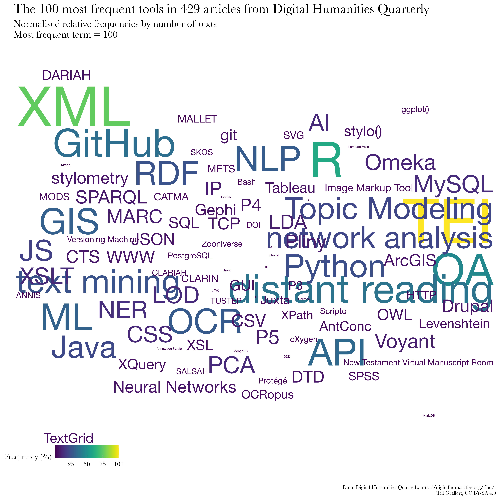{#fig:wordcloud-dhq}

<!-- 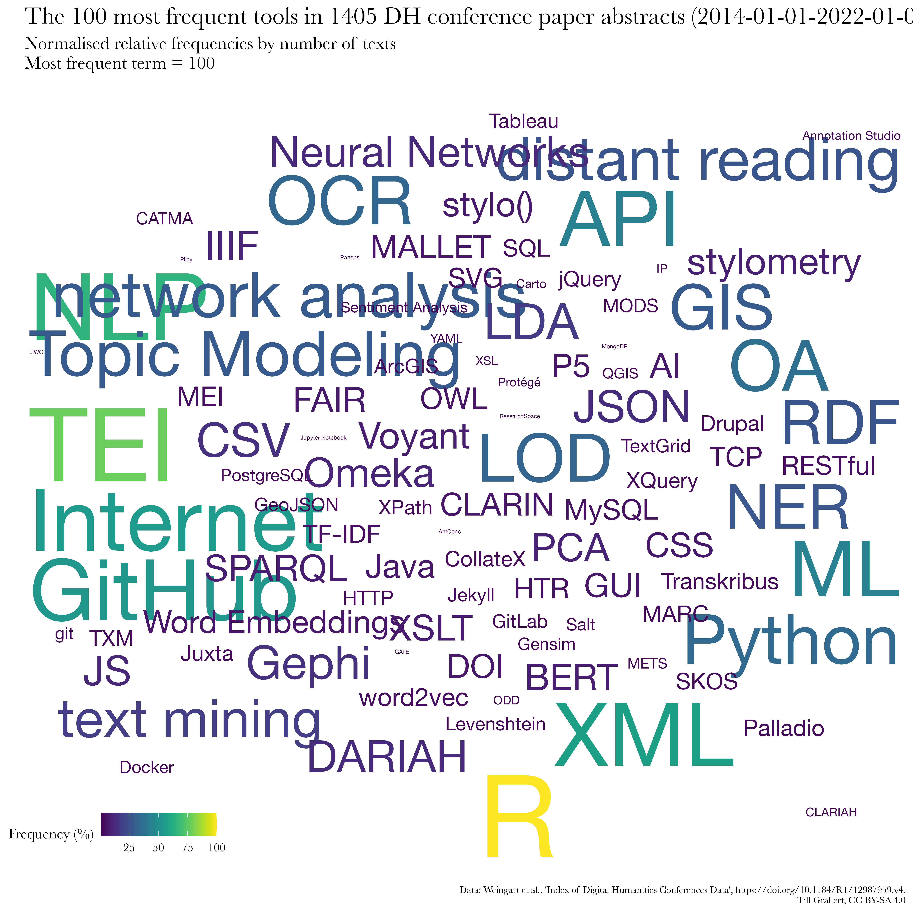{#fig:wordcloud-dh-conferences} -->

::::
:::: column

Es herrscht in der Breite ein Mangel an 

- **Diskurs**: Austausch über unser (disziplinäres) Selbstverständnis 
+ **Theorie**: Verständnis des epistemischen Wandels und der ontologischen Dimensionen der *Datafizierung*
+ **Praktiken**: Beherrschung der notwendigen Methoden und Werkzeuge
+ positivem **Wissen**: Überblick über die Möglichkeiten in einem sich rapide wandelnden Umfeld 

<!-- - Es gibt ein starkes Ressentiment gegenüber allem "digitalen"
- *"Digital" Humanities* als Indikator -->

::::
:::

## Datenkultur

<!-- requires some work -->

[*digital natives* sind nicht automatisch *digital citizens*]{.keyphrase}

::: columns
:::: column

### im weiteren Sinn

eine **Fachkultur**, bei der (Forschungs-)daten und datengetriebener Methoden ein integraler Bestandteil sind, die Arbeit mit und an Daten also nicht mehr als ein netter Appendix zum “eigentlichen” Forschungsprozess verstanden wird.

::::
:::: column

### im engeren Sinn

**alltägliche Praktiken** und Verantwortlichkeiten (auch rechtlich und ethisch) im Umgang mit Forschungsdaten, bei deren Erzeugung, Bereitstellung und Nutzung mit Hilfe von computationellen Methoden und Werkzeugen.


::::
:::

::: columns

### braucht

:::: column

Verständnis der theoretischen und epistemologischen Grundlagen und Implikationen der Datafizierung und Diskussion über deren Folgen

::::
:::: column

Orientierung, Guidelines und Unterstützung

::::
:::

::: notes

- *digital citizenry* ist von [@Rankin2018PeoplesHistory, 11] geprägt
    - >Kurtz, the director of the Computation Center, used the language of “citizenship” to describe the relationship between a user and the user’s computing network. A good computing citizen respected the college’s ongoing computer memory limitations. [@Rankin2018PeoplesHistory, 43-44]
- Ziel ist *digital* or *computing citizens*, die über ihre Teilnahme  und -habe an einer Gemeinschaft definiert sind. 
    + Unterschied zu Produzenten und *Makers*
    + **ABER** Digital natives sind nicht automatisch digital citizens
        + >despite what the term “digital natives” invokes, it does not mean that those who are digital natives (born after 1980) understand digital technology. In fact, digital natives may not remember life before the internet, but that does not mean they understand the complex systems that supports it or the nuances of communication and knowledge creation in the digital age [@Levy2017DigitalZombies, §16].
- kann **nur kollaborativ** adäquat bewältigt werden. 
+ ich fokussiere heute eher auf die Datenkultur im engeren Sinn, und schlage alltägliche Praktiken vor, die uns erlauben auch eine Datenkultur im weiteren Sinn zu etablieren.

:::

## Drei Prinzipien

### DIY, 
### but not alone, 
### and KISS

## Do it yourself

::: columns
:::: narrow

>Do artefacts have politics? 

<cite>[@Winner+1980]</cite>

>Do politics have artefacts? 

<cite>[@DunbarHester2014LowPower]</cite>

::::
:::: wide

>To use [...] tools well, we must, in some real sense, understand them better than the tool makers. [...] The best kind of tools are therefore the ones that we make ourselves. 

<cite>[@Tenen2016BluntInstrumentalism, 85]</cite>

>Without access to the code, whether because it is proprietary or generated on the fly, as in the case of some machine-learning algorithms, analysts can only comment on the apparent operations of the code based on its effects. The operations of the code are left in the hands of those who can access it, usually those who have made or maintain it, and those who can read it. 

<cite>[@Marino2020CriticalCodeStudies, 4]</cite>

::::
:::

<!-- ::: columns
:::: column

### Making

- Experimentieren, Tüfteln, Ausprobieren, Werkeln 
- Selbstermächtigung mit dem Ziel der (Wieder)Aneignung der Produktionsmittel

::::
:::: column

### Maker turn

Kreativität von Design, Herstellung und Erfahrung von (digitalen) Objekten als From von Wissenschaft

::::
::: -->


::: notes

- Grundsatz: Werkzeuge und Methoden sind mit Machtverhältnissen verwoben
    - >The Cloud *is* a factory. Your AI *is* a human. Sexism *is* a feature, not a bug. [@Mullaney2021Intro, 7, Hervorhebung im Original]
- Geschichte
    + 1970er Kalifornien: kooperative Werkstätten
    + Recht auf Reparatur
    + DIY: do it yourself culture
    + "Maker Movement Manifesto" von Hatch (2013)
        * make, share, give, learn, tool up, play, participate, support, change
- bezieht sich auf [@Wythoff2022MinimalComputing], der die beiden Fragen verknüpft hat
    + Do artefacts have politics? [@Winner+1980]
    + Do politics have artefacts? [@DunbarHester2014LowPower]
- Kritik an Maker culture als omnipotenter maskuliner Raum:
    - >knowledge of circuitry is often conflated with (superheroic) command over people, situations, and things. In present-day “maker” cultures, consider the ubiquity of remarks such as “getting under the hood” or “knowing the nuts and bolts,” which tend to fuse logic with mastery, control with masculinity, engineering with rationality, and programming with revealing. [@Sayers2017Introduction, 3]
- Scheitern als wichtiges Moment

:::

## Do it yourself, but not alone!

::: columns
:::: narrow

{#fig:wordcloud-dh-conferences}

::::
:::: wide

>I also remind DH is an imposter syndrome house of mirrors. You look around and see experts in GIS, TEI, dataviz, etc.; it's hard to remember that people tend to be good at *one* of those things when the collective appears to be good at *all* of them. **We all suck at most of DH**.

<cite>[@Weingart2021AlsoRemindDH]</cite>

>Unfortunately, I'm not particularly handy. On every new project, the tools require blood.

<cite>[@Graham2023FindMyselfCharge]</cite>

::::
:::

::: notes

- daraus folgt, dass es neue Rollen und neue Anforderungen gibt

:::

## Generous thinking: zuhören und lernen

::: columns
:::: wide

>Generous Thinking [begins] by proposing that rooting the humanities in generosity, and in particular in the practices of thinking *with* rather than reflexively *against* both the people and the materials with which we work, might invite more productive relationships and conversations not just among scholars but between scholars and the surrounding community.

<cite>[@Fitzpatrick2016GenerousThinking]</cite>

::::
:::: narrow

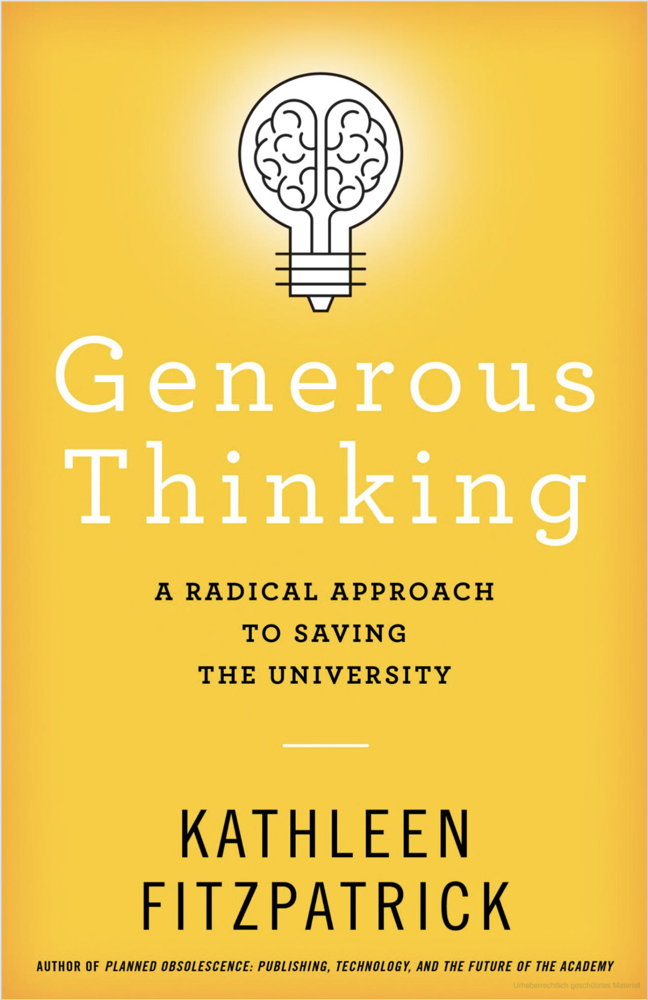{#fig:book-fitzpatrick2019}

::::
:::

::: notes

- frage:
    - Wie kann Kollaboration zum Nutzen aller gestaltet werden?
- sie entwirft eine Kritik der neoliberalen Universität, in der, vor allem in den Humanities, eine destruktive Kritik geübt wird

:::

## trading zones, contact languages, and project management

>to coordinate and develop [...] ‘contact languages’ [..] is the necessary underpinning of a stable, respectful and hybrid form of interdisciplinary collaboration. Done correctly they can create something new: Galison’s ‘full-fledged creoles’  supporting ‘activities as complex as poetry and metalinguistic reflection’.  They can create new disciplinary spaces and practices in their own right. 

<cite>[@AhnertEtAl2023CollaborativeHistoricalResearch]</cite>


::: columns
:::: column

{#fig:book-kemman2021}

::::
:::: column

{#fig:book-cremer2024}

::::
:::

::: notes

- Max Kemman und andere auf der Basis von Peter Galison
- contact zones müssen in "trading zones" verwandelt werden
    - Aber allein der Aufenthalt in einer Kontaktzone erfordert ein Mindestmaß an Toleranz
- Zonen der lokalen Verständigung, in den sich erst ein 
    - Pidgin und dann 
        - Pidgnization als die Periode, in der Labels, wie Digital History, sinnvoll sein können
    - Kreolisch entwickeln kann

- Peter Galison:
            >employed the metaphor of a ‘trading zone’ to explain  how engineers and physicists from a number of different sub-fields went about  collaborating with each other to develop particle detectors and radar.


:::

## Leistungen anerkennen

::: columns
:::: column

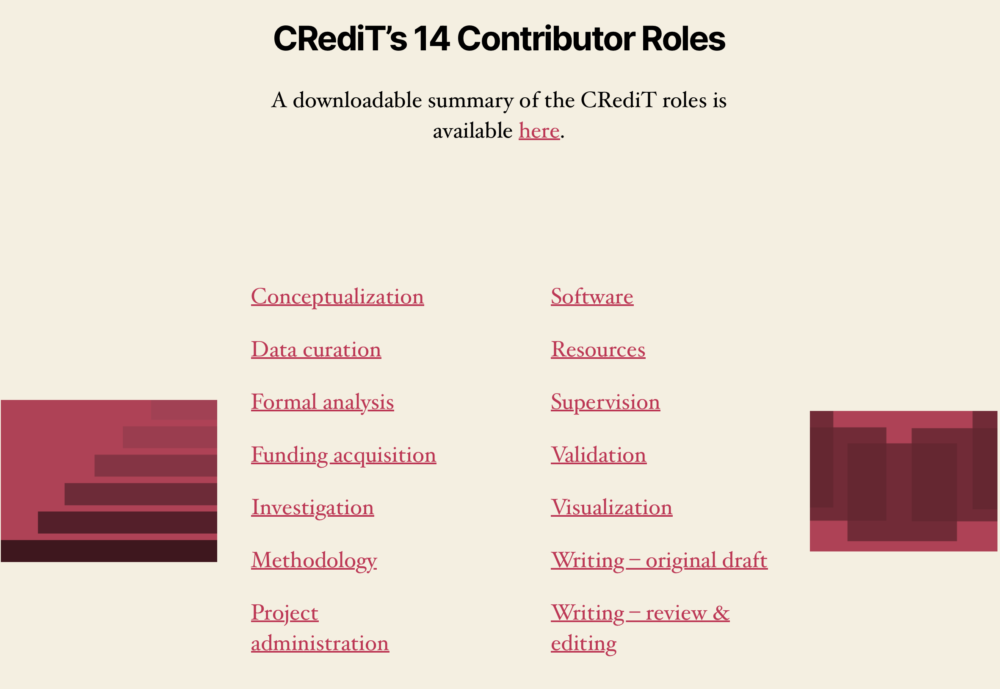{#fig:credit}

::::
:::: column

[Anteile an jeglichem Output transparent klassifizieren]{.keyphrase}

- Seit 2012: [Contributor Role Taxonomy (CRediT)](https://credit.niso.org)
    - ANSI/NISO Standard (seit 2022)
    - 14 Rollen im gesamten Forschungsprozess
    - einige Zeitschriften erlauben weitere Unterscheidung als _lead_ ,_equal_ oder _supporting_
- Die [relators](http://id.loc.gov/vocabulary/relators) Taxonomie der LoC
- Und natürlich gibt es Zeitschriften zum Thema, z.B. [Accountability in Research](https://www.tandfonline.com/journals/gacr20)

[Unsere Stakeholder und ihre Bedürfnisse kennen]{.keyphrase}

- z.B. über die Entwicklung von Personae

::::
:::

::: notes

- CRediT
    - Rollen
        1. Conceptualization  
        2. Data curation  
        3. Formal analysis  
        4. Funding acquisition  
        5. Investigation  
        6. Methodology  
        7. Project administration  
        8. Resources  
        9. Software  
        10. Supervision  
        11. Validation  
        12. Visualization  
        13. Writing – original draft  
        14. Writing – review & editing
    - Außerhalb der Geisteswissenschaften weithin umgesetzt
    - >CRediT grew from a practical realization that bibliographic conventions for describing and listing authors on scholarly outputs are increasingly outdated and fail to represent the range of contributions that researchers make to published output. Furthermore, there is growing interest among researchers, funding agencies, academic institutions, editors, and publishers in increasing both the transparency and accessibility of research contributions.

:::

## Interdisziplinäres Zentrum für Digitalität und digitale Methoden am Campus Mitte

](../../assets/dh/website_iz-digitalität.png){#fig:website-iz}

{.c_logo .c_qr .c_right}

::: notes

- neue Initiative, seit 2024
- soll die vielen Menschen, die bereits zu Themen der Digitalität arbeiten zusammenbringen
- ihnen Raum für Austausch bieten
- ihre Arbeit sichtbar machen nach außen und nach innen

:::

# Abschluss
## Danke!

Dank an 

- Die Co-Convenors der [AG Multilingual DH] in der [DHd]: Jana-Katharina Mende, Jonas Müller-Laackmann und Cosima Wagner
- Die Mitglieder der AG Digitalität im [Interdisziplinären Zentrum Digitalität und Digitale Methoden am Campus Mitte (IZ2D)] der [HU Berlin]: Torsten Hiltmann, Eliza Mandieva, Roland Meyer, Shintaro Miyazaki, Caroline Odebrecht, Lars Erik Zeige 

## Literatur {#refs}